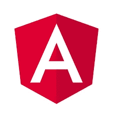
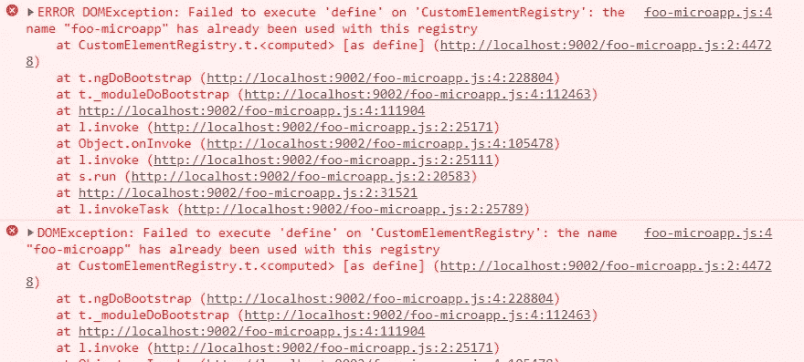
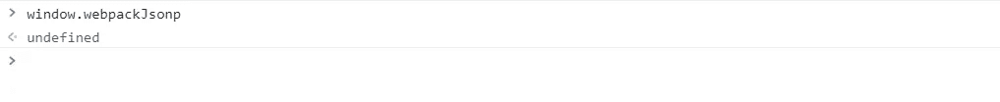
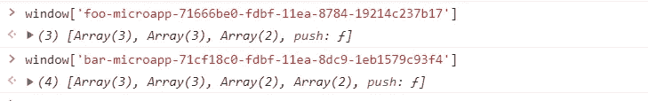

# 如何在一个窗口运行两个 Angular apps？

> 原文：<https://itnext.io/how-to-run-separate-angular-apps-in-one-spa-shell-5250e0fc6155?source=collection_archive---------2----------------------->


由 [Eric Prouzet](https://unsplash.com/@eprouzet?utm_source=unsplash&utm_medium=referral&utm_content=creditCopyText) 在 [Unsplash](https://unsplash.com/s/photos/multiple?utm_source=unsplash&utm_medium=referral&utm_content=creditCopyText) 上拍摄的照片

有时，为了解决使用 Angular framework 设计应用程序的特定情况，我们可以选择一个架构，假设在一个`window`范围内运行两个或更多独立的 Angular 应用程序。

抛开这种微前端方法的利弊不谈，让我们看看如何准备我们的架构，以便在一个 shell SPA 中运行多个独立的角度应用程序。



# **TLDR；📕**

*   我们能够通过 *@angular/elements* 在一个`window`范围内运行多个角度应用
*   我们需要为存储内容提供独特的空间
*   我们可以通过使用*@ angular-builders/custom-web pack*提供额外的配置来确保 *webpackJsonp* 内容的唯一名称
*   多角度应用运行的实际应用和解决方案可以在 [**微前端**](https://github.com/marcinmilewicz/microfrontendly) 库中找到。

# 使用@angular/elements 库

一种更简单、更值得推荐和坚持的方法是使用官方文档中详细描述的[*@ angular/elements*](https://angular.io/api/elements)库。简而言之，这个想法就是构建一个 Angular 应用作为 [*WebComponent*](https://www.webcomponents.org/) 并在父母的 SPA app 中以这种形式使用。


# 创建壳牌 SPA

用@angular/elements 构建的应用程序应该用在 shell 应用程序中，这将是我们架构的核心。要理解这个想法，最好看一个放在[**Microfrontendly**](https://github.com/marcinmilewicz/microfrontendly)资源库中的例子。

在上面的例子中，我们有两个角度应用: *foo-app* 和 *bar-app* 。两者都通过 *@angular/elements* 转换成 *WebComponent* 并在一个集合 shell 中运行。

## 潜在和常见的问题📉

如果我们想弄乱额外的弹出角度应用程序，我们肯定会遇到以下问题:



## 这到底是怎么回事？😕

当我们推出第一款 *foo-app* 时，一切都很好。然而，当我们想要在同一个`window`范围内初始化第二个 Angular 应用程序时，上面的错误被抛出。

这个问题与初始化第一个应用程序时创建的`window.webpackJsonp`密切相关。当第二个应用程序被引导时，`window.webpackJsonp`的内容不会被覆盖，新的应用程序会触发旧的代码。因此， *foo-bar* 应用的函数`customElements.define`被第二次调用，这是因为*自定义元素*可以在`window`范围内注册一次。结果，我们得到上面的异常

> 无法对“CustomElementRegistry”执行“define”:名称“foo-microapp”已用于此注册表

> [如果你想了解新的伟大的角度和前端的东西，请在 Twitter 上关注我](https://twitter.com/marcin_milewicz)！*😄*

# 如何解决，一个窗口运行多个 Angular app？👌

解决这类问题的一种方法(但不是唯一的方法)是使用额外的 Webpack 配置并指定 *webpackJsonp* 范围。要解决这个问题，我们必须遵循以下步骤:

1.  向每个支持自定义 Webpack 配置的 Angular 应用程序添加额外的构建器

```
npm i -D @angular-builders/custom-webpack
```

2.更改 *angular.json* 中的配置

```
"architect": {
 "build": {
  "builder": "@angular-builders/custom-webpack:browser",
  "options": {
   "customWebpackConfig": {
    "path": "./scripts/webpack.config.js"
   },
   "outputPath": "dist/bar-microapp",
.....
```

3.添加适当的附加 *webpack.config.js*

```
const uuidv1 = require('uuidv1');

***module***.exports = {
 output: {
  jsonpFunction: 'foo-microapp-' + uuidv1()
 }
};
```

以上配置保证了`window.webpackJsonp`功能中内容落地的唯一性。

让我们从 [**微前端**](https://github.com/marcinmilewicz/microfrontendly) 库运行这个例子，并检查现在发生了什么。



出乎意料的是，我们观察到`window.webpackJsonp`对象是空的。为什么？让我们仔细思考和观察这个`window`物体。



最后，我们能够为特定的 Angular 应用程序找到合适的内容，一切都正常工作。

# 摘要📗

*   我们能够通过@angular/elements 在一个`window`范围内运行多个角度应用
*   我们需要为存储内容提供独特的空间
*   我们可以通过用@ angular-builders/custom-web pack 提供额外的配置来确保 *webpackJsonp* 内容的唯一名称
*   多角度应用运行的实际应用和解决方案可以在 [**微前端**](https://github.com/marcinmilewicz/microfrontendly) 库中找到。

> [如果你想了解新的伟大的棱角和前端的东西，请在 Twitter 上关注我](https://twitter.com/marcin_milewicz)！*😄*

