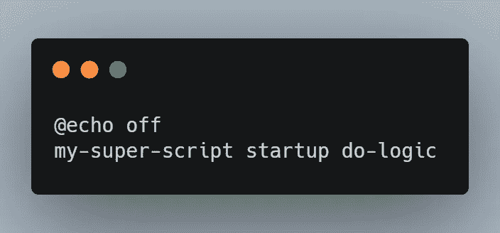
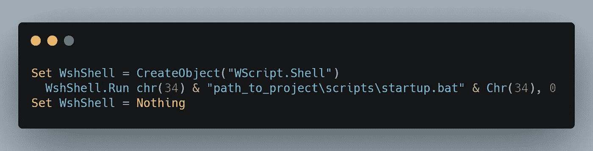

# 如何在 Windows 中启动时运行脚本

> 原文：<https://itnext.io/how-to-run-your-scripts-on-startup-in-windows-8ae62a625f6c?source=collection_archive---------0----------------------->


照片由[马库斯·斯皮斯克](https://unsplash.com/@markusspiske?utm_source=medium&utm_medium=referral)在 [Unsplash](https://unsplash.com/?utm_source=medium&utm_medium=referral) 拍摄

最近，我开发了一个 CLI 工具，打算用作备份应用程序。在开发这个工具的过程中，我需要实现一个特性，使这个脚本在启动时执行。对于 Linux 发行版，我找到了很多关于如何实现这种启动行为的资源，而对于 Windows，事情要复杂一些，因为这不是一个简单的过程。

没有其他不必要的谈话，这里是我如何做到这一点，以及你可以如何为自己实现它😊

## 最终目标

为了让一切尽可能通用，我们将使用一个假想的用例来解释这个过程背后的理论。

因此，假设我们想要创建一个名为`my-super-script`的 CLI 应用程序，每次打开计算机时，它都会将当前时间记录在一个`.txt`文件中。执行该操作必须运行的命令是`my-super-script startup do-logic`。

我们不想每次打开计算机时都打开命令提示符并手动运行这个脚本，而是让它自动为我们运行。

## 启动文件夹

在 Windows 上，启动时运行程序最简单的方法是将一个可执行文件放在 **Startup** 文件夹中。

计算机打开时，该文件夹中的所有程序都会自动执行。

此文件夹在 Windows 上的位置是:

```
***%APPDATA%***\Microsoft\Windows\Start Menu\Programs\Startup
```

您可以通过按下 **WINDOWS 键+ R** 然后复制此文本`shell:startup`来更容易地打开此文件夹。

## 的。蝙蝠文件

现在我们知道**启动**文件夹是我们需要放置*东西*来启动我们的脚本的文件夹，我们需要做的就是创建那个*东西*。

我们可以通过创建一个[球棒](https://en.wikipedia.org/wiki/Batch_file)(。bat)文件，包含以下内容:



[生](https://carbon.now.sh/?bg=rgba%28171%2C+184%2C+195%2C+1%29&t=seti&wt=none&l=application%2Fx-sh&ds=true&dsyoff=20px&dsblur=68px&wc=true&wa=true&pv=27px&ph=22px&ln=false&fl=1&fm=Hack&fs=14px&lh=133%25&si=false&es=2x&wm=false&code=%2540echo%2520off%250Amy-super-script%2520startup%2520do-logic)

这个批处理脚本将执行我们的命令，而不会在终端中发出任何消息，因为第一行是`[@echo off](https://stackoverflow.com/questions/8486042/what-does-mean-in-windows-batch-scripts)`。

仅此一项就够了。

然而，如果我们将这个`.bat`文件复制到启动文件夹中，然后重新启动我们的计算机，我们会看到一个命令提示符被打开，并且闪烁了不到一秒钟。


实际上，只要我们通过`my-super-script startup do-logic`运行程序处于活动状态，命令提示符窗口就会一直打开。因此，如果我们使用上面提到的假设用例，并假设我们的 CLI 工具需要 2 秒钟来将当前时间记录在. txt 文件中，那么这个命令提示符窗口将保持可见 2 秒钟。


虽然这种方法有效，最终目标也达到了，但是用户体验并不是很好。想象一下，如果我们的应用程序是一个持续的进程，只要计算机是打开的，它就会一直运行，在这种情况下，我们就会一直被这个命令提示符所困扰。

我们需要找到一种方法来运行那个命令`my-super-script startup do-logic`，但是不要让这个命令提示符窗口可见。

## 的。vbs 文件

解决这个问题的方法是创建一个 [VBS](https://fileinfo.com/extension/vbs) (。vbs)文件，并将它放在启动文件夹中，而不是放在`.bat`文件中。

这个`.vbs`文件的目的是执行我们之前创建的 bash 脚本，但是没有显示 shell。



[原始](https://carbon.now.sh/?bg=rgba%28171%2C+184%2C+195%2C+1%29&t=seti&wt=none&l=vb&ds=true&dsyoff=20px&dsblur=68px&wc=true&wa=true&pv=27px&ph=22px&ln=false&fl=1&fm=Hack&fs=14px&lh=133%25&si=false&es=2x&wm=false&code=Set%2520WshShell%2520%253D%2520CreateObject%28%2522WScript.Shell%2522%29%2520%250A%2520%2520WshShell.Run%2520chr%2834%29%2520%2526%2520%2522path_to_project%255Cscripts%255Cstartup.bat%2522%2520%2526%2520Chr%2834%29%252C%25200%250ASet%2520WshShell%2520%253D%2520Nothing)

完整的工作流程如下所示:

1.  `.vbs`文件被创建并复制到启动文件夹。
2.  `.vbs`文件会在启动时运行`.bat`文件。
3.  这个`.bat`文件将运行我们的程序。

一旦我们在启动文件夹中有了`.vbs`文件，命令`my-super-script startup do-logic`将在每次启动时执行，而不创建命令提示窗口。

## 行动中的代码

如果事情不是那么清楚，并且这个理论不足以帮助你，并且你想看这个实现的具体例子，那么你可以看一看这个[库](https://github.com/CloudTenant/CloudTenant-CLI/tree/master/src/modules/startup)。

代码是用 NodeJS 编写的，但是一旦你理解了操作原理，用你想要的语言实现它就很容易了。

*感谢您的关注，如果您觉得这篇文章有帮助，请点击*👏*。*