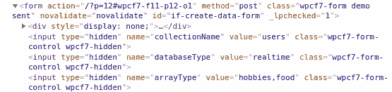
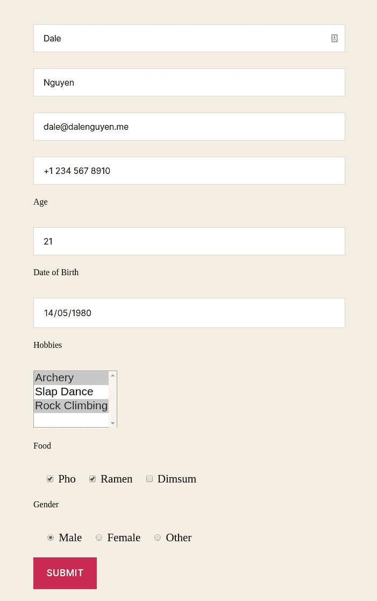
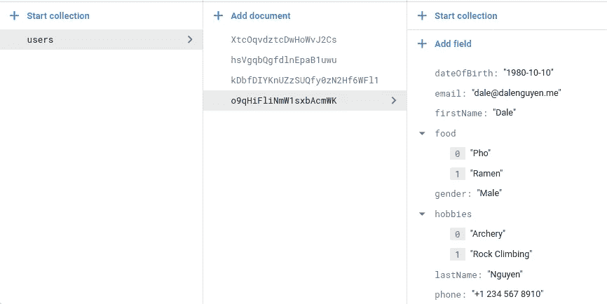
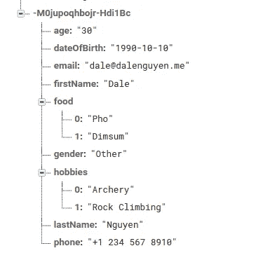

# 如何将数据从 WordPress 保存到 Firebase(实时+ Firestore)

> 原文：<https://itnext.io/how-to-save-data-from-wordpress-to-firebase-realtime-firestore-2eda917d01fb?source=collection_archive---------2----------------------->


> 如果你对 Integrate Firebase PRO 版本感兴趣，请阅读完整更新的文档:[https://firebase-wordpress-docs.readthedocs.io/](https://firebase-wordpress-docs.readthedocs.io/)

【https://wordpress.dalenguyen.me/】演示:[T5](https://wordpress.dalenguyen.me/)

*   文章 1: [如何将 Firebase 集成到 WordPress](/how-to-integrate-firebase-and-wordpress-b017ee274687)
*   第 2 篇:[如何从 Firestore 检索数据并显示在 WordPress 上](/how-to-retrieve-data-from-firestore-and-display-on-wordpress-8638854a762e)
*   第 3 篇:[如何在 WordPress 中使用 Firebase 自定义声明](https://medium.com/@dalenguyen/how-to-work-with-firebase-custom-claims-in-wordpress-aaf83965bd20?sk=85786e3739d42b18c3e2c7344bc5f436)
*   第 4 条: [**将数据从 WordPress 保存到 Firebase(实时+ Firestore)**](/how-to-save-data-from-wordpress-to-firebase-realtime-firestore-2eda917d01fb)
*   第五篇: [Firebase WordPress 用户集成](/firebase-wordpress-user-integration-c18a28e41cbd)
*   第六篇:[如何在 WordPress 仪表盘中管理 Firebase 用户](/firebase-users-management-in-wordpress-dashboard-61b4a1ca066#d4c2-1605c6edec5f)
*   第 7 篇:[如何将数据从 WordPress 同步到 Firebase](/sync-data-from-wordpress-to-firebase-d6e5860d3a06)
*   第 8 条:[一键登录 WordPress & Firebase 或通过电子邮件链接](https://medium.com/@dalenguyen/one-click-login-to-wordpress-firebase-or-via-email-link-d7610d71cd23)
*   第 9 条:[从 WordPress 上传文件到云存储](https://medium.com/@dalenguyen/upload-files-to-cloud-storage-from-wordpress-e8acc8ce70cd)
*   第十条:[远程 URL 登录到 Firebase & WordPress](/remote-url-login-to-firebase-wordpress-2027fad7c159)
*   第 11 条:[添加 Firebase 认证到 WordPress 的 2 种方法& WooCommerce](https://dalenguyen.medium.com/2-ways-to-add-firebase-authentication-to-wordpress-woocommerce-df500c3b104e)
*   第 12 条:[如何将 WooCommerce 购买数据发送到 Firebase](https://dalenguyen.medium.com/how-to-send-woocommerce-purchase-data-to-firebase-8c8b4c8cff39)
*   第 13 条:[从 WordPress](https://dalenguyen.medium.com/create-manage-firebase-database-from-wordpress-13347d8ffb2e) 创建&管理 Firebase 数据库

在本指南中，我将向您展示如何向实时数据库 Firestore 添加新数据。在这个例子中，我使用[联系形式 7](https://wordpress.org/plugins/contact-form-7/) ，但你可以随意设计自己的形式或使用其他插件。

我使用联系表格 7 的原因是它是 WordPress 插件中最流行的表格。它得到了很好的支持，并且高度可定制。提交表单后，您不必担心表单验证或电子邮件处理。

如果您决定创建自己的自定义表单，请记住将“if-create-data-form”以及下面的隐藏字段作为 ID 添加到您的表单中。



*自定义创建表单*

**创建新表格并将数据写入 Firestore 的示例**

我将用来更新 Firestore 的数据样本

```
export interface Contact {
    firstName: string
    lastName: string
    email: string
    phone: string
    age: string
    dateOfBirth: string
    hobbies: array<string>
    food: array<string>
    gender: string
}
```

由此，您可以在 Contact 选项卡中创建一个示例表单。隐藏字段很重要。

*   [隐藏集合名称“用户”] ->集合名称为用户
*   [隐藏数据库类型" firestore "]-->数据将保存在 firestore 中
*   [隐藏数组类型“爱好，食物”] ->数组数据应添加到数组类型字段

```
[hidden collectionName "users"]
[hidden databaseType "firestore"]
[hidden arrayType "hobbies,food"][text* firstName placeholder "First Name"]
[text* lastName placeholder "Last Name"]
[text* email placeholder "Email"]
[tel phone placeholder "+1 647 620 0000"]<label **for**="age">Age</label>
[number age id:age min:1 max:100]<label **for**="dateOfBirth">Date of Birth</label>
[date* dateOfBirth id:dateOfBirth]<label **for**="hobbies">Hobbies</label>
[**select*** hobbies id:hobbies multiple "Archery" "Slap Dance" "Rock Climbing"]<label **for**="food">Food</label>
[checkbox food id:food "Pho" "Ramen" "Dimsum"]<label **for**="gender">Gender</label>
[radio gender id:gender default:1 "Male" "Female" "Other"][submit id:if-data-submit "Submit"]
```

短代码将被添加到 WordPress 页面或文章中。id 为“如果创建数据表单”。id 对于插件将数据保存到 firebase 非常重要。

```
[contact-form-7 id="11" html_id="if-create-data-form" title="Contact form 1"]
```



*前端样本表单*

提交后，数据将被保存到 Firestore



*保存到 firestore 的数据*

**创建新表单并将数据写入实时数据的示例**

如果您想将数据保存到实时数据库，唯一需要更改的是 databaseType 隐藏字段。

```
[hidden databaseType "realtime"]
```

如果表单有效，数据将被保存到实时数据库



*数据保存到实时*

**添加设置**

Contact form 7 带有额外的配置。如果你不想给客户发送确认邮件，你可以对此行进行附加设置。

```
skip_mail: on
```

# 参考

[https://contactform7.com/additional-settings/](https://contactform7.com/additional-settings/)https://contactform7.com/hidden-field/