# 如何扩展 ASP.NET 核心微服务和分片数据库。用 JMeter 进行负载测试

> 原文：<https://itnext.io/how-to-scale-an-asp-net-core-microservice-and-sharded-database-load-test-with-jmeter-1a8c7292e7e3?source=collection_archive---------1----------------------->

## 使用 Docker Compose 在 HAProxy 负载平衡器后运行多个 DBMS 和 C#容器。使用不同数量的实例测试缩放

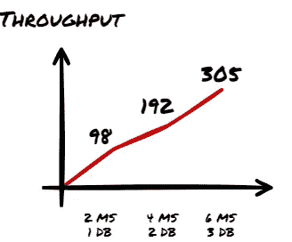

在 [**上一篇文章**](/how-to-use-database-sharding-and-scale-an-asp-net-core-microservice-architecture-22c24916590f) 中，你创建了一个**微服务架构**并手动实现了**应用层数据库分片**。

**现在**，您将**扩展应用**并**运行微服务和数据库的多个容器实例**。您将使用 **Docker Compose** 和 **HAProxy 负载平衡器**:

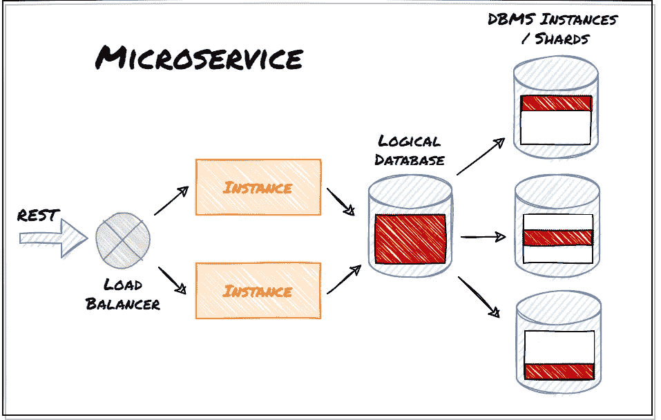

然后运行 **JMeter 负载测试**到**，看看当使用**不同数量的实例**时，应用程序如何伸缩**。最后，您还将**发布和接收来自 RabbitMQ** 的消息。

# 1.运行多个数据库和微服务实例

## **记录微服务**

**使用上一篇文章** **中的** [**代码和环境作为基础**。](/how-to-use-database-sharding-and-scale-an-asp-net-core-microservice-architecture-22c24916590f)

**将 Visual Studio 项目资源管理器中的文件“docker file”**重命名为“ *dockerfile* ”(第一个字符小写)。然后右键单击 Docker 文件，选择 ***创建 Docker 图像*** 。这也会将图像推送到 docker。

## 在 Docker 中运行应用程序

创建文件 *docker-compose.yml* :

docker 文件配置了 3 个数据库容器和 4 个 *Post* 服务实例。目前， *Post* 服务实例只使用两个数据库。您可以稍后删除该注释以使用第三个数据库。一个 HAProxy 负载均衡器在端口 5001 上公开了 *Post* 服务容器。

每个容器有一个 0.5 CPU 的限制，以帮助在本地机器上进行实际的负载测试。在我的 12 核笔记本电脑上，仍然有未使用的资源，因此添加更多的服务和数据库实例可以带来好处。

## **启动应用**

```
C:\dev>docker-compose up -d
```

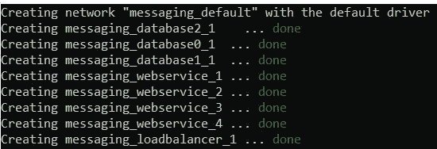

## **初始化数据库**

在[打开浏览器 http://localhost:5001/swagger/index . html](http://localhost:5001/swagger/index.html)

用至少 100 个用户和 10 个类别初始化数据库。

> 您可以创建更多的用户和类别，但由于 CPU 的限制，这需要一些时间。

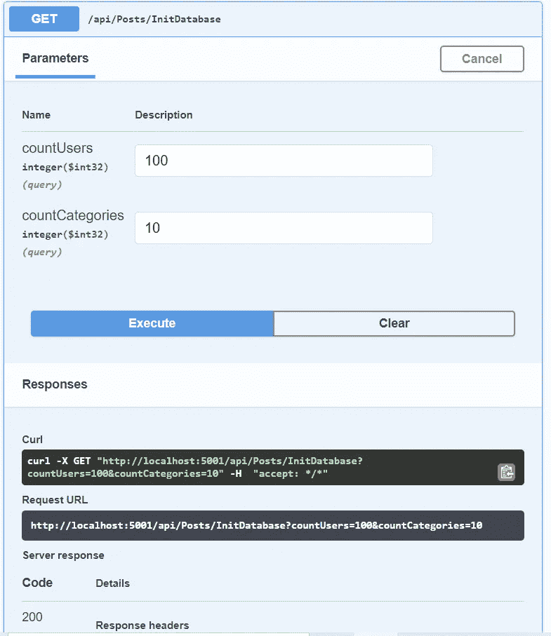

# 2.用 JMeter 对扩展的应用程序进行负载测试

## 创建 JMeter 测试计划

**安装**，打开 [**JMeter**](https://jmeter.apache.org/download_jmeter.cgi) **。**

**创建一个测试计划**和一个线程组:

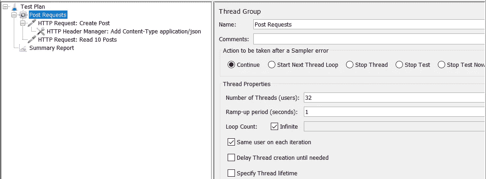

32 个线程是一个不错的开始数字。在线程的每个循环中，它添加一个 post 并读取 10 个 post。

**添加 HTTP 请求以创建帖子:**

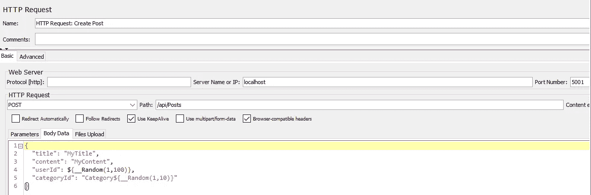

*   服务器名:本地主机
*   端口:5001
*   HTTP-请求:发布
*   路径:/API/post
*   身体数据:

```
{
 "title": "MyTitle",
 "content": "MyContent",
 "userId": ${__Random(1,100)},
 "categoryId": "Category${__Random(1,10)}"
}
```

它为随机用户(ID 1–100)和类别(1–10)创建一个帖子。

**向请求添加一个** `**Content-Type application/json**` **HTTP 头:**

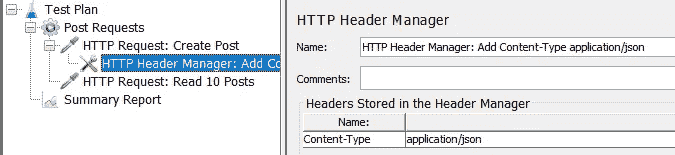

**随机阅读 10 篇文章:**

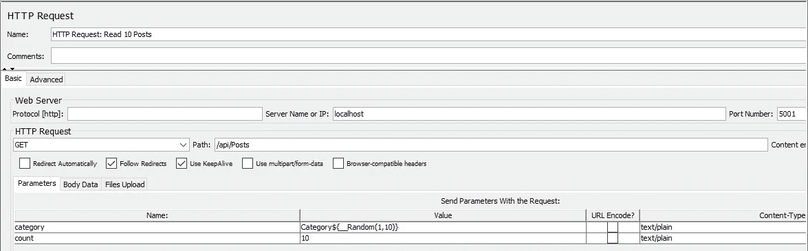

*   服务器名:本地主机
*   端口:5001
*   HTTP-请求:获取
*   路径:/API/post
*   随请求发送参数:

```
NAME | VALUE | CONTENT-TYPE
category | Category${__Random(1,10)} | text/plain
count | 10 | text/plain
```

## 运行测试

测试运行时，看一下*总结报告*:


**不应该有错误。**

**等待一段时间**，直到*平均值*(响应时间)和*吞吐量*的值稳定。

## 修改测试参数

停止 JMeter 中的测试。

您可以**改变测试计划中的线程**。将它们增加到例如 64 或 128 个线程。或者将线程减少到 16 个甚至 1 个。

在编辑 *docker-compose.yml* 之前，关闭应用程序:

```
C:\dev>docker-compose down
```

您可以通过“ *scale* ”属性**更改 *post* 服务实例**的数量。更改数据库数量的“*环境*属性(添加/删除注释):

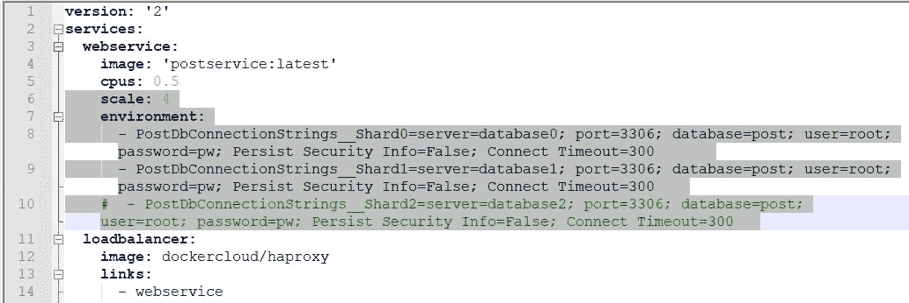

**更改后启动应用程序**:

```
C:\dev>docker-compose up -d
```

数据库服务器运行需要一些时间。还有**记得初始化数据库:**


# 3.测试结果示例

两个 post 服务对一个数据库的比率在我的计算机上产生了良好的结果。我可以将它扩展到六个服务和三个数据库，直到我达到硬件的极限。平均时间保持在 500 毫秒以下。将线程数增加到 64 以上会产生错误。

> 结果取决于我的环境和 CPU 限制。它们在您的机器上会有所不同。

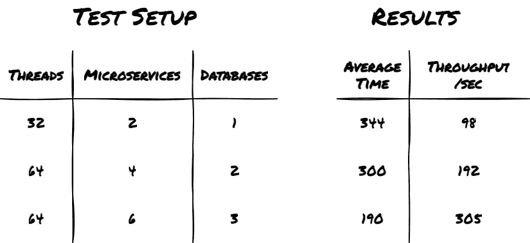

每秒吞吐量与实例数量成正比:


在 CPU 有限的容器中，每秒 305 个请求相当于每天 2500 万个请求。这将允许 100 万用户每天写 10 个帖子并阅读帖子。当然，现实生活中的应用程序会更复杂，但是我希望这个例子展示了基本的思想。

# 4.微服务间通信和复制用户更改

*Post* 服务通过 Rabbitmq 消息接收来自*用户*微服务的用户变更；

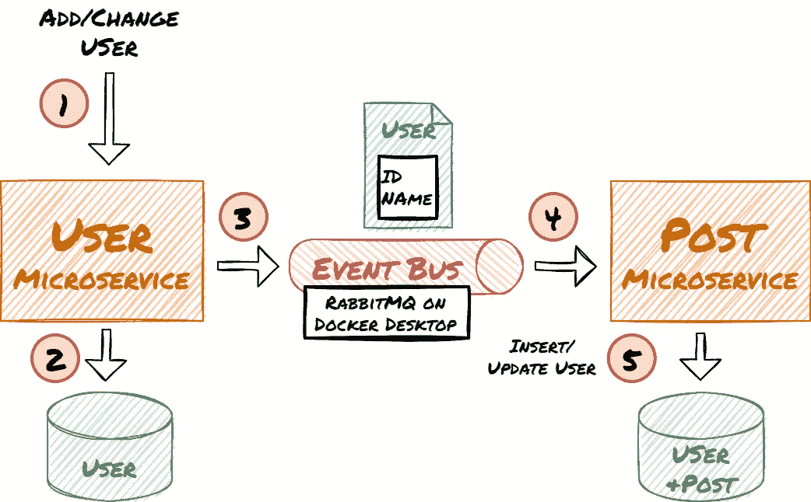

您也将使用 JMeter 进行模拟。

## **创建 RabbitMQ 容器**

**发出下面的命令**(在控制台窗口的一行中)来用 admin UI 启动 RabbitMQ 容器:

```
C:\dev>docker run -d  -p 15672:15672 -p 5672:5672 -e RABBITMQ_DEFAULT_USER=test -e RABBITMQ_DEFAULT_PASS=test --hostname my-rabbit --name some-rabbit rabbitmq:3-management
```

该命令将“*测试*”配置为用户和密码，而不是默认的*来宾*凭证。 *Guest* 限于 localhost，但是在 docker 内部，容器在不同的主机上。

## **修改岗位微服务**

安装 *RabbitMQ。客户端*在 Visual Studio 中获取包。

添加*IntegrationEventListenerService*类:

后台服务使用“ *test* ”账号访问 RabbitMQ 和 *host.docker.internal* 和 *localhost* 作为主机。这允许从容器和 Visual Studio 调试器内部进行连接。

[单个活动消费者](https://www.rabbitmq.com/consumers.html#single-active-consumer)保证只有一个 *Post* 服务实例接收消息。

> 如果活动实例崩溃，下一个实例将接管。您可以稍后通过停止 docker 中当前正在接收的实例来尝试它。

如果交换和管道还不存在，代码将创建它们。它使用手动确认。

**修改*startup . cs*运行 IntegrationEventListenerService:**

## 在 Docker 中运行已更改的微服务

**关闭 docker 中的应用**:

```
C:\dev>docker-compose down
```

**构建 *Post* 服务，将其 docker 化并发布到 docker。**

**更改后启动应用程序**:

```
C:\dev>docker-compose up -d
```

数据库服务器运行需要一些时间。还有**记得初始化数据库:**


## **修改 JMeter 测试**

在 JMeter 测试计划**中添加一个只有一个线程的线程组**:

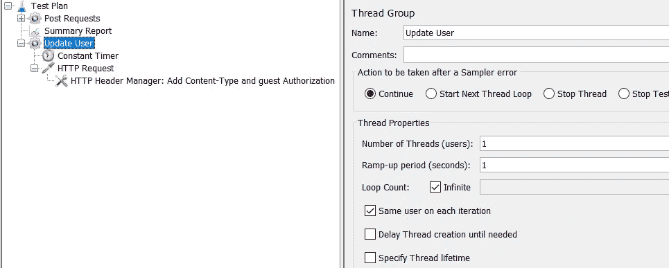

**添加一个常量计时器:**

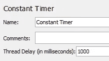

常量计时器将测试限制为每秒一条消息。

> 每秒一条消息还是很常见的。即使半年后有 100 万用户注册，也只是每分钟 4 个新用户。

**添加 HTTP 请求**将消息发布到 RabbitMQ:

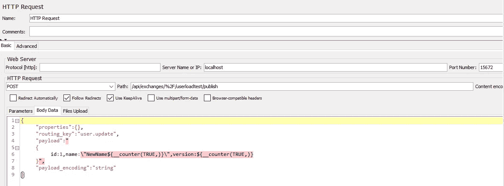

*   服务器名:本地主机
*   端口:15672
*   HTTP-请求:发布
*   路径:/API/exchange/% 2F/userloadtest/publish
*   身体数据:

```
{
 "properties":{},
 "routing_key":"user.update",
 "payload":"
 {
  id:1,name:\"NewName${__counter(TRUE,)}\",version:${__counter(TRUE,)}
 }",
 "payload_encoding":"string"
}
```

用户实体有一个版本字段来处理乱序消息。为了使测试简单，它只更新一个用户并增加版本字段。性能影响应该保持不变。

**为*的内容类型*和对 RabbitMQ 的授权添加一个 HTTP 头管理器**。

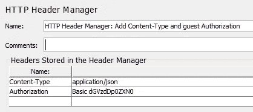

```
Content-Type | application/json
Authorization | Basic dGVzdDp0ZXN0
```

> “dGVzdDp0ZXN0”是 base64 编码的用户和密码“test”。

## **运行测试**

吞吐量应该类似于前面的测试。

您还可以通过查看控制台输出来识别 docker 中的活动 RabbitMQ 消费者。您可以停止容器，另一个实例将接管。

# 5.最后的想法和展望

您**创建了微服务架构**并实现了应用层**数据库分片**。然后**用多个容器实例**扩展应用程序，并**对其进行负载测试**。您还处理了来自 RabbitMQ 的**用户变更事件。**

这仅仅是一个示例应用。您将不得不**调整代码以在生产环境中使用它**。

下一步是什么？获取帖子最多的前 10 个类别的数据需要查询多个数据库实例。这可能会导致延迟并降低性能。 **Redis 可以成为查询聚合数据的解决方案**。我会在我的下一篇文章中展示它。

您还可以在 Kubernetes 中运行应用程序。见**我的其他文章:**

*   [**如何将您的 ASP.NET 核心应用部署到 Kubernetes**](https://levelup.gitconnected.com/kubernetes-angular-asp-net-core-microservice-architecture-c46fc66ede44)
*   [**为 UI 使用角度**](https://levelup.gitconnected.com/kubernetes-angular-asp-net-core-microservice-architecture-c46fc66ede44)

如果你有任何问题、想法或建议，请联系我。