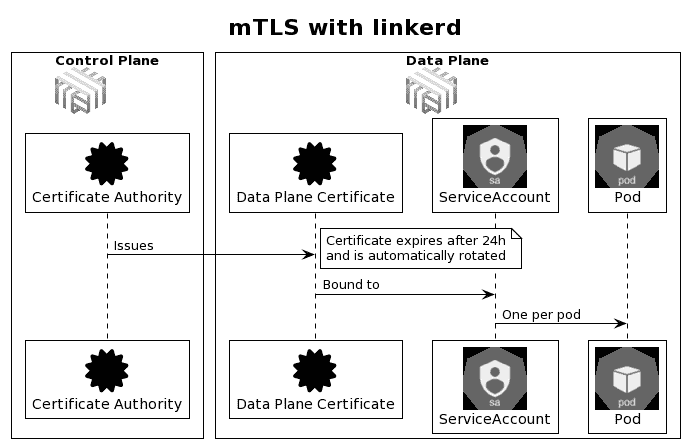
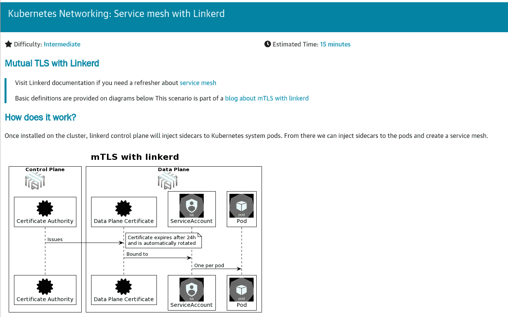
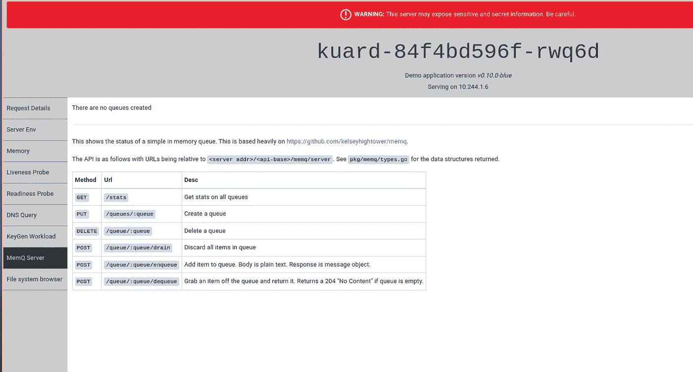
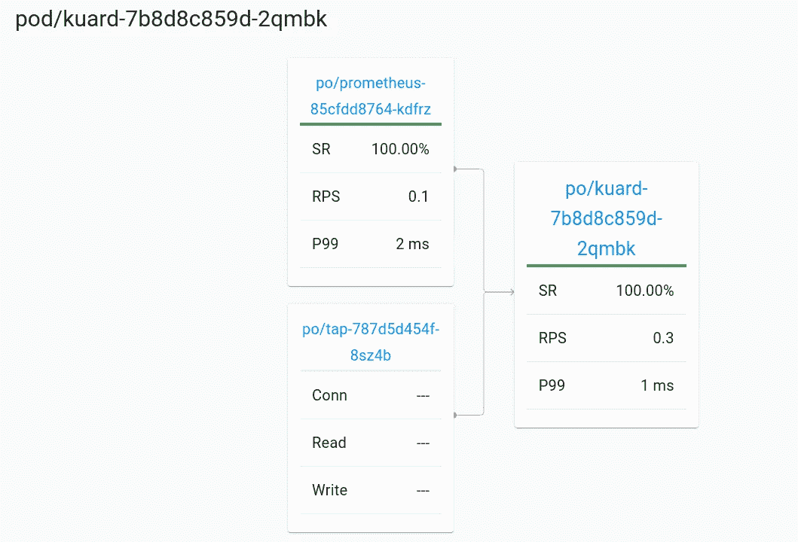

# 如何保护 Kubernetes 集群内通信的安全

> 原文：<https://itnext.io/how-to-secure-kubernetes-in-cluster-communication-5a9927be415b?source=collection_archive---------0----------------------->


Pixabay 上的杰洛特

## Linkerd 服务网格简介

## 介绍

开发 Kubernetes 意味着开发云原生应用程序。 [CNCF](https://www.cncf.io/) 将云原生定义为:

云原生技术使组织能够在现代动态环境(如公共云、私有云和混合云)中构建和运行可扩展的应用程序。容器、**服务网格**、微服务、不可变基础设施和声明式 API 都是这种方法的例子。

这些技术使得松散耦合的系统具有弹性、可管理性和可观察性。与强大的自动化相结合，它们允许工程师以最少的劳动频繁地、可预测地做出高影响力的改变。

*来源:*[*https://github.com/cncf/foundation/blob/master/charter.md*](https://github.com/cncf/foundation/blob/master/charter.md)

云原生应用需要不同的架构方法。服务网格通过将复杂性从应用转移到底层基础设施，帮助实现云原生架构目标

> *如果您需要复习关于* [*服务网格*](https://linkerd.io/what-is-a-service-mesh/) *的内容，请访问 Linkerd 文档。*

## 服务网格解决什么问题？

服务网格通过在平台层而不是应用层透明地插入可观察性、安全性和可靠性功能，为“云原生”应用程序增加了这些功能。

*   平台级指标:在不改变配置或源代码的情况下，跟踪低级指标
*   **Mutual TLS — mLTS** :为集群工作负载添加加密和基于身份的证书
*   提高弹性:延迟感知负载平衡、重试、超时和高级部署模式
*   授权策略:在服务级别实施流量规则

服务网格是一个高级而复杂的主题，因此我们不会一次关注所有的功能，而是一次解决一个。我们将探讨服务网格如何帮助保护集群间的通信。

# 验证和加密地狱流量

服务网格的前提是将意外的架构复杂性(如日志记录、监控、加密和身份验证)转移到底层平台，而不是要求单个应用程序在框架或编程级别实现类似的逻辑。

有两个流行的服务网格， [Istio](https://istio.io/) 和 [Linkerd](https://linkerd.io/) 。我们将使用 Linkerd 来了解如何加密和认证流量，但同样的方法也适用于 Istio。

> *2021 年 Linkerd* [*移至*毕业*状态*](https://www.cncf.io/announcements/2021/07/28/cloud-native-computing-foundation-announces-linkerd-graduation/) *的 CNCF 项目，加盟项目如* Kubernetes *、* etcd *、* rook *或* helm

一旦安装到集群上，linkerd 控制平面将把边盘注入到 Kubernetes 系统单元中。从那里，我们可以注入侧柜到豆荚，并创建一个服务网。



来源:作者

# 演示示例

如果您想尝试 Linkerd 如何保护和认证 Kubernetes 集群中的流量，请前往 Katacoda 并跟随这个自定进度的实验。

[](https://www.katacoda.com/decoder/courses/k8s-networking/k8s-networking-linkerd) [## Kubernetes 网络:使用 Linkerd 的服务网格|解码器| Katacoda

### ☕后台脚本将执行以下任务:重要。如果任何步骤失败，或者您在…中看到 CrashLoopBackOff

www.katacoda.com](https://www.katacoda.com/decoder/courses/k8s-networking/k8s-networking-linkerd) 

卡塔科达情景

## 实验室场景流程

*   安装 linkerd CLI `linkerd version`
*   检查集群是否准备好安装控制面板`linkerd check --pre`
*   安装 linkerd 控制平面

```
linkerd install | kubectl apply -f -
```

*   检查 linkerd 安装`linkerd check`
*   创建示例部署

`kubectl create deployment --image=gcr.io/kuar-demo/kuard-amd64:blue kuard`

*   等待分离舱上升

`kubectl wait deployment kuard --for=condition=Available --timeout=1m`

*   将流量转发到 pod

`kubectl port-forward deploy/kuard 8080:8080 --address 0.0.0.0 &`



Kuard 网页

*   注射 linkerd 边车


> *在注入 linkerd 边车之前，让我们看看 kuard pod 内部运行了多少个容器。应该只有 kuard 容器在运行。*

`kubectl get pods -l app=kuard -o jsonpath='{.items[*].spec.containers[*].name}{"\n"}'`

*   将 linkerd 边车注入 kuard pod

```
kubectl get deploy kuard -o yaml \
  | linkerd inject - \
  | kubectl apply -f -
```

*   确保正确使用 linkerd 边车

`linkerd -n default check --proxy`

*   我们应该看到 linkerd 边车在舱中运行

`kubectl get pods -l app=kuard -o jsonpath='{.items[*].spec.containers[*].name}{"\n"}'`

*   安装可观察性扩展

`helm repo add linkerd [https://helm.linkerd.io/stable](https://helm.linkerd.io/stable)`

```
helm install linkerd-viz \
  --set dashboard.enforcedHostRegexp=.* \
  linkerd/linkerd-viz
```

*   确保安装成功`linkerd check`
*   在后台启动仪表板

```
linkerd viz dashboard --address 0.0.0.0 &
```

*   检查 mTLS 在系统盒和 kuard 盒之间是否工作


*   相互 TLS

> *默认情况下，所有注入了 linkerd sidecar 的 pod 通过加密和认证流量进行通信*

*   重启 pod 以启用 tap 配置

```
kubectl rollout restart deployment kuard
```

*   浏览仪表板以查看连接详细信息



# 结论

在您开始在集群上安装 Linkerd 或 Istio 之前，请确保您了解服务网格带来的操作和认知复杂性。

对于大多数工作负载，您不需要服务网格。通常有替代方案，它们只满足您需要的需求，而不会增加您不需要的功能的复杂性。