# 如何保护您的 web 应用程序(第 1 部分)— CPAS 3

> 原文：<https://itnext.io/how-to-secure-your-web-applications-part-1-cpas-3-715b72973623?source=collection_archive---------0----------------------->


Mauro Sbicego 在 [Unsplash](https://unsplash.com/s/photos/hacking?utm_source=unsplash&utm_medium=referral&utm_content=creditCopyText) 上拍摄的照片

如果您有一个其他用户使用的实时应用程序，那么他们很有可能会受到攻击，如果不是每天，至少每周一次。

从我自己的经验来看，我注意到我监控的几乎所有应用程序每天都受到攻击，要么是用自动脚本查找漏洞，要么是手动攻击。

几乎所有的攻击，无论是手动的还是自动的，都是无害的。它们是由好奇的用户完成的，我认为他们这么做主要是为了好玩或者看看应用程序是如何制作的。大多数看起来是这样的:

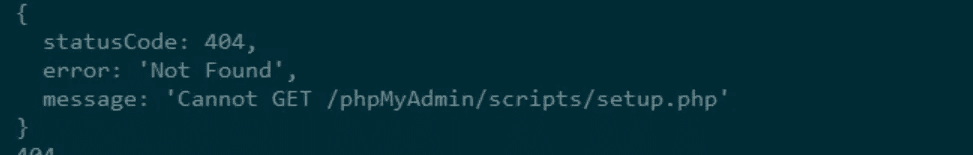

试图运行 PHP 文件的自动化脚本

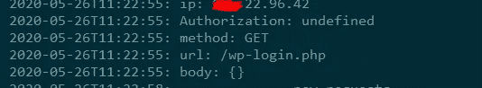

一个随机的用户检查应用程序是否是用 WordPress 制作的

问题在于其他攻击，这些攻击是由黑客完成的，他们宁愿手动分析架构，而不是使用某些特定语言的自动脚本，并根据他们发现的漏洞构建他们的攻击。

考虑到这一点，我将展示一些您现在可以应用的最佳实践，以便为您的应用程序构建一个防弹安全系统。这些原则适用于任何语言和环境。

出于演示目的，我将从我最常用的工具中选择一些:Angular、NestJS(带 express)、MongoDB、带 Ubuntu 的 VPS 和 Nginx。

> 因为，这篇文章会很长，我决定把它分成两部分。在**的第一部分**中，我们将讨论如何**保护**web 应用，在**的第二部分**中，我们将讨论如何**保护**应用的**生产环境**。*😊*
> 
> 此外，本文将更加实用和面向代码。如果你愿意，我会留下一些链接，你可以在那里找到更多的理论信息。

# I .如何保护应用程序

关于安全性的一个误解是，编程语言起着最大的作用。而事实上，大部分安全性(99%)是您编写的实现。

## 1.保持私人数据独立

大多数时候，您的后端代码需要一些敏感数据，如私钥、数据库凭证等…

这里最好的方法是使用类似 [dotenv](https://www.npmjs.com/package/dotenv) 的东西，并将这些数据存储在单独的文件中。

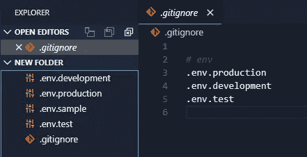

这样，为每个环境创建 3 或 4 个单独的文件，并用相应的数据填充它们(*我们马上会看到一个例子*)。

**这里的关键**是**永远不要把这些文件上传到任何地方**，并且永远不要从每个地方保存一个以上的例子。我的意思是如下。文件 **.env.production** 应该只存在于生产服务器上， **.env.test** 应该只存在于暂存服务器(如果有)上，与 **.env.development** 相同。这就是为什么我们有第四个文件 **.env.sample.** 在这个文件中，我们将写出我们的应用程序需要哪些变量，但是没有它们的值。

## 2.仅为您的资源启用跨来源资源共享(CORS)

如果你曾经看到这个错误，那么你必须处理所谓的 [CORS](https://developer.mozilla.org/en-US/docs/Web/HTTP/CORS) 。

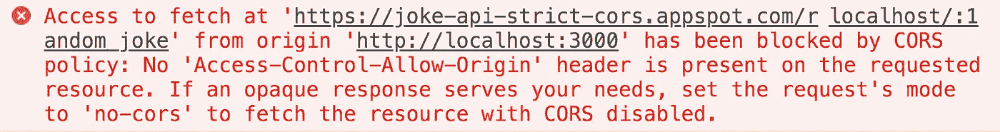

简单地说，只有当资源是从同一个来源上传的时候，这个头才允许 API 请求资源。例如**站点 A** 不能向**站点 B** 请求资源，如果**站点 B** 没有明确允许**站点 A** 。

完整的配置如下所示:

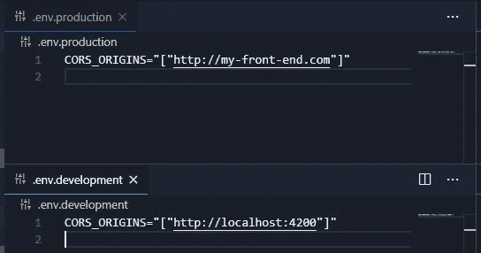

。环境变量

在 Express 中

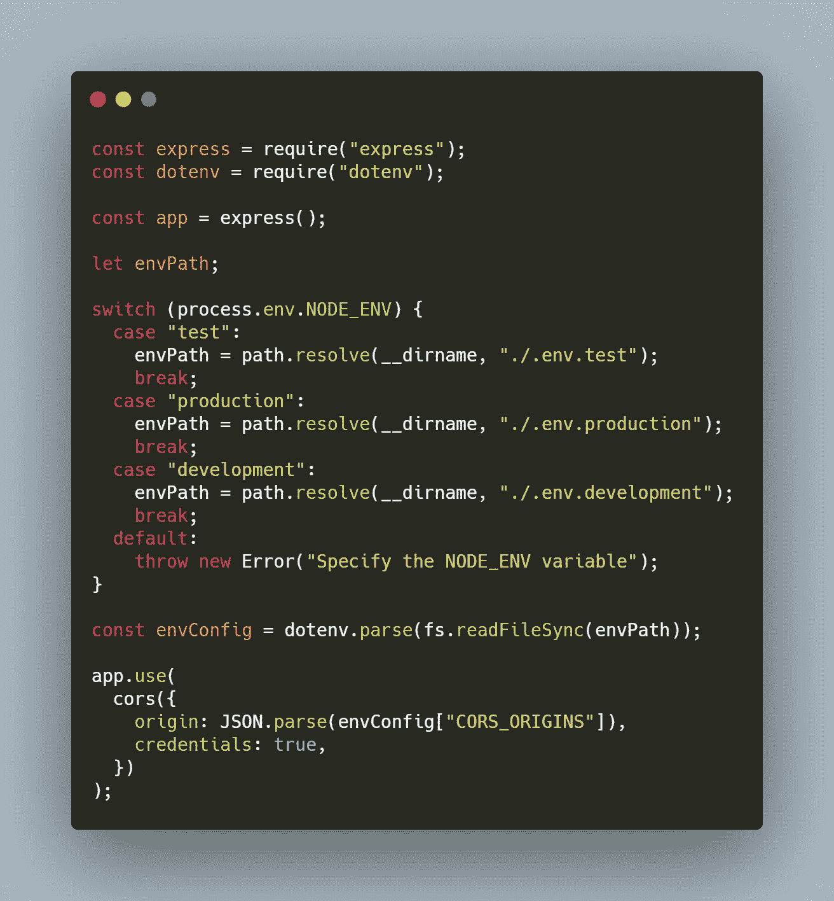

[此处代码](https://carbon.now.sh/?bg=rgba(171%2C%20184%2C%20195%2C%201)&t=monokai&wt=none&l=javascript&ds=true&dsyoff=20px&dsblur=68px&wc=true&wa=true&pv=56px&ph=56px&ln=false&fl=1&fm=Hack&fs=14px&lh=133%25&si=false&es=2x&wm=false&code=const%2520express%2520%253D%2520require(%2522express%2522)%253B%250Aconst%2520dotenv%2520%253D%2520require(%2522dotenv%2522)%253B%250A%250Aconst%2520app%2520%253D%2520express()%253B%250A%250Alet%2520envPath%253B%250A%250Aswitch%2520(process.env.NODE_ENV)%2520%257B%250A%2520%2520case%2520%2522test%2522%253A%250A%2520%2520%2520%2520envPath%2520%253D%2520path.resolve(__dirname%252C%2520%2522.%252F.env.test%2522)%253B%250A%2520%2520%2520%2520break%253B%250A%2520%2520case%2520%2522production%2522%253A%250A%2520%2520%2520%2520envPath%2520%253D%2520path.resolve(__dirname%252C%2520%2522.%252F.env.production%2522)%253B%250A%2520%2520%2520%2520break%253B%250A%2520%2520case%2520%2522development%2522%253A%250A%2520%2520%2520%2520envPath%2520%253D%2520path.resolve(__dirname%252C%2520%2522.%252F.env.development%2522)%253B%250A%2520%2520%2520%2520break%253B%250A%2520%2520default%253A%250A%2520%2520%2520%2520throw%2520new%2520Error(%2522Specify%2520the%2520NODE_ENV%2520variable%2522)%253B%250A%257D%250A%250Aconst%2520envConfig%2520%253D%2520dotenv.parse(fs.readFileSync(envPath))%253B%250A%250Aapp.use(%250A%2520%2520cors(%257B%250A%2520%2520%2520%2520origin%253A%2520JSON.parse(envConfig%255B%2522CORS_ORIGINS%2522%255D)%252C%250A%2520%2520%2520%2520credentials%253A%2520true%252C%250A%2520%2520%257D)%250A)%253B)

## 3.跨站请求伪造(CSRF)和跨站脚本(XSS)

如果这些术语对你来说是新的，那么我建议你先去阅读这篇[文章](https://medium.com/@l4mp1/difference-between-xss-and-csrf-attacks-ff29e5abcd33)。

**TL；博士**

> **跨站点请求伪造(也称为 CSRF 或 XSRF)** 是一种对网站的恶意利用，从 web 应用程序信任的用户处传输未经授权的命令。
> 
> **跨站脚本(也称为 XSS)** 是攻击者可以接管网页的一种方式。XSS 攻击的目标是控制受害者浏览器中的 JavaScript。

为了减少 **CSRF** 漏洞你可以使用 [csurf](https://www.npmjs.com/package/csurf) 模块。这种技术意味着令牌的创建和验证。

服务器创建一个令牌，将其与 cookie 一起发送给客户端，当客户端向服务器发出请求时，后端代码将验证该令牌。这样，所有没有有效令牌的请求都会被拒绝。

后端服务器的实现如下所示。

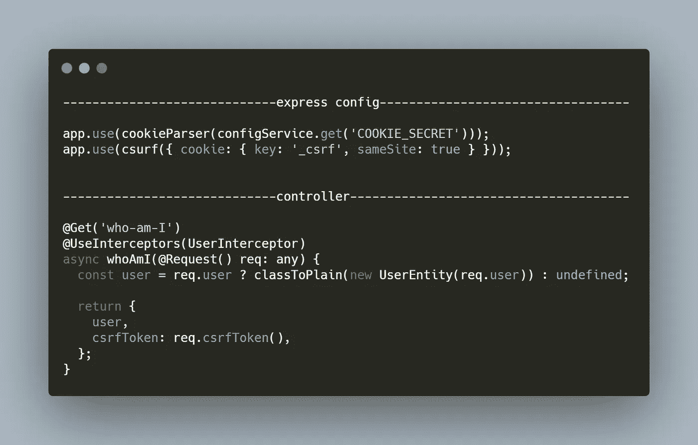

[此处代码](https://carbon.now.sh/?bg=rgba(171%2C%20184%2C%20195%2C%201)&t=monokai&wt=none&l=javascript&ds=true&dsyoff=20px&dsblur=68px&wc=true&wa=true&pv=56px&ph=56px&ln=false&fl=1&fm=Hack&fs=14px&lh=133%25&si=false&es=2x&wm=false&code=-----------------------------express%2520config----------------------------------%250A%250Aapp.use(cookieParser(configService.get(%27COOKIE_SECRET%27)))%253B%250Aapp.use(csurf(%257B%2520cookie%253A%2520%257B%2520key%253A%2520%27_csrf%27%252C%2520sameSite%253A%2520true%2520%257D%2520%257D))%253B%250A%250A%250A-----------------------------controller--------------------------------------%250A%2520%2520%250A%2540Get(%27who-am-I%27)%250A%2540UseInterceptors(UserInterceptor)%250Aasync%2520whoAmI(%2540Request()%2520req%253A%2520any)%2520%257B%250A%2520%2520const%2520user%2520%253D%2520req.user%2520%253F%2520classToPlain(new%2520UserEntity(req.user))%2520%253A%2520undefined%253B%250A%250A%2520%2520return%2520%257B%250A%2520%2520%2520%2520user%252C%250A%2520%2520%2520%2520csrfToken%253A%2520req.csrfToken()%252C%250A%2520%2520%257D%253B%250A%257D)

> **注意！**这个例子是在 NestJS 中完成的。在这里，您必须用您的代码替换其他部分。

**代码解释:**

*   服务器(express)被配置为使用带有秘密令牌的 cookieParser
*   服务器被配置为使用 csurf 模块基于名为 **_csrf** 的 cookie 进行令牌验证，该 cookie 是用属性 **sameSite** 设置的
*   当应用程序第一次加载或向服务器发出第一个请求时，使用方法 **req.csrfToken()** 向客户端发送一个 CSRF 令牌(该方法由 **csurf** 模块提供)

这样，服务器将拒绝所有没有有效令牌的请求。

要使您的前端现在工作，您需要将这个 csrfToken 作为头包含在您的请求中。

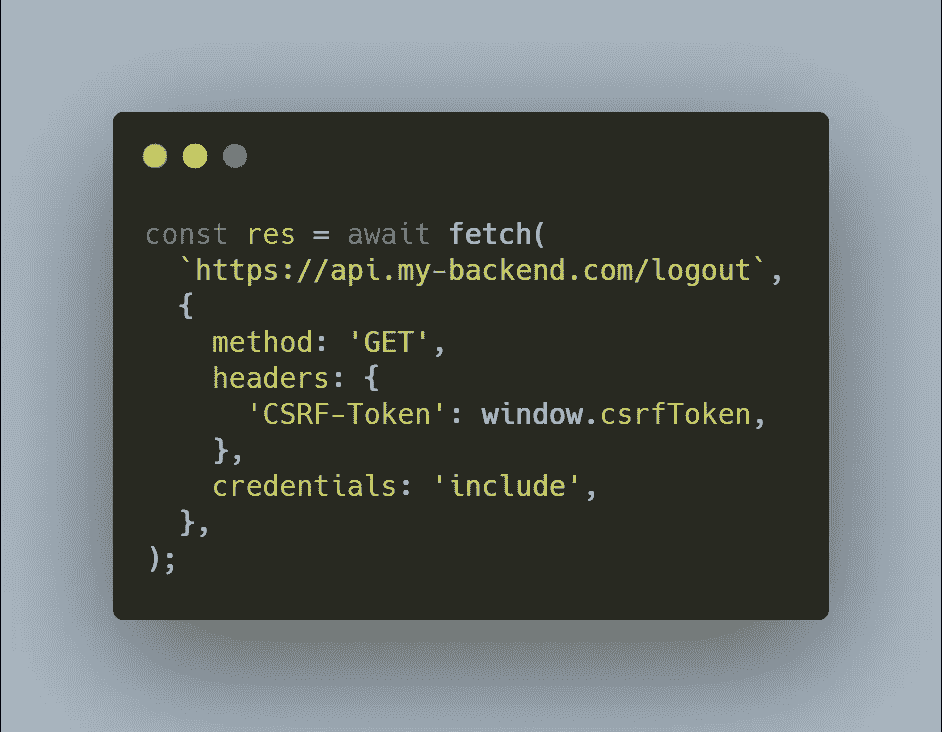

[此处代码](https://carbon.now.sh/?bg=rgba(171%2C%20184%2C%20195%2C%201)&t=monokai&wt=none&l=javascript&ds=true&dsyoff=20px&dsblur=68px&wc=true&wa=true&pv=56px&ph=56px&ln=false&fl=1&fm=Hack&fs=14px&lh=133%25&si=false&es=2x&wm=false&code=const%2520res%2520%253D%2520await%2520fetch(%250A%2520%2520%2560https%253A%252F%252Fapi.my-backend.com%252Flogout%2560%252C%250A%2520%2520%257B%250A%2520%2520%2520%2520method%253A%2520%27GET%27%252C%250A%2520%2520%2520%2520headers%253A%2520%257B%250A%2520%2520%2520%2520%2520%2520%27CSRF-Token%27%253A%2520window.csrfToken%252C%250A%2520%2520%2520%2520%257D%252C%250A%2520%2520%2520%2520credentials%253A%2520%27include%27%252C%250A%2520%2520%257D%252C%250A)%253B)

*注意我们在前端设置的* ***凭证*** *属性，我们在设置* ***cors()*** 时也在后端设置了这个属性

*用您的令牌的位置替换* `*window.csrfToken*` *。*

**XSS** 攻击可以变化，解决方案也可以变化。保护自己免受这种攻击的最佳方法是净化输入。

还有一件事就是使用[头盔](https://www.npmjs.com/package/helmet)模块。头盔是 12 个较小的中间件函数的集合，它们设置 HTTP 响应头。其中一个中间件是为了保护 XSS。你可以在这里阅读更多相关信息[。](https://github.com/helmetjs/helmet#how-it-works)

为了净化后端的输入，您可以使用[类验证器](https://www.npmjs.com/package/class-validator)和[类转换](https://www.npmjs.com/package/class-transformer)模块。

## 4.使用限速器

一个[速率限制器](https://www.npmjs.com/package/express-rate-limit)用于防止垃圾邮件或对 API 路由的暴力攻击。

假设我们的后端服务器上有一个 **/login** 路由，我们希望阻止代理垃圾邮件发送这个路由。

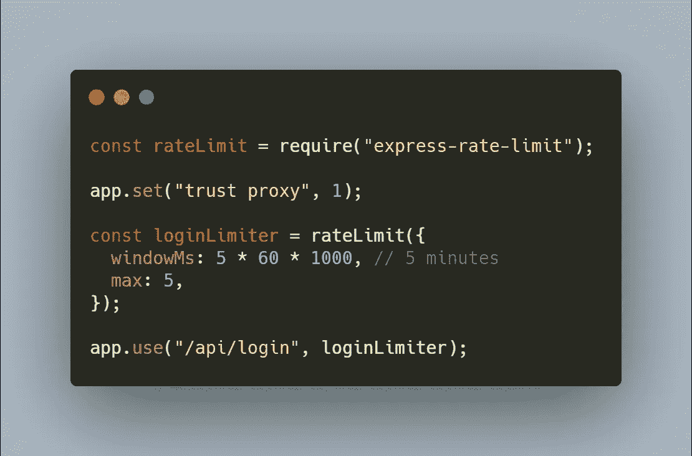

[此处代码](https://carbon.now.sh/?bg=rgba(171%2C%20184%2C%20195%2C%201)&t=monokai&wt=none&l=javascript&ds=true&dsyoff=20px&dsblur=68px&wc=true&wa=true&pv=56px&ph=56px&ln=false&fl=1&fm=Hack&fs=14px&lh=133%25&si=false&es=2x&wm=false&code=const%2520rateLimit%2520%253D%2520require(%2522express-rate-limit%2522)%253B%250A%250Aapp.set(%2522trust%2520proxy%2522%252C%25201)%253B%250A%250Aconst%2520loginLimiter%2520%253D%2520rateLimit(%257B%250A%2520%2520windowMs%253A%25205%2520*%252060%2520*%25201000%252C%2520%252F%252F%25205%2520minutes%250A%2520%2520max%253A%25205%252C%250A%257D)%253B%250A%250Aapp.use(%2522%252Fapi%252Flogin%2522%252C%2520loginLimiter)%253B)

使用这些设置，所有代理都有 5 次登录尝试，在 5 分钟窗口内对路由**/API/登录**的 5 次请求之后，代理 IP 将被列入黑名单 5 分钟。在 5 分钟窗口内的 5 次请求之后，用户将收到一个 **429** 响应**(请求太多)。**

> **如果后端服务器位于 Heroku、Bluemix、AWS ELB、Nginx 等反向代理之后，则需要 app.set("trust proxy "，1)**

## 5.适当的认证系统

说到身份验证，我们目前拥有的最佳解决方案之一是基于 JWT (JSON Web Token)的解决方案。

简而言之，用户将其凭证交换为令牌，并在验证之后，基于该令牌完成许可。

最常见的情况是将这个令牌发送给用户，然后用户将它作为报头添加到所有未来的请求中。

这种方法很好，但是它为漏洞留下了空间。如果令牌被发送回客户端，那么客户端将需要存储在本地存储或 cookies 中。通过这种方式，**秘密令牌**是可用的，并且可以被在你的网站上运行的任何 JavaScript 代码访问。

更好的方法是使令牌只能通过后端代码访问。这样，它就不会被窃取或操纵。

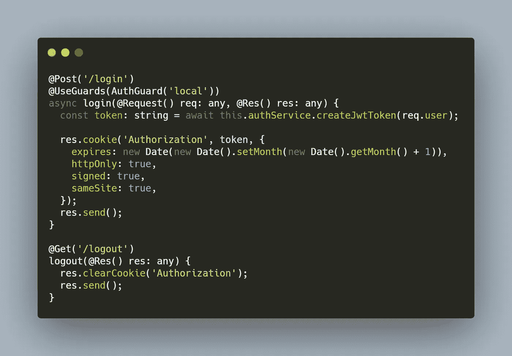

[此处代码](https://carbon.now.sh/?bg=rgba(171%2C%20184%2C%20195%2C%201)&t=monokai&wt=none&l=javascript&ds=true&dsyoff=20px&dsblur=68px&wc=true&wa=true&pv=56px&ph=56px&ln=false&fl=1&fm=Hack&fs=14px&lh=133%25&si=false&es=2x&wm=false&code=%2540Post(%27%252Flogin%27)%250A%2540UseGuards(AuthGuard(%27local%27))%250Aasync%2520login(%2540Request()%2520req%253A%2520any%252C%2520%2540Res()%2520res%253A%2520any)%2520%257B%250A%2520%2520const%2520token%253A%2520string%2520%253D%2520await%2520this.authService.createJwtToken(req.user)%253B%250A%250A%2520%2520res.cookie(%27Authorization%27%252C%2520token%252C%2520%257B%250A%2520%2520%2520%2520expires%253A%2520new%2520Date(new%2520Date().setMonth(new%2520Date().getMonth()%2520%252B%25201))%252C%250A%2520%2520%2520%2520httpOnly%253A%2520true%252C%250A%2520%2520%2520%2520signed%253A%2520true%252C%250A%2520%2520%2520%2520sameSite%253A%2520true%252C%250A%2520%2520%257D)%253B%250A%2520%2520res.send()%253B%250A%257D%250A%250A%2540Get(%27%252Flogout%27)%250Alogout(%2540Res()%2520res%253A%2520any)%2520%257B%250A%2520%2520res.clearCookie(%27Authorization%27)%253B%250A%2520%2520res.send()%253B%250A%257D)

这样前端代码甚至不需要费心去管理敏感数据。

如果服务器需要保护一些路由，并使它们只对经过身份验证的用户可用，那么它所要做的就是从 cookies 中获取令牌并验证它。

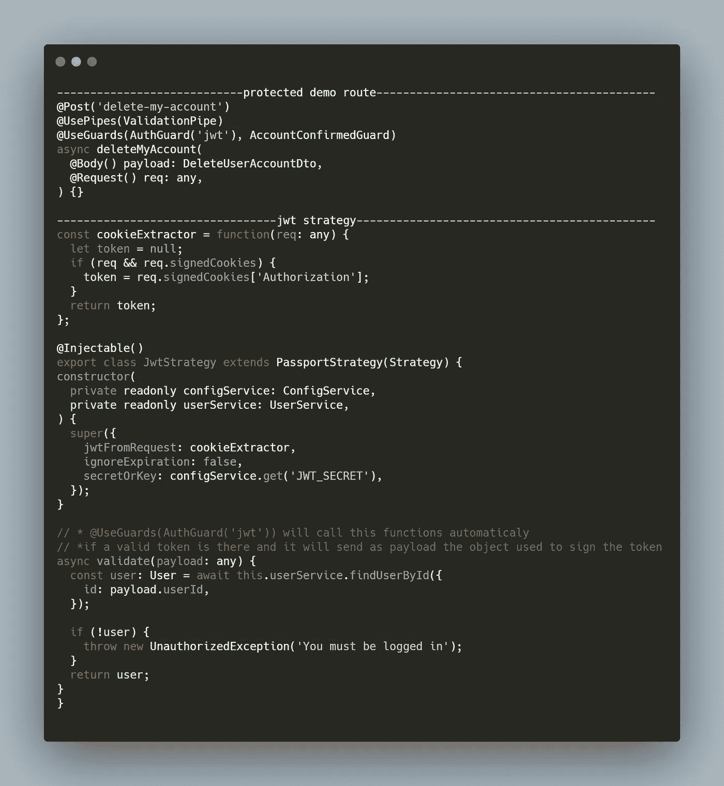

代码[在这里](https://carbon.now.sh/?bg=rgba(171%2C%20184%2C%20195%2C%201)&t=monokai&wt=none&l=javascript&ds=true&dsyoff=20px&dsblur=68px&wc=true&wa=true&pv=56px&ph=56px&ln=false&fl=1&fm=Hack&fs=14px&lh=133%25&si=false&es=2x&wm=false&code=----------------------------protected%2520demo%2520route------------------------------------------%250A%2540Post(%27delete-my-account%27)%250A%2540UsePipes(ValidationPipe)%250A%2540UseGuards(AuthGuard(%27jwt%27)%252C%2520AccountConfirmedGuard)%250Aasync%2520deleteMyAccount(%250A%2520%2520%2540Body()%2520payload%253A%2520DeleteUserAccountDto%252C%250A%2520%2520%2540Request()%2520req%253A%2520any%252C%250A)%2520%257B%257D%250A%250A---------------------------------jwt%2520strategy---------------------------------------------%250Aconst%2520cookieExtractor%2520%253D%2520function(req%253A%2520any)%2520%257B%250A%2520%2520let%2520token%2520%253D%2520null%253B%250A%2520%2520if%2520(req%2520%2526%2526%2520req.signedCookies)%2520%257B%250A%2520%2520%2520%2520token%2520%253D%2520req.signedCookies%255B%27Authorization%27%255D%253B%250A%2520%2520%257D%250A%2520%2520return%2520token%253B%250A%257D%253B%250A%250A%2540Injectable()%250Aexport%2520class%2520JwtStrategy%2520extends%2520PassportStrategy(Strategy)%2520%257B%250Aconstructor(%250A%2520%2520private%2520readonly%2520configService%253A%2520ConfigService%252C%250A%2520%2520private%2520readonly%2520userService%253A%2520UserService%252C%250A)%2520%257B%250A%2520%2520super(%257B%250A%2520%2520%2520%2520jwtFromRequest%253A%2520cookieExtractor%252C%250A%2520%2520%2520%2520ignoreExpiration%253A%2520false%252C%250A%2520%2520%2520%2520secretOrKey%253A%2520configService.get(%27JWT_SECRET%27)%252C%250A%2520%2520%257D)%253B%250A%257D%250A%250A%252F%252F%2520*%2520%2540UseGuards(AuthGuard(%27jwt%27))%2520will%2520call%2520this%2520functions%2520automaticaly%2520%250A%252F%252F%2520*if%2520a%2520valid%2520token%2520is%2520there%2520and%2520it%2520will%2520send%2520as%2520payload%2520the%2520object%2520used%2520to%2520sign%2520the%2520token%250Aasync%2520validate(payload%253A%2520any)%2520%257B%250A%2520%2520const%2520user%253A%2520User%2520%253D%2520await%2520this.userService.findUserById(%257B%250A%2520%2520%2520%2520id%253A%2520payload.userId%252C%250A%2520%2520%257D)%253B%250A%250A%2520%2520if%2520(!user)%2520%257B%250A%2520%2520%2520%2520throw%2520new%2520UnauthorizedException(%27You%2520must%2520be%2520logged%2520in%27)%253B%250A%2520%2520%257D%250A%2520%2520return%2520user%253B%250A%257D%250A%257D%250A)

如果客户端不是浏览器呢？

在这种情况下，我的建议是为每个场景创建多个具有最佳解决方案的登录路由。

## 6.持久数据(cookies、本地存储、会话存储)管理

如果需要在浏览器的 cookies 中保存一些敏感数据，请利用这些属性:

*   **httpOnly —** 如果 HTTP 响应头中包含 httpOnly 标志(可选)，则不能通过客户端脚本访问 cookie
*   **已签名—** 如果包含此标志，那么 cookie 将有一个签名，后端代码可以检测客户端是否修改了 cookie
*   **sameSite —** 允许您声明您的 cookie 是否应该限于第一方或相同站点的上下文
*   **安全—** Cookie 将仅在 HTTPS 传输中发送

最佳做法是，避免使用本地存储或会话存储来存储敏感数据。仅使用此存储来保存一些首选项。例如用户偏好的主题颜色。

## 7.避免在数据库操作中传播语法

**不要这样。**

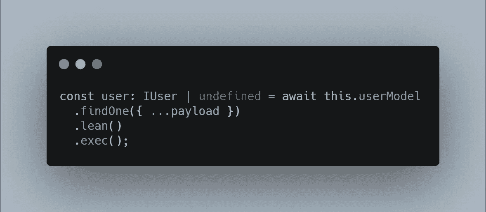

[此处代码](https://carbon.now.sh/?bg=rgba(171%2C%20184%2C%20195%2C%201)&t=seti&wt=none&l=javascript&ds=true&dsyoff=20px&dsblur=68px&wc=true&wa=true&pv=56px&ph=56px&ln=false&fl=1&fm=Hack&fs=14px&lh=133%25&si=false&es=2x&wm=false&code=const%2520user%253A%2520IUser%2520%257C%2520undefined%2520%253D%2520await%2520this.userModel%250A%2520%2520.findOne(%257B%2520...payload%2520%257D)%250A%2520%2520.lean()%250A%2520%2520.exec()%253B)

这是 XSS 攻击或注射攻击的完美场景。

到目前为止，注入是 web 应用程序中最常见的安全问题，正如 OWASP 10 项目中的 listen。

在这种情况下，该漏洞不会带来如此大的风险，因为只是一个 findOne 方法。但是想象一下如果是 **findOneAndUpdate 会怎么样。用户可以提供他想要的任何参数，并对他的文档进行任何可能的修改。例如给自己管理员权限(如果有的话)。**

可能会有需要分布指示器的场景，比如有许多键值对的大更新对象。对于这些情况，请确保对输入进行整理和序列化。


[此处代码](https://carbon.now.sh/?bg=rgba(171%2C%20184%2C%20195%2C%201)&t=seti&wt=none&l=javascript&ds=true&dsyoff=20px&dsblur=68px&wc=true&wa=true&pv=56px&ph=56px&ln=false&fl=1&fm=Hack&fs=14px&lh=133%25&si=false&es=2x&wm=false&code=---------------------controller---------------------%250A%2540Put(%27update-profile%27)%250A%2540UseFilters(MongoExceptionFilter)%250A%2540UsePipes(new%2520ValidationPipe(%257B%2520whitelist%253A%2520true%2520%257D))%250A%2540UseGuards(AuthGuard(%27jwt%27)%252C%2520AccountConfirmedGuard)%250Aasync%2520updateUserProfile(%250A%2520%2520%2540Body()%2520payload%253A%2520UpdateUserProfileDto%252C%250A%2520%2520%2540Request()%2520req%253A%2520any%252C%250A)%2520%257B%257D%250A%250A-----------------DTO------------------------------%250Aexport%2520class%2520UpdateUserProfileDto%2520%257B%250A%2520%2520%2540IsString()%250A%2520%2520%2540IsOptional()%250A%2520%2520firstName%253A%2520string%253B%250A%250A%2520%2520%2540IsString()%250A%2520%2520%2540IsOptional()%250A%2520%2520lastName%253A%2520string%253B%250A%257D)

在这种情况下

```
@UsePipes(new ValidationPipe({ whitelist: true }))
```

将使用**updateuser profile to**对象验证来自**主体**的**有效负载**，并将移除任何额外的属性。

# 包裹

有许多原则可以用来保护您的 web 应用程序。请记住，最重要的是您的代码实现。

在第二部分中，我们将讨论如何保护应用程序的生产环境，这一部分将很快推出，请务必关注我的文章，以免错过。

## 更新

第二部分是这里的。

## 更像这样

如果你喜欢这篇文章，那么看看 CPAS 的另一篇文章(常见问题和解决方案系列)；

[](/how-to-deploy-angular-app-in-production-cpas-2-affb711d18fc) [## 如何在生产中部署 Angular app—CPAS 新协议

### 了解如何在不同的服务器上部署生产环境中的 Angular 应用程序

itnext.io](/how-to-deploy-angular-app-in-production-cpas-2-affb711d18fc) [](/remove-elements-from-an-array-recursively-cpas-1-856cc44613c5) [## 递归地从数组中删除🗑elements—CPAs 1

### 了解如何从数组中移除多个元素。

itnext.io](/remove-elements-from-an-array-recursively-cpas-1-856cc44613c5)