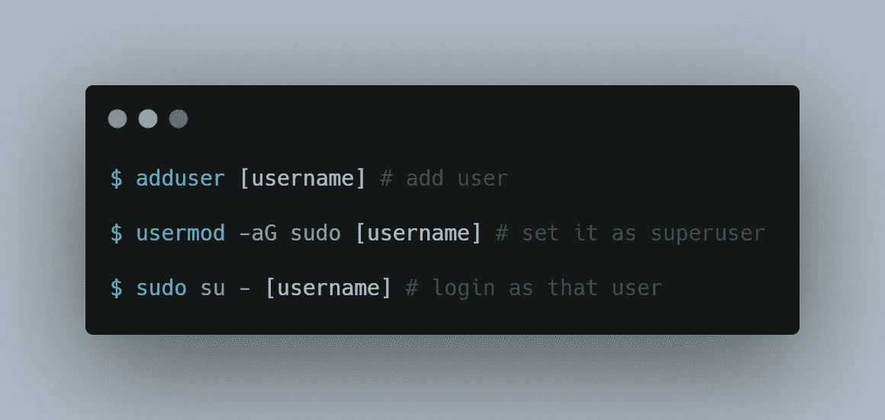
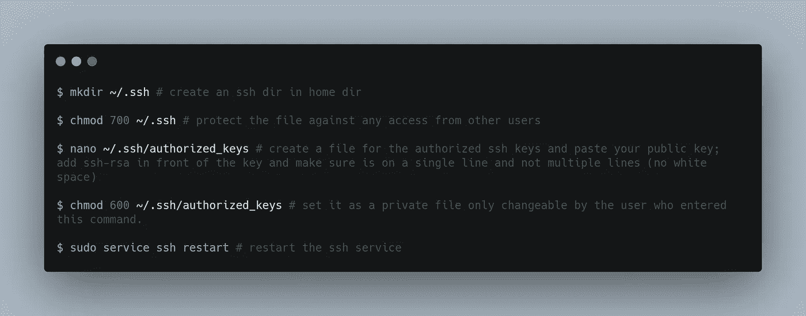
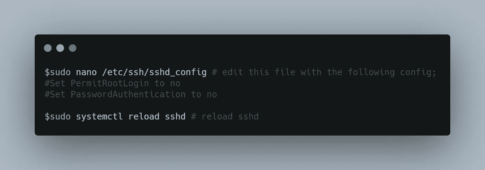
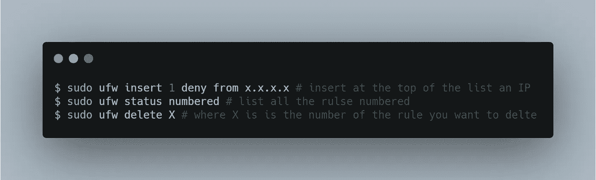
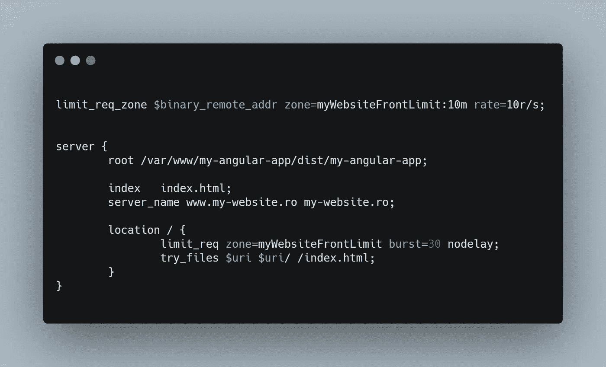
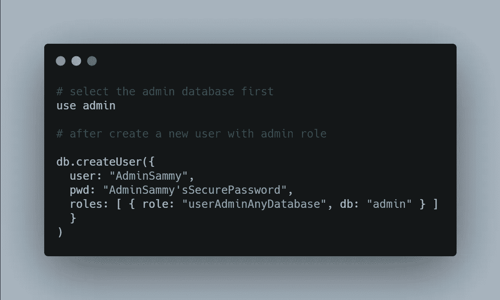
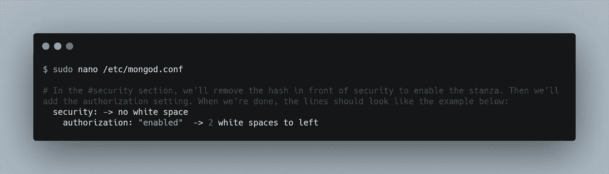

# 如何保护您的 web 应用程序(第二部分)— CPAS 3

> 原文：<https://itnext.io/how-to-secure-your-web-applications-part-2-cpas-3-5f53978f0aef?source=collection_archive---------1----------------------->


Rafif Prawira 在 [Unsplash](https://unsplash.com/s/photos/maze?utm_source=unsplash&utm_medium=referral&utm_content=creditCopyText) 上拍摄的照片

> 如果你发现自己在这里，你可能已经读过本文的[第一部分。如果不是，那就没问题。我要提醒你的是，在**第一部分**中，我们讨论了如何**保护 **web 应用程序**的安全**，在**这一部分**中，我们将讨论如何**保护**应用程序的**生产环境**。*😊*](/how-to-secure-your-web-applications-part-1-cpas-3-715b72973623)
> 
> 就像上一次一样，这篇文章会更加实用，以解决方案为导向。我会留下一些链接，在那里你可以找到更多关于我们为什么这样做的理论信息。
> 
> 让我们跳上去吧！

# 二。如何保护生产环境

我们将提到的生产环境是 VPS(虚拟专用服务器)。是一台我们可以完全访问的服务器，我们可以根据自己的意愿对其进行配置

从第一篇文章开始，我们选择的例子的栈是:Angular，NestJS(带 express)，MongoDB，一个带 Ubuntu 的 VPS，和 Nginx。所以在本文中，一些精确定位的问题会有 Ubuntu 和 Nginx 的例子。然而，这些都是原则，所以你可以在任何地方实现它们。

## 1.启用 SSH 登录并禁用 root 和密码登录

当您拥有基本 VPS 时，要做的第一步是启用 SSH 密钥登录，并禁用 **root** 和**密码**认证方法。

我们为什么要这么做？

*   [root 登录为什么不好](https://askubuntu.com/questions/16178/why-is-it-bad-to-log-in-as-root)？
*   为什么使用 ssh-key 比使用密码更安全？

下面是实现它的步骤:

1.  **生成一个 SSH 密钥对(私钥和公钥)。**

我更喜欢 PuttyGen，因为它很容易使用。[这里的](https://www.youtube.com/watch?v=-92wEg68SKQ)是如何使用 PuttyGen 生成这些密钥对的视频示例。

2.**创建一个新用户并授权给他**



[RAW](https://carbon.now.sh/?bg=rgba(171%2C%20184%2C%20195%2C%201)&t=seti&wt=none&l=application%2Fx-sh&ds=true&dsyoff=20px&dsblur=68px&wc=true&wa=true&pv=56px&ph=56px&ln=false&fl=1&fm=Hack&fs=14px&lh=133%25&si=false&es=2x&wm=false&code=%2524%2520adduser%2520%255Busername%255D%2520%2523%2520add%2520user%250A%250A%2524%2520usermod%2520-aG%2520sudo%2520%255Busername%255D%2520%2523%2520set%2520it%2520as%2520superuser%250A%250A%2524%2520sudo%2520su%2520-%2520%255Busername%255D%2520%2523%2520login%2520as%2520that%2520user)

3.**为新用户授权 SSH 密钥**



[生](https://carbon.now.sh/?bg=rgba(171%2C%20184%2C%20195%2C%201)&t=seti&wt=none&l=application%2Fx-sh&ds=true&dsyoff=20px&dsblur=68px&wc=true&wa=true&pv=56px&ph=56px&ln=false&fl=1&fm=Hack&fs=14px&lh=133%25&si=false&es=2x&wm=false&code=%2524%2520mkdir%2520~%252F.ssh%2520%2523%2520create%2520an%2520ssh%2520dir%2520in%2520home%2520dir%250A%250A%2524%2520chmod%2520700%2520~%252F.ssh%2520%2523%2520protect%2520the%2520file%2520against%2520any%2520access%2520from%2520other%2520users%250A%250A%2524%2520nano%2520~%252F.ssh%252Fauthorized_keys%2520%2523%2520create%2520a%2520file%2520for%2520the%2520authorized%2520ssh%2520keys%2520and%2520paste%2520your%2520public%2520key%253B%2520add%2520ssh-rsa%2520in%2520front%2520of%2520the%2520key%2520and%2520make%2520sure%2520is%2520on%2520a%2520single%2520line%2520and%2520not%2520multiple%2520lines%2520(no%2520white%2520space)%250A%250A%2524%2520chmod%2520600%2520~%252F.ssh%252Fauthorized_keys%2520%2523%2520set%2520it%2520as%2520a%2520private%2520file%2520only%2520changeable%2520by%2520the%2520user%2520who%2520entered%2520this%2520command.%250A%250A%2524%2520sudo%2520service%2520ssh%2520restart%2520%2523%2520restart%2520the%2520ssh%2520service)

4.**禁用 Root &密码登录**



[生](https://carbon.now.sh/?bg=rgba(171%2C%20184%2C%20195%2C%201)&t=seti&wt=none&l=application%2Fx-sh&ds=true&dsyoff=20px&dsblur=68px&wc=true&wa=true&pv=56px&ph=56px&ln=false&fl=1&fm=Hack&fs=14px&lh=133%25&si=false&es=2x&wm=false&code=%2524sudo%2520nano%2520%252Fetc%252Fssh%252Fsshd_config%2520%2523%2520edit%2520this%2520file%2520with%2520the%2520following%2520config%253B%250A%2523Set%2520PermitRootLogin%2520to%2520no%250A%2523Set%2520PasswordAuthentication%2520to%2520no%250A%250A%2524sudo%2520systemctl%2520reload%2520sshd%2520%2523%2520reload%2520sshd)

## 2.添加防火墙

对于这些问题，防火墙是最佳解决方案:

*   保护您的内部端口
*   将恶意代理列入黑名单

这里的方法是使用 [UFW](https://en.wikipedia.org/wiki/Uncomplicated_Firewall) (简单防火墙)，它是 **iptables** 的接口，旨在简化配置防火墙的过程。

设置这个防火墙非常简单，我已经知道一篇文章很好地解释了它。所以我会让你[链接](https://hostadvice.com/how-to/how-to-configure-firewall-with-ufw-on-ubuntu-18/)到它，因为我认为没有必要重新发明轮子。这些命令非常简单，在操作系统中也很相似。

但是，我将向您展示一些我认为非常有用的额外命令:



[生](https://carbon.now.sh/?bg=rgba(171%2C%20184%2C%20195%2C%201)&t=seti&wt=none&l=application%2Fx-sh&ds=true&dsyoff=20px&dsblur=68px&wc=true&wa=true&pv=56px&ph=56px&ln=false&fl=1&fm=Hack&fs=14px&lh=133%25&si=false&es=2x&wm=false&code=%2524%2520sudo%2520ufw%2520insert%25201%2520deny%2520from%2520x.x.x.x%2520%2523%2520insert%2520at%2520the%2520top%2520of%2520the%2520list%2520an%2520IP%250A%2524%2520sudo%2520ufw%2520status%2520numbered%2520%2523%2520list%2520all%2520the%2520rulse%2520numbered%250A%2524%2520sudo%2520ufw%2520delete%2520X%2520%2523%2520where%2520X%2520is%2520is%2520the%2520number%2520of%2520the%2520rule%2520you%2520want%2520to%2520delte)

> 这是我的个人意见。如果你因为把潜在黑客列入黑名单而抓狂，一定不要屏蔽爬虫👍。要检查一个 IP 是否被 Googlebot 使用，你可以运行一个反向 DNS 查找，就像这个例子中的。

## 4.使用限速器

又来了？

是的，但是这一次，在 web 服务器级别创建一个速率限制器。在上一篇文章中，我们看到了如何在应用服务器级别创建一个内部速率限制器。

Nginx 中的一个简单配置如下所示:

> Nginx 的这种配置模式(带有符号链接)在[这里](/how-to-deploy-angular-app-in-production-cpas-2-affb711d18fc)有更详细的介绍。



[RAW](https://carbon.now.sh/?bg=rgba(171%2C%20184%2C%20195%2C%201)&t=seti&wt=none&l=application%2Fx-sh&ds=true&dsyoff=20px&dsblur=68px&wc=true&wa=true&pv=56px&ph=56px&ln=false&fl=1&fm=Hack&fs=14px&lh=133%25&si=false&es=2x&wm=false&code=%250Alimit_req_zone%2520%2524binary_remote_addr%2520zone%253DmyWebsiteFrontLimit%253A10m%2520rate%253D10r%252Fs%253B%250A%250A%250Aserver%2520%257B%250A%2520%2520%2520%2520%2520%2520%2520%2520root%2520%252Fvar%252Fwww%252Fmy-angular-app%252Fdist%252Fmy-angular-app%253B%250A%250A%2520%2520%2520%2520%2520%2520%2520%2520index%2520%2520%2520index.html%253B%250A%2520%2520%2520%2520%2520%2520%2520%2520server_name%2520www.my-website.ro%2520my-website.ro%253B%250A%250A%2520%2520%2520%2520%2520%2520%2520%2520location%2520%252F%2520%257B%250A%2520%2520%2520%2520%2520%2520%2520%2520%2520%2520%2520%2520%2520%2520%2520%2520limit_req%2520zone%253DmyWebsiteFrontLimit%2520burst%253D30%2520nodelay%253B%250A%2520%2520%2520%2520%2520%2520%2520%2520%2520%2520%2520%2520%2520%2520%2520%2520try_files%2520%2524uri%2520%2524uri%252F%2520%252Findex.html%253B%250A%2520%2520%2520%2520%2520%2520%2520%2520%257D%250A%257D%250A)

根据这些规则，我们得到了以下结果:

*   最大速率是 **10 个请求/秒**，因为 Nginx 以**毫秒**跟踪请求，限制是**每 100 毫秒**1 个请求；
*   **最大**缓冲极限**为**30；**参数 **burst** 定义了一个客户端可以发出多少个超过指定速率的请求**
*   **因为 **burst** 将超出的请求放在一个队列中，导致流量的平稳流动，这不是很实际，因为它会使网站看起来很慢；那是额外的参数 **nodelay****

**你可以在他们的官方文档上阅读更多相关信息。**

## **5.保护您的数据库**

**最后一步，我们可以采取的是保护我们的数据库。**

**下面是实现它的步骤:**

1.  ****添加管理员用户****

**首先，连接到 Mongo shell。**

```
$ mongo
```

****

**[生](https://carbon.now.sh/?bg=rgba(171%2C%20184%2C%20195%2C%201)&t=seti&wt=none&l=application%2Fx-sh&ds=true&dsyoff=20px&dsblur=68px&wc=true&wa=true&pv=56px&ph=56px&ln=false&fl=1&fm=Hack&fs=14px&lh=133%25&si=false&es=2x&wm=false&code=%2523%2520select%2520the%2520admin%2520database%2520first%250Ause%2520admin%2520%250A%250A%2523%2520after%2520create%2520a%2520new%2520user%2520with%2520admin%2520role%250A%250Adb.createUser(%257B%250A%2520%2520user%253A%2520%2522AdminSammy%2522%252C%250A%2520%2520pwd%253A%2520%2522AdminSammy%27sSecurePassword%2522%252C%250A%2520%2520roles%253A%2520%255B%2520%257B%2520role%253A%2520%2522userAdminAnyDatabase%2522%252C%2520db%253A%2520%2522admin%2522%2520%257D%2520%255D%250A%2520%2520%257D%250A))**

**2.**启用认证****

****

**[RAW](https://carbon.now.sh/?bg=rgba(171%2C%20184%2C%20195%2C%201)&t=seti&wt=none&l=application%2Fx-sh&ds=true&dsyoff=20px&dsblur=68px&wc=true&wa=true&pv=56px&ph=56px&ln=false&fl=1&fm=Hack&fs=14px&lh=133%25&si=false&es=2x&wm=false&code=%2524%2520sudo%2520nano%2520%252Fetc%252Fmongod.conf%250A%250A%2523%2520In%2520the%2520%2523security%2520section%252C%2520we%25E2%2580%2599ll%2520remove%2520the%2520hash%2520in%2520front%2520of%2520security%2520to%2520enable%2520the%2520stanza.%2520Then%2520we%25E2%2580%2599ll%2520add%2520the%2520authorization%2520setting.%2520When%2520we%25E2%2580%2599re%2520done%252C%2520the%2520lines%2520should%2520look%2520like%2520the%2520example%2520below%253A%250A%2520%2520security%253A%2520-%253E%2520no%2520white%2520space%250A%2520%2520%2520%2520authorization%253A%2520%2522enabled%2522%2520%2520-%253E%25202%2520white%2520spaces%2520to%2520left)**

**3.**重启守护进程****

```
$ sudo systemctl restart mongod
```

**4.**检查状态****

```
$ sudo systemctl status mongod
```

**注意输出中的`Active: active (running)`。**

**5.**验证未授权用户是否受到限制****

```
----- connect to Mongo Shell ------$ mongo------ in Mongo Shell ------use admindb.getUsers()
```

**应该限制访问。**

**6.**验证管理用户的访问权限****

```
$ mongo -u AdminSammy -p --authenticationDatabase admin
```

****在 MongoDB 的情况下，您可以采取的一个额外步骤是阻止从外部(互联网)访问运行您的数据库服务器的端口(27017)。****

> **这已经在第 2 步中完成了—添加防火墙**

# **包裹**

**当涉及到保护您的 web 应用程序时，这些是我推荐的步骤。如果你有任何其他建议，请随意写在**回复**部分**