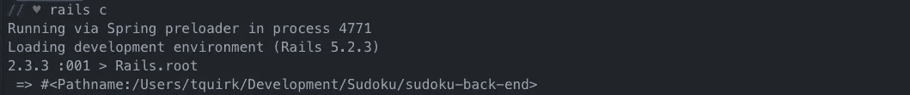

# 如何用 CSV 文件作为 Rails 数据库的种子？

> 原文：<https://itnext.io/how-to-seed-a-rails-database-with-a-csv-file-105a7ba0e88c?source=collection_archive---------2----------------------->


照片由[米卡·鲍梅斯特](https://unsplash.com/@mbaumi?utm_source=medium&utm_medium=referral)在 [Unsplash](https://unsplash.com?utm_source=medium&utm_medium=referral) 上拍摄

最近，我一直在为自己做一个好玩的项目。我正在创建一个数独网络应用程序。它构建在 Ruby on Rails 后端和 React 前端之上。

我找到了一个包含一百万个数独谜题和答案的开源数据集，我用它来做我的后台。简单来说，我只使用了 5000 个谜题/答案作为数据库的种子。

我找到的开源数据集在一个包含两列的 CSV 文件中。第一栏是难题，第二栏是解决方案。

# 什么是 CSV 文件？

“CSV [文件](https://www.lifewire.com/what-is-a-file-2625878)是一个逗号分隔值文件。所有 CSV 文件都是[纯文本文件](https://www.lifewire.com/txt-text-file-4150707)，只能包含数字和字母，并以表格形式组织其中包含的数据。”([什么是 CSV 文件？](https://www.lifewire.com/csv-file-2622708))

# 如何读取和访问 CSV 文件？

为了将 CSV 文件中的信息植入数据库，您需要知道 CSV 文件所在的文件路径。

对我来说，将 by CSV 文件放在我的 Rails API 项目目录的`lib`文件夹中是最有意义的。你可以把你的文件放在对你最有意义的地方。


在 Ruby 中，您可以一次导入所有 CSV 文件(将所有文件内容存储在内存中)或一次从文件中读取一行。我选择通过使用`.foreach`方法从文件中一次读取一行来实现这一点。另一个选择是使用`CSV.read`方法。

在种子文件中，您需要使用以下代码:

```
require 'csv'CSV.foreach(Rails.root.join('lib/sudoku_seeds.csv'), headers: true) do |row|

  Board.create({
    puzzle: row[0],
    solution: row[1]
  })end
```

## 需要

在第一行中，我使用了`require 'csv'`，它允许我在 Ruby 中处理 CSV 文件。这是真的，因为 [CSV 是 Ruby 标准库](https://ruby-doc.org/stdlib-2.6.3/libdoc/csv/rdoc/index.html)的一部分。

## 使用文件路径访问文件

在看到`CSV.foreach`做什么之前，让我们先看看括号内发生了什么。

**属性 1:** 我知道我的文件的本地路径是:`'lib/sudoku_seeds.csv'`。将其替换为 CSV 文件的文件路径。

但是`Rails.root.join(‘lib/sudoku_seeds.csv’)`在做什么呢？如果您在您的终端中运行`Rails.root`,同时在您试图访问的目录中，返回值是您当前目录的路径。例如，我在我的 rails 控制台上运行`Rails.root`来测试它。



现在，当我将`.join(‘lib/sudoku_seeds.csv’)`添加到先前返回到我的本地目录的路径中时，我的返回值就是保存我的谜题和答案的 CSV 文档的确切路径。


**属性 2:**`headers: true`的第二个属性，表示我的 CSV 文件的第一行有列名。如果您的 CSV 文件在第一行中没有列名，那么您不需要包括该属性。

## CSV.foreach

知道我们已经将文件路径和一个头选项作为参数传递给了`CSV.foreach`方法，我们还将一个块传递给了我们的方法。该块是关键字`do`和`end`之间的所有内容。在这个代码的例子中:

```
do |row|

  Board.create({
    puzzle: row[0],
    solution: row[1]
  })end
```

`CSV.foreach`方法将 CSV 文件的每一行传递给代码块。在我的例子中，我调用我的`Board`模型并为每一行创建一个新的 board 实例。

`CSV.foreach`把每一行当作一个数组，通过调用它在数组中的位置来访问一行中的每一列。例如，我的 CSV 文件只有两列:未完成的谜题和正确的答案。

通过访问代码为`row[0]`的第一列，为每个`Board`分配一个难题属性，通过访问第二列`row[1]`分配解决方案属性。这将通过增加值`row[value]`来为您需要的任意多的列继续。

# 您现在已经成功地植入了您的数据库

遵循这些步骤将允许您使用此方法在数据库中植入 CSV 文件。如果你想深入这个话题，Darko Gjorgjievski 有一个很棒的教程，分为两部分。[第 1 部分](https://www.sitepoint.com/guide-ruby-csv-library-part/)和[第 2 部分](https://www.sitepoint.com/guide-ruby-csv-library-part-2/)可通过以下链接找到。

一旦您为数据库设定了种子，请务必测试您的数据，并确保一切都按预期执行！