# 如何使用 Netlify、Twilio 和无服务器功能从静态站点发送文本消息

> 原文：<https://itnext.io/how-to-send-text-messages-from-your-static-site-using-netlify-twilio-and-serverless-functions-efd6e383bd1a?source=collection_archive---------3----------------------->

作为一名前端开发人员，这是令人兴奋的时刻。随着无服务器功能等现代技术的兴起，[前端工程师可以做通常只有后端工程师才能做的事情](https://thepowerofserverless.info/)。这需要部署可扩展的站点，[发送电子邮件](https://sendgrid.com/)，或者创建 HTTP 端点。由于新服务提供商和无数 API 的力量，构建高性能的应用程序已经变成了一个连接点的游戏，而不是从头开始构建一切。

在这篇文章中，我想分享如何在 [Netlify](https://www.netlify.com/) 上创建和部署一个可伸缩的静态站点，以及如何使用无服务器功能通过 [Twilio](https://www.twilio.com/) 发送文本消息。

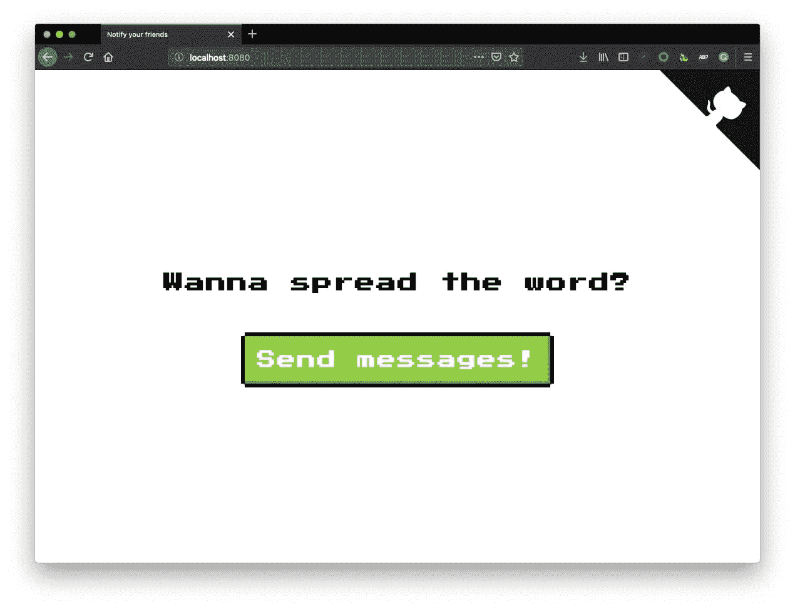

8-bit-revolution.netlify.com 截图

你可以在[8-bit-revolution.netlify.com](https://8-bit-revolution.netlify.com/)上看到最终结果。你可以去那里，通过短信告诉我你有多爱那个好的老 8 位风格。如果你想建立一个类似“8 位革命”的网站，你可以看看[项目的自述](https://github.com/stefanjudis/8-bit-revolution)。它包括一个一键式安装按钮，你可以自己创建一个短信发送网站。在设置中，您可以配置收件人的电话号码和您要发送的文本。

如果你想继续下去，想了解它是如何工作的，你需要做的是:

*   一个 [Twilio](https://www.twilio.com/) 账户
*   净收益账户
*   GitHub 的一个账户
*   [Node.js](https://nodejs.org/en/) 已安装

# 为什么是静态？

HTML 为 web 提供了动力，静态服务 HTML 有几个优点。静态站点更安全，因为涉及的计算更少。HTML 是预先生成的，文件可以从服务器一对一地提供，这减少了攻击媒介的数量。另外，静态网站很便宜。GitHub pages 和其他服务提供商主要免费提供静态站点托管。最后，静态站点是可伸缩的。在服务器端提供静态文件不需要太多的计算能力，如果你需要的话，你可以在你的网站前快速放置一个 CDN，为你数百万的访问者提供服务。

不过，手工编写数百个普通的 HTML 页面可能会很麻烦。这就是为什么构建工具和静态站点生成器已经成为一种常见的实践。这些工具将模板与降价文件或 API 数据结合起来生成静态 HTML。

这导致需要更复杂的设置。服务器需要生成 HTML，然后将 HTML 上传到您的静态站点主机。这就是 TravisCI 这样的持续集成系统(CI)发挥作用的地方。这些服务允许您在推送代码更新或内容更新时重建您的站点。

# Netlify 是您的 CI、CDN 和无服务器平台

Netlify 是一个相当新的服务，它解决了这个日益复杂的问题。你定义一个目录和一个构建脚本，他们负责创建你的网站，并把它放到全球内容交付网络上。您可以使用额外的功能，如无服务器功能或表单，通过额外的功能来丰富您的静态站点，所有这些都包含在一个平台中。

听起来不错？我们开始吧！

# 创建你的静态网站

创建一个新目录并包含一个`dist`子目录。`dist`将保存应由 Netlify 部署的所有文件。你可以在那里放一个类似下面的`index.html`文件，你就可以开始了。

```
<!doctype html>
<html lang="en">
<head>
  <meta charset="utf-8">
  <title>8-bit revolution</title>
  <meta name="viewport" content="width=device-width, initial-scale=1">
  <meta name="theme-color" content="#fafafa">
</head>
<body>
  <p>8-bit rocks!</p>
</body>
</html>
```

此外，您必须定义一个在部署站点时应该运行的命令。在项目目录中初始化新的 npm 项目。

`--yes`标志允许您在创建新项目时跳过通常与 npm 一起提供的调查问卷。该命令创建一个新的`package.json`，它是 Node.js 项目的配置文件。让我们添加一个虚拟构建命令，该命令只将日志消息回显到包含的 JSON 对象的`scripts`属性中。

您的`package.json`应该如下所示:

```
{
  "name": "8-bit-revolution-tut",
  "version": "1.0.0",
  "description": "",
  "main": "index.js",
  "scripts": {
    "build": "echo \"Building your new static site!\""
  },
  "repository": {
    "type": "git",
    "url": "git+https://github.com/stefanjudis/8-bit-revolution-tut.git"
  },
  "keywords": [],
  "author": "stefan judis <sjudis@twilio.com>",
  "license": "MIT",
  "bugs": {
    "url": "https://github.com/stefanjudis/8-bit-revolution-tut/issues"
  },
  "homepage": "https://github.com/stefanjudis/8-bit-revolution-tut#readme"
}
```

*注意:名称、存储库、作者、bug 和主页属性会因用户和项目而异。*

您可以在终端中使用`npm run`后跟属性名来运行所有已定义的`script`属性。执行`npm run build`将记录“构建你的新静态站点！”到终点站。这还不算多，在本教程的后面部分，您将向该脚本添加更多的功能。

[在你的项目根中初始化 git，并将其推送到一个新的 GitHub 存储库中。](https://help.github.com/en/articles/adding-an-existing-project-to-github-using-the-command-line)

将这两个文件提交并推送到 GitHub 后，就可以部署站点了。转到 Netlify，登录，点击“从 Git 新建站点”,将您的存储库与 Netlify 连接起来。

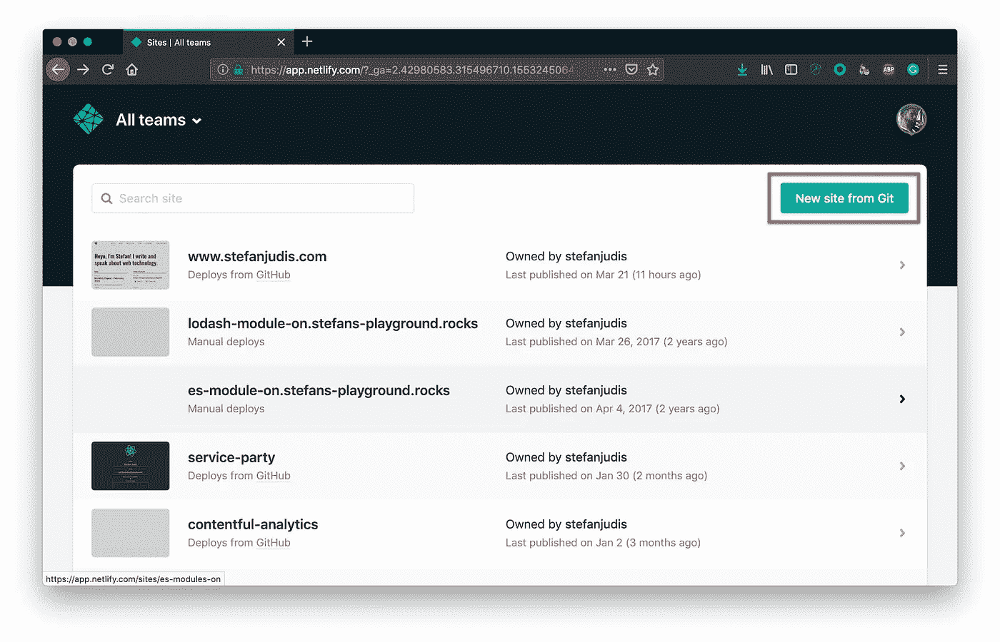

网络管理区的站点概述

连接 GitHub 后，你可以选择你新创建的库。Netlify 会询问您应该部署哪个分支和目录，以及在部署过程中要执行哪个脚本。在这种情况下，将是`master`、`dist`和`npm run build`。

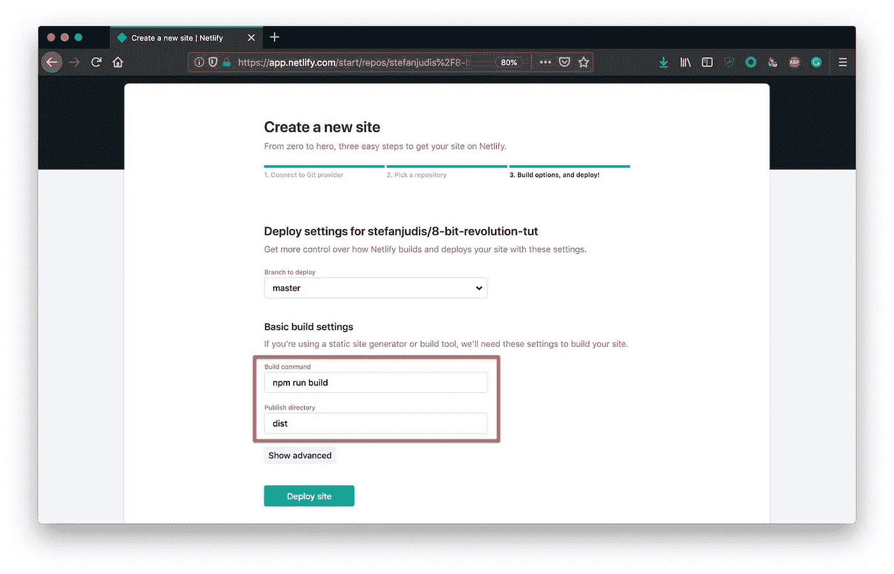

用于在网络管理区定义构建脚本和文件夹的新站点对话框

按下“部署网站”,看到你的静态网站进入互联网。部署只需要几秒钟，可以在 Netlify 的`frosty-mclean-c6c41c`这样的随机子域上使用。如果你愿意，你也可以改变这个子域或者连接[你自己的域](https://www.netlify.com/docs/custom-domains/)。🎉

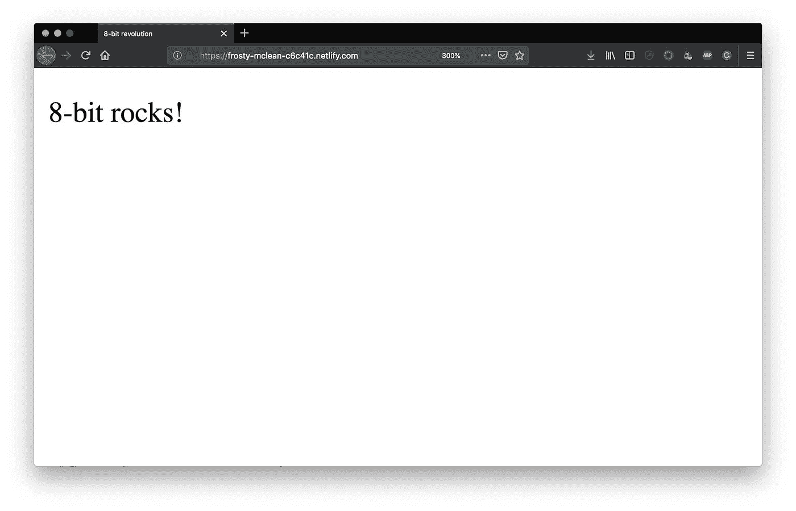

首次成功部署

恭喜你。点击“部署站点”,您将建立一个新的部署管道。

Netlify 和 GitHub 连接最酷的一点是，每当你向 GitHub 推送新代码时，Netlify 都会通过 [webhooks](https://en.wikipedia.org/wiki/Webhook) 得到通知，并自动部署你的站点。它还准备好接受来自您使用的任何系统的请求，以便您可以在不同的事件之后触发重建，例如在[远程内容管理系统](https://headlesscms.org/)中更新内容。

# 添加允许用户输入的表单

对于发送消息的情况，静态 HTML 是不够的。您必须添加一种方式来允许用户输入，如按下按钮或输入数据。幸运的是，Netlify 提供了[内置的表单处理](https://www.netlify.com/docs/form-handling/)。替换“8 位岩石！”具有以下形式的段落。

```
<form name="contact" class="form" method="POST" data-netlify="true">
    <h1>Wanna spread the word?</h1>
    <button class="btn" type="submit">Send messages!</button>
</form>
```

表单必须包含一个`data-netlify=”true”`属性。这告诉 Netlify 您希望表单提交由他们的服务器处理。提交并推送代码。等待部署完成，瞧，您现在可以处理表单提交了！

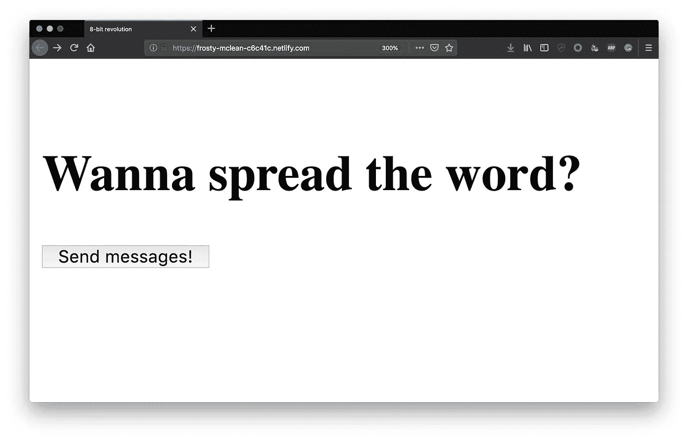

首先部署包括表单和按钮

所有提交表格的数据将在网络管理区的“表格”下提供。这使得它非常适合从联系人表单等收集数据。

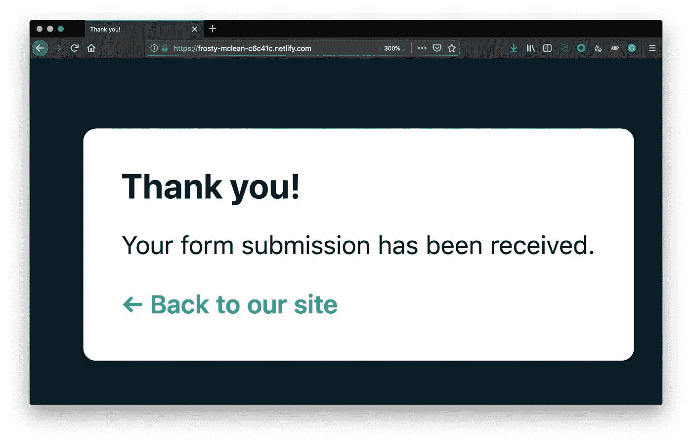

网络表单提交成功对话框

在这个阶段，当您提交表单时，Netlify 将向您显示一条通用的成功消息，告诉您它已收到表单提交。您可以通过定义一个页面来改变这种情况，该页面应该使用表单元素上的`action`属性重定向到该页面。

我更喜欢通过 JavaScript 提交表单，以避免重定向。

# 使用 Ajax 提交表单

通过实现全球可用的`[fetch](https://developers.google.com/web/updates/2015/03/introduction-to-fetch)`方法，您可以直接在浏览器中发出请求，而不需要添加任何依赖项。

在开始实现 Ajax 功能之前，向页面添加两个 HTML 元素。这些元素将指示表单提交请求的成功或错误。

```
<p class="successMsg" role="alert" hidden>Messages sent...</p>
<p class="errorMsg" role="alert" hidden>Something went wrong...</p>
```

在页面底部添加一个内嵌的`script`元素。使用原生 DOM 方法，您可以监听表单的提交事件，并应用定制功能，如发出 AJAX 请求。

```
<script>
  const form = document.querySelector('form');
  form.addEventListener('submit', async event => {
    event.preventDefault();

    // disable button to prevent multiple submissions
    form.querySelector('button').disabled = true;

    // make the request to submit the form
    try {
      const response = await fetch('/', {
        method: 'post',
        headers: {
          'Content-type': 'application/x-www-form-urlencoded; charset=UTF-8'
        },
        // parse and submit all included form data
        body: new URLSearchParams(new FormData(form)).toString()
      });

      // if it was successful show success message
      if (response.status === 200) {
        document.querySelector('.successMsg').hidden = false;
      } else {
        document.querySelector('.errorMsg').hidden = false;
      }
    } catch (e) {
      console.error(e);
    }
  });
</script>
```

`fetch`方法返回[一个承诺](https://developer.mozilla.org/en-US/docs/Web/JavaScript/Reference/Global_Objects/Promise)。如果[你的浏览器支持允许的话](https://caniuse.com/#feat=async-functions)你可以使用一个[异步函数](https://developer.mozilla.org/en-US/docs/Web/JavaScript/Reference/Statements/async_function)作为提交处理程序来避免回调和然后链与`await`和`try/catch`的结合。

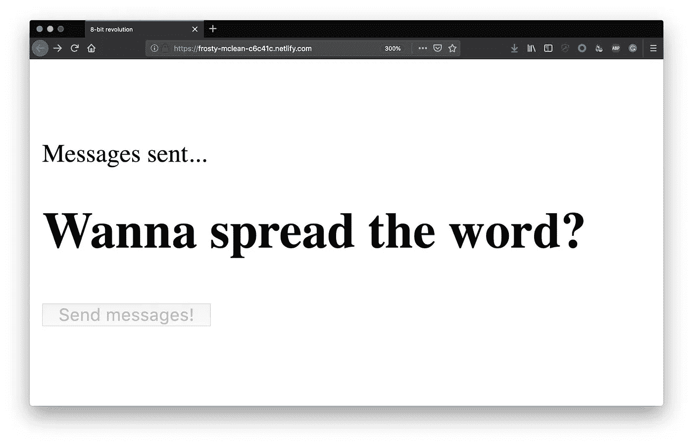

表单提交，带有启用 ajax 的成功消息

推送代码并等待部署。当您测试表单提交时，您将看到表单提交工作正常，并且站点向您显示一条成功消息，但是它还没有发送任何消息。

在你实现 SMS 发送部分之前，让我们把 8 位风格带回网站。从范例库中复制[样式，并将它们粘贴到您的`dist`目录中的一个新文件`styles.css`中。此外，添加一个指向 Google 字体的链接，该字体在刚刚粘贴到`index.html`的样式](https://github.com/stefanjudis/8-bit-revolution/blob/master/dist/styles.css)中被引用[。](https://github.com/stefanjudis/8-bit-revolution/blob/master/dist/styles.css#L26)

```
<head>
  <meta charset="utf-8">
  <title>8-bit revolution</title>
  <!-- reference the new stylesheet -->
  <link rel="stylesheet" href="/styles.css" />
  <!-- load Google Font to get get a nice 8-bit font -->
  <link
    href="https://fonts.googleapis.com/css?family=Maven+Pro|Yrsa|Press+Start+2P"
    rel="stylesheet"
  />
  <meta name="viewport" content="width=device-width, initial-scale=1">
  <meta name="theme-color" content="#fafafa">
</head>
```

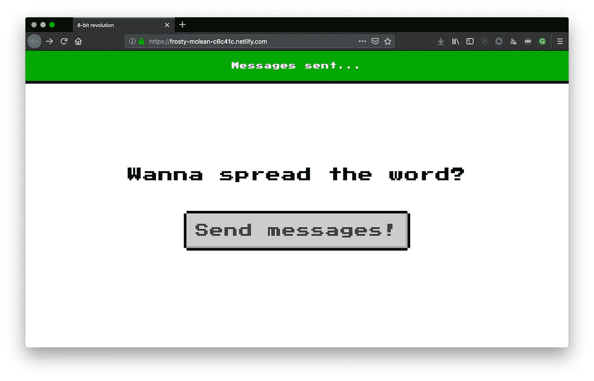

8 位风格的已部署站点

不算太差！现在你的网站看起来不错，而且是“8 位”的，让我们来实现 SMS 功能。

# 使用无服务器功能响应提交的表单

当用户提交表单时，除了 Netlify 存储表单数据之外，什么都不会发生。要实现 SMS 发送功能，您可以使用 Netlify 提供的[无服务器功能](https://www.twilio.com/docs/glossary/what-is-serverless-architecture)。建议使用[netlify-lambda NPM 包](https://www.npmjs.com/package/netlify-lambda)来创建这些函数。通过命令行安装软件包。

```
npm install --save netlify-lambda
```

*netlify-lambda* 内联函数中包含的所有依赖项，这样它们就可以在 netlify 环境中执行。创建一个名为`functions`的目录并添加一个 JavaScript 文件`submission-created.js`。 [Netlify 遵循命名约定在特定事件后运行函数](https://www.netlify.com/docs/functions/#event-triggered-functions)。此外，您还可以为函数文件指定一个不在列表中的名称，以启动新的 HTTP 端点。

```
// submission-created.js
exports.handler = function(event, context, callback) {
  console.log('Submission created!')
};
```

在生成函数之前，您必须定义存储函数的目录。在项目根目录下创建一个`netlify.toml`文件。定义`[build]`属性，并包含您生成的准备运行的函数将存储在`.functions`目录中的配置。

```
[build]
  functions = ".functions"
```

在部署期间，调整您的`package.json`来构建您的无服务器功能。

```
{
  "scripts": {
      "build": "netlify-lambda build functions"
    } 
}
```

当您在本地运行`npm run build`时，它会生成一个新的`.functions`目录，其中包含可以在 Netlify 上运行的函数。新的`.functions`目录包含生成的代码，可能不值得签入 git 并推送到 GitHub。确保创建一个包含生成目录的`.gitignore`文件。

```
# .gitignore
# generated functions
.functions
```

通过这些调整，您可以提交并推送至 GitHub。Netlify 将自动部署网站，包括当有人提交表单时运行的功能。

当你提交表格告诉世界关于 8 位的信息并进入 Netlify 的函数日志时，你会看到“提交已创建！”消息。

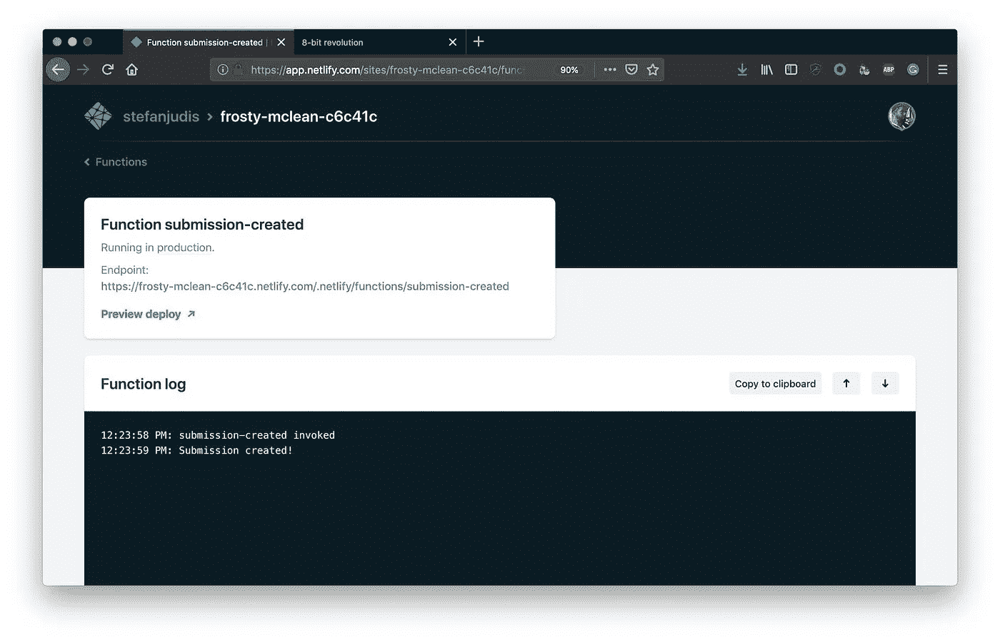

网络管理区中的功能日志

# 在无服务器功能下发送短信

此时，您的函数已经准备好响应表单提交，您可以开始发送文本消息了。要使用 Twilio 发送消息，您必须定义敏感信息，如您的帐户 SID、帐户令牌以及您要向其发送消息的人的电话号码。确保这些不会成为公共的 git 库。

使用`npm install --save dotenv`安装 [dotenv](https://www.npmjs.com/package/dotenv) 包。它允许您从根目录下的`.env`文件中读取配置变量，并通过`process.env`在您的无服务器功能中访问它们。创建`.env`文件，将其包含在您的`.gitignore`中，并定义以下值，用您自己的值替换它们:

```
TWILIO_ACCOUNT_SID = “YOUR-TWILIO-ACCOUNT-SID”
TWILIO_AUTH_TOKEN = “YOUR-TWILIO-AUTH-TOKEN”
BOT_NUMBER = “YOUR-BOUGHT-TWILIO-NUMBER”
BOT_MESSAGE = "YOUR-MESSAGE"
CONTACT_NUMBERS = "NUMBERS-THAT-SHOULD-RECEIVE-A-MESSAGE"
```

要获得所有这些值，[登录 Twilio](https://www.twilio.com/console/) 。您可以在仪表板中找到您的帐户 SID 和身份验证令牌。auth 令牌是非常敏感的信息，因为它可以授予与当前用户相同的访问权限。我建议在继续之前，掌握一些最佳实践来保证您的 auth token 的安全。

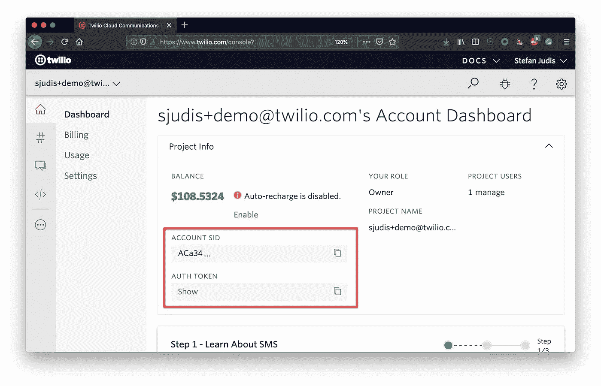

Twilio 控制台，包括帐户 sid 和令牌

接下来，你需要[购买一个 Twilio 电话号码](https://www.twilio.com/console/phone-numbers/search)。确保你买一个有短信功能的。

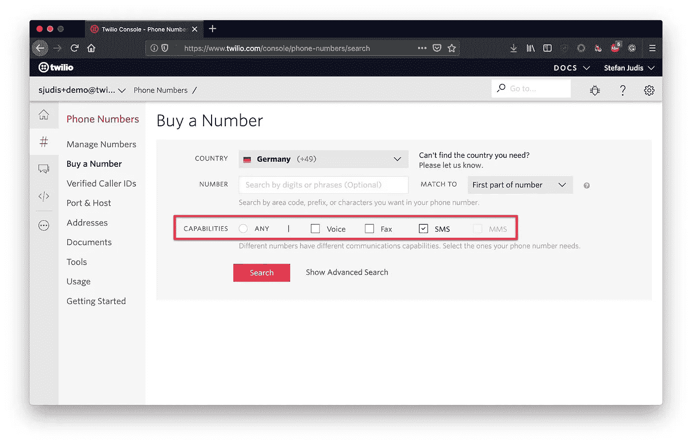

Twilio 控制台购买号码对话框

购买号码后，您可以自己在配置文件中定义要发送的消息和收件人的号码。

您的`.env`文件应该是这样的:

```
TWILIO_ACCOUNT_SID = "AC..."
TWILIO_AUTH_TOKEN = "a8..."
BOT_NUMBER = "+4915735982595"
BOT_MESSAGE = "8-bit rocks!"
CONTACT_NUMBERS = "+491761234567;+49170987654"
```

调整您的函数以访问上面定义的值。

```
// submission-created.js
// load the env file and make values accessible via process.env
require('dotenv').config();

const {
  TWILIO_ACCOUNT_SID,
  TWILIO_AUTH_TOKEN,
  CONTACT_NUMBERS,
  BOT_NUMBER,
  BOT_MESSAGE
} = process.env;

exports.handler = function(event, context, callback) {
  console.log('Submission created!')
  // the logic for sending the message will go here
};
```

在命令行上安装 Twilio helper 库。

```
npm install --save twilio
```

有了 Twilio helper 库，您现在可以发送文本消息了。替换日志消息并添加以下内容。

```
// submission-created.js

// ...
// 👆 dotenv and process.env handling as above

// initialize the helper library client
const client = require('twilio')(TWILIO_ACCOUNT_SID, TWILIO_AUTH_TOKEN);

exports.handler = function(event, context, callback) {
  Promise.all(
    // split the string of several messages into single numbers
    // send message to each of them
    CONTACT_NUMBERS.split(';').map(num => {
      return client.messages.create({
        from: BOT_NUMBER,
        to: num,
        body: BOT_MESSAGE
      });
    })
  )
    .then(() => callback(null, { statusCode: 200, body: 'Created' }))
    .catch(e => {
      console.log(e);
      callback(e);
    });
};
```

要在本地运行您的函数，向`package.json`添加一个`serve`命令来启动本地开发服务器。

```
{
  "scripts": {
      "serve": "netlify-lambda serve functions"
    } 
}
```

上面的`netlify-lambda`命令将构建并生成您的函数，并打开一个 HTTP 端点。如果你运行`npm run serve`然后打开[http://localhost:9000/submission-created](http://localhost:9000/submission-created)它会运行你的函数并发送短信。🎉

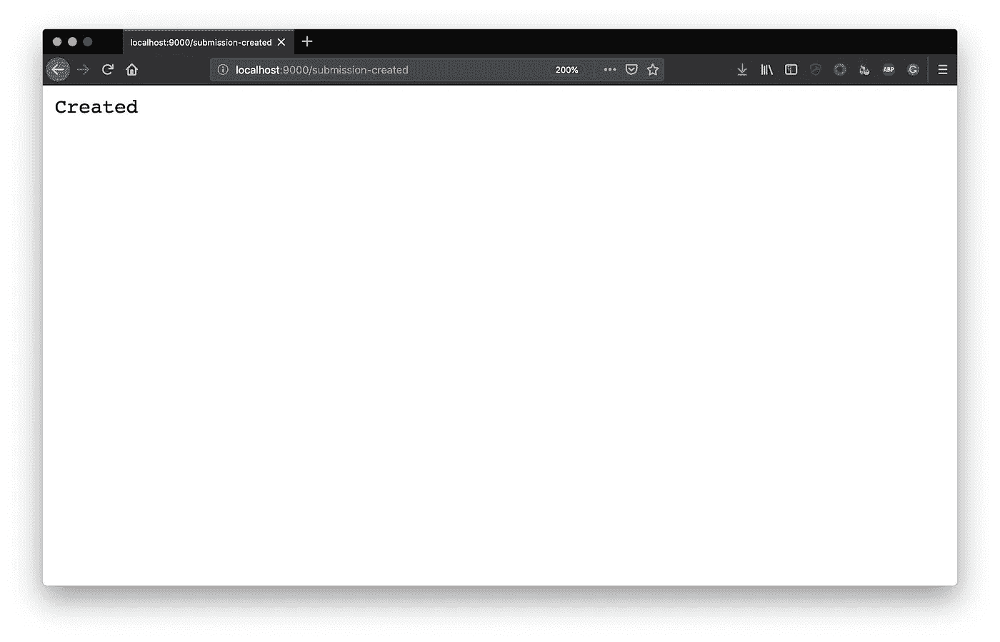

Netlify 函数的“已创建”响应

提交和推送新功能，并等待部署。但是等一下…当你试着在已部署的网络生活网站上按下按钮发送短信时，你会发现它还不能工作。还记得你把你的`.env`文件放到`.gitignore`里吗？

将`.env`文件与环境变量结合使用是避免泄露凭证的常见做法。使用`dotenv`,您可以确保您的应用程序既可以使用已定义的环境变量，也可以使用`.env`配置文件。本地`dotenv`读取`.env`文件并将值放入`process.env`中。在生产中–您必须自己在`process.env`中定义这些环境变量。这样就不用把凭证放在公共场所了。

您可以在网络管理区域的“构建”、“构建设置”和“构建环境变量”下定义环境变量。

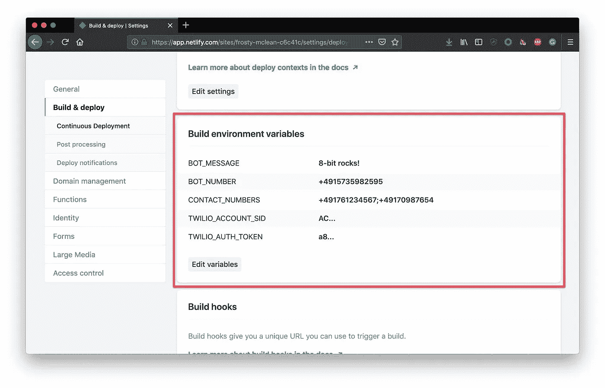

在网络管理用户界面中定义的环境变量

保存值并触发新的构建。现在点击按钮，将显示您的所有收件人，你爱 8 位。🎉

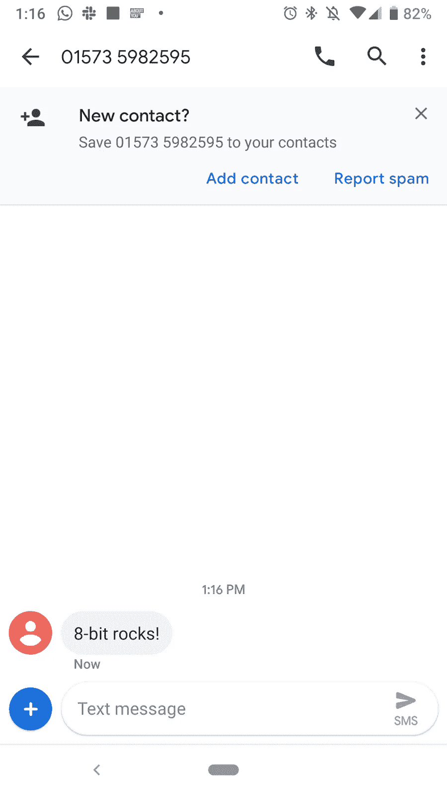

android 短信对话框中收到的消息

你可以在 GitHub 上找到最终的功能实现[。](https://github.com/stefanjudis/8-bit-revolution/blob/master/functions/submission-created.js)

# 结论

在本教程中，您学习了如何使用 Netlify 部署静态站点，使用无服务器功能丰富您的站点，以及使用 Twilio 发送 SMS。

在我们生活的 API 驱动的世界中，无服务器函数是完美的连接器。他们可以连接服务，接受网页挂钩，甚至回复短信。

让我知道你发了什么信息。你可以在 GitHub 上找到[完整的代码。它包括](https://github.com/stefanjudis/8-bit-revolution)[一个更复杂的表单提交流程](https://github.com/stefanjudis/8-bit-revolution/blob/master/dist/index.html#L77-L91)，你可能想看看。

如果您有任何问题，请通过以下渠道联系我们:

*   邮箱:【sjudis@twilio.com 
*   Github: [stefanjudis](https://github.com/stefanjudis)
*   推特: [@stefanjudis](https://twitter.com/stefanjudis)

*原载于*[*www.twilio.com*](https://www.twilio.com/blog/a-how-to-send-text-messages-from-your-static-site-using-netlify-twilio-and-serverless-functions)*。*