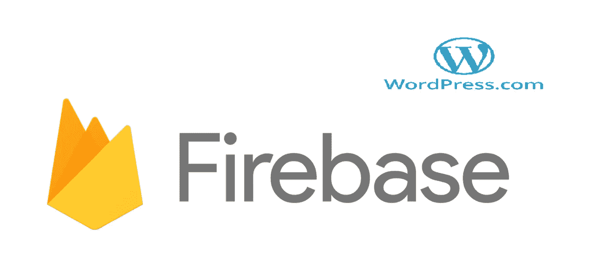
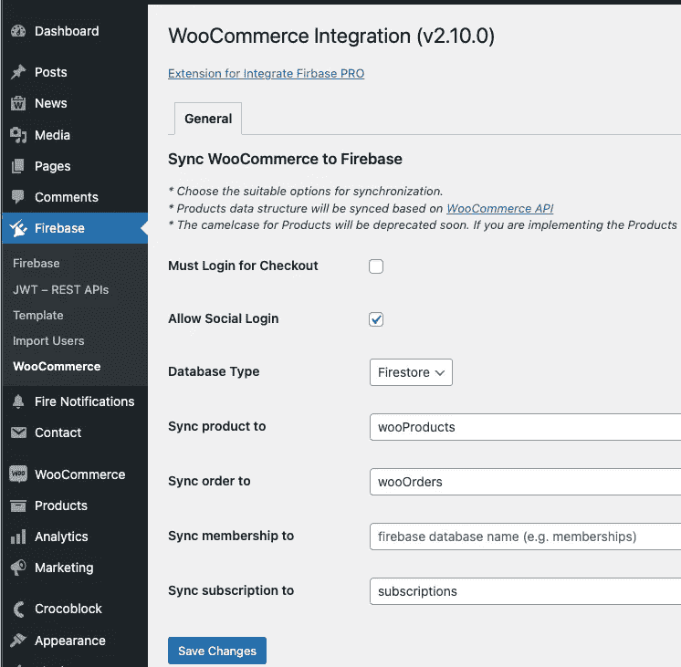
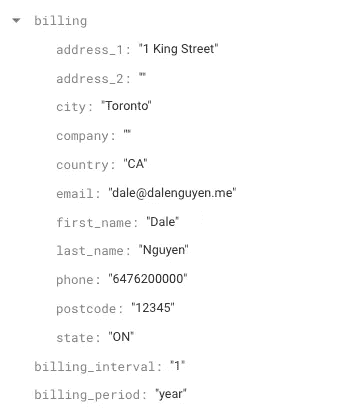
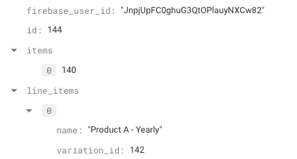

# 如何将 WooCommerce 购买数据发送到 Firebase

> 原文：<https://itnext.io/how-to-send-woocommerce-purchase-data-to-firebase-8c8b4c8cff39?source=collection_archive---------3----------------------->

> 如果你对 Integrate Firebase PRO 版本感兴趣，请阅读完整的更新文档:[https://firebase-wordpress-docs.readthedocs.io/](https://firebase-wordpress-docs.readthedocs.io/)

【https://wordpress.dalenguyen.me/】演示:[T5](https://wordpress.dalenguyen.me/)

*   文章 1: [如何将 Firebase 集成到 WordPress](/how-to-integrate-firebase-and-wordpress-b017ee274687)
*   第 2 篇:[如何从 Firestore 检索数据并显示在 WordPress 上](/how-to-retrieve-data-from-firestore-and-display-on-wordpress-8638854a762e)
*   第 3 篇:[如何在 WordPress 中使用 Firebase 自定义声明](https://medium.com/@dalenguyen/how-to-work-with-firebase-custom-claims-in-wordpress-aaf83965bd20?sk=85786e3739d42b18c3e2c7344bc5f436)
*   第 4 条:[从 WordPress 保存数据到 Firebase(实时+ Firestore)](/how-to-save-data-from-wordpress-to-firebase-realtime-firestore-2eda917d01fb)
*   第五篇: [Firebase WordPress 用户集成](/firebase-wordpress-user-integration-c18a28e41cbd)
*   第 6 篇:[如何在 WordPress Dashboard 中管理 Firebase 用户](/firebase-users-management-in-wordpress-dashboard-61b4a1ca066#d4c2-1605c6edec5f)
*   第 7 条:[如何将数据从 WordPress 同步到 Firebase](/sync-data-from-wordpress-to-firebase-d6e5860d3a06)
*   第 8 条:[一键登录 WordPress & Firebase 或通过电子邮件链接](https://medium.com/@dalenguyen/one-click-login-to-wordpress-firebase-or-via-email-link-d7610d71cd23)
*   第 9 条:[从 WordPress 上传文件到云存储](https://medium.com/@dalenguyen/upload-files-to-cloud-storage-from-wordpress-e8acc8ce70cd)
*   第十条:[远程 URL 登录到 Firebase & WordPress](/remote-url-login-to-firebase-wordpress-2027fad7c159)
*   第 11 条: [2 种给 WordPress 添加 Firebase 认证的方法& WooCommerce](https://dalenguyen.medium.com/2-ways-to-add-firebase-authentication-to-wordpress-woocommerce-df500c3b104e)
*   第十二条: [**如何将 WooCommerce 购买数据发送到 Firebase**](https://dalenguyen.medium.com/how-to-send-woocommerce-purchase-data-to-firebase-8c8b4c8cff39)
*   第 13 条:[从 WordPress](https://dalenguyen.medium.com/create-manage-firebase-database-from-wordpress-13347d8ffb2e) 创建&管理 Firebase 数据库

在发现希望从 WooCommerce 购买数据(订单、产品、会员或订阅)到 Firebase 的客户的使用案例的过程中，允许他们的 Firebase 应用程序(WebApp、移动应用程序、桌面应用程序)有权访问该应用程序。

**集成 Firebase PRO** 已经照顾到了[Firebase&WordPress 之间的](https://firebase-wordpress-docs.readthedocs.io/en/latest/auth/wordpress-user-integration.html) 集中认证。剩下的就是允许购买的用户访问 Firebase 应用程序。

在本文中，我将向您展示如何在不编写任何代码的情况下实现它。

## 先决条件

确保你已经准备好了。

## 扩展配置

安装后，你会看到一些从 WooCommerce 同步数据到 Firebase 的选项。

网络商务推广

您可以选择将数据同步到实时数据库或 Firestore 的位置。您还可以为数据命名集合名称。在图片中，所有的 WooCommerce 订阅将被同步到 Firestore 中的订阅集合。

**fire base 中的数据结构**

在这个例子中，我将展示 Firebase 中订阅数据结构的例子。有一堆数据将提供你在用户购买后为其设置权限所需的信息。

票据信息

用户标识和产品信息

订阅状态

在订阅文档中，您可以使用以下基本数据:

*   **电子邮件** - >创建或更新订阅后发送电子邮件
*   **firebase_user_id** - >以 firebase uid 为目标，以设置用户的角色或自定义声明
*   **项目**或 **line_items** - >用户购买了哪些产品
*   **状态** - >订阅是否激活

根据这些信息，您可以完全控制用户如何根据他们的订阅状态访问您的 firebase 应用程序。

如果你想看实际操作，这里有视频教程。