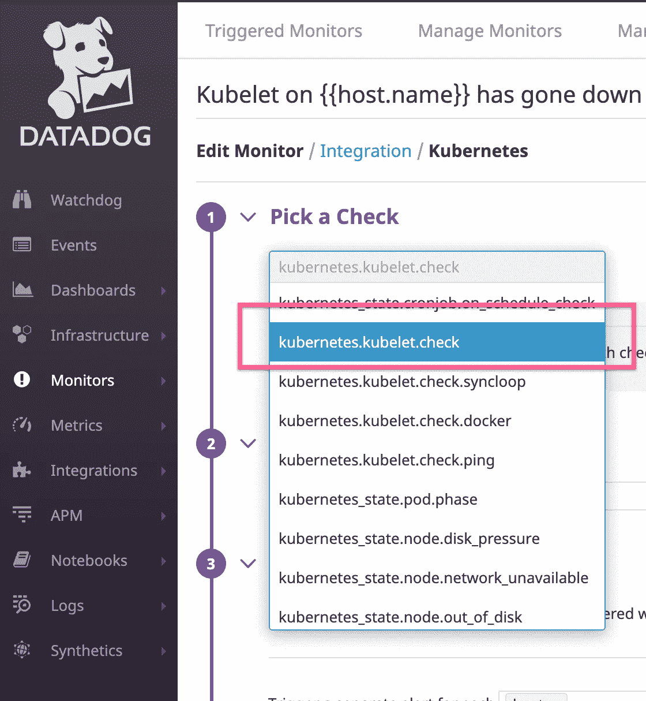
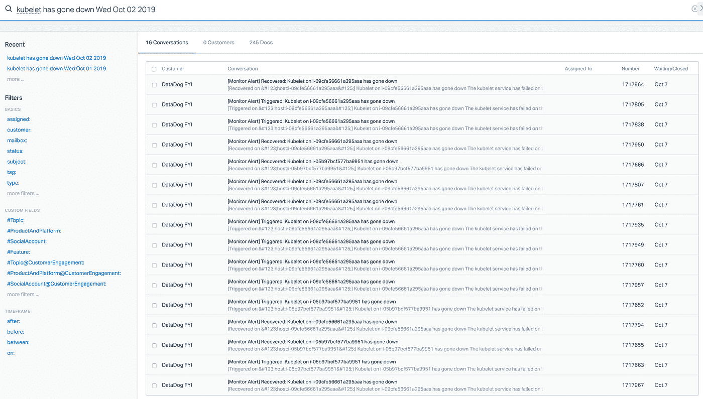
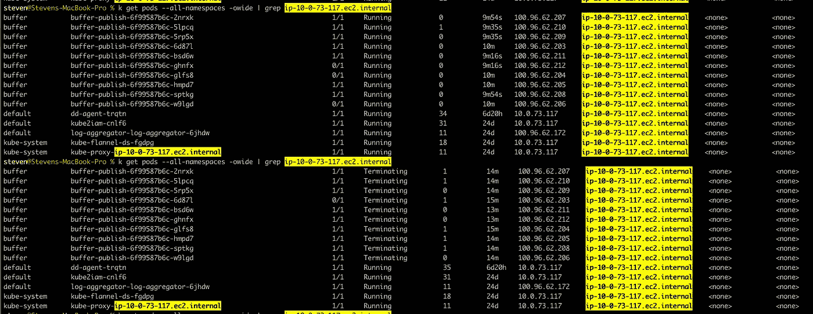
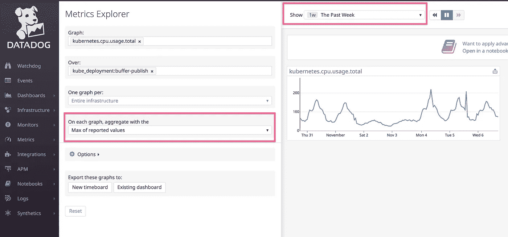
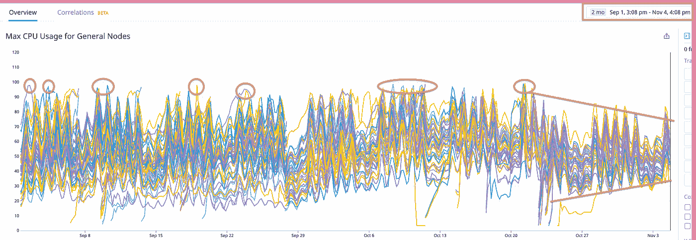

# 如何设置 Kubernetes 资源请求和限制——提高集群稳定性和效率的传奇

> 原文：<https://itnext.io/how-to-set-kubernetes-resource-requests-and-limits-a-saga-to-improve-cluster-stability-and-a7b1800ecff1?source=collection_archive---------3----------------------->

# 一个谜

这一切都始于 9 月 1 日，就在我们的集群从 1.11 升级到 1.12 之后。几乎在第二天，我们就开始在`kubelet`上看到 Datadog 报告的警报。有时候我们会收到几封(3 - 5 封)，有时候一天会收到 10 多封。警报监视器基于 Datadog check - `kubernetes.kubelet.check`，每当`kubelet`进程在一个节点上停止时就会触发警报监视器。

我们知道 [kubelet](https://kubernetes.io/docs/concepts/overview/components/#kubelet) 在 Kubernetes 的日程安排中起着重要作用。如果不能在节点中正常运行，将会直接从功能群集中删除该节点。如果有更多的节点出现问题`kubelet`，那么集群就会降级。现在，想象一下早上醒来有 16 个提醒。这真是太可怕了。

真正让我们困惑的是，在有问题的节点上运行的所有服务似乎都是无害的。在某些情况下，只有少数几个正在运行的服务，并且之前有一些高 CPU 使用率。当潜在的罪犯可能已经离开现场时，很难指出任何事情，因此没有留下任何痕迹供我们进一步诊断。有趣的是，在我们的服务中没有任何明显的性能影响，比如请求延迟。这个小事实给整个事情增添了更多的神秘色彩。

这种现象每天大约在同一时间(太平洋时间早上 5:30)开始，通常在中午之前停止，周末除外。在某种程度上，我觉得我可以用这些数据狗提醒我的闹钟。一点也不好玩，这次挑战让我有些白发。

# 我们的调查

从一开始，我们就知道这将是一项艰巨的调查，需要系统的方法。为了简洁起见，我将只列出一些我们尝试过的关键实验，不赘述。尽管它们是很好的调查步骤，但我不认为它们对这篇文章很重要。以下是我们尝试的内容

*   我们将集群从 1.12 升级到 1.13
*   我们创建了一些受感染的节点，并把我们所有的 cronjobs 转移到这些节点上
*   我们创建了更多受感染的节点，并将大多数消耗 CPU 的工作人员转移到这些节点上
*   我们将集群扩展了近 20%，从 42 个节点扩展到 50 个节点
*   我们再次缩减了集群，因为我们没有看到任何改进
*   我们回收(删除并重新创建)了所有先前报告 kubelet 问题的节点，结果第二天又有新的节点跟进
*   在你我之间，我甚至认为 Datadog 警报可能会被打破，因为没有任何明显的服务性能影响。但我无法让自己结案，因为我知道罪犯可能仍然逍遥法外。

幸运的是，经过大量的政治迫害，这引起了我的注意

我们看到 10 个`buffer-publish`pod 被安排到一个节点，持续大约 10 分钟，但很快就被终止了。与此同时，CPU 使用率激增，`kubelet`喊道，在终止后的几分钟内，pod 从节点上消失了。

难怪发出警报后我们什么也找不到。但是我想，这些豆荚有什么特别之处呢？我们有的唯一事实是高 CPU 使用率。现在，让我们看看资源请求/限制

> *CPU/内存* ***请求*** *参数告诉 Kubenetes 最初应该分配多少资源*
> 
> *CPU/内存* ***限制*** *参数告诉 Kubenetes 在所有情况下应该给定的最大资源*

这里有一个[帖子](http://blog.kubecost.com/blog/requests-and-limits/)在解释这个概念方面做得更好。我强烈推荐全文阅读。向 kubecost 的团队致敬！

现在，回到我们现在的位置。CPU 请求/限制比率是 10，应该没问题吧？开始时，我们为一个 pod 分配 0.1 个 CPU，并将最大使用量限制为 1 个 CPU。这样，我们有一个保守的开始，同时仍然有某种，尽管是任意的上限。感觉我们几乎是在遵循最佳实践！

然后我想，这一点意义都没有。当在单个节点中调度 10 个 pod 时，该参数允许的总 CPU 是 10 个 CPU，但是在一个`m4.xlarge`节点中没有 10 个 CPU。在我们的高峰时段，比如说美国太平洋时间早上 5:30 醒来，会发生什么？现在我几乎可以想象出一幅可怕的画面，这些节点杀死了所有的 CPU，甚至连`kubelet`也开始死亡，然后整个节点就崩溃了。

那么现在，我们能做些什么呢？

# 补救措施

显然，最简单的方法是降低 CPU 的限制，这样这些 pod 就会在杀死一个节点之前杀死自己。但我觉得这不太对劲。如果他们真的需要那么多 CPU 来进行正常操作，那么节流(在这个上有更多[说明)不会导致低性能。](https://kubernetes.io/docs/tasks/configure-pod-container/assign-cpu-resource/)

好吧，增加 CPU 请求，让这些单元更加分散，而不是被安排到单个节点，怎么样？这听起来像一个更好的计划，这就是我们实施的计划。以下是详细情况:

## 算出你通常需要多少

我使用过去一周的数据狗指标`kubernetes.cpu.usage.total`来衡量最大报告值，以给我一些参考

你可以看到它通常保持在 200 米以下(0.2 个 CPU)。这告诉我，CPU 请求的这个值很难出错。

## 给它设限

这是棘手的部分，就像生活中大多数棘手的事情一样，没有简单的解决方法。根据我的经验，一个好的开始应该是 2 倍的请求。在这种情况下，它将是 400m (0.4 个 CPU)。更改之后，我花了一些时间观察服务性能指标，以确保性能不会受到 CPU 节流的影响。如果是的话，我可能需要把它提高到一个更合理的数字。这是一个反复的过程，直到你做对为止。

## 注意比例

关键是不要让低请求欺骗 Kubernetes 将所有 pods 调度到一个节点上，这样只会以难以置信的高限制耗尽所有 CPU。理想情况下，请求/限额不应相距太远，比如在 2 到 5 倍的范围内。否则，应用程序会被认为过于尖锐，甚至有某种漏洞。如果是这种情况，深入了解应用程序足迹是明智的。

## 定期复习

只要应用程序是活动的，它们就会发生变化，它们的足迹也是如此。确保你有某种回顾过程，带你回到第一步(计算出它通常需要多少)。这是让事情保持最佳状态的唯一方法。

# 利润

那么，成功了吗？你打赌！我们的集群中有相当多的服务具有不成比例的请求/限制。在我调整了这些重载服务之后，集群运行更加稳定了，这是它现在的样子👇

等等！题目中承诺的效率怎么样？请注意改变后乐队变得更加狭窄。这表明集群中的 CPU 资源得到了更加均匀的利用。这随后使得放大具有线性效果，这是非常有效的。

# 结束语

与在一组专用计算实例上部署每个服务不同，面向服务的架构允许许多服务共享一个 Kubernetes 集群。正因为如此，每个服务现在都有责任指定自己的资源需求。这一步不可掉以轻心。不稳定的集群会影响所有驻留的服务，并且故障排除通常具有挑战性。诚然，并不是所有人都对这种新配置有经验。在过去的好时光里，我们所需要的只是在一些服务器上部署我们的一个东西，并根据我们的喜好进行缩放。我想这可能是为什么我在 Kubernetes 中没有看到很多关于资源参数的讨论。通过这篇文章，我希望能帮助一些正在为这个新概念而奋斗的人(我知道我做到了)。更重要的是，也许向掌握其他技巧的人学习。如果你对此有任何想法，请随时在 [Twitter](https://twitter.com/stevenc81) 上联系我。

*最初发表于*[T5【http://github.com】](https://gist.github.com/stevenc81/086d5ed7435ee66d4ea697e6d4461ca2)*。*