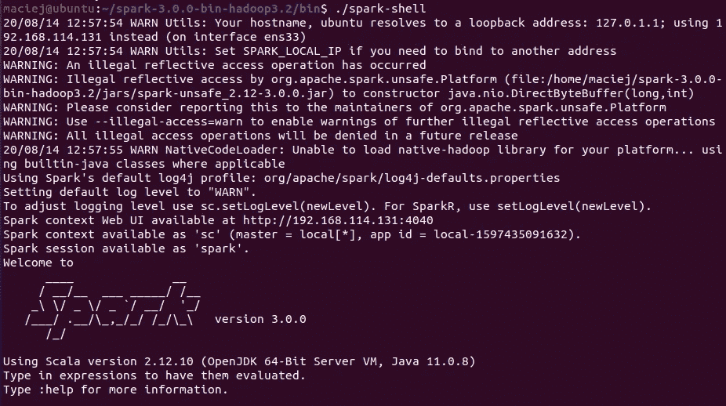
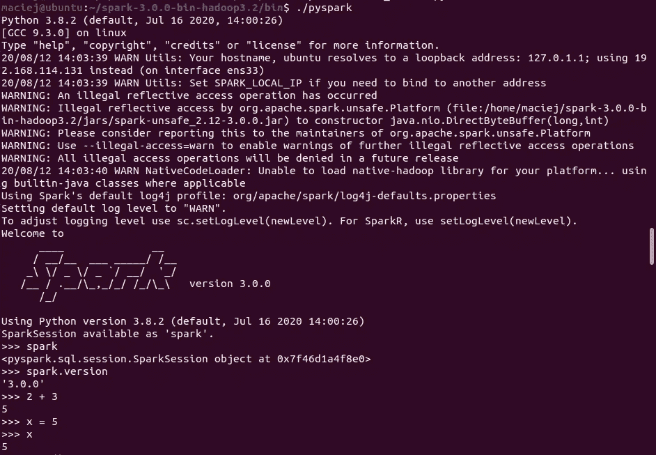
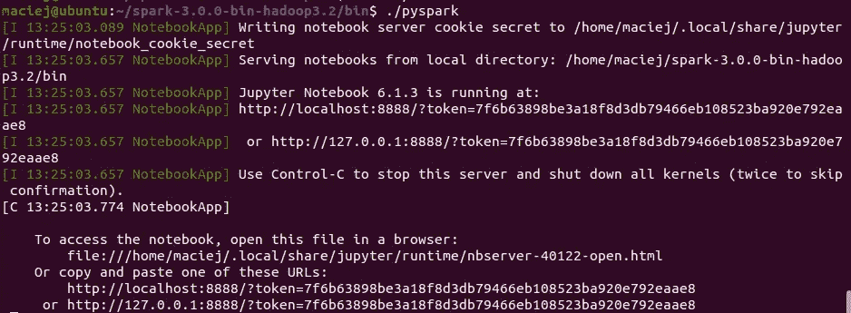
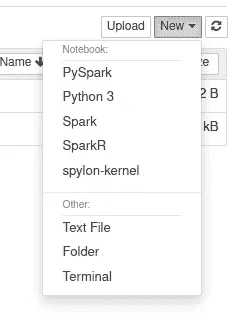
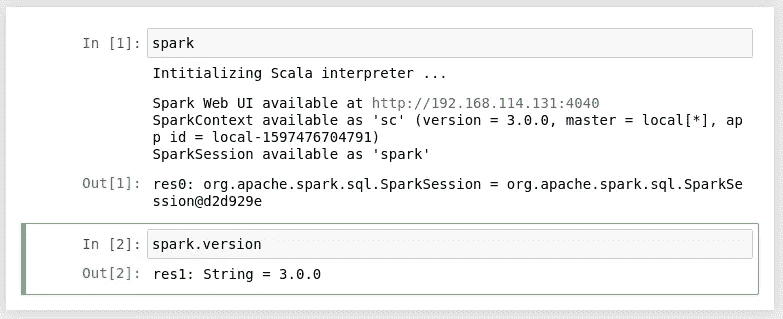
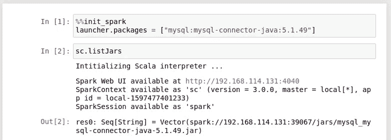
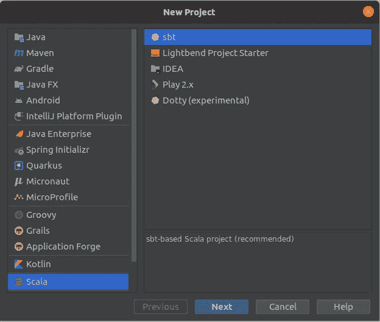
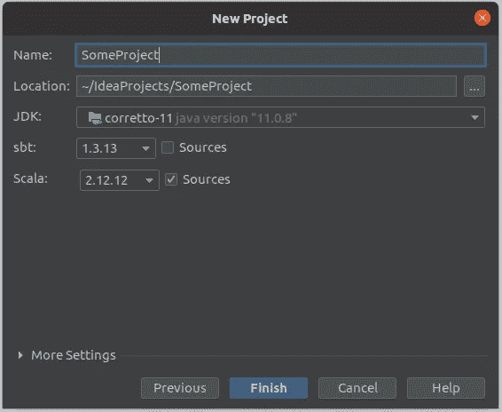

# 如何设置本地 Apache Spark 环境(5 种方法)

> 原文：<https://itnext.io/how-to-set-up-local-apache-spark-environment-5-ways-62910fa0e8ad?source=collection_archive---------0----------------------->


Apache Spark 是最流行的分布式数据处理和分析平台之一。虽然它与服务器场、Hadoop 和云技术相关联，但您可以在您的机器上成功启动它。在本条目中，您将学习几种配置 Apache Spark 开发环境的方法。

假设

在这种情况下，基本系统是 Ubuntu 桌面 20.04 LTS。

# 火花壳

第一种方法是在终端中运行 Spark。让我们从下载 Apache Spark 开始。你可以在这里下载。下载后，我们必须用 tar 打开包。

```
wget ftp://ftp.task.gda.pl/pub/www/apache/dist/spark/spark-3.0.0/spark-3.0.0-bin-hadoop3.2.tgz
tar zxvf spark-3.0.0-bin-hadoop3.2.tgz
```

Apache Spark 是用 Scala 写的，这意味着我们需要一个 Java 虚拟机(JVM)。对于 Spark 3.0，它将是 Java 11。

```
sudo apt install default-jre
```

现在你所要做的就是进入 bin 目录并运行 spark-shell



如果您需要一个库(例如，您想从 MySQL 下载数据，对其进行处理并保存到其他地方)，您可以手动附加 jar(—jars)或从 maven 存储库下载它们(— packages)。

```
./spark-shell --driver-memory 8G --packages mysql:mysql-connector-java:5.1.49
```

# pyspark

在 spark-shell 中我们用 Scala 编写，如果你更喜欢 Python，你的选择将是 PySpark。

系统里没有 Python，我们就来一招。我们将安装 pip3，Python 将作为一个依赖项安装🙂。

```
sudo apt install python3-pip
```

但事实证明这还不够。Pyspark 没有找到变量 python。

```
maciej@ubuntu:~/spark-3.0.0-bin-hadoop3.2/bin$ ./pyspark
env: ‘python’: No such file or directory
```

我们需要使用环境变量来指示 Python 版本。

```
export PYSPARK_PYTHON=python3
```

现在 pyspark 在终端启动。



# 朱庇特笔记本里的 pyspark

大多数使用 Python 的人，而不是终端，更喜欢笔记本。最受欢迎的是 Jupyter 笔记本。让我们安装它。我们将使用 pip3，然后添加 */。local/bin* 文件夹到路径。

```
pip3 install notebook
export PATH=$PATH:~/.local/bin
```

当您添加以下环境变量时…

```
export PYSPARK_DRIVER_PYTHON="jupyter"
export PYSPARK_DRIVER_PYTHON_OPTS="notebook"
```

…Jupyter 笔记本将与 pyspark 一起自动推出。



如果需要添加库，请使用下面的环境变量。

```
export PYSPARK_SUBMIT_ARGS='--packages mysql:mysql-connector-java:5.1.49'
```

# Jupter 笔记本中的 spylon (scala)

但是，如果您更喜欢使用 Scala，可以选择 spylon 内核。安装过程如下:

```
pip3 install spylon-kernel
python3 -m spylon_kernel install --user
```

然后设置环境变量 SPARK_HOME。

```
export SPARK_HOME=/home/maciej/spark-3.0.0-bin-hadoop3.2
```

现在我们可以访问木星笔记本中的 spylon 内核了。



如果您需要特定的包或配置，请使用%%init_spark



# IntelliJ 理念中的项目

你需要 Scala 插件。


我们正在创建一个新的 Scala -> sbt 项目。



我们选择 Scala 2.12 和 JDK。我选择了亚马逊 Corretto 11。



让我们将必要的包添加到 build.sbt 文件中。

```
libraryDependencies ++= Seq(
  "org.apache.spark" %% "spark-core" % "3.0.0",
  "org.apache.spark" %% "spark-sql" % "3.0.0"
)
```

在 sbt 加载更改后，我们可以开始在 Spark 中编写应用程序。在 src/main/scala 路径中创建一个对象并开始编码😎。

```
import org.apache.spark.sql._

object MyAwesomeApp {
  def main(args: Array[String]) {

    val spark = SparkSession
      .builder
      .appName("MyAwesomeApp")
      .master("local[*]")
      .getOrCreate()

    import spark.implicits._

    val df = Seq(
      ("x", 4),
      ("y", 2),
      ("z", 5)
    ).toDF("some_id", "some_int")

    df.show()
  }
}
```