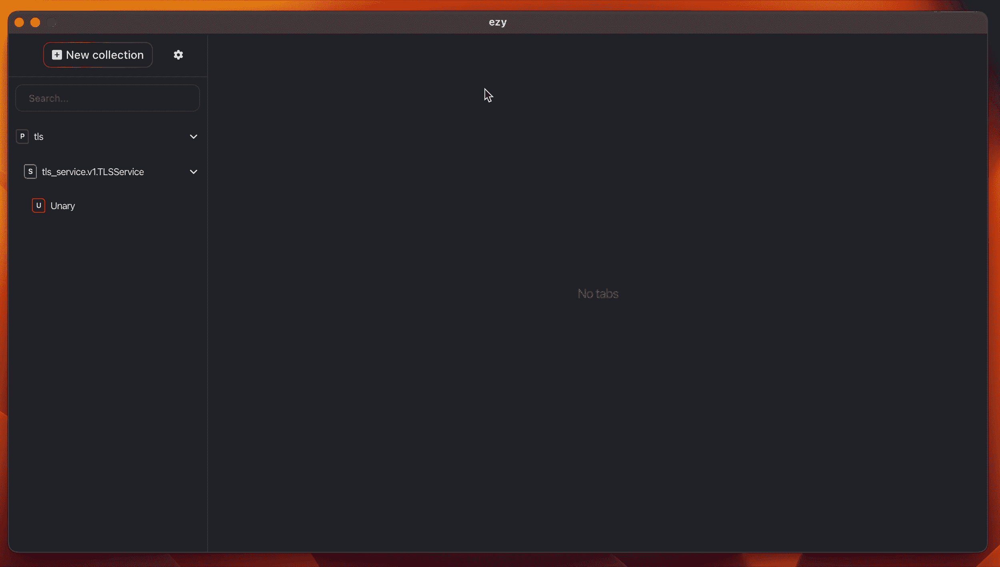

# 如何在 gRPC/gRPC-Web 中设置和测试 TLS

> 原文：<https://itnext.io/how-to-setup-and-test-tls-in-grpc-grpc-web-1b67cc4413e6?source=collection_archive---------2----------------------->

本文在 Node 中有示例。JS 但是对其他语言可能会有帮助，所以我们开始吧。所有工作实例你都可以在这里找到[。](https://github.com/getezy/ezy/tree/master/__tests__/tls-service)

# **TLS 是如何工作的？**

推荐阅读关于[TLS 如何工作](https://howhttps.works/)的最佳漫画文章。

# gRPC 连接类型

您可以使用三种类型的 gRPC 连接:

1.  不安全—所有传输的数据都不加密。
2.  服务器端 TLS —类似浏览器的加密，其中只有服务器向客户端提供 TLS 证书。
3.  相互 TLS —最安全的方法是，服务器和客户端互相提供证书。

# 创建自签名证书

如果您没有来自任何 CA 的证书或者想要在 localhost 上使用 TLS，这是一个可选步骤。

*注意，在生产环境中大多建议选择 CA 的证书以获得更多的安全性，例如，您可以从* [*获得一个免费证书，让我们加密*](https://letsencrypt.org/) *。*

# 准备

让我们从实现 gRPC 服务开始。

首先，我们将定义我们的服务[协议缓冲区](https://developers.google.com/protocol-buffers)文件。

其次，我们需要生成类型、服务和客户端定义。
对于 TypeScript，我更喜欢用 [ts-proto](https://github.com/stephenh/ts-proto) ，但是你可以选择任何你喜欢的工具，这取决于你的语言。

```
protoc --plugin=./node_modules/.bin/protoc-gen-ts_proto --ts_proto_opt=env=node,outputServices=grpc-js --ts_proto_out=./src/generated ./proto/tls_service.proto
```

现在我们可以实现在 Node.js 上运行的服务器了。

# gRPC

我们将在这里为服务器和客户端使用一个官方的 [@grpc/grpc-js](https://github.com/grpc/grpc-node/tree/master/packages/grpc-js) 包。

## 服务器端 TLS

服务器端 TLS 只需要服务器证书及其私钥。

**服务器**

**客户端**

现在我们可以实现客户端了。

*这里注意，如果你的 TLS 证书是 CA 签名的(非自签名)，你不需要在客户端提供这个证书；它应该会自动工作。*

## 相互 TLS

相互 TLS 需要根证书、服务器证书及其私钥。
这里将使用根证书来检查客户端证书是否已签名，以及服务器是否信任客户端。

**服务器**

像在服务器端部分一样，只改变了`getServerCredentials`功能。

**客户端**

像在服务器端部分，只改变了`getChannelCredentials`功能。

## 覆盖 SSL 目标名

@grpc/grpc-js 包额外提供了一些有用的[频道选项](https://github.com/grpc/grpc-node/tree/master/packages/grpc-js#supported-channel-options)供你设置。你可以在这里了解他们每个人[。](https://grpc.github.io/grpc/core/group__grpc__arg__keys.html)

`grpc.ssl_target_name_override` —当代理背后的实际服务器和 CN 不匹配时，这对我们很有帮助。

要设置通道选项，您需要将它们传递给客户端构造函数的第三个参数。

# gRPC-Web

阅读 grpc.io 关于 gRPC-Web 状态的博文。

TL；
博士你应该知道的事情:

1.  工作方案:
    客户端↔代理【http(s)gRPC-web】↔服务器(grpc)
2.  有两个实现——[官方 gRPC-Web](https://github.com/grpc/grpc-web) 和[@ impossible-eng/gRPC-Web](https://github.com/improbable-eng/grpc-web)。
3.  目前，gRPC-Web 只支持通过 HTTP(S)的一元和服务器流请求。
    *另外*[*@ implementable-eng/grpc-web*](https://github.com/improbable-eng/grpc-web)*通过实验性的 websocket 传输支持客户端和双向流。这不是 gRPC-Web 规范的一部分，不建议在生产中使用。*
4.  有两个代理——来自官方 gRPC-Web 的带 [gRPC-Web 过滤器的特使](https://www.envoyproxy.io/docs/envoy/latest/configuration/http/http_filters/grpc_web_filter)和来自@ implementable-eng 的 [grpcwebproxy](https://github.com/improbable-eng/grpc-web/tree/master/go/grpcwebproxy) 。
5.  您可以将任一客户端与任一代理一起使用。
6.  客户端有不同的通信传输。
    *官方 gRPC-web 仅支持 XMLHttpRequest。
    @ impossible-eng/grpc-web 另外支持 Fetch(如果可用的话使用它)并且可以用自定义传输来扩展，例如*[*node . js*](https://github.com/improbable-eng/grpc-web/tree/master/client/grpc-web-node-http-transport)*。*

@ impossible-eng/grpc-web 包在过去 10 个月没有更新，所以如果你不打算在自定义传输或 Node.js 环境中使用 gRPC-Web，我认为你应该选择官方 gRPC-Web 客户端。我已经在官方包中创建了添加 Node.js 支持[https://github.com/grpc/grpc-web/issues/1277](https://github.com/grpc/grpc-web/issues/1277)的功能请求。

在这个例子中，我们将使用在 docker 中运行的 Envoy 代理。

## 服务器端 TLS

**服务器**

正如您已经注意到的，我们需要在代理后面启动 gRPC 服务。所以没有什么需要改变的，只需用我们前面讨论过的服务器端 TLS 启动服务。

之后，我们需要设置特使，并启动它。

docker-compose.yaml

特使服务器. yaml

```
docker-compose up envoy-server
```

就是这样。您的带有服务器端 TLS 的 gRPC-Web 代理将在`https://0.0.0.0:8080`可用。

## 相互 TLS

**服务器**

这里的技巧是用**服务器端 TLS、**启动 gRPC 服务，但是在特使端检查由可信 CA 签名的客户端证书。

docker-compose.yaml

特使-互助. yaml

```
docker-compose up envoy-mutual
```

太好了！您的 gRPC-Web 代理将于`https://0.0.0.0:8080`提供。

# 测试 gRPC 和 gRPC-Web 请求


最近我发布了一个叫做`[ezy](https://www.getezy.dev/)`的多平台桌面 gRPC / gRPC-Web 客户端。我每天都在和 gRPC 打交道，没有功能齐全的 UI/UX 完美的客户端用于 gRPC 测试，所以我试图创建一个。



试映

[](https://github.com/getezy/ezy) [## GitHub - getezy/ezy:桌面 gRPC GUI 客户端。

### 桌面 gRPC 客户端。🚧这个项目是在测试阶段，可以在任何时候得到突破性的变化，直到它去…

github.com](https://github.com/getezy/ezy) 

这个客户端完全支持 gRPC / gRPC-Web。如果你试一下，我会很感激。

🙏如果您有任何反馈或想法，请随时打开[讨论](https://github.com/getezy/ezy/discussions)。