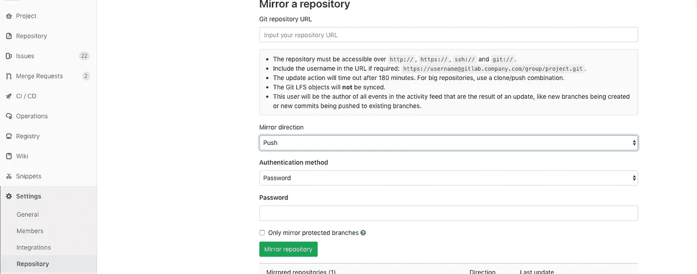
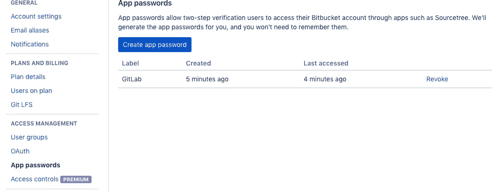
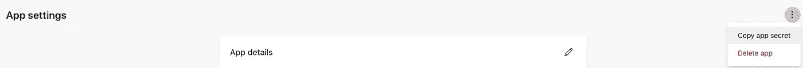
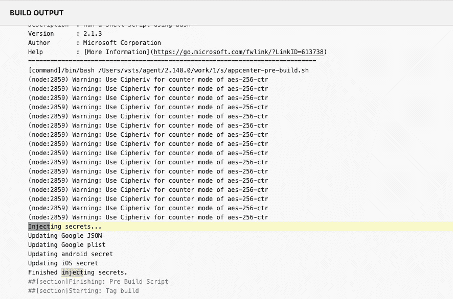

# 如何在不泄露秘密的情况下使用 GitLab 设置应用中心

> 原文：<https://itnext.io/how-to-setup-appcenter-with-gitlab-without-pushing-secrets-5f802b9530bd?source=collection_archive---------3----------------------->

[Pankaj Patel](https://unsplash.com/@pankajpatel?utm_source=medium&utm_medium=referral) 在 [Unsplash](https://unsplash.com?utm_source=medium&utm_medium=referral) 上拍摄的照片

我们都同意，拥有一个自动化应用程序构建、发布甚至**分析**的工具会非常好。嗯，这正是 [AppCenter](https://appcenter.ms/) 的工作。更多。

## 然而…

对于我们这些使用 GitLab 作为他们主要的 Git 服务器的人来说，设置 GitLab 与 AppCenter 一起工作是非常令人沮丧的。我们也不想把我们的应用秘密推给我们的 Git 服务器，不管是我们的 Firebase JSON 还是 AppCenter 的秘密。

# 位桶镜像

为了让 AppCenter 与 GitLab“合作”，我们首先必须将我们的存储库镜像到 BitBucket。所以，继续在 [BitBucket](https://bitbucket.org) 中创建一个存储库，然后转到您的用户的`Settings` ( **不是回购设置**，我们仍然在 BitBucket 中)，在`App passwords`下用所有可用权限创建一个新的应用程序密码，并复制您以后获得的密码。

然后转到 GitLab，`Settings` - > `Repository`，在`Mirroring Repositories`下，输入您新的 BitBucket repo 的克隆 URL，在`Mirror Direction`、`Password`下选择`Push`作为身份验证方法，并将您输入的密码粘贴到 BitBucket 中。单击`Mirror Repository`按钮，您会在镜像按钮正下方的表格中看到新的一行。单击右侧的刷新按钮开始同步。

# 设置 AppCenter

那是容易的部分。我们仍然需要配置我们的构建并隐藏一些秘密😎

进入[应用中心](https://appcenter.ms/)，如果您还没有用户，请创建一个用户。创建你的应用程序(对我来说，一个是安卓的，一个是 iOS 的)，并完成添加应用中心 SDK 的步骤。现在进入`Build tab`，在`Select a Service`下选择`BitBucket`。选择您新创建的回购，然后您应该会看到您的所有分支机构。到此为止。

# 生成脚本

现在，为了让 AppCenter 构建您的应用程序，它需要 iOS 和 Android 的 AppCenter secret(在上面显示的设置页面中提供)文件，因此继续填写以下文件中的机密(如果您执行了 react-native 链接，它们可能已经被填写):

> Android/app/src/main/assets/app center-config . JSON
> 
> IOs/YOUR _ PROJECT _ NAME/app center-config . plist

现在您需要将这些文件添加到您的。gitignore 文件，然后对它们都进行 base64，以便稍后将编码的值插入到 AppCenter 的构建环境变量中。我还建议为每个被忽略的文件添加示例文件(例如 appcenter-config.example.json ),这样在预构建脚本中创建实际文件时就不会有任何错误。

如果你像我一样使用 Firebase，你还需要注入`google-services.json`文件(对于 Android)和`GoogleService-Info.plist`用于 iOS。首先，将这些文件添加到 gitignore 中，像以前一样，为每个文件创建空的示例文件。

现在让我们编写预编译代码！

创建一个名为`appcenter-pre-build.sh`的新文件(这样 AppCenter 可以在构建之前识别并运行它):

这段代码适用于两个平台，你可以随意编辑。

现在要做的最后一件事是插入环境变量。

# 环境变量

如我们的代码所示，我们有 4 个环境变量。让我们再次进入构建配置，展开`Environment Variables`，并添加我们的 4 个变量:

`GOOGLE_SERVICES_JSON`、`GOOGLE_SERVICES_PLIST`、`ANDROID_SECRET`、`IOS_SECRET`。

## 确保在输入这些值之前对它们进行 base64 编码！

(你可以使用[这个站点](https://www.base64encode.org/))

现在我们的构建应该运行了，它应该在中间的某个地方显示`Injecting secrets…`！

*原载于*[*gist.github.com*](https://gist.github.com/bf143978784eea67adcdbed2f641d4fd)*。*