# 如何使用 Azure DevOps 为 Android 设置 CI CD 管道

> 原文：<https://itnext.io/how-to-setup-ci-cd-pipelines-for-android-with-azure-devops-2a4ded0de0e7?source=collection_archive---------0----------------------->

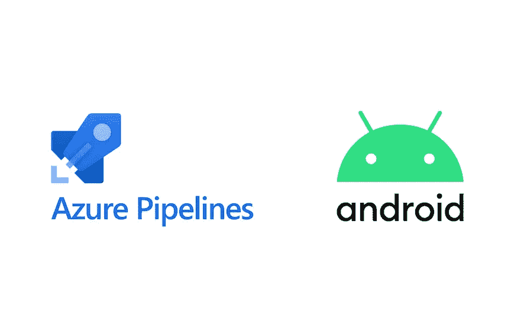

CI CD AAB (Android 应用捆绑包)到 Google Play 控制台

DevOps & CI/CD 是一段时间以来的热门词汇，它们已经在当今快速发展的世界和敏捷开发过程中证明了它们的价值。只有当他们真正经历了这一过程，亲眼看到它节省了大量的时间和令人头痛的事情时，他们才能理解真正的价值。

在 [Royale Cheese](https://royalecheese.com/) 最初我们通过微软的 Visual Studio 应用中心(曲棍球应用的升级)为 Android 设置 CI/CD，但去年他们宣布[的 MBaas](https://devblogs.microsoft.com/appcenter/app-center-mbaas-retirement/) 退休，这让我们担心 VS 应用中心的整体未来。这是我们想放弃它的原因之一。其次，免费层为每个帐户每月提供大约 400 分钟的构建时间，这对于其他技术来说已经足够了，但 Android 需要大约 15 分钟来创建一个单独的构建和部署。我们都知道格雷能做什么😉。因此，在同一个账户中拥有多个应用程序(包括 iOS 和 Android)并不太好。

我们已经将 [Azure DevOps](https://dev.azure.com/) 用于其他技术的 CI/CD，这看起来很有前景。它的未来计划没有关闭的问题，它提供了大约 1800 分钟的免费构建时间。我们决定试一试，到目前为止没有任何抱怨。我们已经开始热爱和崇拜 Azure DevOps，并希望它保持这种状态。

好吧！问题已经说得够多了，让我们看看如何进行构建和部署。在本教程中，我们将制作更新的 [Android 应用捆绑包](https://developer.android.com/platform/technology/app-bundle)(。aab)而不是。apk 上传到 Google Play 控制台。

# 先决条件

*   付费[谷歌开发者账号](http://play.google.com/apps/publish/)，Play 主机上增加的一个应用。
*   创建了 Android 存储库的 Azure DevOps 帐户
*   用于签署构建的 jks 文件

# 连续累计

持续集成是每次变更被推送到存储库时运行构建和测试套件的过程。由于 Android 构建确实需要大量的时间，并且通常云 CI/CD 工具会随着构建时间的增加而变得昂贵，因此最好每周安排一次 CI 管道。我将使用在我的 devops 帐户中创建的名为 *Android* 的演示项目来创建 ci cd 管道。项目有一个空白活动，支持棒棒糖 5.0 及以上版本。

打开您的项目并导航到左侧面板上的*管道*部分，如下图所示。

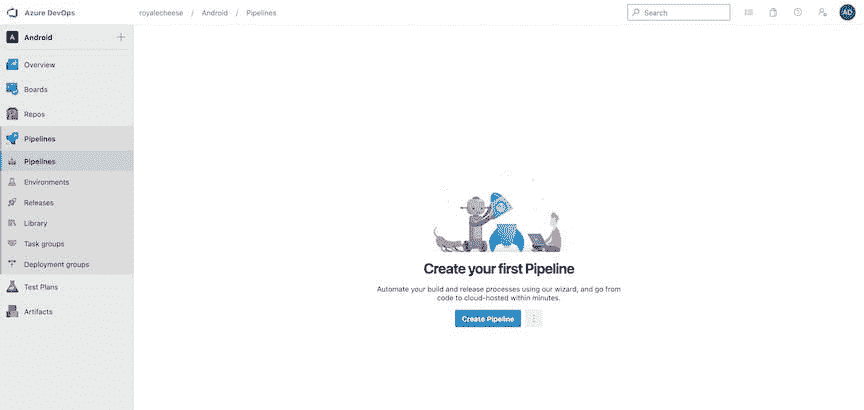

点击*创建管道*，将打开以下页面。


这里我们将选择*使用经典编辑器*，这比其他选项更容易。其他选项将最终导致编写 yaml 文件来配置您的管道。

通常，您可能有开发、qa 和/或 uat 分支要上传到 Google Play 控制台上的内部或测试频道，并且您只想从您的 Google Play 控制台将应用程序升级到生产。因此，选择您想要运行构建的分支，然后单击 Continue。对我来说，一切都在主枝上。

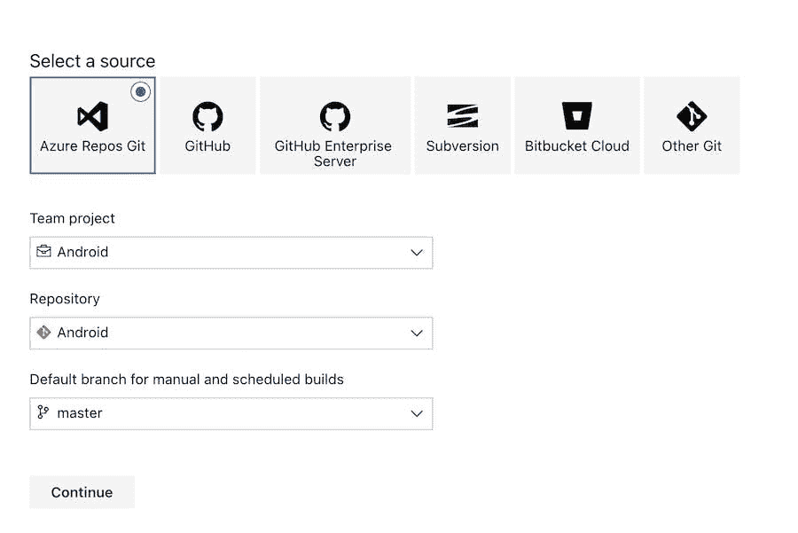

理想情况下，我们会被诱惑选择 *Android* 模板，继续我们的生活；不要这样做。因为 *Android* 模板没有提供生成。aab 文件，我们不打算使用它。请选择一个空作业。

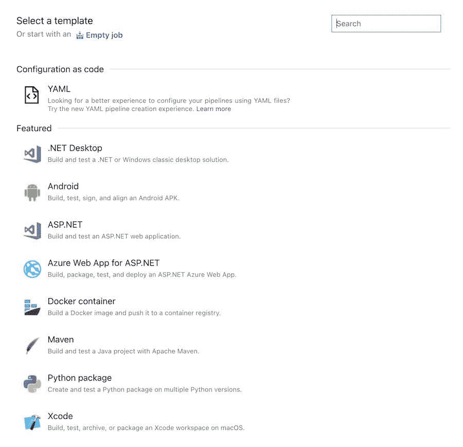

我们现在将有一个空的*代理作业 1* ，我们将向其中添加任务。

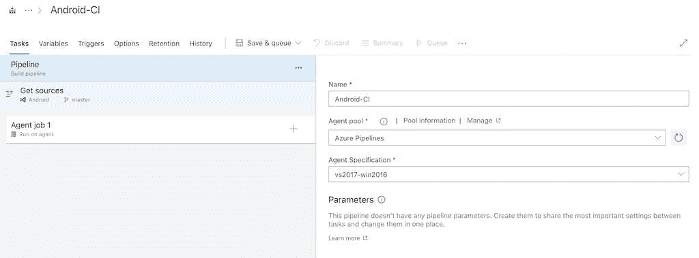

我们将不得不执行以下任务来创建我们的 CI 渠道:

*   设置 jks 文件
*   通过 gradle 进行未签名的构建
*   生成。aab 文件
*   创造一件艺术品

让我们一步一步地开始。

## 设置 jks 文件

如果你在过去已经上传了一个 apk 或者 aab 到 play store，你必须使用一个 jks 文件来签署版本。在这一步中，您应该使用相同的 jks 文件。如果你还没有生成文件[，这里的](https://developer.android.com/studio/publish/app-signing#generate-key)是一个很好的文档。

得到你的 jks 文件，因为我们现在要上传它。点击*代理作业 1* 旁边的 *+* 符号，将打开要添加的任务列表。搜索*下载安全文件*。

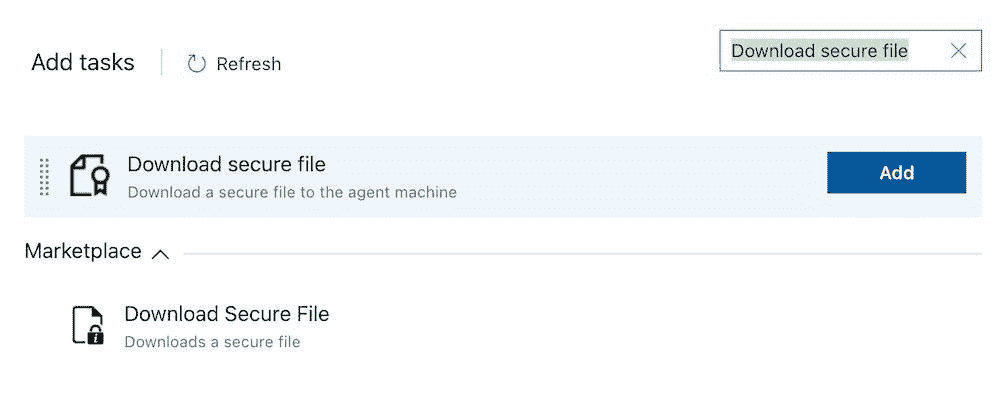

点击*添加*按钮添加任务。它会给出一个错误提示*一些设置需要注意*。它要求上传一个安全文件。点击*安全文件*栏旁边的档位/设置图标，上传您的 jks。

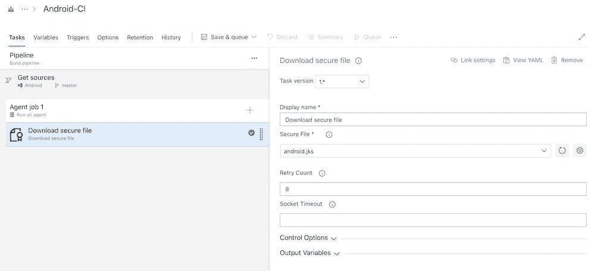

我们现在将为该文件提供一个名称，以便可以从签名任务中引用它。点击*输出变量*下拉菜单，在*参考名称*中输入*密钥存储文件*。这将更新*变量列表*以反映变量名称。

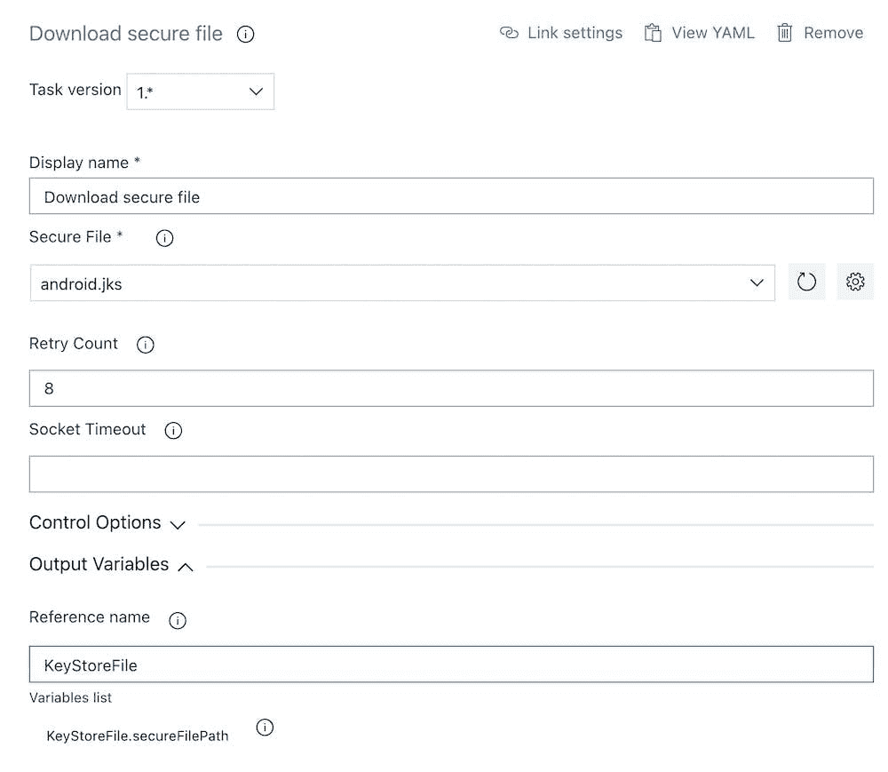

## 未签名的梯度文件

点击*代理作业 1* 旁边的 *+* 符号，将打开要添加的任务列表。搜索 *gradle* 。

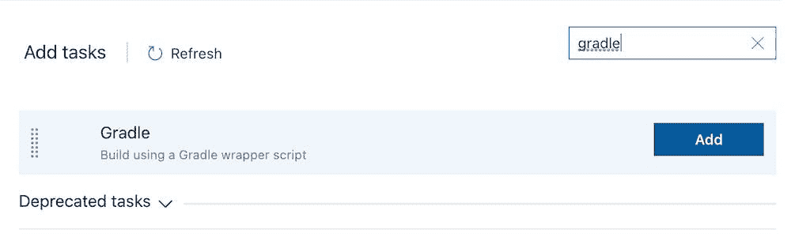

点击*添加*按钮添加任务。我们将关闭 *JUnit 测试结果*部分下的*发布到 Azure 管道*。你可以根据需要一直戴着它。其次，我们将更新任务名称。因为我们要发布一个构建版本，所以将您的任务名称更新为 *buildRelease* 。如果你想用一种特殊的风格来建造，你可以相应地更新你的任务名称。例如，如果您使用 dev 作为风格名称，请将您的任务名称更新为 *buildDevRelease* 。

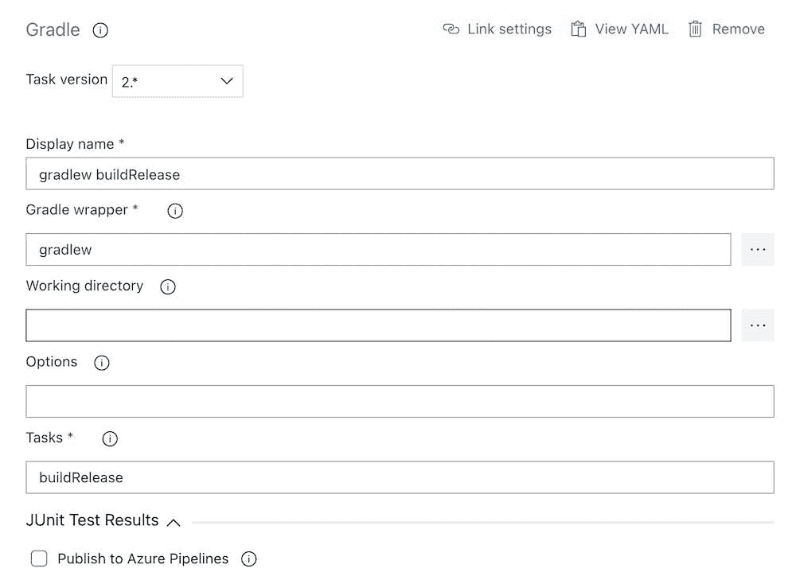

## 生成。aab 文件

点击*代理作业 1* 旁边的 *+* 符号，将打开要添加的任务列表。搜索*命令行*。

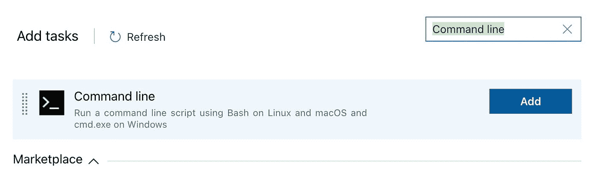

在*脚本*部分，清除该字段并设置以下文本。

复制

```
jarsigner -verbose -sigalg SHA256withRSA -digestalg SHA-256 -keystore $(KeyStoreFile.secureFilePath) -storepass $(StorePassword) -keypass $(KeyPassword) $(system.defaultworkingdirectory)/app/build/outputs/bundle/release/*.aab $(KeyStoreAlias)
```

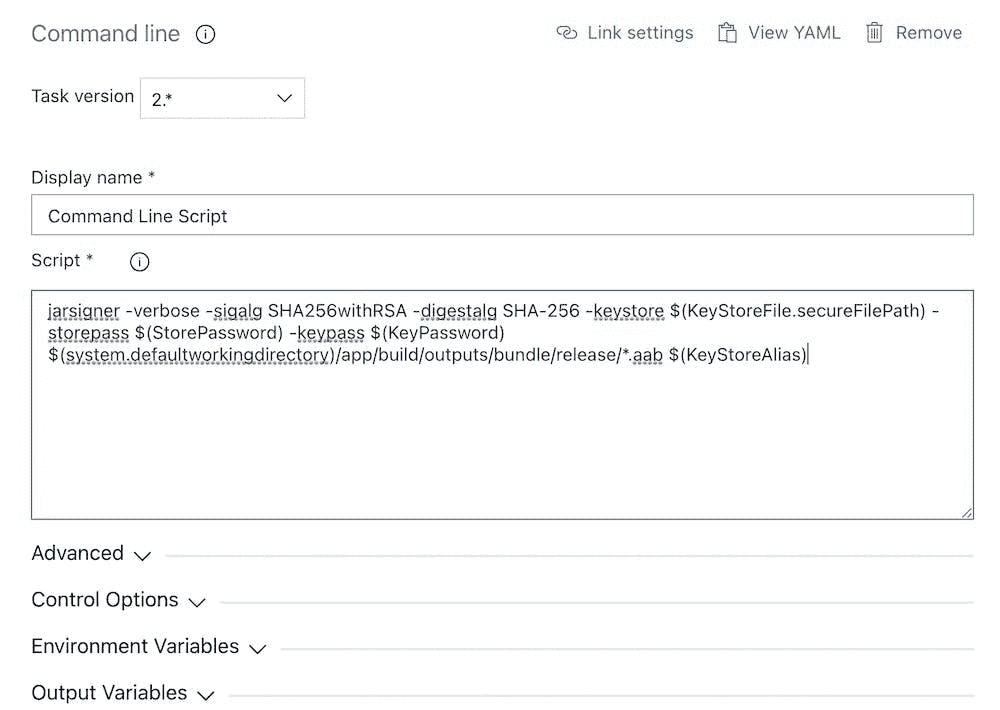

脚本中有 4 个变量，其中我们已经设置了*keystorefile . securefilepath*。设置其他 3 个变量*存储密码*、*密钥密码*和*密钥存储别名*的时间。导航到点击的*变量*选项卡，添加变量及其值，如下图所示。一旦您确定这些值是正确的，您可以单击锁图标来保护它。一旦您锁定并保存，包括您在内的任何人都无法查看它，因此请确保您仍然有详细信息的备份，以防您想在其他地方使用它。

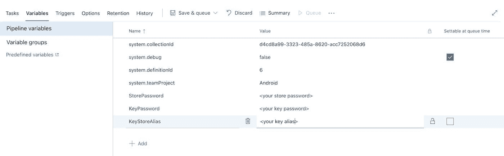

## 创造一件艺术品

上面的步骤创建了一个。aab 文件，但是仍然需要转换成工件，以便它可以用于 CD 管道的发布。

到现在为止，您已经是向代理作业 1 添加任务的专家了。将以下两个任务添加到*代理作业 1* : *复制文件* & *发布构建工件*。为了避免混淆选择哪个任务，我添加了下面的截图。

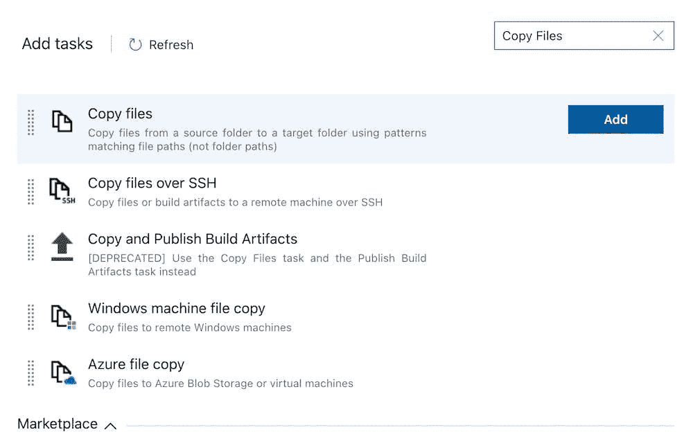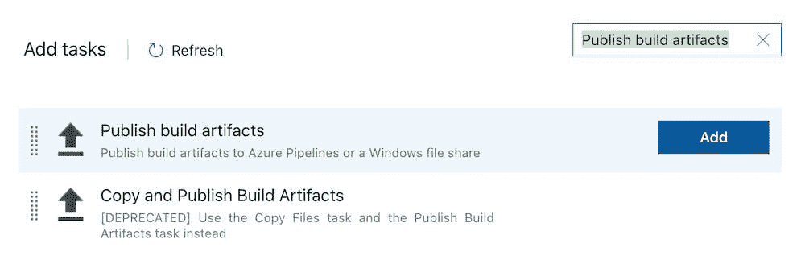

现在选择*复制文件*任务，在*源文件夹*字段中设置*$(system . defaultworkingdirectory)*， ***/* 。内容*中的 aab *和*目标文件夹*中的*$(build . artifactstaging directory)*。*

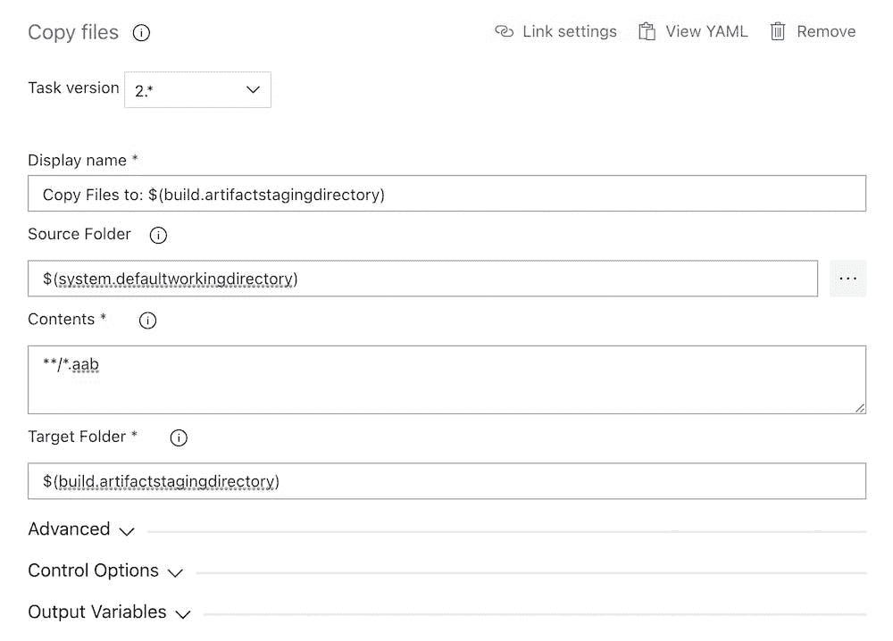

点击*保存&队列*，点击*保存*保存我们的 CI 管道。

对于*持续集成*就是这样。我们现在将前往*连续部署*以了解如何将生成的工件发布到游戏控制台上的*内部测试*通道。

# 持续部署

持续集成处理的是在机器本身上创建构建，*持续部署*关注的是如何将构建发布到 Play Store、App Store、自托管或云服务器。为了部署到 Play Store，您需要一个 Google Play 控制台帐户和一个在 Play 控制台中创建的具有相同捆绑 id 的应用程序。

接下来，我们将回到我们的 Azure DevOps 项目，并选择 pipeline 部分下的*版本*。

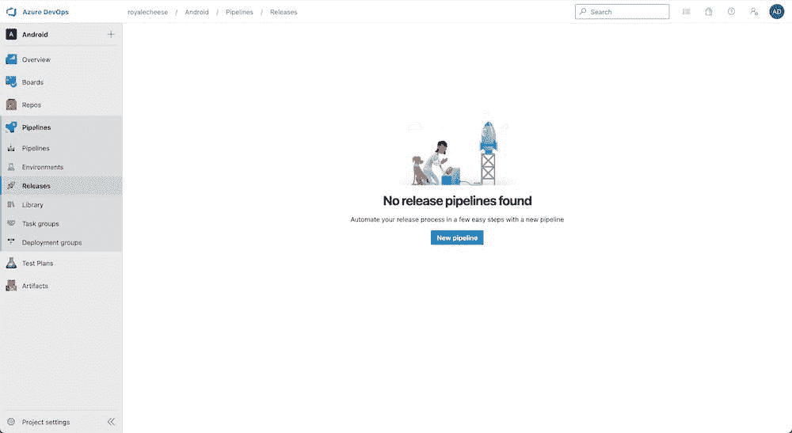

由于没有用于将构建上传到 Play Store 的预定义模板，我们将选择一个空作业。

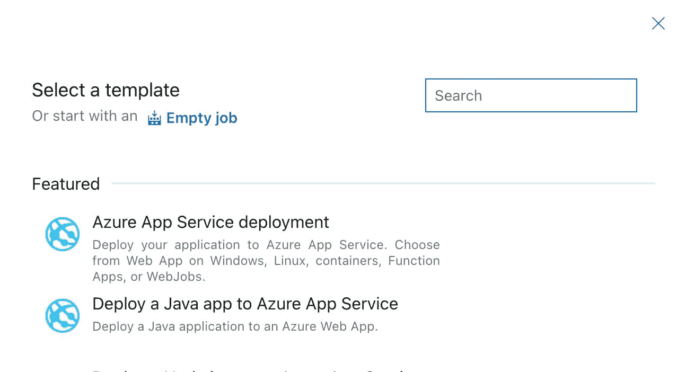

我们现在将输入部署的阶段名称。你想叫它什么都可以。我已经把它作为*播放商店部署*

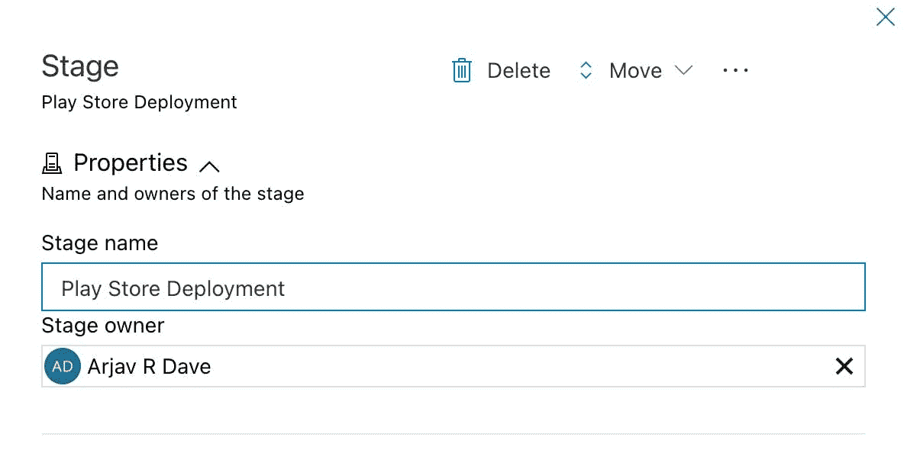

让我们将 CI 工件与我们当前的 CD 管道连接起来。选择*从工件中添加一个工件*。这将在右侧打开一个对话框，我们将在其中选择我们的工件。单击 *Source (build pipeline)* 的下拉菜单，您将看到 *Android-CI* 是唯一的选项(除非您添加了更多 CI 管道或更改了 CI 名称)。

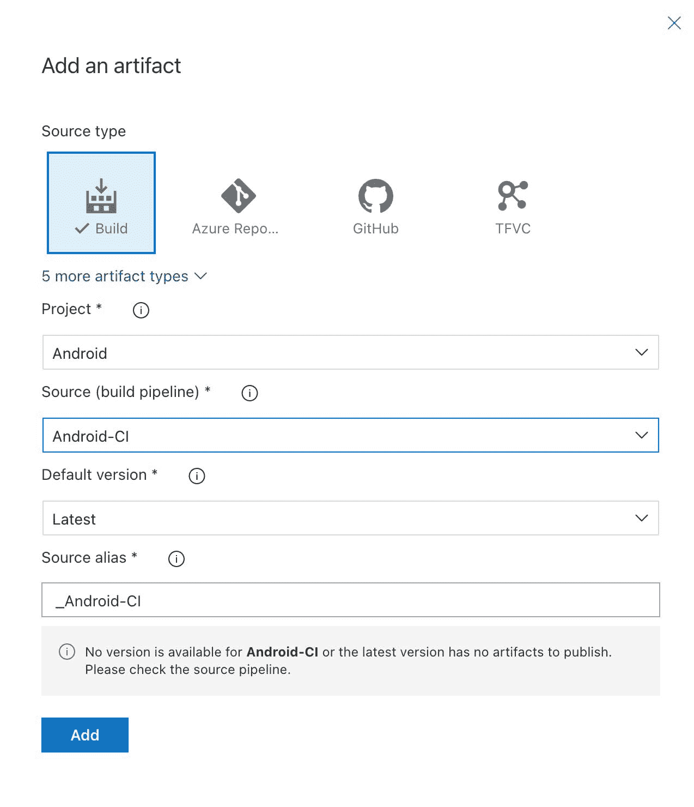

选择 *Android-CI* 并点击*添加*。添加工件后，我们的发布管道将看起来像下面这样。

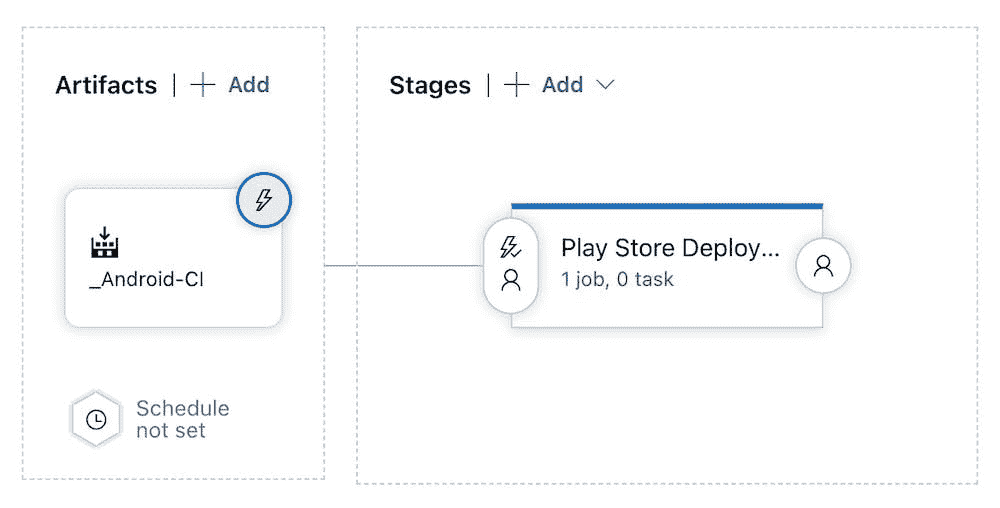

由于 CI 和 CD 管道是分开的，我们应该设置一种方法，在 CI 成功时自动触发 CD 管道。为了实现这一点，为我们刚刚添加的工件选择闪电图标。这将在右侧打开一个对话框，其中包含启用/禁用持续部署触发器的设置。当构建触发器启用时，当我们的构建(CI)管道完成一个新的构建时，我们的发布管道将自动启动。我们不会启用拉取请求触发器。

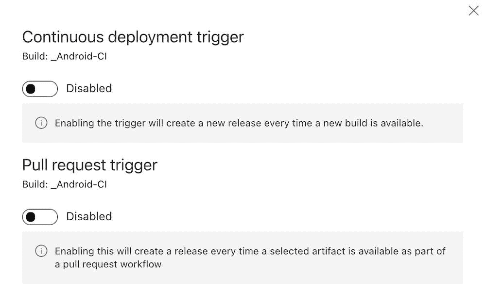

到目前为止，我们已经将管道设置为在我们的构建管道中有新的构建可用时自动启动。我们还设置了一个 Play Store 部署阶段，我们将在下一节中为实际部署添加任务。

## 部署任务

选择 1 作业 0 任务超链接，该超链接将切换到“任务”选项卡。选择*代理作业*旁边的+号，打开新任务列表。当你搜索 *Google Play* 时。你会看到微软的 Google Play 。如果尚未安装，请安装该项。一旦安装完毕，当你再次搜索谷歌应用程序时，你会看到如下几个新任务。

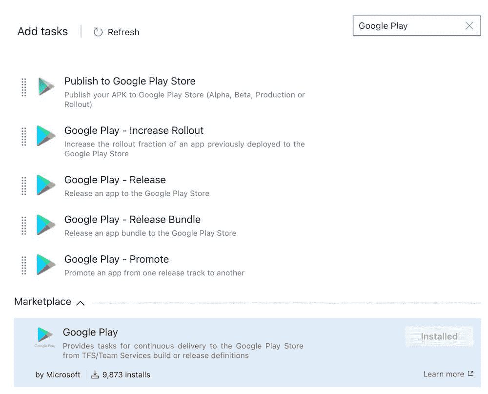

选择显示 Google Play-Release Bundle 的任务，点击*添加*按钮(不要选择*Google Play-Release*)。有些设置需要注意，我们会逐一处理。

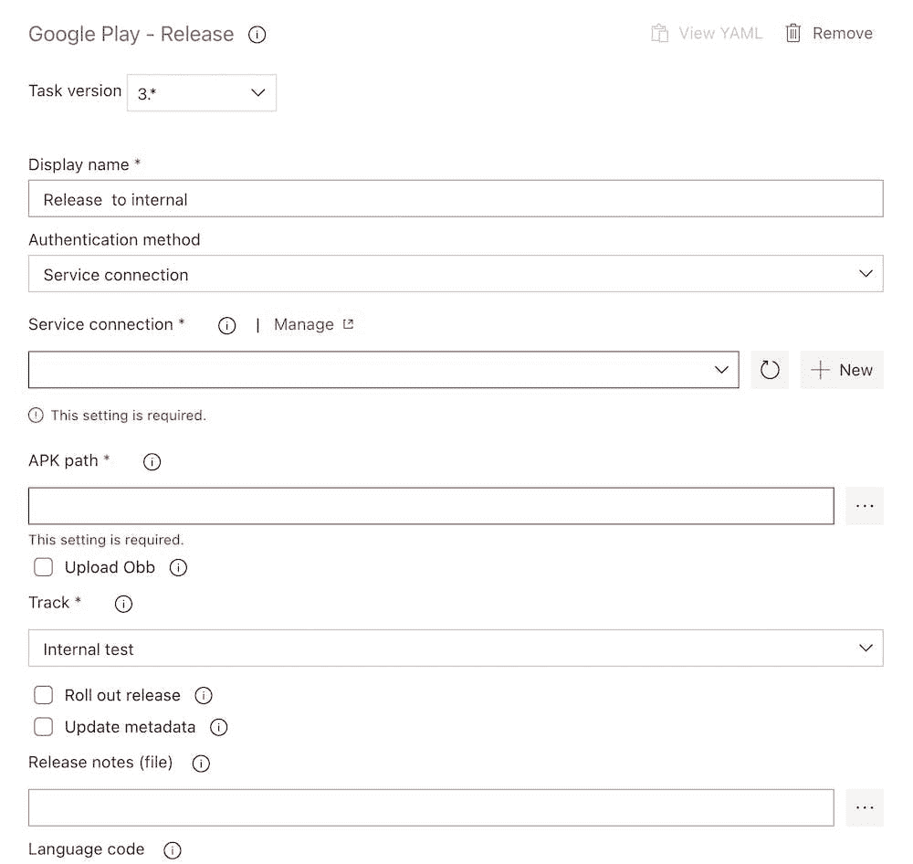

## 添加服务连接

首先，我们需要创建一个新的服务连接。点击*服务连接*字段旁边的*新建*按钮。它将弹出一个对话框，主要要求输入一个*服务账户电子邮件*和一个*私钥*。我们将在 Google Play 控制台上创建一个服务帐户来上传版本。出于身份验证的目的，该帐户还会附带一个私钥。

要创建帐户，请访问 [Google Play 控制台](https://play.google.com/apps/publish/)，并在*设置*下的*开发者帐户*下选择 *API 访问*。

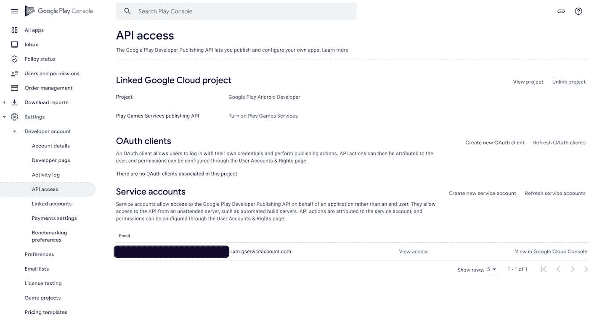

点击*新建服务账户*按钮，弹出如下对话框。

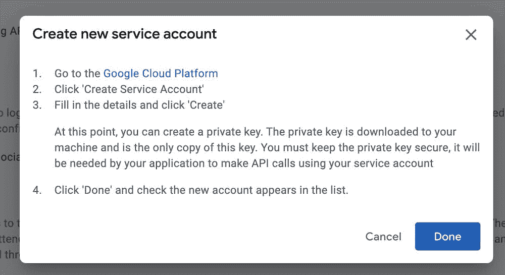

点击步骤 1 中的链接，这将把您重定向到*谷歌云控制台*的一个新标签。

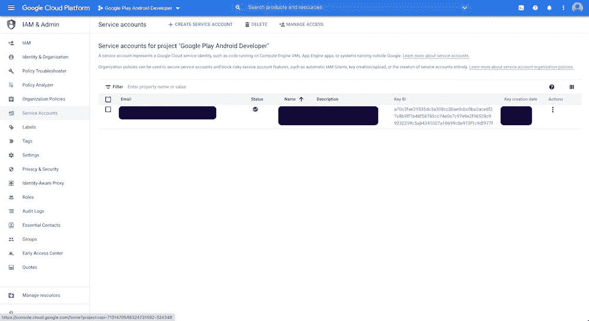

点击顶部的 *+创建服务账户*，开始创建新账户。在新打开的页面中，我在服务帐户名称中输入了 *Google Play 控制台*，但是它可以是你想要的任何名称。如果需要，输入*服务账户描述*。

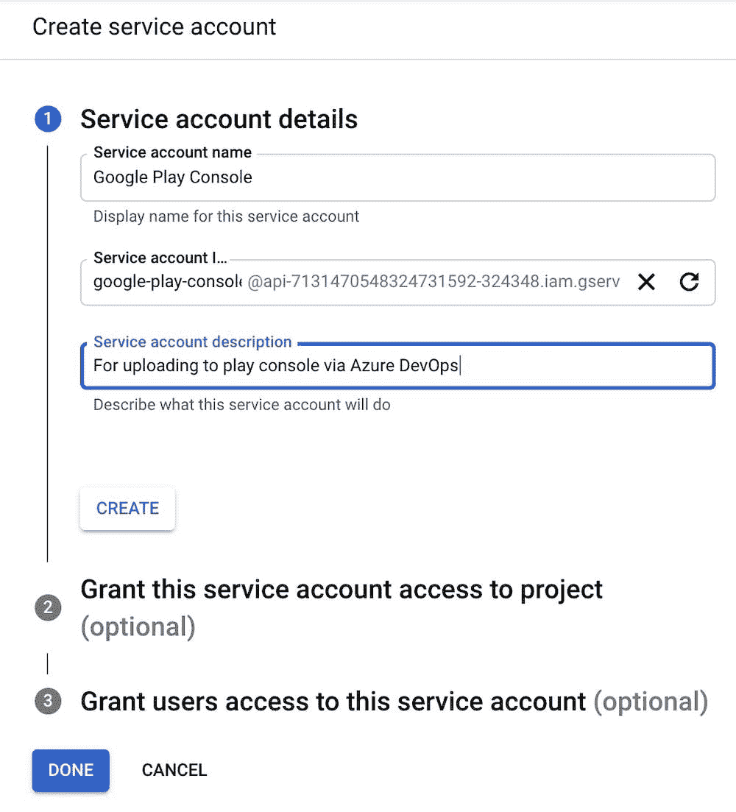

点击*创建*继续。然后，它会询问您希望为该用户分配什么权限。点击角色下拉菜单，搜索*所有者*。选择*所有者*，拥有*对所有资源*的完全访问权。

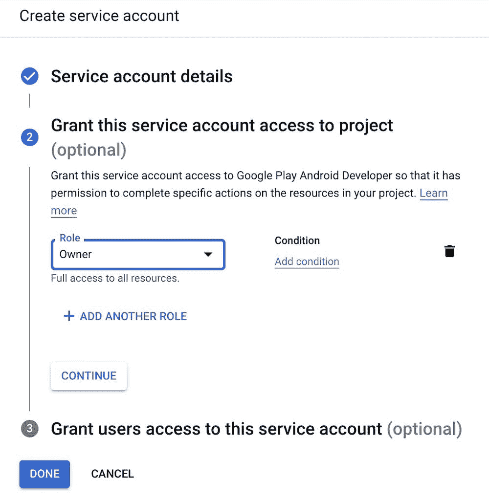

单击*继续*按钮，并在步骤 3 中选择*完成*，因为我们不想添加任何可以作为该服务帐户执行操作的用户或组。您将被重定向到密钥列表页面。现在选择新创建的帐户并转到*键*选项卡。这里我们将为我们的服务连接添加一个新的*私有密钥*。

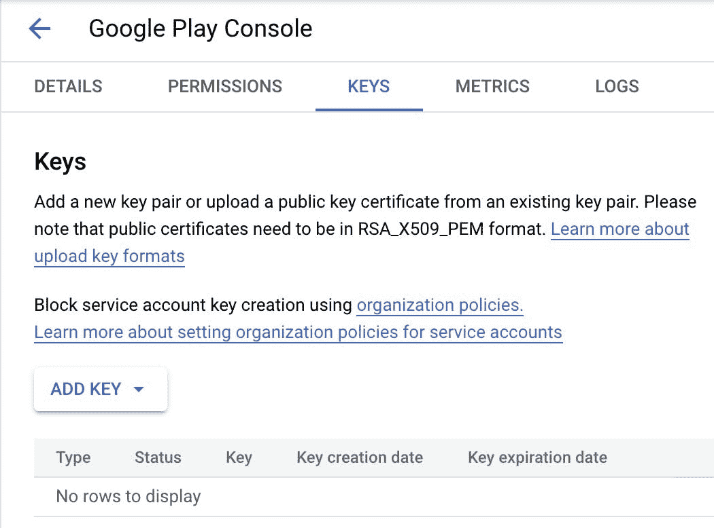

选择*添加密钥*，并从下拉菜单中选择*创建新密钥*。它将显示一个弹出窗口，显示您想要创建的密钥类型。

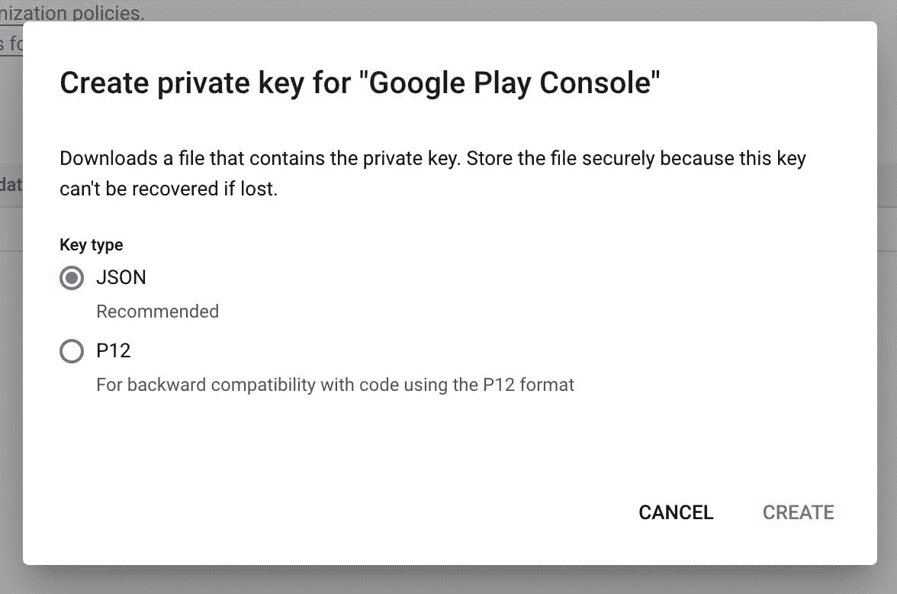

选择 *JSON* 选项，点击*创建*按钮。这将要求您下载文件。把它存放在一个安全的地方，我们不会照原样使用整个文件，如果你打开文件，它会有一个名为 *private_key* 的密钥。

在我们使用这个值之前，回到我们的 google play 控制台的 *API 访问*页面，点击*完成*按钮。它将刷新服务帐户列表，将您的服务帐户添加到列表中。

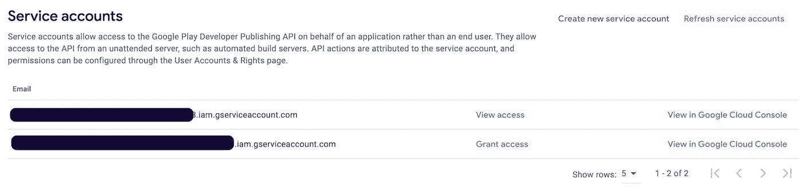

对于新创建的服务帐户，该行将有*授权访问*按钮。点击按钮将打开一个页面邀请用户。不要与术语 *invite* 混淆，因为 Google 可能会重用一个页面来显示服务帐户的相同信息。

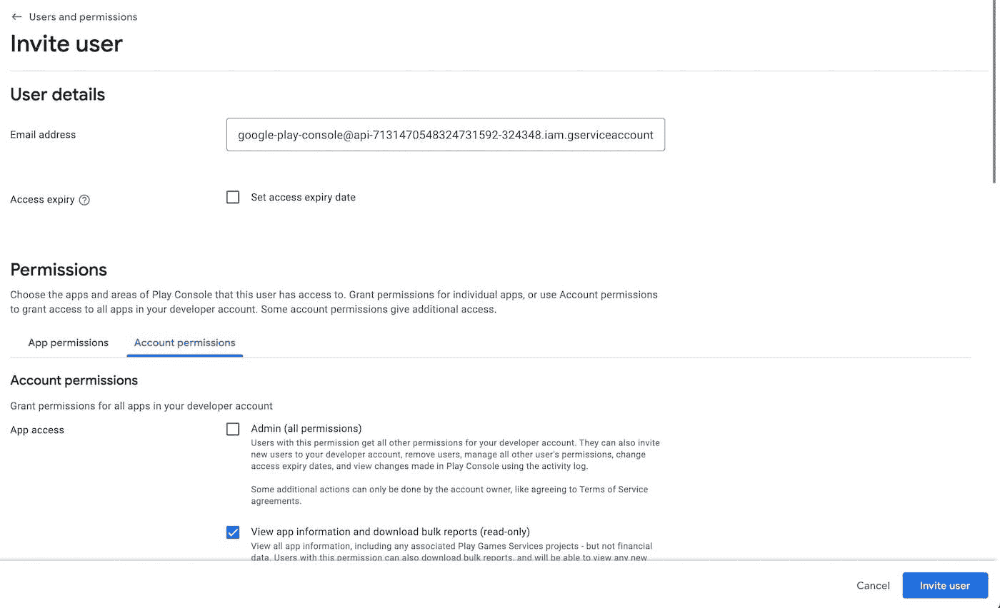

点击右下角的*邀请用户*，在弹出的对话框中点击*发送邀请*。此操作会将您重定向到*用户和权限*页面，其中服务帐户被添加为新用户。

我们现在将在 Azure DevOps 中设置*服务电子邮件*和*私钥*。首先，将新创建的服务帐户的电子邮件复制到 Azure DevOps 选项卡中的*服务帐户电子邮件*中。接下来打开私钥 json 文件，并将 *private_key* 的值复制到*私钥*字段。这是它的样子。

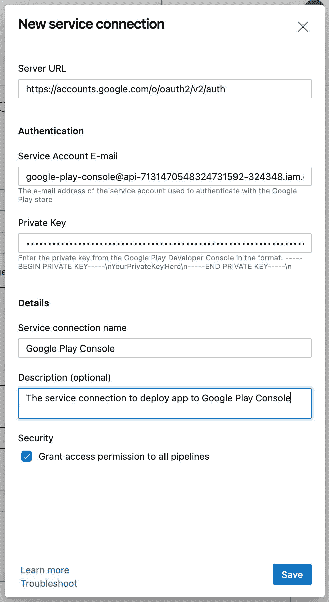

点击*保存*，将服务连接添加到*服务连接*字段。接下来，在*应用程序 id (com.google.MyApp)* 字段中输入您的包 id。最后，在*捆绑路径*中，您可以浏览选择。aab 文件，方法是单击右边的 3 个点。通常，aab 将位于

```
<your CI name>/drop/app/build/outputs/bundle/release/*.aab
```

如果您还没有运行 CI 管道，您可以将路径设置为

```
$(System.DefaultWorkingDirectory)/_Android-CI/drop/app/build/outputs/bundle/release/*.aab
```

如果您正在使用风味前缀*,请在路径中发布带有您的风味名称的*。例如，路径应该是

```
$(System.DefaultWorkingDirectory)/_Android-CI/drop/app/build/outputs/bundle/devRelease/*.aab
```

您可以从下拉列表中选择要启动的曲目。

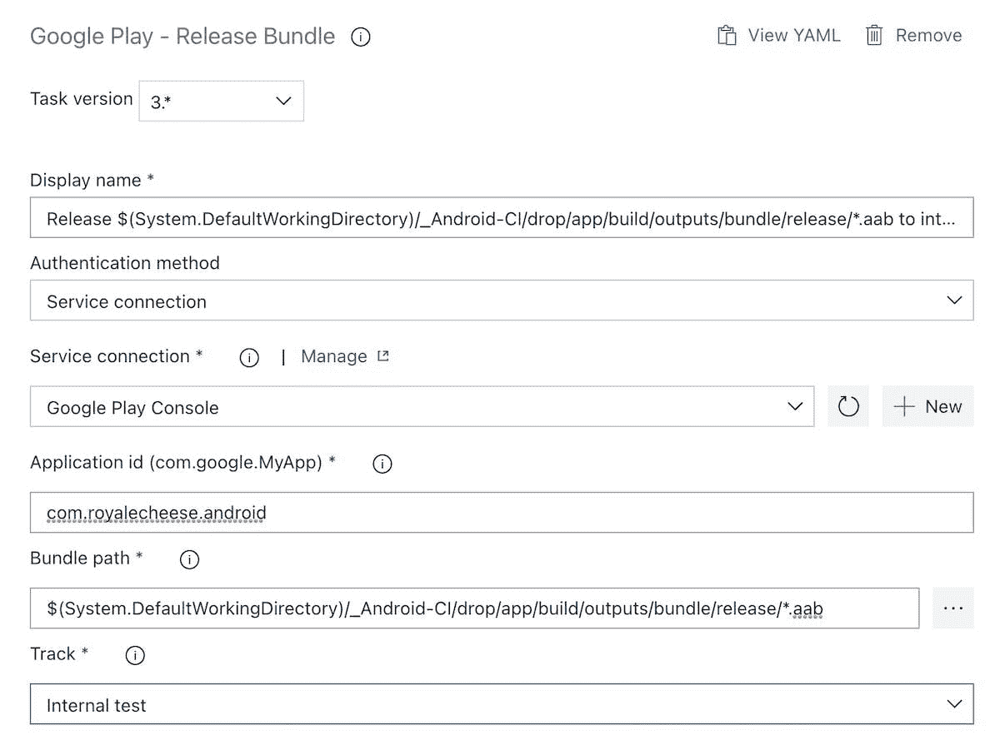

这就是你需要的所有设置。您现在可以*保存*管道并运行 CI 管道来构建 aab 并将其上传到 Play 控制台。

# 结论

这似乎是一个很长的教程，但是一旦你成功地设置了 CI/CD 管道，它将为你的开发者节省大量的时间。其次，它将在云上运行，因此不需要物理机器。您可以通过登录 Azure DevOps 从手机触发构建。希望你喜欢这篇文章，也希望它能帮助你团队中的其他人。

要了解如何为 iOS 设置 CI CD 管道，您可以访问本教程。

如有任何疑问，您可以在下方留言。请关注我的页面，了解更多即将到来的教程。