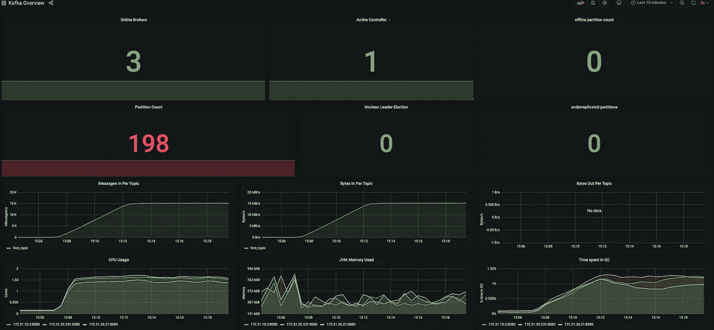
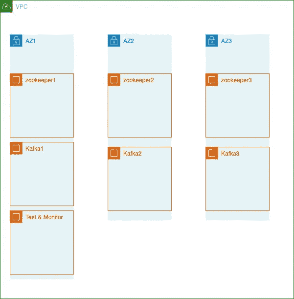
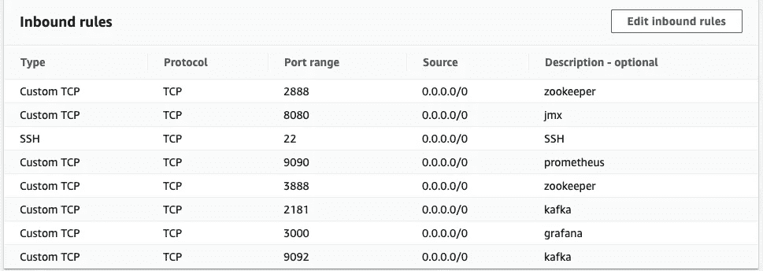
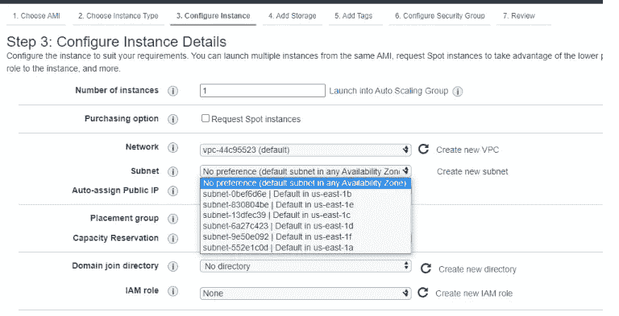
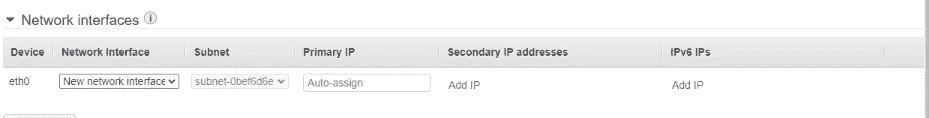
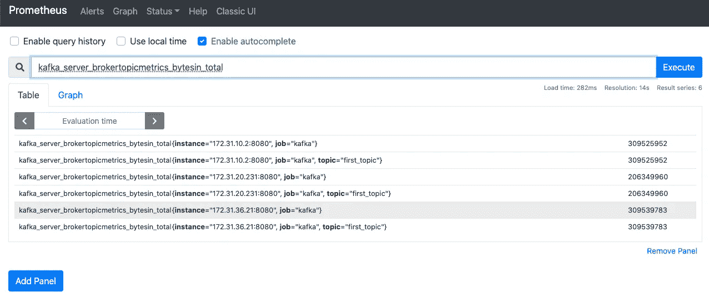
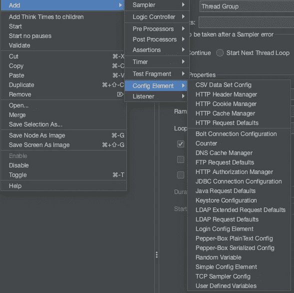
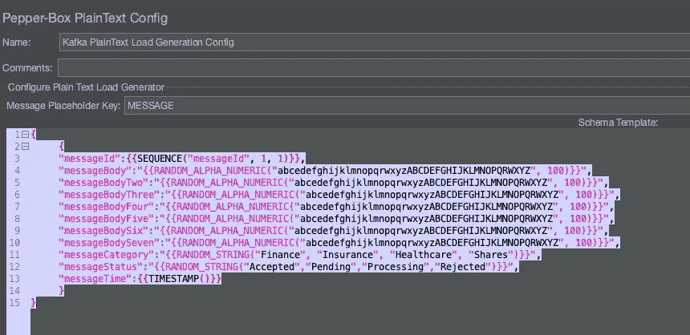
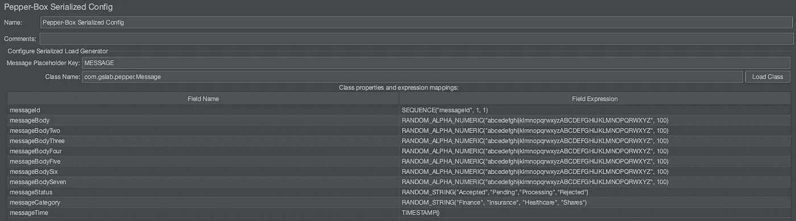
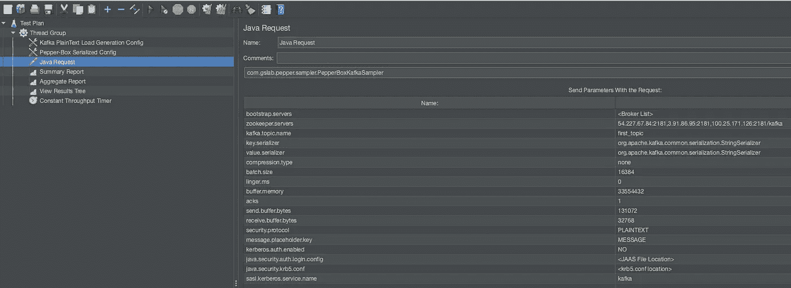

# 如何使用 Docker 在 AWS 上设置每秒 15K 事件的 Kafka 集群

> 原文：<https://itnext.io/how-to-setup-kafka-cluster-for-15k-events-per-second-on-aws-using-docker-d34539873589?source=collection_archive---------0----------------------->



我们将在博客中设置的 Grafana 仪表板

在这篇博文中，我们将按照以下要求设置 Kafka 和 Zookeeper 集群:

*   系统每秒将处理 15K 个 1 KB 的事件
*   系统将是可靠的，不会丢失数据
*   系统将支持 Prometheus 和 Grafana 的监控
*   将使用 JMeter 对系统进行负载测试

我们不会在博客中考虑的事情:

*   没有主题被[消息键](https://kafka.apache.org/08/documentation.html#producerapi)分割。
*   消费者及其吞吐量/分区需求
*   与安全相关的更改

# **卡夫卡系统需求:**

*   **CPU &内存**:由于 Kafka 在 CPU 上是[轻量级](https://docs.confluent.io/platform/current/kafka/deployment.html)，我们将为我们的代理使用`m5.xlarge`实例，它们很好地平衡了 CPU 内核和内存。
*   **Insync 副本:**由于数据对我们很重要，我们将使用 2。
*   **复制因子:**我们将把它保持为 3，以尽量减少数据丢失的可能性。
*   **磁盘:**我们将在每个代理上安装一个外部 EBS 卷。为了提高吞吐量，我们将使用`gp3`作为卷类型。
*   **经纪人数量:**我们将保持在 3 个，都在同一个地区，但有不同的可用性区域。我们将在讨论 AWS 部署时讨论这一点
*   分区:选择分区的数量对生产者和消费者来说都是一个因素。由于我们没有考虑消费者吞吐量，我们的最大吞吐量将是`1KB*15000/s= 15MB/s`。这在我们的 EBS 卷的吞吐量限制之内。无论如何，我们将保持分区的数量为 8。由于这对于非关键消息总是可以增加的，所以我们不会对此过于担心。

*提示:制作 Kafka brokers 时应该做的一些优化*

# 动物园管理员系统要求:

*   我们将建立一个由 3 个 zookeeper 节点组成的集群
*   由于我们的集群很小，我们将使用`t2.medium`实例大小。来自[汇合文件](https://www.confluent.io/wp-content/uploads/apache-kafka-confluent-enterprise-ref-architecture.pdf)

> ZooKeeper 使用 JVM 堆，4GB RAM 通常就足够了。太小的堆将由于持续的垃圾收集而导致高 CPU，而太大的堆可能导致长时间的垃圾收集暂停和 ZooKeeper 集群内的连接丢失。

# 测试(JMeter)系统要求:

*   我们需要一个可以生成 15K 事件或以分布式模式运行 JMeter 的系统。为了简单起见，我们将使用`c5.9xlarge`实例在一台机器上运行它

# 监控系统要求:

*   我们将在同一个`c5.9xlarge`实例上设置 Prometheus 和 Grafana。

# AWS 部署概述:



Kafka 部署概述

关于上述部署的一些要点:

*   我们将在单个区域的三个不同的[可用性区域](https://aws.amazon.com/about-aws/global-infrastructure/regions_az/) (AZs)中的每一个上部署一个 zookeeper 实例，以实现高可用性
*   类似地，我们将在一个区域的三个不同的 az 上部署一个 Kafka 实例。
*   我们将使用 **Ubuntu Server 20.04 LTS**
*   测试和监控服务器可以在任何 AZ。

# AWS 安全组:

我们需要打开几个端口，以便整个集群能够协同工作。这是安全组的快照。不用说，让它在操作生产集群时更加安全



动物园管理员、卡夫卡、普罗米修斯和格拉法纳的 AWS 安全组

# Zookeeper 设置:

在三个不同的 az 中启动 3 个 EC2 实例。我们可以在启动实例时选择这些区域



启动 EC2 实例时的可用性区域选择

一旦选择了子网，就给 zookeeper 实例分配静态 IP。当实例启动时，这些静态 IP 不会改变。



分配静态私有 IP

为实例选择正确的子网 IP。例如，我设置了区域、IP 和名称映射，如下所示

```
us-east-1d -> 172.31.9.1 -> zookeeper1
us-east-1a -> 172.31.19.230 -> zookeeper2
us-east-1e -> 172.31.35.20 -> zookeeper3
```

*提示:这里有一个小视频可以帮助划分子网*

更新`/etc/hosts`文件，并在每个 zookeeper 服务器上添加以下条目。这将有助于使用名称而不是 IP 来连接实例

```
172.31.9.1 zookeeper1
172.31.19.230 zookeeper2
172.31.35.20 zookeeper3
```

更新系统并安装 docker 和 docker compose

更新主机并安装 docker 和 docker compose 的脚本

容器将作为`non-root`用户运行，因为它们提供了额外的一层[安全性](https://engineering.bitnami.com/articles/why-non-root-containers-are-important-for-security.html)。创建一个 zookeeper 数据文件夹，并分配正确的所有权权限。

```
mkdir -p /data/zookeeper
chown -R 1001:1001 /data/zookeeper
```

创建`/data/zookeeper/myid`文件，给`zookeeper1`赋值`1`，给`zookeeper2`赋值`2`，给`zookeeper3`赋值`3`

使用以下数据在`/home/ubuntu/zoo/zoo.cfg`创建动物园管理员配置`zoo.cfg`

注意它是如何使用像`zookeeper2`这样的服务器名称而不是 IP 地址的。这是可行的，因为我们在`/etc/hosts` 文件中有条目。这只是为了方便。也可以使用 IP 地址。

对于 docker 联网，我们将使用[主机联网](https://docs.docker.com/network/host/)。在所有三台服务器上启动 zookeeper 服务器

启动 zookeeper 的脚本

# Kafka 设置:

在匹配动物园管理员 AZs 的三个不同 AZs 中启动 3 个 EC2 实例。与`zookeeper1`、`zookeeper2`、`zookeeper3`对应同一区域的`Kafka1`、`Kafka2`、`Kafka3`姑且称之

用我们在 zookeeper 服务器中做的相同条目更新`/etc/hosts`文件

```
172.31.9.1 zookeeper1
172.31.19.230 zookeeper2
172.31.35.20 zookeeper3
```

使用我们在 Zookeeper 设置中使用的相同脚本更新系统并安装 docker

创建 Kafka 数据文件夹，并分配正确的所有权权限。

```
mkdir -p /data/kafka
sudo chown -R 1001:1001 /data/kafka
```

在每台服务器上的`/home/ubuntu/kafka/server.properties`处创建 `server.properties`。分别在每个服务器上将`broker.id`更改为`1`、`2`和`3`。确保`advertised.listeners`反映实例的公共 IP。这使我们能够从外部连接到 Kafka 服务器。

Kafka server.properties 文件

为了监控 Kafka 集群，下载 [prometheus jmx exporter](https://github.com/prometheus/jmx_exporter) 和相应的[配置文件](https://raw.githubusercontent.com/prometheus/jmx_exporter/master/example_configs/kafka-2_0_0.yml)

```
mkdir -p kafka/config && cd $_wget https://repo1.maven.org/maven2/io/prometheus/jmx/jmx_prometheus_javaagent/0.15.0/jmx_prometheus_javaagent-0.15.0.jarwget https://raw.githubusercontent.com/prometheus/jmx_exporter/master/example_configs/kafka-2_0_0.yml
```

就像 zookeeper 一样，运行带有网络主机的容器，并添加`KAFKA_OPTS`用于度量收集和挂载 Kafka 配置

开始卡夫卡脚本

# 普罗米修斯设置:

在测试服务器中，创建一个`prometheus/prometheus.yml`文件。目标是卡夫卡经纪人的私人知识产权。

普罗米修斯. yml

由于 Kafka broker 公开了指标，我们可以启动 prometheus 容器

用码头图片启动普罗米修斯

前往`<publicip>:9090`验证 Prometheus 设置，应该可以看到类似这样的内容。检查所有主机是否都在列表中



连接到 Kafka 集群后的 Prometheus UI

# Grafana 设置:

以管理员身份启动 Grafana，使用一个卷来保存仪表板。

用 docker 图像启动 Grafana

选择[数据源为 Prometheus](https://grafana.com/docs/grafana/latest/datasources/prometheus/) 并选择 Prometheus 服务器的 IP。创建适合您的仪表板。这个博客使用的 json 文件在这里是。

# JMeter 设置:

我们将使用[胡椒盒](https://github.com/GSLabDev/pepper-box/)作为 Kafka 负载生成器。

安装 Java(我们用的是亚马逊 corretto 11)和 JMeter

```
wget -O- [https://apt.corretto.aws/corretto.key](https://apt.corretto.aws/corretto.key) | sudo apt-key add - 
sudo add-apt-repository 'deb [https://apt.corretto.aws](https://apt.corretto.aws) stable main'sudo apt-get update; sudo apt-get install -y java-11-amazon-corretto-jdkwget [https://mirrors.estointernet.in/apache//jmeter/binaries/apache-jmeter-5.4.1.tgz](https://mirrors.estointernet.in/apache//jmeter/binaries/apache-jmeter-5.4.1.tgz)
tar -xvzf apache-jmeter-5.4.1.tgz
mv apache-jmeter-5.4.1 jmeter
rm -rf apache-jmeter-5.4.1.tgz
```

设置 Pepper-Box:从[这里](https://github.com/raladev/load/tree/master/JARs)或者[这里](https://github.com/abhinavdhasmana/kafka-aws-setup/blob/master/JMeter/pepper-box-1.0.jar)复制 JAR 文件，放入 JMeter 插件文件夹。

```
cd /home/ubuntu/jmeter/lib/ext
wget [https://github.com/raladev/load/raw/master/JARs/pepper-box-1.0.jar](https://github.com/raladev/load/raw/master/JARs/pepper-box-1.0.jar)
```

从下面的文件创建 Kafka 有效载荷 jar 文件`Message.jar`，或者从[复制到这里](https://github.com/abhinavdhasmana/kafka-aws-setup/blob/master/JMeter/Message.jar)。将该文件复制到 JMeter 的`lib/ext`文件夹中

我们将在 Mac 中创建测试计划，然后在 Ubuntu 中复制 jmx 文件。在 JMeter 中创建一个线程组，并添加胡椒盒配置元素，即`Kafka PlainText Load Generation Config`和`Pepper-Box Serialized Config`



如何添加胡椒盒为卡夫卡制作人

在`Kafka PlainText Load Generation Config`中，添加下面的模板。这允许我们生成大约 1KB 的有效载荷

它应该是这样的



在`Pepper-Box Serialized Config`中，点击`Load Class`并添加`Field Expression`，如下所示



*   向测试计划添加一个`Java Request`并设置 Zookeeper 的 IP 地址。该插件将从 Zookeeper 获取代理地址



在螺纹组中，相应地设置`Thread Count`以测试负载。完整的 jmx 文件可从[这里](https://github.com/abhinavdhasmana/kafka-aws-setup/blob/master/JMeter/kafka_loadtest.jmx)获得。

在测试服务器上复制 jmx 文件。通过增加堆大小来运行 jmeter

`bin/jmeter HEAP=”-Xms512m -Xmx24g” -n -t kafka_loadtest.jmx`

如果一切正常，我们会看到一个漂亮的仪表盘，如下图所示


负载测试期间的 Grafana 仪表板

完整代码可在[这里](https://github.com/abhinavdhasmana/kafka-aws-setup)获得

这里的很多信息来自于 Udemy 上的[这个](https://www.udemy.com/course/kafka-cluster-setup/)和[这个](https://www.udemy.com/course/kafka-monitoring-and-operations/)大课程。