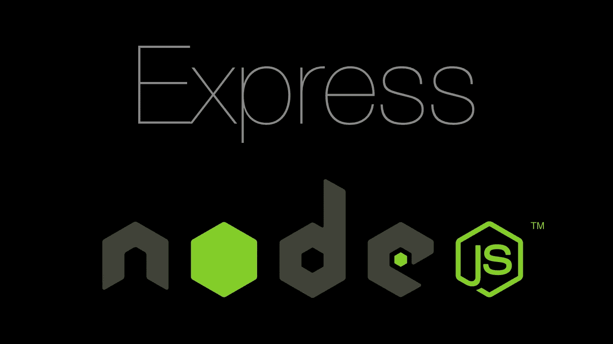

# 如何在 node/express 应用程序中共享一个数据库连接

> 原文：<https://itnext.io/how-to-share-a-single-database-connection-in-a-node-js-express-js-app-fcad4cbcb1e?source=collection_archive---------0----------------------->



在 node/express 应用程序中，您经常需要调用数据库；在不止一个场合，通常是在不止一个模块中。在本文中，我将展示一种简洁而简单的方法来连接数据库，并在所有与数据库相关的操作中重用该连接。我们还将确保在开始接受请求之前连接已经准备好。我将使用 [MongoDB](http://mongodb.github.io/node-mongodb-native/) 作为我的数据库，但是这些原则可以应用于任何数据库管理系统。

我们所有与数据库相关的操作都将由一个模块来处理，姑且称之为`db.js`。该模块将导出 2 个函数:

```
const assert = require("assert");
const client = require("mongodb").MongoClient;
const config = require("../config");let _db;module.exports = {
    getDb,
    initDb
};
```

数据库对象存储在一个`_db`对象中，这个对象最初是`undefined`，但是一旦我们连接到数据库，它将被设置为实际的数据库连接。您可能会猜到这两个函数是做什么的:

*   `initDb`初始化我们的数据库，确保它可以使用——基本上是连接到数据库。
*   `getDb`返回一个连接的数据库对象，通过它我们可以执行所有的数据库操作。

这个想法是，当我们第一次初始化我们的应用程序时，在我们开始监听 http 连接之前，我们将通过调用`initDb`来初始化我们的数据库连接，此后，我们将能够通过调用`getDb.`来获得我们连接的数据库的实例。让我们来看看`initDb`的实现。

```
function initDb(callback) {
    if (_db) {
        console.warn("Trying to init DB again!");
        return callback(null, _db);
    }client.connect(config.db.connectionString, config.db.connectionOptions, connected);function connected(err, db) {
        if (err) {
            return callback(err);
        }
        console.log("DB initialized - connected to: " + config.db.connectionString.split("@")[1]);
        _db = db;
        return callback(null, _db);
    }
}
```

首先，我们检查`_db`是否已经设置。如果有，这意味着我们已经连接到数据库，我们打印一条警告消息，然后返回已经连接的数据库。如果没有设置`_db` ，我们连接到数据库，设置`db`，然后返回连接的数据库。此时，我们可以通过调用下面实现的`getDb,`开始请求数据库对象:

```
function getDb() {
    assert.ok(_db, "Db has not been initialized. Please called init first.");
    return _db;
}
```

非常简单。我们检查是否已经设置了`_db`(记住，如果没有设置 _ `db`，那么这意味着我们没有连接到数据库)，如果没有，我们抛出一个错误。否则，我们返回连接的数据库。

这就是我们的数据库模块。现在让我们看看如何正确使用它。在我们开始监听 express 服务器上的 http 连接之前，我们需要确保我们的数据库是连接的。所以在我们的`app.js`(或者任何你启动服务器的地方)我们需要在启动服务器之前建立连接。

//app.js

```
const initDb = require("./db").initDb;
const getDb = require("./db").getDb;
const app = require("express")();const port = 3001;app.use("/", exampleRoute);initDb(function (err) {
    app.listen(port, function (err) {
        if (err) {
            throw err; //
        }
        console.log("API Up and running on port " + port);
    });
);function exampleRoute(req, res){
 const db = getDb();
 //Do things with your database connection
 res.json(results);
}
```

举例来说，我们的服务器上只有一条路由(`app.use(“/”, exampleRoute);`)。注意，我们首先通过调用`initDb`来初始化我们的数据库，只有在对它的回调中，我们才开始监听 http 连接(`app.listen`)。现在，无论何时我们点击任何路径，我们的数据库都已经连接上了，我们可以通过调用`getDb`来访问它(就像我们在 exampleRoute 中所做的那样)，这是一个可以被我们整个代码库共享的单一连接。

如果你有不同的策略在你的整个代码库中共享你的数据库，我很乐意看到它。请在评论区分享。

仅此而已。