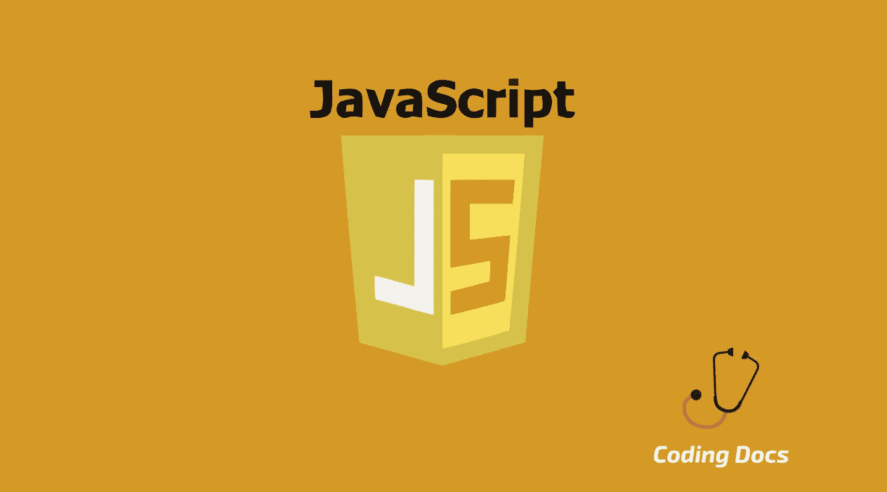
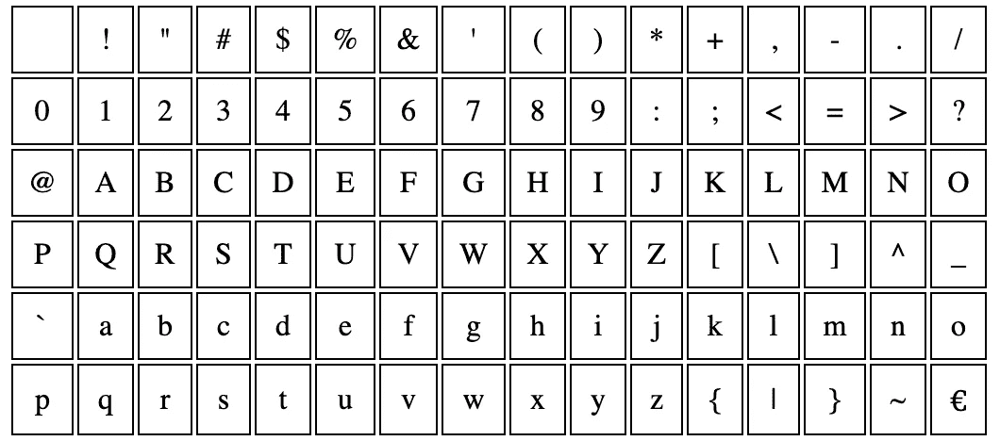

# 如何在 JavaScript 中对数组进行排序？

> 原文：<https://itnext.io/how-to-sort-an-array-in-javascript-f6cc7a26b34d?source=collection_archive---------1----------------------->



排序是编程中最重要的问题之一。无论你是初学者还是资深开发者，在考试或工作面试中都会面临排序算法。

幸运的是，在现实生活中，我们不需要从头开始实现任何排序算法。JavaScript 有自己的内置排序方法，在本文中，我们将介绍如何在 JavaScript 中对数组进行排序。

先说排序算法概念。

# 什么是排序算法？

根据维基百科；

> 在计算机科学中，排序算法是将列表中的元素按一定顺序排列的算法。最常用的顺序是数字顺序和字典顺序。

对于我们的具体情况，排序算法主要是通过改变数组中每个元素的位置，按照字母或数字顺序对数组元素进行排序。根据您的喜好，排序可以是升序或降序。

例如，我们有一个包含无序字母字符的数组:

```
let myAlphabeticArray = ['d', 'a', 'b', 'c'];
```

如果您喜欢按**升序**排序，正确的结果是:

```
['a', 'b', 'c', 'd']
```

如果您喜欢按**降序**排序，正确的结果是:

```
['d', 'c', 'b', 'a']
```

我们也可以对带有数字的无序数组做同样的事情:

```
let myNumericArray = [4,1,3,2]; 
```

如果你喜欢按**升序**排序，正确的结果是:

```
[1,2,3,4]
```

如果您喜欢按**降序**排序，正确的结果是:

```
[4,3,2,1]
```

小菜一碟！但是为了从头实现任何排序算法，您需要学习几种排序算法。

# 排序算法的类型

最常见的排序算法有

*   冒泡排序
*   选择排序
*   插入排序
*   合并排序
*   快速排序
*   堆排序

在本文中，我们不会涉及它们，但是你可以通过谷歌搜索很容易地找到这些算法。

为了根据您的编程语言偏好正确地应用这些算法，您应该知道如何在该特定语言中处理数组。

对于我们的例子，我们使用 JavaScript，如果你不太了解 JavaScript 数组，请随意阅读我们关于 [JavaScript 数组](https://www.codingdocs.com/an-introduction-to-javascript-arrays/)的其他帖子。

多亏了 JavaScript，我们已经有了预定义的数组排序方法。

# JavaScript 数组排序方法

无论何时定义一个数组，它都会有一个公共可访问的 **sort()** 和 **reverse()** 方法，就像任何公共方法一样，这些方法可以通过带有点符号的数组变量来调用。

我们来看看这些方法。

# sort()方法

如果要对数组进行升序排序，应该使用 sort()方法:

```
let myAlphabeticArray = ['d', 'a', 'b', 'c'];
myAlphabeticArray.sort(); // output is ['a', 'b', 'c', 'd']
```

# reverse()方法

如果你想按降序排列你的数组，你可以使用相反的方法。

```
myAlhabeticArray.reverse(); // output is ['d', 'c', 'b', 'a']
```

> 在 JavaScript 中，数组是可变的，sort()和 reverse()方法也是以可变的方式实现的。这就是为什么通过运行这些方法，数组内容将被改变，你将失去你的数组先前的状态。

您还可以在一个数值数组上测试这些 sort()和 reverse()方法，对于我们的示例，您可以获得如下结果:

```
let myNumericArray = [4, 1, 3, 2];
myNumericArray.sort();     // output is [1, 2, 3, 4]
myNumericArray.reverse();  // output is [4, 3, 2, 1]
```

> 但是有一个大大的**警告！**
> 
> 如果你认为我们也可以在数值数组上安全地使用这些方法，你就有大麻烦了。

因为默认情况下，这些排序和反转方法按字母顺序比较和排序每个数组元素。即使你的数组有数值，也没关系，它自动将所有数组元素表现为字符串值。

# 按字母顺序排列数组(默认行为)

例如，这次你有一个不同的数字数组，我们使用相同的方法对它进行排序。

```
let myWillNotWorkExpectedlyArray = [3, 10, 1, 20];myWillNotWorkExpectedlyArray.sort(); 
// output is [1, 10, 20, 3]myWillNotWorkExpectedlyArray.reverse(); 
// output is [3, 20, 10, 1]
```

你会得到这些奇怪的排列。

此外，您可以尝试另一种混合阵列:

```
let myAnotherWillNotWorkExpectedlyArray = ['a', 'A', 1, '!'];myAnotherWillNotWorkExpectedlyArray.sort() 
// output is ['!', 1, 'A', 'a'];myAnotherWillNotWorkExpectedlyArray.reverse() 
// output is [‘a’, ‘A’, 1, ’!’];
```

第一眼看上去，这个结果也不会有一个合理的解释。

为什么？

因为正如我之前提到的，默认情况下，sort()和 reverse()方法按字母顺序比较数组元素，不管数组元素是数字还是字符串。

但是这种字母比较实际上是一种字符串比较，它是根据它们的 **Unicode** 码来排序的。

Unicode 是计算行业中处理字符的编码标准。你可以从 https://en.wikipedia.org/wiki/List_of_Unicode_characters 的[那里得到这个 Unicode 字符代码列表。](https://en.wikipedia.org/wiki/List_of_Unicode_characters)

为了了解这些字符的顺序，让我们看看下图中常用字符的 Unicode 编码顺序。



字符顺序是从左上角开始，从左到右一直延续到右上角。

根据这个 Unicode 顺序表，我们可以对这个字母排序行为进行一些推断，如下所示:

1.  与字母字符相比，数字总是具有第一顺序。
2.  与大写字母字符相比，小写字母字符总是具有最后的顺序。

对于其他非字母数字字符，您需要检查 Unicode 顺序表，因为有些符号位于数字字符之前、大写和小写字母字符之间或者列表的最后。

好了，现在我们知道了 JavaScipt 中排序方法的默认行为，但是对数值数组排序呢？

# 数字排序数组

为了对数组进行数字排序，我们只需要向 sort()或 reverse()方法传递一个参数。

这个参数需要是一个只比较两个元素的函数。由于这一点，我们可以覆盖 sort()和 reverse()方法的默认比较逻辑。

在我们的例子中，我们希望这个逻辑是一个数字比较，但是不要忘记我们也可以应用一个定制的比较逻辑。

让我告诉你这个比较函数的一般实现。

1.  该函数应该有两个参数。
2.  如果你认为第一个参数应该在第二个参数之前返回一个负数。
3.  如果你认为第一个参数应该在第二个参数之后，返回一个大于零的正数。
4.  如果你认为两个参数相等或者没有必要采取任何行动，只需返回数字 0。

对于数字比较，我们只需要比较两个数字。如果我们基于上面的算法精确地实现这个函数，这个函数将是:

```
function numberComparator(firstNumber, secondNumber) { if(firstNumber < secondNumber) return -1;
  else if(firstNumber > secondNumber) return 1;
  else return 0;}
```

但是具有相同逻辑的较短实现可以是:

```
function numberComparator(firstNumber, secondNumber) { return firstNumber - secondNumber;}
```

现在，我们可以将自定义的比较函数传递给 sort()和 reverse()方法，如下所示:

```
let myWillWorkExpectedlyArray = [3, 10, 1, 20];myWillNotWorkExpectedlyArray.sort(numberComparator); 
// output is [1, 3, 10, 20]myWillNotWorkExpectedlyArray.reverse(numberComparator); 
// output is [20, 10, 3, 1]
```

正如您现在看到的，我们的 sort()和 reverse()方法可以正确地对数值数组进行排序。

通过传递我们的自定义比较器函数，我们覆盖了它的默认字母比较行为。

顺便说一句，在 ES6 JavaScript 中更清晰、更合适的实现应该是:

```
let myWillWorkExpectedlyArray = [3, 10, 1, 20];myWillWorkExpectedlyArray.sort((firstNumber, secondNumber) => firstNumber - secondNumber); 
// output is [1, 3, 10, 20]myWillWorkExpectedlyArray.reverse((firstNumber, secondNumber) => firstNumber - secondNumber); 
// output is [20, 10, 3, 1]
```

现在我们知道了如何对字母或数字数组元素进行排序，但是您可能想知道在调用 sort()和 reverse()方法时使用了哪种排序算法。

# JavaScript 中使用哪种排序算法？

您可能已经知道 JavaScript 可以在许多不同的环境中运行，如客户端或服务器端。此外，这些环境可以有不同的 JavaScript 引擎，像 **V8** 、 **Chakra** 、 **SpiderMonkey** 是唯一流行的。

*   **V8** 大多用于谷歌 Chrome 和 Node.js。
*   **Chakra** 是微软的产品，用于微软 Edge。
*   **SpiderMonkey** 是火狐浏览器使用的 JavaScript 引擎。

每个引擎都有自己的架构和 JavaScript 解释逻辑。因此，sort()和 reverse()方法在不同的平台上没有使用共同的排序算法。

但根据各种资源，他们大多使用插入排序，选择排序，合并排序，或根据数组大小交替快速排序。

# 结论

我希望现在您可以毫不犹豫地使用 sort()和 reverse()方法对数字或字母数组进行排序。

如果你有任何问题，请不要犹豫与我联系。新文章再见。