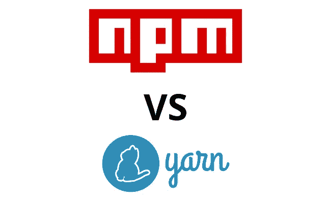
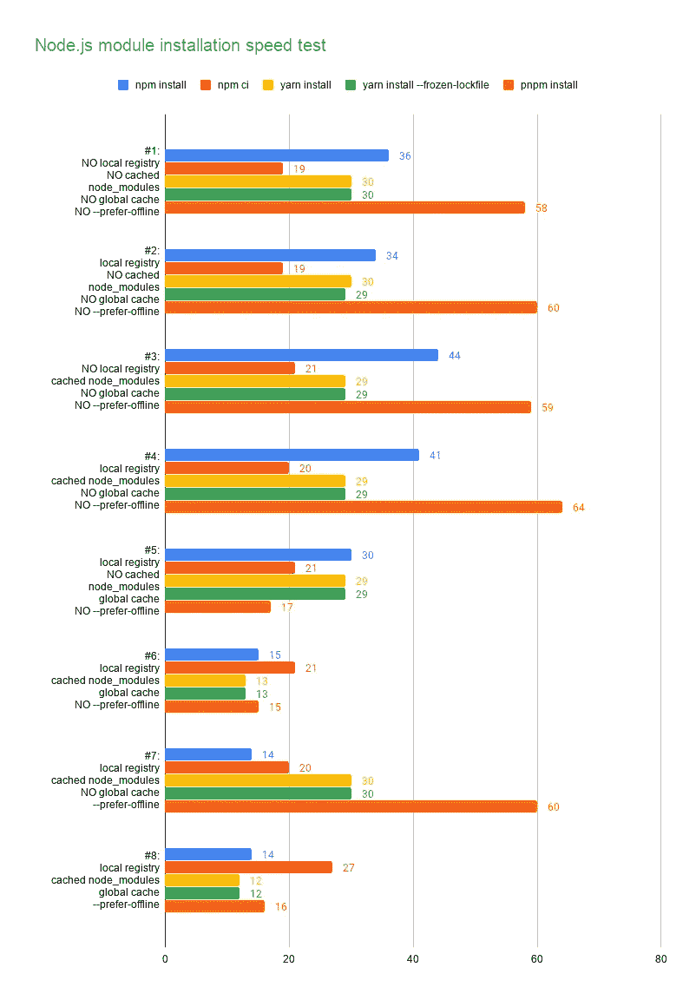

# 截至 2020 年，如何加快 CI/CD 管道中 Node.js 模块的安装

> 原文：<https://itnext.io/how-to-speed-up-node-js-modules-installation-in-ci-cd-pipeline-as-of-2020-4865d77c0eb7?source=collection_archive---------1----------------------->



> 2020/3/28 更新:添加`pnpm`

当您在项目中使用 Node.js 时，您需要注意 CI/CD 管道中的 node_modules 安装。你可以使用`npm install`、`npm ci`、`yarn install`和`pnpm install`，但是最快的方法是什么仍然是我们正在寻找答案的问题。在这个故事中，我想尝试所有我知道的可能性来找出最终的答案。

# TL；速度三角形定位法(dead reckoning)

如果你很着急，你必须做的是:

1.  禁用标准输出输出
2.  使用缓存的节点模块
3.  使用`--prefer-offline`
4.  使用全局缓存(仅适用于`yarn`

```
$ tar zxvf node_modules.tar.gz
$ npm install --prefer-offline &> /dev/null
```

如果你喜欢`yarn`

```
$ tar zxvf node_modules.tar.gz
$ tar zxvf cache.tar.gz
$ yarn install --prefer-offline --cache-folder ./cache &> /dev/null
```

如果你喜欢`pnpm`

```
$ tar zxvf cache.tar.gz
$ pnpm config set store-dir $PWD/cache
$ pnpm install &> /dev/null
```

> 与纯粹的`npm install`相比，总速度提高了约 3 倍

# 现有工程

这是正常的，有人已经这样做了，这里有一些现有的作品供您参考。

*   [https://github.com/appleboy/npm-vs-yarn](https://github.com/appleboy/npm-vs-yarn)
*   [https://winsmarts . com/NPM-install-speed-up-by-3-times-almost-25ad 416 cf 77 e](https://winsmarts.com/npm-install-speed-up-by-3-times-almost-25ad416cf77e)
*   [http://www . tier NOK . com/posts/2019/faster-NPM-installs-during-ci/](http://www.tiernok.com/posts/2019/faster-npm-installs-during-ci/)

# 环境

## 包装

为了防止任何缓存或意外行为，我在 docker 容器中运行实验，每次我们完成一个安装，我们都为下一个安装运行一个新的容器。

我使用的 docker 镜像是`node:12`，每个组件的版本是:

*   节点:v12.16.1
*   国家预防机制
*   纱线:1.22.0
*   pnpm: 4.12.1

## 网络

我对远程和本地注册中心( [verdaccio](https://verdaccio.org/) )场景进行了实验，以展示网络的影响。在本地注册表中，我假设用户做了如下事情:

```
$ npm install react@latest --registry [http://nvy-registry:4873](http://nvy-registry:4873)
# or
$ yarn add react@latest --registry http://nvy-registry:4873
```

这使得锁文件中的注册表 url 直接指向本地注册表。

## 应用

为了模拟真实世界的场景，我在一个使用`create-react-app`创建的 web 应用程序中进行了实验。

## 命令

我使用 5 个基本命令:

*   `npm install`
*   `npm ci`
*   `yarn install`
*   `yarn install --frozen-lockfile`
*   `pnpm install`

> `yarn install --frozen-lockfile`类似于`npm ci`

对于所有这些，我添加了`&> /dev/null`来删除 stdout 输出，执行时间是 3 次执行的平均值。(由于执行时间相当稳定，我相信 3 次就足够了)

让我们开始实验，看看我们会达到什么目的。😃

# 因素

我们将调整 4 个参数:

1.  本地注册表

有了本地注册表，你可以在网络带宽不够的时候防止过时。这是一个提高速度的好方法，但是当有人克隆了你的注册表却无法访问你使用的本地注册表时，这可能会很痛苦。

2.缓存的节点模块

一种加速安装的常用技术，通过压缩`node_modules`文件夹并在安装前解压缩，以消除再次从网络下载模块的需要。

3.全局缓存

npm 在`~/.npm`有全局缓存文件夹，yarn 在`~/.yarn`有全局缓存文件夹，通过提前添加全局缓存，想知道有没有可能加速。

4.`--prefer-offline`

详情:[https://docs.npmjs.com/misc/config#prefer-offline](https://docs.npmjs.com/misc/config#prefer-offline)

> 如果为 true，将绕过对缓存数据的过时检查，但将从服务器请求缺失的数据。要强制完全离线模式，使用`***--offline***`。

通过这个选项，我们可以防止 npm 或 yarn 检查远程数据并直接使用本地缓存。

# 实验

以下是所有配置的结果:



> 该数字是完成模块安装的秒数

# 观察

*   永远记住用`&> /dev/null`关闭安装的输出，因为 stdout 非常耗时
*   虽然本地注册表可以保证下载模块的稳定性，但不建议修改锁文件来获得这一好处，因为副作用是巨大的。
*   `npm ci`的速度在不同配置下都很稳定，但是`npm install`可以用`--prefer-offline`更快。
*   `yarn install`和`yarn install --frozen-lockfile`的速度根本没有区别。
*   全局缓存对`yarn`更有用
*   `pnpm`的效率高度依赖全局缓存，如果没有缓存，由于缓存预处理开销，它的速度比其他的要慢

对于这个实验的源代码可以在这个资源库中找到:[https://github.com/jeromewu/npm-vs-yarn-in-cicd](https://github.com/jeromewu/npm-vs-yarn-in-cicd)

希望它对你有所帮助，如果你有任何想法可以进一步加快速度，请随时在资源库中留下回复或创建问题。😄