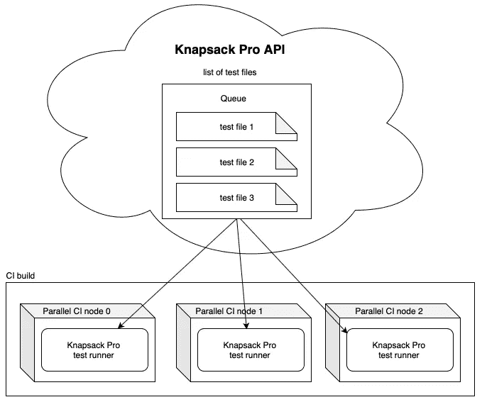

# 如何用 CI 并行化加速 Ruby 和 JavaScript 测试

> 原文：<https://itnext.io/how-to-speed-up-ruby-and-javascript-tests-with-ci-parallelisation-a2324a62022a?source=collection_archive---------3----------------------->

当您在处理一个更大的项目时，您可能会被日益增长的测试集的问题所困扰，随着时间的推移，这些测试在您的持续集成(CI)服务器上的执行速度开始变慢。我在 Ruby on Rails 的一个项目中遇到了这个问题，在 CircleCI 上的 RSpec 测试花了大约 15 分钟。

由于这个问题困扰着我，我决定对此做些什么，这导致了构建一个开源的背包 Ruby gem 库(名字来源于背包问题)，它处理并行 CI 服务器之间的分布式测试。在本文中，您将**了解在并行持续集成服务器上分割测试的两种方法——静态和动态**。

如果您的项目中有一个测试套件需要在 CI 服务器上执行十几分钟，或者甚至几个小时，您就会知道这对程序员来说有多不方便。当您在开发一些新特性并将一个新的 git 提交推入存储库时，您必须等待 CI 服务器很长时间，直到它执行 CI 构建。

等待几分钟或一小时会延迟您从 CI 服务器获得的关于可能尚未完成的测试的反馈(红色测试)。毕竟，我们都希望尽快获得关于我们的 CI 构建是绿色还是红色的信息，以便程序员的工作不会受阻。

# 在 CI 服务器上运行并行测试的问题

为了加速 CI 构建的执行，您可以在 CI 服务器上使用并行性，即启动几个并行 CI 机器(CI 容器，例如 Docker 中的 CI 容器)，其中每个并行服务器将执行测试集的一部分。但是，有一个问题，即哪些测试应该在哪些服务器(CI 节点)上运行，以便它们的分布相当均匀，并且您不必等待成为瓶颈的 CI 节点。

下面您可以看到一个在 4 台 CI 服务器上测试的非最优分布的例子，其中第二台标有红色的服务器是一个瓶颈，因此等待整个 CI 构建完成的时间长达 20 分钟。

# 并行 CI 服务器上测试的最优分布

在理想的情况下，测试应该以这样的方式分布，即所有并行 CI 服务器在相似的时间结束操作。在接下来的部分中，我将展示如何实现这一点。

下面您可以看到一个测试最佳分布的示例，其中每台并行 CI 机器执行 10 分钟的测试，因此整个 CI 构建只持续了 10 分钟，而不是上一个示例中的 20 分钟。

# 以确定的方式静态拆分测试

确定如何在 CI 服务器上的并行机器之间划分测试以便每个服务器在相似的时间完成测试的一种方法是使用测试套件中文件的测量运行时间。这是我在背包 Ruby gem 中实现的第一种方法。

在测量测试执行时间之后，我们可以在并行 CI 服务器之间分配单独的测试文件，以确保 CI 构建没有瓶颈。

在背包库的帮助下，您可以在 Ruby 中运行许多测试运行程序的测试，例如 RSpec、Minitest、Cucumber、菠菜和芜菁。使用测试运行时，背包 gem 可以构建一个要在特定 CI 节点上执行的测试列表。

我通过测量每个 git 提交和分支的测试文件时间来改进这种划分测试的方式。在下面的视频中，我展示了如何在背包 Pro 中以确定的方式进行常规模式的静态测试分割。在下一节中，您将了解这种方法的一些边缘情况以及如何解决它。

# 测试的静态分割问题

在从用户那里收集信息时，我发现以静态方式分布测试并不总是一个好的解决方案。有时，一些测试有随机的执行时间，这取决于，例如，CI 服务器有多忙，或者测试由于软件错误、比平常更快退出工作等原因而没有通过。

例如，使用浏览器的测试在运行时会有波动(Ruby 中的 Capybara 测试或 JavaScript 中的 E2E 测试)。

这个问题还会随着您使用的 CI 服务器而增加。每台并行 CI 机器是否具有相似的性能，或者是否共享 CPU 或 RAM 等资源？CI 容器是否在共享环境中运行？如果 CI 节点过载，那么我们的测试当然会变慢。

除此之外，还会有所有并行机启动时间是否相近的问题。如果您购买了一个并行 CI 服务器池，其他人可能也在使用它，例如，当前项目的另一个 CI 构建或您组织的另一个项目。

如果不是所有 CI 节点都同时启动，或者在 CI 节点执行过程中某些步骤的引导时间可能是随机的，那么我们希望能够确保所有 CI 机器在相似的时刻完成它们的工作。慢的 CI 机器或那些晚开始工作的机器应该做更少的测试，而那些早开始工作的机器可以很容易地做更多的测试。

所有并行 CI 节点必须在相似的时间停止工作，以避免瓶颈，即测试使机器过载。

# 动态测试拆分

上述问题的解决方案是在一个 CI 构建中的并行机器之间动态划分测试。这是我近年来一直在解决的问题，创建了[backpack Pro](https://knapsackpro.com/?utm_source=medium&utm_medium=blog&utm_campaign=how-to-speed-up-ruby-and-javascript-tests-with-ci-parallelisation)库和 Ruby 和 JavaScript 的队列模式，支持 Jest 或 Cypress 等几个流行的测试运行程序。

这个想法很简单。我们有一组在背包 Pro 服务器上排队的测试。单个并行 CI 机器使用背包 Pro API 消耗队列，直到队列结束。由于这一点，测试在 CI 服务器之间得到了最佳分布，帮助您避免过载(太慢)CI 服务器形式的瓶颈。下面你可以看到一个例子:

动态测试套件分割解决了我们在随机测试执行时间、运行缓慢的 CI 服务器或工作速度较慢的过载服务器方面的问题。无论他们何时开始或结束工作，重要的是他们在完成当前工作之前不要进行太多的测试。

了解动态测试套件分割如何在 backpack Pro 的队列模式下工作。

# 用 Ruby 和 JavaScript 实现背包 Pro

[背包 Pro](https://knapsackpro.com/?utm_source=medium&utm_medium=blog&utm_campaign=how-to-speed-up-ruby-and-javascript-tests-with-ci-parallelisation) 对很多流行的 CI 服务器有原生支持。它还是一个不可知的 CI 工具，因此您可以使用任何 CI 服务器。您所要做的就是为在一个 CI 构建中运行的每个并行 CI 服务器配置 backpackage Pro 命令。下面您可以看到一个配置 YAML 如何使用 backpack Pro 查找配置项服务器的一般示例:

# 结论

[backpack Pro](https://knapsackpro.com/?utm_source=medium&utm_medium=blog&utm_campaign=how-to-speed-up-ruby-and-javascript-tests-with-ci-parallelisation)支持 Ruby 和 Jest、Cypress 等几个 JavaScript 测试程序，但也有计划增加对更多测试程序和编程语言的支持。我很想听听[你们用什么来测试应用程序以及哪些 CI 服务器](https://docs.google.com/forms/d/e/1FAIpQLSe7Z6k__VczmRMmXykjA5i2MVEA3nEJ90gbiIeCRjecWhPOig/viewform?hl=en)。你可以在 [LinkedIn](https://www.linkedin.com/in/arturtrzop/) 上联系我，你可以在[KnapsackPro.com](https://knapsackpro.com/?utm_source=medium&utm_medium=blog&utm_campaign=how-to-speed-up-ruby-and-javascript-tests-with-ci-parallelisation)上找到关于所述解决方案的更多信息。我希望这篇文章对你有用。:)

*原载于 2020 年 2 月 2 日 https://docs.knapsackpro.com***。**