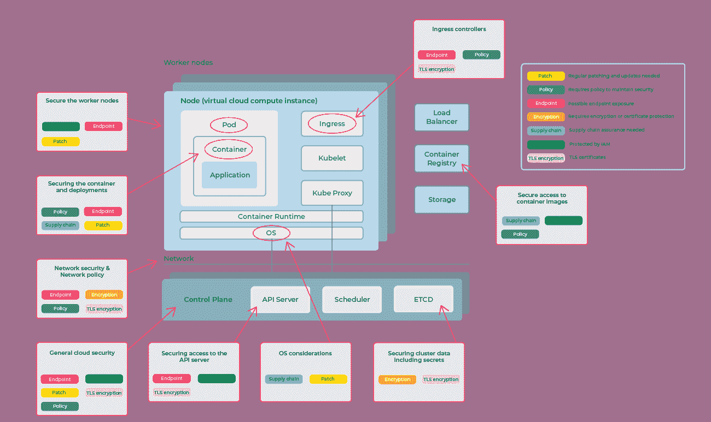
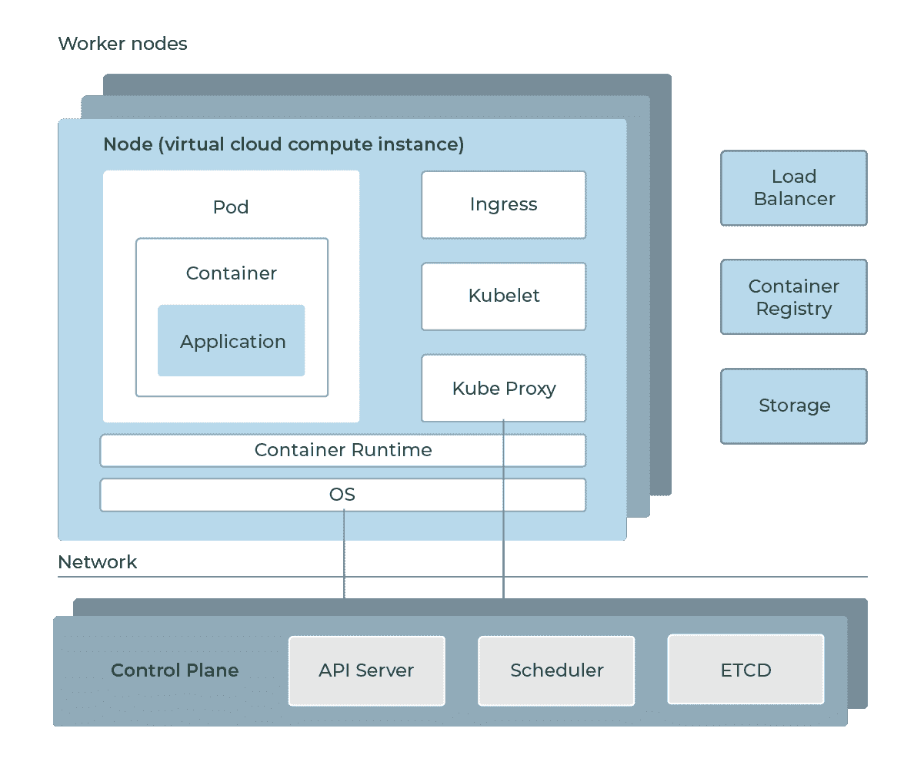
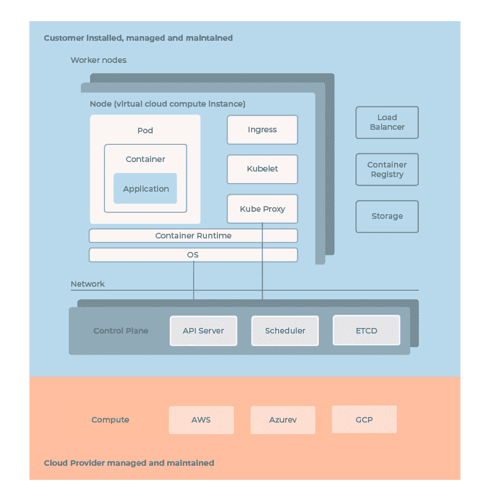
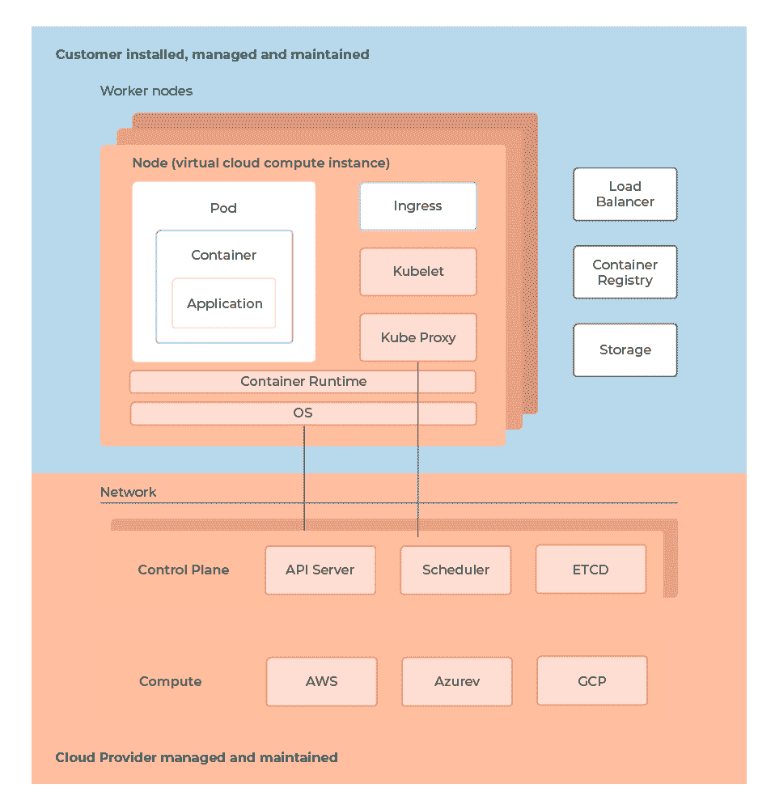
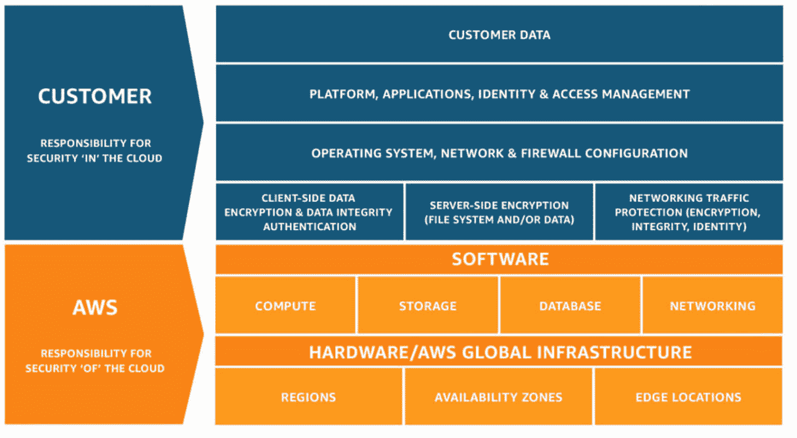
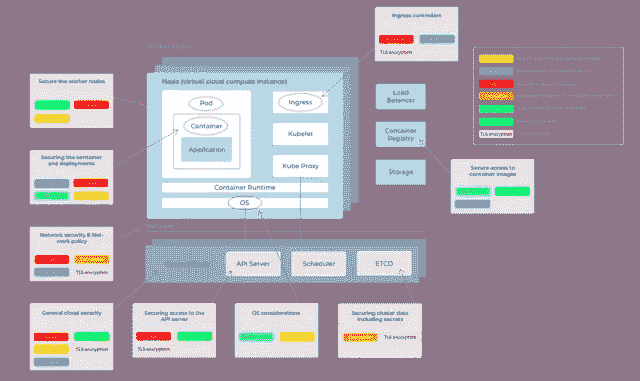
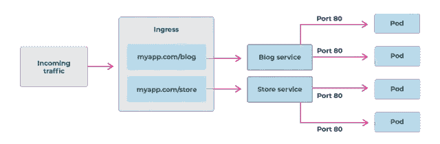
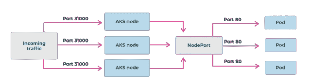
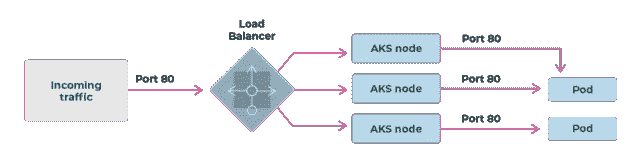

# 如何发现您的公共云 Kubernetes 安全状况中的差距

> 原文：<https://itnext.io/how-to-spot-gaps-in-your-public-cloud-kubernetes-security-posture-b9cd375f1b25?source=collection_archive---------1----------------------->

Kubernetes 的安全问题

特斯拉被黑是因为他们的 Kubernetes 管理控制台没有密码保护。在另一个事件中，Capital One 的 AWS 防火墙定义过于宽松，导致 30GB 的信贷申请数据(影响 1.06 亿客户)暴露。除了实现 Kubernetes 本身，最重要的考虑是安全性。

## 大约 60%的 Kubernetes 安全漏洞是由于配置错误造成的

【2021 年 Kubernetes 安全状况

与任何其他技术领域相比，公共云总是有能力引入看不见的漏洞，特别是通过影子 IT 以及开发团队和最终用户可以使用的服务的便利性。

## **您真的知道您的组织是否正在使用或计划使用公有云 Kubernetes** 吗？

您了解这对于保护组织的应用程序和数据意味着什么吗？

上图是文章“**如何发现您的公共云 Kubernetes 安全态势中的差距”**的前提，该文章旨在展示您需要考虑的一些领域，这是一个永无止境的挑战。尤其是在面对迟钝且普遍存在的范式转换技术时，因为它将是普遍存在的，而且如果您还没有掌握理解您想要采取的安全态势所需的关于攻击媒介和漏洞图的高级信息。

如果你已经了解 kubernetes 和容器，那么很好。您不需要成为容器和 kubernetes 方面的专家，但是理解基础知识对于能够确定在哪里集中精力是至关重要的。

库伯内特建筑

上面简化的 Kubernetes 架构是理解一些需要考虑的安全领域的基础。

看一下这些文章，从较高的层次理解这些技术，重点是 linux 容器和 Kubernetes。[https://www . app via . io/blog/understanding-common-kubernetes-terms](https://www.appvia.io/blog/understanding-common-kubernetes-terms)

[https://www.appvia.io/blog/what-is-kubernetes](https://www.appvia.io/blog/what-is-kubernetes)

[https://www.redhat.com/en/topics/containers](https://www.redhat.com/en/topics/containers)

## **公有云 Kubernetes v Kubernetes 发行版**

Kubernetes 可以在任何地方使用，公共云、私有数据中心、edge 等。然而，当我们想要在公共云中使用 Kubernetes 时，我们需要进行区分。我们可以选择以两种方式使用 Kubernetes。

## **云管理或自我管理的 Kubernetes**

有了自我管理的 Kubernetes 平台，我们可以使用开源的 Kubernetes 项目作为起点，或者采用第三方 Kubernetes 发行版，如 Red Hat 的 OpenShift 或 VMWare 的 Tanzu，并部署到公共云。或者，我们可以利用**公共云的本地 Kubernetes 服务**。

## **有什么区别？**

Opensource、OpenShift 和 Tanzu 为您提供了构建和管理 Kubernetes 集群的最终控制权，由您来安装、管理和维护构成 Kubernetes 的平台和基础设施中的所有组件。您负责管理计算(服务器)、控制平面(运行 Kubernetes 集群所需的核心服务)、网络和存储。

云上自我管理的 Kubernetes

第二个选择是使用公共云 Kubernetes 服务。最大的区别是，云提供商将管理和运行 Kubernetes 基础设施，而您只需要使用 Kubernetes 来部署和运行您的容器工作负载。

公共云托管的 Kubernetes 服务

> ***安全性和合规性被视为公共云中的共同责任***

在使用 AKS/EKS/GKE 这样的托管服务时，安全性和合规性被视为共同的责任。一般来说，云提供商负责“云”的安全性，而您负责“云中”的安全性。

公共云提供商负责管理 Kubernetes 控制平面。这包括 Kubernetes masters、ETCD 数据库以及提供安全可靠服务所需的其他基础设施。作为公共云 Kubernetes 服务的消费者，您在很大程度上负责其他一切，例如 IAM、pod 安全、运行时安全、网络安全等等。

[AWS 共享责任模式](https://aws.amazon.com/compliance/shared-responsibility-model/)

在这里看看一篇关于共担责任的很棒的文章:[https://www . app via . io/blog/shared-respons ibility-model-cloud-security](https://www.appvia.io/blog/shared-responsibility-model-cloud-security)

# 第 2 部分—分解在考虑公共云 Kubernetes 的安全性时应该注意的核心领域

# API 服务器

API 服务器

API 服务器提供了专门用于管理 Kubernetes 集群的入口点。API 服务器端点通过公共云 IAM 和 RBAC Kubernetes 得到保护，但是，如果配置不正确，它**对互联网**开放，因此会成为攻击媒介。

*   *通过使用私有集群或 IP 白名单和黑名单来保护 API 服务器端点。*
*   *通过有效的 IAM 控制保护对 API 服务器的访问。*
*   *在集群 RBAC 控制中定义有效的职责分离。*

## **微软 AKS**

通过 Azure AD IAM 控件保护 API 服务器。

*   *使用 IP 白名单限制。*
*   [*集群安全最佳实践和*](https://cloud.google.com/kubernetes-engine/docs/how-to/hardening-your-cluster) [*升级*](https://cloud.google.com/kubernetes-engine/docs/how-to/hardening-your-cluster)

## **谷歌 GKE**

*   *通过私有集群保护 API 服务器。*
*   *禁用公共端点。*
*   *使用 IP 白名单限制。*
*   [*强化集群的安全性*](https://cloud.google.com/kubernetes-engine/docs/how-to/hardening-your-cluster)

## **亚马逊 EKS**

*   *通过私有集群保护 API 服务器。*
*   *禁用公共端点。*
*   [*集群端点访问控制*](https://docs.aws.amazon.com/eks/latest/userguide/cluster-endpoint.html)

# ETCD

ETCD 是一个分布式数据存储，其中包含集群数据，包括 Kubernetes secrets，这是一种机制，通过它可以将用户证书、密码或 API 密钥等敏感数据提供给容器。

AK、EKS 和 GKE 都为 ETCD 提供静态加密来保护存储的信息，然而，Kubernetes 的秘密在默认情况下只进行 base64 编码(明文)。

*   *Kubernetes 的秘密对同一名称空间内的* ***所有 pod****可用。*
*   *默认情况下，密码将以明文形式(base 64 编码)装入 pod。*
*   *通过加密秘密和轮换证书来保护敏感信息*
*   *使用公共云加密服务(例如 AWS KMS、Azure Key Vault)。*
*   *使用第三方机密管理工具(例如 Hashicorp Vault)。*

## **谷歌 GKE**

*   *静态加密的秘密(默认)。*
*   *建议使用第三方保险库或应用级机密加密。*
*   [*在应用层加密秘密*](https://cloud.google.com/kubernetes-engine/docs/how-to/encrypting-secrets)

## **微软 AKS**

*   *机密在静态时加密(默认)。*
*   *推荐 Azure Key Vault。*
*   [*pod 安全的最佳实践*](https://docs.microsoft.com/en-us/azure/aks/developer-best-practices-pod-security)

## **亚马逊 EKS**

*   *静态加密的秘密(取决于 ETCD 存储，需要配置)。*
*   *可配置秘密审计(当秘密被推送到云监控时)。*
*   [*数据加密和机密管理*](https://aws.github.io/aws-eks-best-practices/security/docs/data/)

# 网络

# 控制平面网络/工人网络

通常，公共云 Kubernetes 中的控制平面运行在独立于工作节点(运行应用程序的地方)的网络中。作为服务的消费者，您无法访问由云提供商管理和保护的控制平面网络。

保护集群时，必须考虑两个网络之间的接入点。提供商有不同的机制来缩小安全差距:

## **微软 AKS**

*   *AKS 为工作节点的公共和私有端点提供与控制平面通信的能力。当使用公共端点或私有接口来保持 VPN 内的通信时，AKS 还提供 IP 和 CIDR 地址白名单和黑名单。*
*   *使用网络安全组。*
*   [*应用和集群的安全概念*](https://docs.microsoft.com/en-us/azure/aks/concepts-security#network-security)

## **亚马逊 EKS**

*   *使用* [*AWS VPC 安全组*](https://docs.aws.amazon.com/vpc/latest/userguide/VPC_SecurityGroups.html) *来控制 Kubernetes 控制平面和集群的工作节点之间的流量。*
*   [*网络安全*](https://aws.github.io/aws-eks-best-practices/security/docs/network/)

## ***谷歌 GKE***

*   *添加* [*授权网络*](https://cloud.google.com/kubernetes-engine/docs/how-to/authorized-networks) *，使用 IP 地址白名单。*

# pod 网络的网络策略

默认情况下，Kubernetes 集群中的所有 pod 可以自由地与其他 pod 通信。这带来了来自集群内运行的应用程序的内部攻击的巨大威胁。

应该通过集群中存在的网络安全结构来缓解这些威胁。网络策略是 Kubernetes 资源，用于控制 pod 和/或网络端点之间的流量，以及控制 pod 和名称空间之间的数据进出。

## **微软 AKS**

*   *建议使用 Calico 网络提供商来启用网络策略。*
*   [*网络安全*](https://docs.microsoft.com/en-us/azure/aks/concepts-security#network-security)

## **亚马逊 EKS**

*   *建议使用 Calico 网络提供商来启用网络策略。*
*   [*网络安全*](https://aws.github.io/aws-eks-best-practices/security/docs/network/)

## **谷歌 GKE**

*   *使用 GKE 数据面板 V2 时，网络策略自动启用。*
*   [*用网络策略限制 pod 之间的流量*](https://cloud.google.com/kubernetes-engine/docs/how-to/hardening-your-cluster#restrict_with_network_policy)

# 虚拟机(节点)、操作系统和容器运行时

Kubernetes 集群中的应用程序运行在称为节点的虚拟服务器的容器中。该节点拥有主机操作系统和容器运行时(运行容器)。这两个组件都需要在您的 Kubernetes 安全态势中加以关注，因为主机中的漏洞会危及您在那里运行的一切，包括 Kubernetes 和其中的工作负载。

公共云提供商在缓解这一级别的安全漏洞方面做了大量工作，包括针对主机操作系统运行 CIS 基准测试，以及定期修补和更新。但是，作为最终用户，您仍然有责任确保您采用了云补丁和升级。

## **微软 AKS**

*   *使用针对 Linux 或 Windows 2019 优化的 Ubuntu(受管节点)。*
*   *默认为 Containerd，Docker 为选项。*
*   [*节点安全*](https://docs.microsoft.com/en-us/azure/aks/concepts-security#node-security)

## **亚马逊 EKS**

*   *受管节点或自管节点有不同的安全考虑—查看文档。*
*   *EKS 1.23 中的默认容器。*
*   [*EKS 节点*](https://docs.aws.amazon.com/eks/latest/userguide/eks-compute.html)

## **谷歌 GKE**

*   *使用屏蔽 GKE 节点。*
*   *默认为 Containerd。*
*   [*集装箱节点选择*](https://cloud.google.com/kubernetes-engine/docs/how-to/hardening-your-cluster#container_node_choices)

# 操作系统

公共云 Kubernetes 服务在创建集群时允许各种各样的节点选项，从 Windows 到 Linux 主机，以及容器运行时优化的操作系统。为您的节点选择正确的操作系统包括了解持续的安全修补策略。

> **“了解公共云修补策略的差异”**

## 修补和更新

不同的云提供商有不同的方法来修补和更新其产品中的操作系统和容器运行时。

一般来说，如果您使用“自我管理”的虚拟机作为主机，那么您需要负责修补和升级。如果您使用提供商管理的虚拟机，则会自动应用部分或全部修补和升级流程。

您可以做几件事情来强化自己提供的节点映像，比如删除包管理器、拥有只读文件系统等等。最好的指导是与操作系统提供商一起加强映像。

## **微软 AKS**

*   *微软安全策略每晚自动向所有节点应用操作系统补丁，但是，需要节点重启的补丁不会强制节点重启，必须手动处理。*
*   *补丁映像每周提供一次，没有新补丁的自动警报，但 Azure 服务健康可用于识别新的安全补丁版本:* [*微软服务健康概述*](https://docs.microsoft.com/en-us/azure/service-health/service-health-overview)
*   [*对 Linux 节点应用安全和内核更新*](https://docs.microsoft.com/en-us/azure/aks/node-updates-kured)

## **亚马逊 EKS**

*   *AWS 为您提供了打了补丁的 AMI 版本，您必须通过升级集群中的节点组来手动应用这些版本。*
*   *由自动化流程处理的自动化节点更新(扩展、清空和更新)流程。*
*   *没有自动补丁通知，但是补丁发布会发布到* [*rss 订阅频道*](https://github.com/awslabs/amazon-eks-ami/releases.atom)
*   [*托管节点更新行为*](https://docs.aws.amazon.com/eks/latest/userguide/managed-node-update-behavior.html)
*   [*更新被管节点组*](https://docs.aws.amazon.com/eks/latest/userguide/update-managed-node-group.html)
*   [*AWS bottle rocket*](https://aws.amazon.com/bottlerocket/)*(专为运行最小操作系统的容器而创建，因此攻击向量更小)是更安全节点的一个选项。*

## **谷歌 GKE**

*   *提供用于应用补丁或升级的更新节点映像。客户可以订阅更新频道以自动将节点升级到最新版本，也可以手动申请。*
*   *GKE 向发布/订阅渠道发布升级通知:* [*自动升级节点*](https://cloud.google.com/kubernetes-engine/docs/how-to/node-auto-upgrades)
*   [*安全补丁*](https://cloud.google.com/kubernetes-engine/docs/resources/security-patching)

> **安全是共同的责任】**

在处理节点安全和修补工作时，共同责任是最重要的。您必须了解您的云提供商用于安全补丁和更新的方法，并确保有适当的流程来审查和应用正确的流程，以保持节点安全性最新。

# 工作量

# 保护容器和部署

容器和容器工作负载的安全性是一个很大的主题，有许多含义，不在本文的讨论范围之内。但是，您应该知道在保护系统和数据方面需要解决的问题。

要考虑的一个重要方面是供应链的安全。

# 集装箱特定安全性

保护容器工作负载始于容器如何与容器运行时接口，从而与底层工作节点和网络接口。容器带来了许多安全问题，必须通过应用基于策略的保护来解决。

# 最小特权

必须创建应用程序容器，以仅公开执行容器角色所需的服务和组件。此外，必须制定策略来拒绝容器运行时交互的某些方面，例如:

*   不允许“特权容器”
*   特权容器可以进入 worker 节点的根，从而进入 Kubernetes 集群的任何部分。
*   限制用户 id
*   限制容器内正在执行的流程的用户(userid ),例如，不允许 root 用户执行容器内的流程。
*   限制网络、文件系统和命名空间访问
*   容器不应该具有访问主机文件系统或网络的能力。

上面的列表只是一个选择，它给出了容器安全的重要性以及需要创建策略来保护和保障的地方。

Kubernetes 在 1.21 中弃用了 Pod 安全策略，并将在 1.25 中完全删除(2022 年 4 月)。Pod 安全策略是用于定义上述 pod 和 OS 级安全限制策略的核心功能。请注意您现有的解决方案是否利用了这一点。看看这些博客，了解更多关于这背后的基本原理和替代工具的信息:
[PodSecurityPolicy 已死。万岁…？](https://www.appvia.io/blog/podsecuritypolicy-is-dead-long-live)

[版本化政策代码](https://www.appvia.io/blog/policy-as-versioned-code)

[如何使用安全配置文件操作符](https://www.appvia.io/blog/how-to-use-the-security-profiles-operator)

## 集装箱供应链

容器无处不在所催生的一个领域是软件供应链安全。容器打包格式的一个特征是允许软件被分解成“层”,这些层可能来自其他来源，例如第三方软件提供商。分层软件方法在识别软件“层”中包含什么以及应用了什么安全控制缓解措施方面提出了挑战。

此外，基本容器映像可能来自公共存储库，其中软件层的内容未知，很有可能嵌入恶意软件。

在您的软件交付过程中必须小心谨慎，以确保开发中使用的**容器映像来自可信来源，并且已经过映像扫描**，以确保容器中使用的软件版本具有最新的补丁和已识别的易受攻击的映像层。

要考虑的一个重要方面是内部容器构建标识。作为标签的版本号有利于识别，但不足以确保容器中的内容就是您所期望的。看看如何使用 SHA 校验和来确保映像与预期的一样。此外，看看图像签名，它可以让您更加确信图像与签名时完全相同。

供应链问题将在本博客中进一步讨论:

[教程:用 cosign](https://www.appvia.io/blog/tutorial-keyless-sign-and-verify-your-container-images) 无钥匙签名并验证你的容器图像

# 应用程序对集群的访问

需要公开公共端点的公共云 Kubernetes 应用程序有几种选择。通常这些分为三个方面:

*   *入口*
*   *节点端口*
*   *负载平衡器*

# Kubernetes 入口

Kubernetes 入口配置有两个对象:入口控制器和入口对象。

入口控制器是一个软件，它为 Kubernetes 服务提供反向代理、可配置的流量路由和 TLS 终端。Kubernetes 入口资源用于为各个 Kubernetes 服务配置入口规则和路由。使用入口控制器和入口规则，可以使用单个 IP 地址将流量路由到 Kubernetes 集群中的多个服务。

# 节点端口

在底层节点上创建端口映射，允许使用节点 IP 地址和端口直接访问应用程序。

# 负载平衡器

使用负载平衡器资源，该资源具有连接到所请求的 pod 的外部 IP 地址。为了允许客户的流量到达应用程序，在所需的端口上创建负载平衡规则。

# 安全是一项共同责任

公共云 Kubernetes 提供商通常将入口的安全问题交还给用户。由您来配置入口控制器、证书和策略，以确保从外部访问您的服务。应制定足够的策略和流程来识别可能造成安全威胁的错误配置的入口。

看看这篇关于 TLS 在 EKS 的入口的博文:

[教程:如何使用 DNS 和 TLS 在 EKS 上公开 Kubernetes 服务](https://www.appvia.io/blog/expose-kubernetes-service-eks-dns-tls)

# 集装箱登记处

默认情况下，Kubernetes 可以从任何目的地获取 Pod 规范中定义的容器图像，只要它可以从节点到达。这带来了用户(授权或未授权)可能意外或恶意指定从不可信来源运行的图像的风险，这可能对平台和相邻服务造成直接损害，导致数据泄漏，并增加托管和审计成本。

采用集群级映像策略控制可显著降低这种风险，并可通过使用自定义准入控制器(即 OpenPolicyAgent Gatekeeper)来实现。

做什么:

*   仅允许从受信任的存储库中提取图像。始终引用图像标签和摘要(例如，通过使用 [OPA 看门人](https://github.com/open-policy-agent/gatekeeper-library/tree/master/library/general/allowedrepos))。

看看下面这篇关于验证集装箱供应链的博客。Appvia Wayfinder 还实现了一个自定义准入控制器，该控制器提供可信存储库的策略实施:

[改善 Kubernetes 安全状况的 5 件事](https://www.appvia.io/blog/5-things-to-improve-your-kubernetes-security-posture)

# 摘要

希望这已经给出了在考虑将公共云 Kubernetes 作为交付应用程序的工具时，您需要了解的大多数安全领域的合理的高层次说明。我提到的每一个领域都有更详细的保护内容和保护方式，但是现在您应该对投入时间的范围有所了解。

Kubernetes 和 containers 是一组很棒的技术，可以用更简单、更标准化的方式构建可伸缩的应用程序。是的，它仍然很复杂，但是比构建过去的雪花基础设施和架构要简单得多。设计一个经过深思熟虑的安全态势需要您了解移动部件，因为任何这些部件的错误配置都可能导致您组织的数据易受攻击。

在 [Appvia.io](http://www.appvia.io) 这里，我们有专注于为公共云 Kubernetes 提供安全防护和基于策略的合规性的产品和服务。 [Appvia Wayfinder](https://www.appvia.io/wayfinder) 让您安心合规地解决您的安全问题。看一看我们的 so