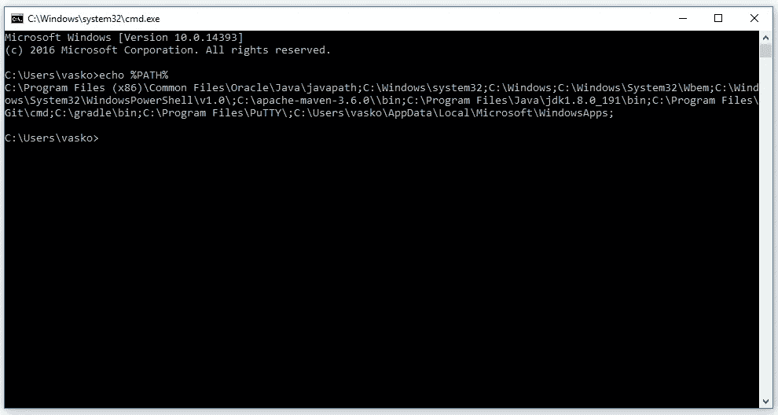

# 如何启动 Selenium WebDriver 浏览器

> 原文：<https://itnext.io/how-to-start-browser-for-selenium-webdriver-27e98bbbf13d?source=collection_archive---------1----------------------->


我想每个 QA 自动化工程师都熟悉控制台中的这条消息:

```
org.openqa.selenium.WebDriverException:The path to the driver executable must be set by the webdriver.chrome.driver system property;for more information, see [http://code.google.com/p/selenium/wiki/ChromeDriver.](http://code.google.com/p/selenium/wiki/ChromeDriver.)The latest version can be downloaded from [http://code.google.com/p/chromedriver/downloads/list](http://code.google.com/p/chromedriver/downloads/list)
```

我同意，这个问题简单地解决了:

```
System.setProperty(**"webdriver.chrome.driver"**, **"/path/to/driver"**);
```

但是，使用这种方法会遇到几个问题:

使用这种方法，你通常需要下载 chromedriver 并存储在 resources 文件夹中。但最大的问题是，如果我们在不同的平台上运行测试，我们需要创建一个不同的驱动程序工厂，并编写一堆额外的代码。

在这篇文章中，我将告诉你如何解决这个问题。以及 Selenium 如何寻找辅助可执行文件或垫片。

浏览器 chromedriver(Chrome)、geckodriver(Firefox)等所谓的 Selenium 驱动程序的辅助文件。

您将得到答案的主要问题是，您可以将这些辅助可执行文件放在哪里，以便 Selenium 可以找到它们。

当调用新的 DriverBrowser()构造函数时，它会找到代理文件并启动它。因此，对于您想要使用的每个浏览器，您需要下载一个可执行的帮助文件。装载后，有必要把它放在某个地方，以便硒可以找到它。

要解决这个问题，有 4 种方法:

1。放在任何地方，直接在程序代码中指定这个可执行文件的路径。Java 编程语言的客户端库提供了两个选项供选择:

*   设置系统属性 webdriver.chrome.driver

```
System.setProperty(**"webdriver.chrome.driver"**, **"/path/to/driver"**);
```

*   有必要构建一个驱动程序:

```
**webDriver** = **new** ChromeDriver(
        **new** ChromeDriverService.Builder()
                .usingDriverExecutable(**new** File(**"/path/to/driver"**)).build());
```

2。放入 PATH 环境变量中提到的目录。

PATH 环境变量类似 Unix 的操作系统、DOS、OS/2 和 Microsoft Windows，它是可执行文件所在的一组目录。基本上，每个正在运行的进程或用户会话都有自己的 path 变量。

要在 Windows 操作系统中找出该变量的内容，您需要调用以下命令:

**回声%路径%**

对于 Linux 操作系统:

**echo $PATH**

它将显示在 PATH 变量中注册的所有目录，并且可执行文件可以放在任何目录中。



Windows 可以放在 C:\Windows\system32 中，或者您可以创建自己的目录并将其包含在变量 PATH 中。

对于 Linux /usr/local/bin 或类似的文件，创建您自己的变量并将其包含在 PATH 变量中。另外，不要忘记这些文件应该被标记为可执行的。也就是说，应该设置一个标记特殊可执行文件的标志。

第二个地方，你可以把可执行文件的工作或当前目录。这是测试或自动化脚本运行时的当前目录。通常，这是您正在开发的项目的根目录。

可执行文件搜索引擎的逻辑如下:最初，它在当前目录中查找可执行文件，如果找不到该文件，则从 PATH 环境变量中指定的目录开始搜索。

3。在你的项目中使用一个自动化的库来管理代理文件，换句话说就是 webdrivermanager。

**WebDriverManager** 允许自动化管理二进制驱动程序(例如 chromedriver、geckodriver 等。)是 Selenium WebDriver 所需要的。

有了这个库，你可以为 Chrome、Firefox 或 InternetExplorer 解决一个相当普通的驱动管理问题。

如果你使用 Selenium WebDriver，你会知道，要使用 Chrome、Firefox、Opera、PhantomJS、Microsoft Edge 或 Internet Explorer 等一些浏览器，你需要下载一个允许 WebDriver 处理浏览器的二进制文件。在 Java 中，此二进制文件的路径必须设置为 JVM 属性，如下所示:

```
System.setProperty(**"webdriver.chrome.driver"**, **"/path/to/driver"**);
```

这很烦人，因为它迫使你将这个二进制文件直接链接到你的源代码中。此外，当二进制文件的新版本发布时，您必须手动检查。

WebDriverManager 来拯救您，以自动化的方式为您执行所有这些脏活累活。

要在 Maven 项目的测试中使用 WebDriverManager，您需要在 pom.xml 中添加以下依赖项(需要 Java 8 或更高版本):

```
<**dependency**>
    <**groupId**>io.github.bonigarcia</**groupId**>
    <**artifactId**>webdrivermanager</**artifactId**>
    <**version**>3.6.2</**version**>
</**dependency**>
```

或者在 Gradle 项目中:

```
**dependencies {
testCompile("io.github.bonigarcia:webdrivermanager:3.6.2")
}**
```

一旦我们包含了这个依赖项，您就可以让 WebDriverManager 为您管理 WebDriver 二进制文件。看看这个 JUnit 4 示例，它使用 Chrome 和 Selenium WebDriver(要将 WebDriverManager 与 JUnit 5 结合使用，强烈建议使用 Selenium-Jupiter 扩展):

```
**public class** Test {

    **private** WebDriver **driver**;

    @BeforeClass
    **public static void** setupClass() {
        WebDriverManager.*chromedriver*().setup();
    }

    @Before
    **public void** setupTest() {
        **driver** = **new** ChromeDriver();
    }

    @After
    **public void** teardown() {
        **if** (**driver** != **null**) {
            **driver**.quit();
        }
    }

    @Test
    **public void** test() {
        *// Your test code here* }

}
```

请注意，只需添加 WebDriverManager.chromedriver()。setup()；WebDriverManager 为您施展魔法:

1.它会检查您机器上安装的浏览器版本(如 Chrome、Firefox)。

2.它检查驱动程序的版本(例如 chromedriver、geckodriver)。如果未知，它使用最新版本的驱动程序。

3.如果 WebDriverManager 缓存中没有 WebDriver 二进制文件，它将下载该文件(默认情况下为～/. m2/repository/web driver)。

4.它导出 Selenium 所需的适当的 WebDriver Java 环境变量(从 CLI 或作为服务器使用 WebDriverManager 时不需要这样做)。

更多关于图书馆[的详细信息请点击此链接](https://github.com/bonigarcia/webdrivermanager)

4。 **硒栅或硒样。**

**Selenium-Grid** 允许您在不同的浏览器中，在不同的机器上并行运行测试。


一般来说，使用 Selenium Grid 有几个原因:

1)在不同的浏览器中，在不同的操作系统上运行测试；
2)减少总的试运行时间。

Selenium 网格由 Hub 和 Node 组成。

**Hub** 是接收请求并将其路由到节点的中心点。这样的指挥所。一个网格中只能有一个集线器。

**节点**是一个 Selenium 实例，它将运行加载到 Hub 中的命令。网格中的一个节点可以是很多。节点—可以在具有不同浏览器的不同操作系统上运行。

**让我们开始吧。:**

你需要在这个[链接](https://bit.ly/2TlkRyu)下下载 Selenium Server Standalone。

创建一个 seleniumgrid 文件夹，将下载的 selenium_server_x.xx 复制到 it.x.jar 文件中。

**启动集线器。**

在控制台中，您必须运行命令:

**Java-jar selenium _ server _ standalone _ _ x . xx . x . jar-角色中枢**

要检查一切是否正确启动，您需要在浏览器中键入:

[http://localhost:4444/grid/console](http://localhost:4444/grid/console)

**启动节点。**

在控制台中，您必须运行命令:

**对于火狐:**

Java-jar selenium-server-standalone-_ x . xx . x . jar-role web driver-hub[http://localhost:4444/grid/register](http://localhost:4444/grid/register)-port 5556-browser browser name = Firefox

Chrome 和 Internet Explorer 的设置略有不同。你需要添加各自浏览器的驱动的路径-dwebdriver . ie . driver = iedriverserver . exe 和-dwebdriver . chrome . driver = chrome driver . exe 你可以在 selenium.org 网站下载驱动

**对于 Chrome:**

Java-dwebdriver . chrome . driver = chrome driver . exe-jar selenium-server-standalone-_ x . xx . x . jar-role web driver-hub

[http://localhost:4444/grid/register](http://localhost:4444/grid/register)-端口 5558-浏览器 browserName=chrome

**对于 Internet Explorer:**

Java-dwebdriver . ie . driver = iedriver server . exe-jar selenium-server-standalone-_ x . xx . x . jar-role web driver-hub

[http://localhost:4444/grid/register](http://localhost:4444/grid/register)-端口 5558-浏览器 browserName=iexplorer

为了检查所有的配置是否正确，你需要打开所有相同的[http://localhost:4444/grid/console](http://localhost:4444/grid/console)并确保显示一个实例 IE 和一个 Chrome。

您可以使用 JSON 文件配置中心和节点:

**轮毂示例:**

Java-jar selenium-server-standalone . jar-role hub-hub config

**节点示例:**

Java-jar selenium-server-standalone . jar-role 节点-nodeConfig nodeconfig.json

**Selenoid** 是原 Selenium hub 代码的强大 Go 实现。它正在使用 Docker 推出浏览器。如果需要源代码，请参考 GitHub 资源库。


**月长石——主要优点**

*   快速安装
*   方便使用浏览器。
*   易于扩展。
*   方便的 UI 和日志记录。
*   队列和灵活的限制。

**月形设置:**

*   安装 Docker
*   下载配置管理器(12mb):
    $ wget–O cm
    [https://github . com/aero kube/cm/releases/download/1 . 6 . 1/cm _ Linux _ amd64](https://github.com/aerokube/cm/releases/download/1.2.3/cm_linux_amd64)
*   $ chmod +x cm
*   启动 Selenoid: $。/cm selenoid start — vnc
*   Selenoid 在标准的 selenium-4444 端口上运行

**Selenoid 浏览器维护:**

*   带有预配置浏览器的现成容器图像。
*   每个浏览器都在一个独立的容器中。
*   对于每个测试清洁浏览器，就像刚刚安装在操作系统。

**在 Selenium Grid 或 Selenoid 中运行测试的示例 Java 代码:**

```
DesiredCapabilities capability = DesiredCapabilities.*chrome*();
    **try** {
        **driver** = **new** RemoteWebDriver(**new** URL(**"URL for Seleniun Grid or selenoid"**), capability);
    } **catch** (MalformedURLException e) {
        LOG.info(**" "**);
    }
}
```

更多关于 Selenoid 的详细信息请点击[链接](https://aerokube.com/selenoid/)