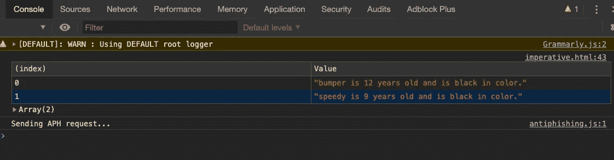

# 如何开始用 JavaScript 进行函数式思考

> 原文：<https://itnext.io/how-to-start-thinking-functionally-in-javascript-b7805e3b48e?source=collection_archive---------0----------------------->

Denys Nevozhai 在 [Unsplash](https://unsplash.com?utm_source=medium&utm_medium=referral) 上拍摄的照片

函数式编程是一种编程风格，它要求从业者在更抽象的层次上进行思考。一般来说，当我们学习如何编程时，我们以一种非常必要和程序化的方式来思考问题。首先，我们做这个，然后我们做那个，等等。

我们如此关注语法和语言规则，以至于提高抽象层次的想法没有进入思考过程。

这太糟糕了，因为后来当我们不再被语言规则和语法所消耗时，我们不得不重新训练我们的大脑以不同的方式思考。

函数式编程(酷孩子称之为 FP)可能需要一点时间来适应，但一旦你领会了其中的概念，它就会打开一个全新的世界。它还允许您开发更容易推理的代码。

***FP 允许你从命令式的编码风格转向更加声明式的风格。***

描述两者区别的一种流行方式是,*声明式编程关注的是* ***程序应该完成什么*** *而命令式编程关注的是* ***程序应该如何*** *实现结果。*

如果这一切都有点模糊，没关系。耐心等待，我们会一起解决的。

让我们看一个简单的 JavaScript 例子。

## 必要的方式

假设我们有一系列宠物。

数组的每个元素都是一个定义宠物的对象。

让我们假设业务需求声明我们使用这些标准来过滤对象:宠物年龄大于 7 岁并且有黑色的皮毛。

对于每个匹配的记录，我们需要生成以下格式的字符串:

***<宠物名>是<年龄>岁，是<色>色。***

现在我们知道了需要什么样的输出，我们如何得到它呢？

首先，让我们看看处理这个问题的必要方法。这是代码。

宝贝，一路走好！

在第 1 行，我们创建了一个新的数组来收集满足业务需求的结果。然后在第 2 行，我们创建了一个 for 循环。在循环的每次迭代中，我们在第 3 行获得宠物，并在第 4 行测试它的属性，看看它是否符合我们的标准。

如果测试成功，我们将一个新字符串推入 output array。

最后，我们在第 8 行调用 console.table()，将我们新创建的要打印的数组传递给控制台。

这是输出。

我们在控制台中过滤的记录

回顾源数据，我们可以看到我们的代码工作正常。只有两条记录符合我们的筛选标准。

这段代码没有错。这是可行的，但它绝对要求我们深入到杂草中，考虑每一个细节。我们明确地陈述了如何得到我们想要的东西的每一步。

有没有更好的办法？我也这么认为让我们来看看吧。

## 陈述的方式

如果我们停下来，从更高的层面思考我们想要做什么，我们会想到什么。用简单的英语我会说:

"我想根据一组标准过滤一个数组，并产生一个字符串作为输出."

我故意不考虑实现。我的想法是在问题上方 10000 英尺，而不是 10 英尺。

我这里跳出来的词是 ***滤镜******产生一串*** 。考虑到这一点，不如这样:

pets.filter()。地图()

以及实际的实现

声明版本 1

看起来舒服多了，不是吗？它读起来几乎像英语。这就是人们说 FP 是声明性的意思。我们在声明我们想要什么。当然，我们仍然需要提供过滤逻辑，但这是一个更好的解决方案，也更容易推理。我不必检查 for 循环的每一行来理解发生了什么。

我会更进一步。为了忠实于点规则(做一件事)，我将这段代码重构为。

声明版本 2

我将过滤器逻辑分解成两个独立的函数(记住:做一件事)以及创建字符串的逻辑。

然后，正如您在第 5 行看到的，这实际上只是一个链接。过滤器()和。map()函数，把我们的新函数作为参数传递给我们所需的输出。控制台中的输出完全相同。

更清晰的代码—相同的输出

## 关键要点

1.  函数式编程是一种编程风格，它要求在更抽象的层次上考虑你的问题。
2.  我们大多数人都是在过程化、命令式的水平上学习编程，所以当你刚刚开始时，进行转换可能会很困难。
3.  以函数式风格编写的代码通常更容易推理和阅读。
4.  功能代码可以更容易维护和修改。

## 资源

[查看口才 JavaScript](https://eloquentjavascript.net/Eloquent_JavaScript.pdf) 继续你的免费 FP 之旅。

一如既往，感谢阅读，如果你喜欢这篇文章，请查看我在 Medium 上写的其他文章。

 [## 亚历克斯·里茨科万-中等

### 阅读 Alex Ritzcovan 在媒体上的文章。前首席技术官，热衷于制作精良的软件，健身爱好者…

medium.com](https://medium.com/@aritzcovan)