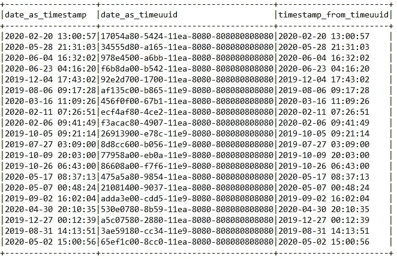

# 如何从 Apache Spark 和 Apache Cassandra 开始

> 原文：<https://itnext.io/how-to-start-with-apache-spark-and-apache-cassandra-886a648bd2fb?source=collection_archive---------0----------------------->


Apache Cassandra 是一个特定的数据库，可以线性扩展。这是有代价的:特定的表格模型、可配置的一致性和有限的分析。苹果每秒在超过 160，000 个 Cassandra 实例上执行数百万次操作，同时收集超过 100 PBs 的数据。您可以通过 Apache Spark 和 DataStax 连接器绕过这些有限的分析，这就是本文的内容。

# 设置

我在 Docker 上使用过一个 Apache Cassandra 节点

```
version: '3'

services:
  cassandra:
    image: cassandra:latest
    ports:
      - "9042:9042"
```

Apache Spark 3.0 作为 shell 推出，带有连接器和 Cassandra 的客户端库，这对于 timeuuid 类型转换将很有用。

```
./spark-shell --packages com.datastax.spark:spark-cassandra-connector_2.12:3.0.0-beta,com.datastax.cassandra:cassandra-driver-core:3.9.0
```

如果 Cassandra 没有在本地运行，您需要配置它的地址。

```
spark.conf.set("spark.cassandra.connection.host", "127.0.0.1")
```

# 数据

为了测试 Spark + Cassandra 组合，我使用 mockaroo.com 生成了一些日期。这是一个传感器列表和这些传感器的测量值列表。你可以在 GitHub 的[库](https://github.com/zorteran/wiadro-danych-spark-cassandra-101)中找到它们。

```
maciej@ubuntu:~/Desktop/spark_and_cassandra$ head sensor_reads.csv 
date,sensor_id,temperature,wind_speed,wind_direction
2020-02-20 13:00:57,11,90.42,72.91,153
2020-05-28 21:31:03,9,51.62,20.07,255
2020-06-04 16:32:02,3,6.68,89.31,309
...
```

# 在 Apache Cassandra 中创建表格

Apache Cassandra 有一个叫做 *cqlsh* 的专用工具。在 Docker 的情况下，您必须使用以下命令。

```
sudo docker exec -it container_name cqlsh
```

首先，我们必须创建一个 keyspace，这是一个用来存放我们的表的包。

```
**CREATE** KEYSPACE spark_playground **WITH** replication = {'class': 'SimpleStrategy', 'replication_factor': 1 };
```

有关传感器的信息将保存在传感器表中。没什么异常:id，位置，组 id。注意，主键是 id。因此，在没有完整的表扫描的情况下，我们不会对其他列执行 WHERE 操作(我提到具体的数据建模了吗？)，但是按键过滤会超级快。

```
**CREATE** **TABLE** sensors ( sensor_id **int**, location text, group_id **int**, **PRIMARY** **KEY** (sensor_id ));
```

测量值将在 sensors_reads 表中。密钥由传感器 id(分区密钥)和日期组成 [timeuuid](https://docs.datastax.com/en/cql-oss/3.3/cql/cql_reference/uuid_type_r.html) (聚类密钥)。分区键指示记录的位置(在哪个节点中)。Timeuuid 作为一个聚类键允许对记录进行排序。如果你迷路了，看看[关于](https://stackoverflow.com/questions/24949676/difference-between-partition-key-composite-key-and-clustering-key-in-cassandra)栈溢出的解释。您必须小心选择分区键。**错误的选择会导致节点上的负载不均匀**。

```
**CREATE** **TABLE** sensors_reads ( sensor_id **int**, **date** timeuuid, **temp** **double**, humidity **double**, wind_speed **double**, wind_direction **double**, **PRIMARY** **KEY** (sensor_id, **date** ));
```

# 使用 Spark 向 Cassandra 添加数据

## 加载 CSV 文件

```
val sensors = spark.read.format("csv").option("header", "true").load("/home/maciej/Desktop/spark_and_cassandra/sensors.csv")
val sensorReads = spark.read.format("csv").option("header", "true").load("/home/maciej/Desktop/spark_and_cassandra/sensor_reads.csv")
```

## 写入传感器表

列的类型和名称都一致，所以操作很简单。

```
sensors.write
    .format("org.apache.spark.sql.cassandra")
    .option("keyspace","spark_playground")
    .option("table","sensors")
    .mode("append")
    .save()
```

## 写入传感器读取表

这里变得更加复杂:

*   温度列中的列名不一致。温度= >温度
*   日期列中的类型不一致。我们从 CSV 中读取字符串形式的日期，而 Cassandra 中的列类型是 timeuuid。我们需要使用 Cassandra 的客户端库来进行转换。

类型不一致的问题可以通过适当的 UDF(用户定义的函数)来解决。顺便说一下，我们将检查反向函数是否返回相同的日期。通常我会用 IntelliJ 编写一个测试，但是让我们用 spark-shell 的方式来做😊。

```
import spark.implicits._
import com.datastax.driver.core.utils.UUIDs
import org.apache.spark.sql.functions.udf

val toTimeuuid: java.sql.Timestamp => String = x => UUIDs.startOf(x.getTime()).toString()
val fromTimeuuid: String => java.sql.Timestamp = x => new java.sql.Timestamp(UUIDs.unixTimestamp(java.util.UUID.fromString(x)))

val toTimeuuidUDF = udf(toTimeuuid)
val fromTimeuuidUDF = udf(fromTimeuuid)

sensorsReads
    .withColumn("date_as_timestamp", to_timestamp($"date"))
    .withColumn("date_as_timeuuid", toTimeuuidUDF($"date_as_timestamp"))
    .withColumn("timestamp_from_timeuuid",fromTimeuuidUDF($"date_as_timeuuid"))
    .show(false)
```



看起来不错。

现在我们去掉不必要的列，重命名温度列，并将数据保存在 Cassandra 中

```
val sensorsReads_fixed = sensorsReads
                            .withColumn("date_as_timestamp", to_timestamp($"date"))
                            .withColumn("date_as_timeuuid", toTimeuuidUDF($"date_as_timestamp"))
                            .drop("date").drop("date_as_timestamp")
                            .withColumnRenamed("date_as_timeuuid","date")
                            .withColumnRenamed("temperature","temp")
sensorsReads_fixed.write
    .format("org.apache.spark.sql.cassandra")
    .option("keyspace","spark_playground")
    .option("table","sensors_reads")
    .mode("append")
    .save()
```

# 阅读卡珊德拉的作品

在 Cassandra 中可以简化对表的引用。您只需要配置 Spark 上下文。

```
spark.conf.set("spark.sql.catalog.casscatalog","com.datastax.spark.connector.datasource.CassandraCatalog")
```

现在我们可以使用*cas catalog . key space _ name . table _ name*符号来引用这些表。

```
scala> spark.read.table("casscatalog.spark_playground.sensors").show()
+---------+--------+--------------------+
|sensor_id|group_id|            location|
+---------+--------+--------------------+
|        2|       4|       027 Heath Way|
|       13|       3|  42585 Ramsey Alley|
|        4|       1|     676 Marcy Point|
|        5|       3|260 Steensland Cr...|
|        9|       3|9385 Comanche Ter...|
|        8|       2|291 Meadow Ridge ...|
|        7|       2|     716 Randy Point|
|       14|       2|    331 Mcbride Road|
|       15|       3|     91 Gateway Hill|
|        1|       3|      66 Vera Avenue|
|        6|       4|87212 Lake View S...|
|       12|       2|    12 Montana Place|
|       10|       3|      60 Spohn Plaza|
|       11|       1|    48 Redwing Court|
|        3|       3|        930 Almo Way|
+---------+--------+--------------------+**val** sensors**_**table **=** spark.read.table("casscatalog.spark_playground.sensors")**val** sensors**_**reads**_**table **=** spark.read.table("casscatalog.spark_playground.sensors_reads")
```

## 手术费用

有了 Spark，一切都显得轻松愉快。我们必须记住，我们操作的是 Cassandra，它有自己处理查询的方式。我主要关心通过键和值检索记录的速度。

```
scala> sensors_table.filter("sensor_id in (1,2,3)").select("sensor_id","location").explain
20/07/21 11:09:50 INFO V2ScanRelationPushDown:
Pushing operators to sensors
Pushed Filters: In(sensor_id, [1,2,3])
Post-Scan Filters:
Output: sensor_id#749, location#751

== Physical Plan ==
*(1) Project [sensor_id#749, location#751]
+- BatchScan[sensor_id#749, location#751] Cassandra Scan: spark_playground.sensors
 - Cassandra Filters: [["sensor_id" IN (?, ?, ?), 1]]
 - Requested Columns: [sensor_id,location]
```

通过 sensor_id 过滤发生在从 Cassandra 检索数据的阶段。按 group_id 过滤需要按 Spark 扫描整个表。

```
scala> sensors_table.filter("group_id in (1,2,3)").select("sensor_id","location").explain
20/07/21 11:14:34 INFO V2ScanRelationPushDown:
Pushing operators to sensors
Pushed Filters:
Post-Scan Filters: group_id#750 IN (1,2,3)
Output: sensor_id#749, group_id#750, location#751

== Physical Plan ==
*(1) Project [sensor_id#749, location#751]
+- *(1) Filter group_id#750 IN (1,2,3)
   +- BatchScan[sensor_id#749, group_id#750, location#751] Cassandra Scan: spark_playground.sensors
 - Cassandra Filters: []
 - Requested Columns: [sensor_id,group_id,location]
```

## 简单聚合

让我们假设需要计算传感器组的数量。我们没有在数据库设计级别预测到这一点，CQL 查询也不会被执行。

```
cqlsh:spark_playground> SELECT group_id, count(1) FROM sensors GROUP BY group_id;
InvalidRequest: Error from server: code=2200 [Invalid query] message="Group by is currently only supported on the columns of the PRIMARY KEY, got group_id"
```

因此，我们要么在客户端应用程序端进行，要么使用 Apache Spark。

```
scala> sensors_table.groupBy("group_id").count.show
+--------+-----+                                                                
|group_id|count|
+--------+-----+
|       1|    2|
|       3|    7|
|       4|    2|
|       2|    4|
+--------+-----+
```

## 连接 joinWithCassandraTable

最简单的连接方法是取两个集合，做一个笛卡尔积。然而，Cassandra 连接器提供了一个更快的解决方案。在 RDD 版本中有一个[joinwithcassandrable](https://github.com/datastax/spark-cassandra-connector/blob/master/doc/2_loading.md#using-joinwithcassandratable)方法，而在数据框架中有 [Direct Join](https://github.com/datastax/spark-cassandra-connector/blob/master/doc/14_data_frames.md#direct-join) ，正如你所看到的，它的文档很差。joinWithCassandraTable 为源 RDD 所需的每个分区执行一次查询。在数据帧的情况下，这是自动发生的。

```
scala> sensors_reads_table.join(sensors_table).explain
...    
== Physical Plan ==
CartesianProduct
:- *(1) Project [date#755, sensor_id#756, humidity#757, temp#758, wind_direction#759, wind_speed#760]
:  +- BatchScan[date#755, sensor_id#756, humidity#757, temp#758, wind_direction#759, wind_speed#760] Cassandra Scan: spark_playground.sensors_reads
 - Cassandra Filters: []
 - Requested Columns: [date,sensor_id,humidity,temp,wind_direction,wind_speed]
+- *(2) Project [sensor_id#749, group_id#750, location#751]
   +- BatchScan[sensor_id#749, group_id#750, location#751] Cassandra Scan: spark_playground.sensors
 - Cassandra Filters: []
 - Requested Columns: [sensor_id,group_id,location]
```

理论上，相同的操作，但是选择键控关节会生成更有效的执行计划。

```
scala> sensors_reads_table.join(sensors_table, sensors_reads_table("sensor_id") === sensors_table("sensor_id"), "inner").explain
...
== Physical Plan ==
*(5) SortMergeJoin [sensor_id#756], [sensor_id#749], Inner
:- *(2) Sort [sensor_id#756 ASC NULLS FIRST], false, 0
:  +- Exchange hashpartitioning(sensor_id#756, 200), true, [id=#812]
:     +- *(1) Project [date#755, sensor_id#756, humidity#757, temp#758, wind_direction#759, wind_speed#760]
:        +- BatchScan[date#755, sensor_id#756, humidity#757, temp#758, wind_direction#759, wind_speed#760] Cassandra Scan: spark_playground.sensors_reads
 - Cassandra Filters: []
 - Requested Columns: [date,sensor_id,humidity,temp,wind_direction,wind_speed]
+- *(4) Sort [sensor_id#749 ASC NULLS FIRST], false, 0
   +- Exchange hashpartitioning(sensor_id#749, 200), true, [id=#820]
      +- *(3) Project [sensor_id#749, group_id#750, location#751]
         +- BatchScan[sensor_id#749, group_id#750, location#751] Cassandra Scan: spark_playground.sensors
 - Cassandra Filters: []
 - Requested Columns: [sensor_id,group_id,location]
```

# 编辑(2020 年 7 月 30 日)

Datastax 的 Alex Ott 在 Linkedin 的评论中告诉我，在这个案例中没有直接加入。原来你需要配置 spark.sql.extensions，更多详情可以在这里[找到](https://www.datastax.com/blog/2020/05/advanced-apache-cassandra-analytics-now-open-all)。

```
spark.conf.set("spark.sql.extensions", "com.datastax.spark.connector.CassandraSparkExtensions")
```

# 贮藏室ˌ仓库

[https://github . com/zorteran/wiadro-danych-spark-Cassandra-101](https://github.com/zorteran/wiadro-danych-spark-cassandra-101)—docker-compose 和 CSV

# 摘要

Spark 和 Cassandra 合作的话题在这个词条中几乎没有提及。Cassandra 是 Hadoop 生态系统的一个有趣的替代和/或补充。我们可以使用 Spark 进行分析，也可以维护和集成 Cassandra 的数据。毕竟，在第一种方法中很难找到理想的数据模型😉。