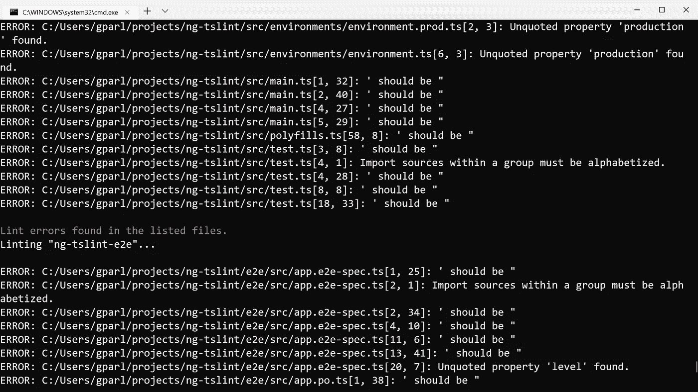
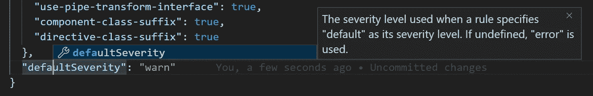
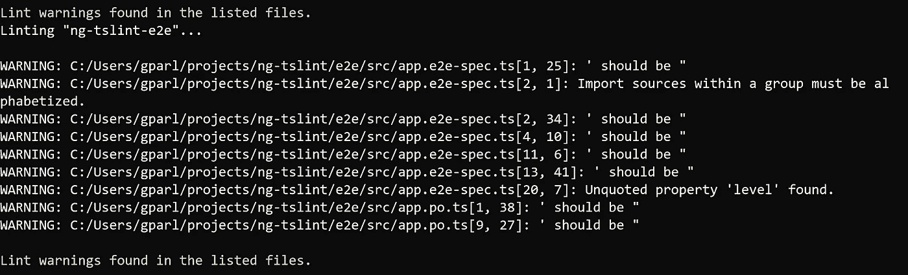
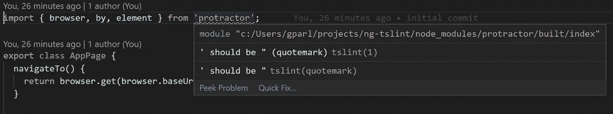
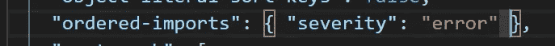
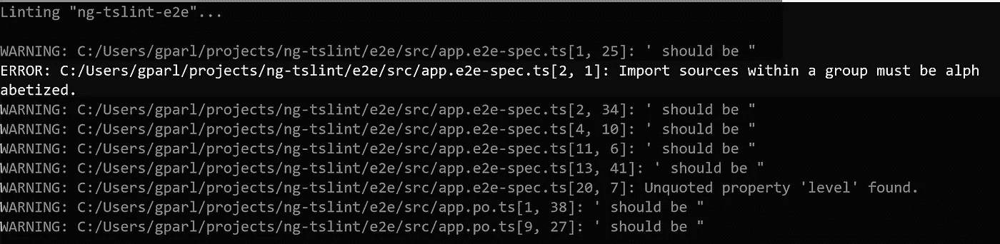

# 如何在现有 app 中启动 tslint？

> 原文：<https://itnext.io/how-to-start-with-tslint-in-an-existing-app-3eb04b5d6e6a?source=collection_archive---------3----------------------->

感谢 andremsantana 的照片

你如何吃掉一头大象？小字节。

如果您使用[**ts lint**](https://palantir.github.io/tslint/)**在**现有的**类型脚本代码基础上**启动**，您可能会看到 **lot** of **errors** 。**

**一种**方法**是将默认严重性设为“**警告**”。然后选择**一个规则**(或一组少数规则)给出**有限的**个错误。**修复**并将**严重性**设置为“错误”,这样如果发现新的错误实例，您的 **CI** 就会中断。**

**让**警告**会让你的编辑**给它们加下划线**，这样开发者就能得到**视觉反馈**。同时也不会破坏 CI。这允许逐步采用 tslint。**

**我们来做一个**的例子**。要模拟大量 tslint 错误，请执行以下操作:**

1.  **`git clone [https://github.com/gparlakov/ng-tslint](https://github.com/gparlakov/ng-tslint)`**
2.  **`npm run lint`**
3.  **得到许多错误:**

****

**现在你有了一个类似真实世界的应用程序，它开始于`tslint`的道路上。很多代码都有很多错误。一次解决这些问题太难了。即使我们可以一次解决所有问题——我们也可能希望慢慢来，反复进行，从而降低应用程序崩溃的几率。那么-我们该怎么做？**

**首先，将默认严重性更改为警告:**

****

**现在，由于`npm run lint`，我们得到了警告**

****

**但是在我们的代码编辑器中，我们仍然可以看到曲线:**

****

**这样，我们可以通过 CI 构建，并且仍然可以从我们的编辑那里获得反馈。**

**现在我们可以继续并修复其中一个错误。从使规则具有错误的严重性开始:**

****

**现在，如果我们运行`npm run lint`，我们会得到警告和**错误:****

****

**我们现在可以修复所选规则发现的错误，签入代码并继续下一步…**

**这个例子使用了一个 Angular 7 应用程序，默认为`tslint.json`(略有变化- > [提交](https://github.com/gparlakov/ng-tslint/commit/451e1d99f96a2044aba450c3e72dc20b96c87205))。是来自`ng new ng-tslint`的结果。这种方法可以应用于任何类型脚本应用程序**

**感谢阅读。如果你链接了这个——看看我的另一个 ts 棉绒——这里**