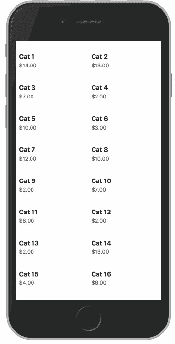
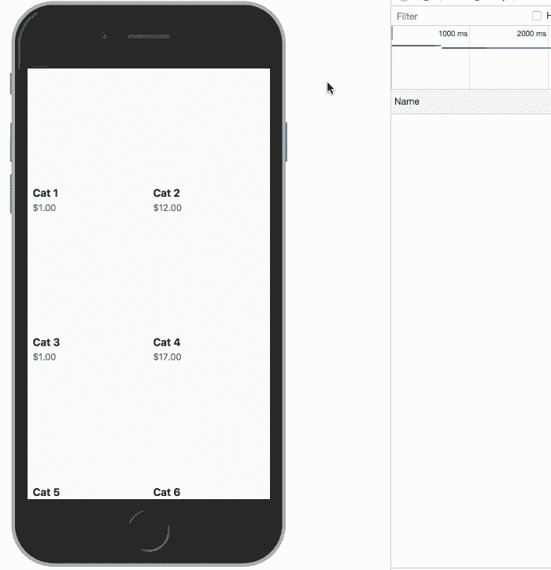

# 图片加载时如何停止内容跳转？

> 原文：<https://itnext.io/how-to-stop-content-jumping-when-images-load-7c915e47f576?source=collection_archive---------0----------------------->


图像在大多数网站、网络应用程序和 PWAs 中被广泛使用，看看你最近的任何项目，很可能图像是其捆绑大小的很大一部分。

因此，您可能会遇到这种情况:您的页面中混合了图像和基于文本的内容，但是随着图像的加载，整个布局会移动、跳转和更改，从而提供非常差的用户体验。



随着图像的加载，内容会四处跳跃

由于有限的屏幕尺寸和连接速度，这在移动设备上尤其糟糕。此外，现代最佳实践推荐在文件夹下延迟加载图像也没有帮助，因为这意味着当用户向下滚动页面时，跳跃和移动将继续。

# 只需设置图像的宽度和高度？

哦，要是生活有那么简单就好了，事实是，设置图像的`width`和`height`确实让浏览器在加载之前“保留”图像空间，因为它提前知道图像空间有多大，但是有一个巨大的警告，如果图像是响应性的，*它根本不起作用。*

在大多数情况下，你会有这样的 CSS，以确保图像将缩小很好:

```
img { max-width: 100%; height: auto;}
```

那个`height: auto`将“取消”固定的`height`属性，这是有充分理由的，现在浏览器不加载它就无法知道图像需要多大。

# 纵横比填充技巧

图像根据其长宽比放大和缩小，因此知道这一点后，我们可以使用最古老的 CSS 技巧来解决这个问题。

[纵横比填充技巧](https://css-tricks.com/aspect-ratio-boxes/)通常用于帮助响应视频和 SVG，它依赖于百分比填充基于元素宽度的事实，这可以帮助我们解决内容跳跃问题。

我们所需要的是将图像包装在一个零高度容器中，并给出一个具有相同图像纵横比的`padding-top`,例如:

你甚至不需要在这里使用`calc`，它只是帮助你更好地形象化它，你所需要的是根据下面的公式得到图像的长宽比:

> (高/宽* 100

现在，你可以在下面的笔中看到，我们已经避免了可怕的内容跳转，即使图像需要一段时间才能加载:

# 额外收获:在上面撒一些 JS

由于我们很多人都在使用某种基于组件的 javascript 框架，我们可以制作一个新的`Img`组件来帮助重用我们的新图像，我们还可以添加一些惰性加载功能和有趣的加载指示器，只是为了好玩。

在这个例子中，我将使用 ReactJS，但它在您选择的框架中也是可行的，基本概念是相同的:

它看起来更复杂，但本质上与静态 html/css 的想法是一样的。`.wrapper`元素将作为填充的容器，`.img`元素将被绝对定位在里面。

我们可以使用内联样式来基于图像大小设置容器上的`padding-top`,但是通过使用 CSS 变量，我们为我们的组件添加了一个额外的时髦词，这个词很适合这个时代。

我还使用了[react-intersection-observer](https://github.com/thebuilder/react-intersection-observer)库，该库提供了一个带有`inView`参数的渲染道具，让我知道图像何时在视口内，并添加了一些 CSS 动画来显示图像加载时的加载指示器。

最后，我们的`Img`组件可以像任何其他`img`元素一样使用:

```

```

好处是现在我们有了一个可重复使用的图像组件，包括:

*   懒加载。
*   避免内容跳转。
*   装载指示器。



[https://codesandbox.io/s/1642lz7n7](https://codesandbox.io/s/1642lz7n7)

请随意使用演示，并在您认为合适的时候进行改进，我们随时欢迎您的反馈！👋🏽