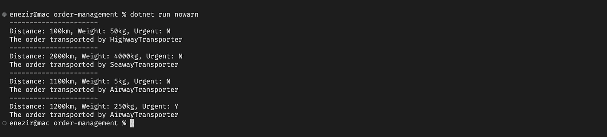

# 如何停止使用 If-else 并使代码更具可读性

> 原文：<https://itnext.io/how-to-stop-using-if-else-and-make-your-code-more-readable-9d1cd97c68bf?source=collection_archive---------0----------------------->


[https://refactoring.guru/design-patterns/factory-method](https://refactoring.guru/design-patterns/factory-method)

## 将 if-else 语句识别为代码中的问题。

如果使用不当，If-else 语句可能会有问题。它们可能难以阅读，并可能导致代码难以维护。如果使用不当，if-else 语句也会导致错误。尤其是当其他人添加了另一个不符合 if 条件的特性时，else 语句可能会意外工作。没有人想要一个不稳定或者不能正常工作的应用程序。让我们检查下面的[例子](https://www.freecodecamp.org/news/so-youre-in-if-else-hell-here-s-how-to-get-out-of-it-fc6407fec0e/)，它可能不是解释 if/else 嵌套问题的最佳例子。但希望它能给你一个好的指引，告诉你问题是什么。

很难阅读和理解，不是吗？添加一个新的条件或者修改现有的条件怎么样？

我很确定上面的代码在调试一百次后不会像你预期的那样工作。此外，在这样的代码中做一个简单的改变是非常痛苦的，因为无论何时你想做改变，你都必须理解几乎所有的逻辑。

## ⚠问题

假设您正在创建一个订单管理应用程序，并且每当创建一个订单时都运行一个运输逻辑。

基本上，您的代码将类似于上面的代码。

一段时间后，你的应用程序变得非常受欢迎。每天你都会收到几十份来自其他国家的订单，而你的公司与一家航空运输公司达成了协议。因此，您应该根据您的代码实现航空运输，并在订单距离超过 1000 公里时使用它。

然后，他们意识到，如果订单重量超过 100 公斤，这一过程是昂贵的，并与海运公司达成了另一项协议，但如果订单是紧急订单，则在任何情况下都应通过航空运输。

问题是你修改了以前的条件，完全打破了[的开闭原则](https://en.wikipedia.org/wiki/Open%E2%80%93closed_principle#:~:text=In%20object%2Doriented%20programming%2C%20the,without%20modifying%20its%20source%20code.)，增加了一些额外的条件块，当你想使用铁路或增加一些额外的规则时会发生什么？它可能会像第一个例子一样变成代码。

## ✔️溶液

让我们用下面编写的命令创建一个新的 dotnet 控制台项目。

```
dotnet new console -n order-management
```

> 这个项目将会在 github 上发布。

然后，让我们创建一个非常简单的订单类来解决我们的问题。

我们需要创建一个包含我们的抽象方法的抽象类(或者您可以使用接口和 DI 以及其他方法)。

现在，我们有了一个抽象的 Transporter 类，它有一个接受 Order 作为参数的 transport 方法。下一步是为 SeaTransporter、HighwayTransporter 和 AirwayTransporter 类创建和实现我们的业务逻辑。

我们有三个从 Transporter 衍生出来的独立职业，魔法就从这一点开始。让我们添加一个抽象的 IsSuitableWithOrder 方法，该方法返回一个布尔值，并为这三个类实现条件。

在这一点上，我们的代码应该类似于下面的代码。

因此，我们需要使用 transporter 类作为一个工厂，它返回一个合适的 Transporter 类给我们，但它必须在没有任何硬编码条件或手动检查的情况下这样做，以便能够在不修改以前的代码的情况下在特性中添加新的类，反射可以帮助我们做到这一点。

让我们从编写一个从给定类型返回所有派生类的扩展方法开始。

我们要做的是找到所有 transporter 子类，执行它们的 IsSuitableWithOrder 方法并返回合适的方法。所以，让我们对我们的抽象运输类做最后的润色。

如您所见，我们添加了一个静态 GetTransporter 方法，该方法从 assembly 中获取所有子类，并返回其中一个适合该顺序的子类。

> 请注意，工厂方法不需要一直**创建**新实例。它还可以从缓存、对象池或其他源返回现有对象。
> 
> 如果您检查[构建器模式](https://endjin.com/blog/2019/06/design-patterns-in-c-the-builder-pattern)和[方法链接](https://levelup.gitconnected.com/method-chaining-with-fluent-interface-pattern-d01e75d4bb3d)，可能会有用。

作为最后一步，让我们返回到 Program.cs 文件，准备一个订单列表，并运输它们。

你所需要的是编写下面的代码，而不是大量的 if 条件。

```
Transporter.GetTransporter(order).Transport();
```

此外，您可以轻松地为其他选项添加新类，并为现有类添加新特性。

这是结果。



GitHub:[https://github.com/edisnezir/factory-pattern-order](https://github.com/edisnezir/factory-pattern-order)