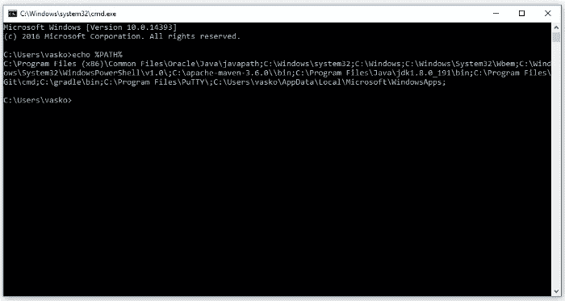

# 如何在项目代码中存储密码和 API 密钥？

> 原文：<https://itnext.io/how-to-store-passwords-and-api-keys-in-project-code-1eaf5cb235c9?source=collection_archive---------0----------------------->


劳伦·曼克在 Unsplash[上的照片](https://unsplash.com/collections/8278420/web-mockups-?utm_source=unsplash&utm_medium=referral&utm_content=creditCopyText)

通常，您的自动化脚本会有秘密凭证或 API 密钥，您需要在您的应用程序中使用这些凭证或密钥，并且您更愿意从您的密钥库中轻松提取它们。

如果您正在使用动态生成的秘密，存储该信息的最有效方法是使用 Keystore API。您不应该在没有首先加密这些数据的情况下将它们储存在共享偏好设置中，因为在执行数据备份时会提取它们。

为了存储固定的 API 密钥，在源代码中存储机密有以下常见策略:

*   隐藏在项目代码中。
*   隐藏在 BuildConfigs 中。
*   格拉德。
*   隐藏在路径环境中。
*   火焰基地。

存储机密的最简单方法是将它们保存为资源文件，不要签入源代码控制。

项目代码中的 idden。

```
*/**
 * The class Service.
 */* **public class** Service {

    */**
     * The constant APP_KEY.
     */* **public final static** String ***APP_KEY*** = **"jk433g34hg3"**;

    */**
     * The constant APP_SECRET.
     */* **public final static** String ***APP_SECRET*** = **"987dwdqwdqw90"**;
    */**
     * The constant ACCESS_TYPE.
     */* **public final static** AccessType ***ACCESS_TYPE*** = AccessType.HARD;

*// SOME MORE CODE HERE* }
```

密码和 API 密钥存储在项目代码中并直接使用。

这种策略的缺点是:

*   当使用存储库时，数据将对第三方可用。
*   数据分散在整个项目中。不存在所有密钥和密码都存储在一个地方的情况。
*   密码和 API 密钥写在项目代码中，我们不能通过任何管理工具从外部使用它们。

BuildConfigs 中的 idden。

首先，在根目录下创建一个文件`apikey.properties`，其中包含不同密钥的值:

```
APP_KEY = jk433g34hg3
APP_SECRET = 987dwdqwdqw90
ACCESS_TYPE = AccessType.HARD
```

为了避免这些密钥出现在您的存储库中，请确保通过将添加到您的。gitignore 文件。

```
*/**
 * The class Properties reader.
 */* **public final class** PropertiesReader {

    */**
     * Constant LOGGER.
     */* **private static final** Logger ***LOGGER*** = LoggerFactory.*getLogger*(PropertiesReader.**class**);

    */**
     * Constant PROPERTIES.
     */* **private static final** Properties ***PROPERTIES***;

    */**
     * Constant PROP_FILE.
     */* **private static final** String ***PROP_FILE*** = **"**apikey**.properties"**;

    */**
     * Default private constructor PropertiesReader.
     */* **private** PropertiesReader() {
    }

    **static** {
        ***PROPERTIES*** = **new** Properties();
        **final** URL props = ClassLoader.*getSystemResource*(***PROP_FILE***);
        **try** {
            ***PROPERTIES***.load(props.openStream());
        } **catch** (IOException ex) {

            **if** (***LOGGER***.isDebugEnabled()) {
                ***LOGGER***.debug(ex.getClass().getName() + **"PropertiesReader method"**);
            }
        }
    }

   */**
 * Method getProperty.
 *
 ** ***@param name*** *String name file.
 ** ***@return*** *Return property
 */* **public static** String getProperty(**final** String name) {

    **return *PROPERTIES***.getProperty(name);
}
```

并在项目中使用:

```
PropertiesReader.getProperty("APP_KEY");PropertiesReader.getProperty("APP_SECRET");PropertiesReader.getProperty("ACCESS_TYPE");
```

这种策略的优点是:

*   所有的密钥和密码都在一个地方，我们可以看到我们使用的外部系统。

这种策略的缺点是:

*   密码和 API 密钥写在项目代码中，我们不能通过任何管理工具从外部使用它们。

radle 是一个用于多语言软件开发的构建自动化工具。

我们可以使用 Gradle 来保护密码或 API 密钥。

您需要用 gradle.properties 文件中的键创建一个变量:

```
APP_KEY = jk433g34hg3
APP_SECRET =987dwdqwdqw90
ACCESS_TYPE = AccessType.HARD
```

设置要构建的变量。格拉德:

```
buildTypes.each {it.buildConfigField 'String', 'APP_KEY', AppKeyit.buildConfigField 'String', 'APP_SECRET', AppSecretit.buildConfigField 'String', 'ACCESS_TYPE', AccessType
}
```

使用 BuildConfig 访问它:

```
BuildConfig.AppKeyBuildConfig.AppSecretBuildConfig.AccessType
```

这种策略的优点是:

*   所有密钥和密码都在一个地方。

这种策略的缺点是:

*   密码和 API 密钥写在项目代码中，我们不能通过任何管理工具从外部使用它们。

H 路径环境中的 idden。

PATH 环境变量类似 Unix 的操作系统、DOS、OS/2 和 Microsoft Windows，它是可执行文件所在的一组目录。基本上，每个正在运行的进程或用户会话都有自己的 path 变量。

要在 Windows 操作系统中找出该变量的内容，您需要调用以下命令:

**回声%路径%**

对于 Linux 操作系统:

**回声$路径**

它将显示在 PATH 变量中注册的所有目录的列表，并且可执行文件可以放在任何目录中。



您可以通过以下方式使用环境变量:

创建了一个简单的 shell 脚本。这个文件不会存储在 git 中。它将被添加到。gitignore 文件。每个 QA 工程师在他们的本地设备上都有这个 shell 文件，所有的密钥都存储在这个文件中。

```
create setenv.sh
```

在 setenv.sh shell 脚本文件中创建 3 个变量:

```
export APP_KEY=jk433g34hg3export APP_SECRET=987dwdqwdqw90export ACCESS_TYPE=AccessType.HARD
```

并使用以下命令将从加载到环境变量:

```
source ./setenv.sh
```

并调用项目代码:

```
String apiKey = System.getenv("API_KEY");String appSecret = System.getenv("APP_SECRET");String accessType = System.getenv("ACCESS_TYPE");
```

这种策略的优点是:

*   我们不将密钥存储在 git 存储库中，它们存储在外部。
*   环境变量可以通过管理工具来设置。
*   此外，您可以将环境变量存储在管理工具的配置文件、 **systemd** 或 Docker 配置文件中。

这种策略的缺点是:

*   我们需要一个 shell 脚本。

irebase 是谷歌的移动平台，可以帮助你快速开发高质量的应用并发展你的业务。

您可以使用 firebase 数据库或 firebase RemoteConfig(默认值为 Null):

1.  加密您的密钥。
2.  将其保存在 Firebase 数据库中。
3.  在应用程序启动期间或必要时获取。
4.  解密密钥并使用它们。

这种策略的优点是:

*   对 Firebase 的访问是受保护的，因此只有拥有签名证书的应用程序才能进行 API 调用。
*   加密/解密
*   速度

F 对我个人来说，环境变量是存储机密信息和重要项目设置的最正确、最优秀的方式。

到现在，您应该意识到在公共和私有 Git 存储库中存储敏感信息(如 API 密钥和密码)的危险。

理解您的存储库可能暴露的潜在方式是评估和减轻与信息泄漏相关的风险的关键。

本文还提出了一些不同的解决方案，让您可以加密 API 密钥和密码，这样您就可以安全地使用您的代码库。

我相信有更多的解决方案可以帮助你达到同样的效果。