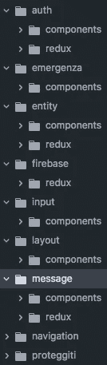

# 如何构建你的 React 应用 2？

> 原文：<https://itnext.io/how-to-structure-your-react-app-2-2cf3b8040634?source=collection_archive---------0----------------------->

在之前的[如何构建你的 react 应用](https://hackernoon.com/how-to-structure-your-react-app-98c48e102aad)的故事中，我写了关于使用捆绑包作为你的应用的顶级入口点，这可能对一些人有效，对另一些人可能无效。今天我要告诉你另一种构建 react 应用的方法，我们在 [unicorndev](http://unicorndev.io) 使用的是这个方法——域。我建议您在继续之前阅读本主题的[第一版。](https://hackernoon.com/how-to-structure-your-react-app-98c48e102aad)

**在我们开始之前**

在我们开始讨论域之前，让我们先来看看它:

我们定义了一个名为`alert`的域，它有组件和 redux 文件夹，但也有只与这个域相关的常量文件。

如你所见，它非常小。

我们定义了一个域和其中的两个文件夹:components & redux。这取决于你在域文件夹里放什么。不管你用的是 redux 还是 relay。这个想法是将与域相关的所有东西都保存在它自己的文件夹中。

**想法**

将域作为应用程序的顶级是有益的，原因如下:

1.  域名很小。使用它时很容易记住它，因为您处理的所有内容都在同一个文件夹中。万一你不喜欢，也很容易重组。
2.  主应用程序的结构保持扁平。因为域是独立的，所以在初始阶段更容易规划应用程序。
3.  没有深层文件夹结构—平均 3 层。不需要写很长的导入，这就是为什么更容易记住需要导入什么以及从哪个域导入。
4.  每个域都有相似的结构，通常有一些实体子集，如`components` `redux actions` `reducers` `sagas`。只要你保持所有领域看起来相似，就很容易记住并习惯它。
5.  领域很容易指定，因为总是很清楚你要写什么组件，指定领域也很容易。如果你需要创建一个普通的文本输入或按钮，那么你可能要创建一个名为`input`的域。
6.  这种方法消除了像`shared`或`common`这样的东西，通常所有没有共同点的东西都在这里。你通常会把一个你不能确定的东西放在其中一个文件夹里。

**人类**

我们是人类，我们的大脑以特定的方式工作。这意味着对我们的大脑来说，有些事情比其他事情更容易记忆和处理。我们倾向于更快地记住小而简单的事情。这就是这种方法与人脑兼容的原因:

1.  清楚明白什么是什么。域名代表了它的主要功能。
2.  通过功能的名称/描述很容易找到域。
3.  保持它们很小很容易，因为域是专门为某个目的而创建的，它们通常只保存与它们的域逻辑相关的东西。

**如何指定**

在你开始考虑什么是你正在工作或将要工作的领域之前，你可能要考虑你的应用程序中是否已经有了这个领域。如果您没有域，因此需要创建一个:

1.  选择名称。名称应该反映一个域名的主要功能。只要想想你创建它的主要目的或原因是什么。通常名称应该是单数，并且以小写字母开头。比如:`user` `auth`，`navigation`。
2.  尽量保持所有的域结构相似。为了能够快速地写/找东西，你必须为所有的领域保持一个相似的结构。例如:

**差异**

包是比域更高层次的抽象，用于保存组件。定义一个捆绑包总是很难，因为你需要考虑那里会有什么类型的组件，而且因为它是一个高层次的抽象，所以总是很难确定，几个捆绑包可能有逻辑交集，导致提取一个新的捆绑包或将其作为技术债务。一个域名很容易。简单而准确。

**什么比较好**

如何构建 react 应用程序完全取决于您。想一想和你一起工作或者可能和你一起工作的其他人。

喜欢&分享。一块。

附注:感谢所有来自 [unicorndev](http://unicorndev.io) 团队的人审阅&这篇文章。