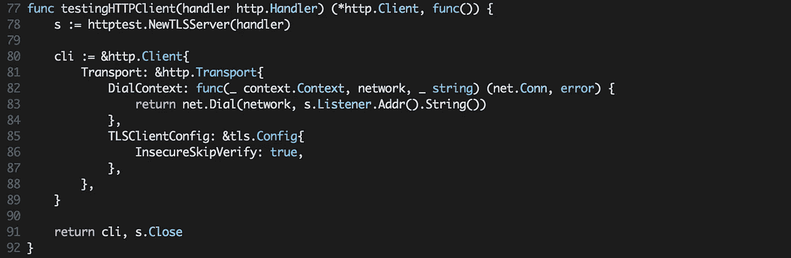

# 如何使用 Go 向远程主机发送存根请求

> 原文：<https://itnext.io/how-to-stub-requests-to-remote-hosts-with-go-6c2c1db32bf2?source=collection_archive---------1----------------------->

当用客户端为某个 API 创建一个包时，用测试覆盖它是很关键的，特别是如果你想把这个包放到 *GitHub* 上供公众使用，因为新版本中的 bug 会给在生产环境中使用它的项目带来可悲的后果。在公开软件包之后，你的工作是跟踪它的可靠性和兼容性，使它可供其他人使用。

测试有助于代码**的可维护性**，所以当其他用户用他们所做的更改创建拉请求时，你总是会看到是否有什么地方出错了，并确保代码仍然**可靠**，尤其是当你使用一些集成了 *GitHub* 的 CI 工具时，比如*特拉维斯*、*信号量*或*詹金斯*。

最近，我浏览了各种实现 API 客户端的包，注意到它们缺少测试，尽管这些代码很容易通过*向远程主机发送*请求来测试。所以我决定分享我如何测试我的客户。

上面的代码定义了一个客户端，它能够从远程服务器接收用户列表，请求通过`http.Client`发生，通过用自定义`http.Transport`重新定义它的`Transport`属性，我们可以将客户端发出的所有请求重定向到另一个假服务器，我们可以使用`httptest.NewServer`工厂创建这个假服务器，并返回我们需要的响应。

上面的函数接收`http.Handler`接口作为参数，在其中我们可以写响应体，设置状态码，或者我们从远程主机期待的任何东西——我们甚至可以检查我们发送的*请求。最后，该函数返回带有重新定义的`Transport`的`http.Client`，以及一个 teardown 函数，该函数将停止之前启动的假服务器。因此，我们有能力用*存根*请求编写一些测试。*

因为我们的库将在其他包中使用，所以让其他包能够更改`httpClient`属性也是很好的，因为它可能会在集成测试中使用，例如，如果我们的客户端将作为依赖项被注入。你可以简单地通过将`httpClient *http.Client`属性重命名为`HTTPClient *http.Client`来公开它，或者通过为客户端添加`func(cli *Client) SetHTTPClient(httpClient *http.Client)`方法来实现，但就个人而言，我更喜欢使用[功能选项](https://dave.cheney.net/2014/10/17/functional-options-for-friendly-apis)，因为它是一个非常强大的工具。

完整的例子可以在 [GitHub](https://github.com/romanyx/api_client_testing) 上找到。