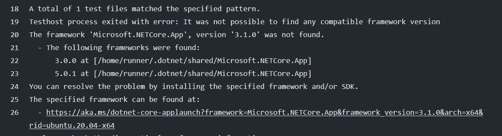
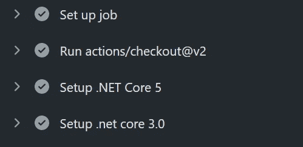

# 如何支持多个？GitHub 操作工作流中的. NET SDKs

> 原文：<https://itnext.io/how-to-support-multiple-net-sdks-in-github-actions-workflows-b988daa884e?source=collection_archive---------4----------------------->

GitHub 操作非常棒，您可以使用它们轻松地自动化您的工作流(从简单的 CI/CD 到更复杂的工作流)。我为我的项目 [AzureAutoNumber](/generate-auto-increment-id-on-azure-62cc962b6fa6?source=friends_link&sk=d530e2765669f1678349e724b0358d71) 使用 GitHub Actions 作为我的 CI/CD 管道。在上次更新期间，我遇到了一个问题，我无法运行我的测试(基于 xUnit)。

```
steps:
- uses: actions/checkout@v2
- name: Setup .NET Core
  uses: actions/setup-dotnet@v1
  with:
 dotnet-version: 3.1.101
```

拥有。NET 5 SDK 在我的构建过程中，我把`dotnet-version`改成了`5.1.101`。

```
steps:
- uses: actions/checkout@v2
- name: Setup .NET Core
  uses: actions/setup-dotnet@v1
  with:
 dotnet-version: 5.1.101
```

构建过程进行得很顺利，但是在测试阶段，test runner 给了我这个错误:



这个错误很详细，而且很明显是哪里出了问题。测试框架需要。NET SDK 3.1.x 来运行该目标的测试。**解决办法看起来很简单:“安装不同的。NET SDKs，它应该可以解决这个问题。”**

只有当您的项目目标不同时，才会出现此问题。NET 就像下面的例子:

```
<PropertyGroup>               <TargetFrameworks>netcoreapp2.1;netcoreapp3.1;net5.0</TargetFrameworks>
</PropertyGroup>
```

如我所说，解决方案很简单，支持多个。NET SDKs，作为一个单独的步骤逐个设置它们:

```
- name: Setup .NET Core 2.1	
  uses: actions/setup-dotnet@v1	
  with:	
    dotnet-version: 2.1.x	
- name: Setup .NET Core 3.1	
  uses: actions/setup-dotnet@v1	
  with:	
    dotnet-version: 3.1.x
- name: Setup .NET Core 5.0
  uses: actions/setup-dotnet@v1
  with:
    dotnet-version: 5.0.x
```

这些步骤中的每一步都将 SDK 下载并安装到当前的构建容器中，并且这些 SDK 在接下来的步骤中是可以访问和共享的。



搞定了。作为一个工作示例，您可以看看我的构建[工作流](http://.github/workflows/dotnet-core.yml)。