# 如何在主要反应性版本的重大变更中生存

> 原文：<https://itnext.io/how-to-survive-breaking-changes-of-major-react-native-release-2464374a1ded?source=collection_archive---------3----------------------->

[React-native](https://reactnative.dev/) 是最受欢迎的跨平台移动框架，拥有超过+86k GitHub 明星和超过 363k 活跃社区开发者。

# TL；速度三角形定位法(dead reckoning)

一个现实的假设是，一个新的 RN 版本包含了突破性的变化，这对开发者来说是一个新的挑战，引起了意想不到的头痛(！).面对升级困境，有一个简单而高效的解决方案—在内部查找:)

# 咚咚这是主要版本

最近我们公布了一个新的主要版本`react-native` (0.62)。令人高兴的是，它包含了我们一直在等待的性能改进和关键错误修复— *万岁！*


但是在我们让兴奋接管之前，我们知道当一个新的`react-native`主要版本发布时，开发者会进入紧急情况🤯关心突破性的改变。

# 巨大的困境

您发现自己渴望升级到新版本，因为您等待了很久的重大改进和重要的错误修复(即**用户**等待)。

然后，在查看版本发布说明时，现实给你留下了深刻印象，意识到升级成本将与其他一些恼人的问题作斗争😡突破性的改变。

这意味着升级将迫使您投入额外的精力来协调不可预测的突破性变化。

好吧，一个显而易见的问题是:在应用程序计划盖章后，还有时间可以分配吗？
甚至更多:你真的要在这个敏感时期去触碰多个代码区吗？—当资源有限时，可能需要一些错误修复周期。

让我们把注意事项贴在墙上:

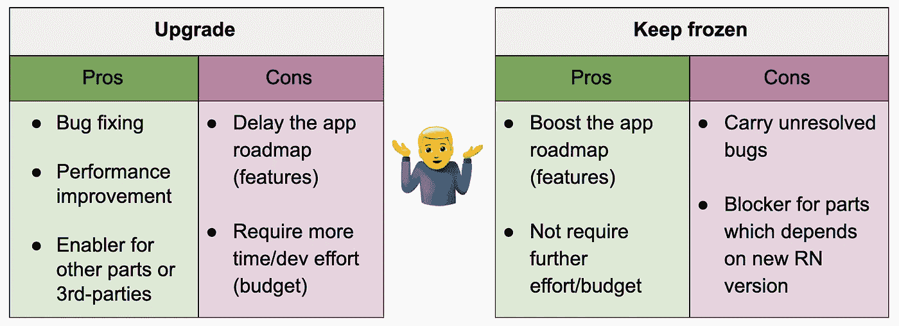

如果您选择升级，那么您可能会发现自己投入了比原始路线图更多的精力来协调差异，但是如果您不升级，那么您会发现自己落后了，携带一些连续的错误，并且可能会依赖于新版本…

于是我们面临一个“情况”:**到底该不该升级？**

你叫什么？


# 突破{through}个更改

在急于下任何结论之前，让我们试着分析一下造成这种情况的原因。

如前所述，这里的主要问题是**突破性变化**。如果没有突破性的变化，那么升级会像威士忌酒一样顺利。


`react-native`版本中的大部分突破性变化可以分为两类:

1.  从`react-native`堆芯、**中取出的组件**到外部回购，用于社区维护。
2.  组件 **API 在`react-native`内核内**改变。

我们中的智者会说，可能有第三种选择，即在不改变 API 的情况下改变组件的内部功能。但实际上这不是一个“突破性的改变”,而是行为的改变。

> 为了降低中断更改的风险，我们应该找到一种方法来减少`react-native` API 与我们的应用程序代码库之间的摩擦。

令人欣慰的是，这不一定是“蓝色药丸红色药丸”的情况，但有一盏灯😇在隧道的尽头。

# [2]裹在(1)里的鸟

减少两个代码部分之间的摩擦，也称为**解耦**和**封装**，是面向对象编程的优良原则。

**解耦**确保两个不同的组件不会紧密依赖于彼此。

封装是将一个组件的内部功能隐藏在一个定义好的接口后面。

在我们的例子中，字面意思是从`react-native`包中导入并**包装**某个组件，并使用这个**包装的组件**作为所有代码库的源代码。


听起来很简单，下面是一个从`react-native`的核心包装`[TextInput](https://reactnative.dev/docs/textinput)`组件的简单例子:

1.  在`./components/core`目录下创建`TextInput.js`文件

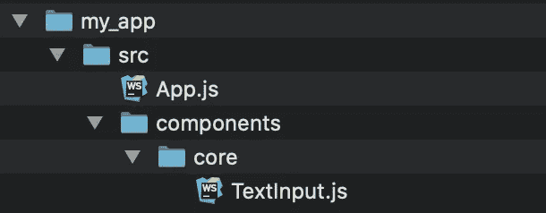

2.直接从`react-native`包导入原点`TextInput`组件。

3.封装`*font-family*` 样式*的自定义功能。*

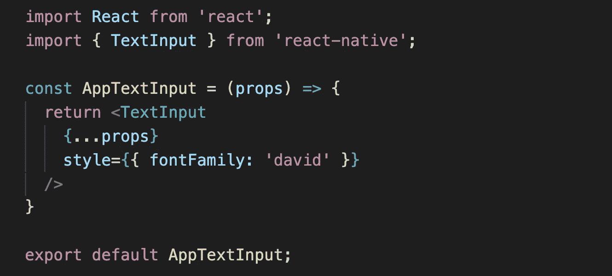

4.从你当地的来源消费`TextInput`。

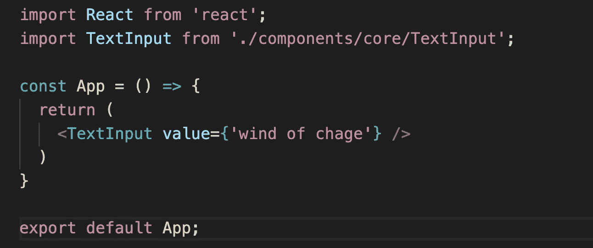

Vualá，`TextInput`inner functional 封装在`TextInput.js`文件中，可以很容易地从一个“真实的单一来源”进行控制，而不需要改变消费事件。

遵循这个简单而有效的**包装**，我们促进了`react-native`与代码库之间的隔离，并实现了内部组件功能的轻松定制。一包两鸟— *万岁！*

现在，让我们看看如何用行动来克服这种破坏性的改变。

# **展示橱窗**研究

拥抱你自己的一个习惯，在一个新发布的`react-native`版本上，推荐过一遍发布说明——让我们在[最新版本 0.62](https://github.com/react-native-community/releases/blob/master/CHANGELOG.md) 上检查一下🕵️。

在更改日志详细信息中找到“**Breaking”**部分，即“Breaking-changes”——不要太短…

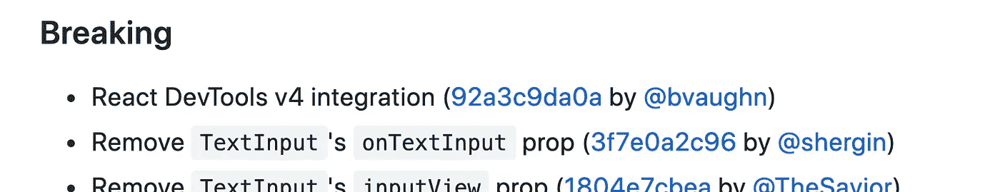

React-Native v0.62 更改日志，重大更改列表

观察第二个项目符号:“*移除* `*TextInput*` *的* `*onTextInput*` *道具”。* 当然我们都是`TextInput`在我们的应用中的重度消费者，直接从`react-native`包导入，在应用代码库中可能会出现`**onTextInput**`。但是正如我们注意到的，这个 API 在上一个主要版本中发生了变化。我们肯定能克服这种突破性的变化(*)。

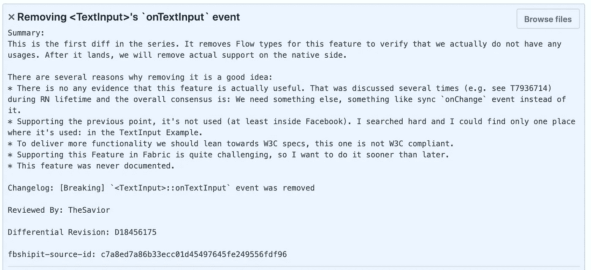

提交详细信息

## 1.`onTextInput'`搞清楚功能

`onTextInput`是一个回调函数，在用户输入新文本时被调用，与`[onChangeText](https://reactnative.dev/docs/textinput#onchangetext)`回调函数一样触发(我想这就是为什么由于冗余的重叠功能，它被从新的`react-native`版本中删除了)。

事件数据方案是:

```
{
   nativeEvent: {
      text,                 // value of ***diff*** text
      previousText,         // the previous value of text
      range: { start, end } // cursor position  
   }
}
```

主要有趣的是`text`值属性。
下面是升级前**的使用方法:
(注意`TextInput`是直接从`react-native`包导入的)**

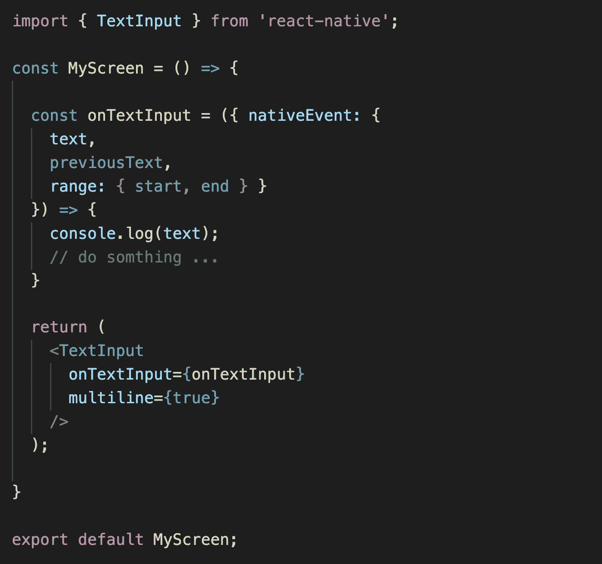

## 2.包装

在您的`./components/core`目录、
中创建一个新的`TextInput`文件组件(我建议将它嵌套在`./components/core`下，这表明了它的重要性)。直接从`react-native`包导入`TextInput`。

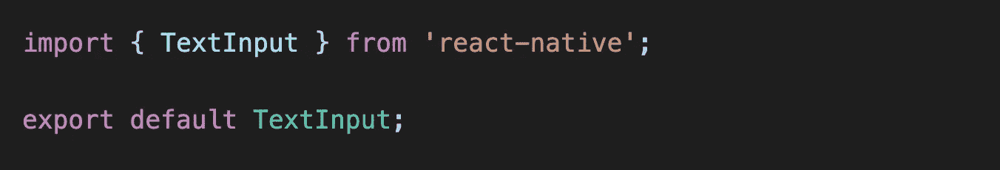

将所有出现的`TextInput`指向创建的本地源文件，而不是直接指向`react-native`——通过仿真器运行应用程序，以确保不会出错。

```
import TextInput from './components/core/TextInput';orimport { TextInput } from './components/core';
```

现在，您获得了一个`TextInput`元件的去耦隔离层。

是的，我们强调了避免大范围代码变更的愿望，那么我们现在为什么要这样做呢？—实际上我们没有，**我们没有更改任何逻辑或功能**，只是更改了导入引用。所以那次行动没有风险。

## 3.封装对帐

在包装器内部实现一个对`onTextInput`回调的模仿，以协调强制中断更改。

遵循代码说明:

*   为`TextInput`实现一个`React`组件。记住`import React from 'react'`，你需要`Babel`到 *transpile* 这个`React`组件，否则这一切都不行。

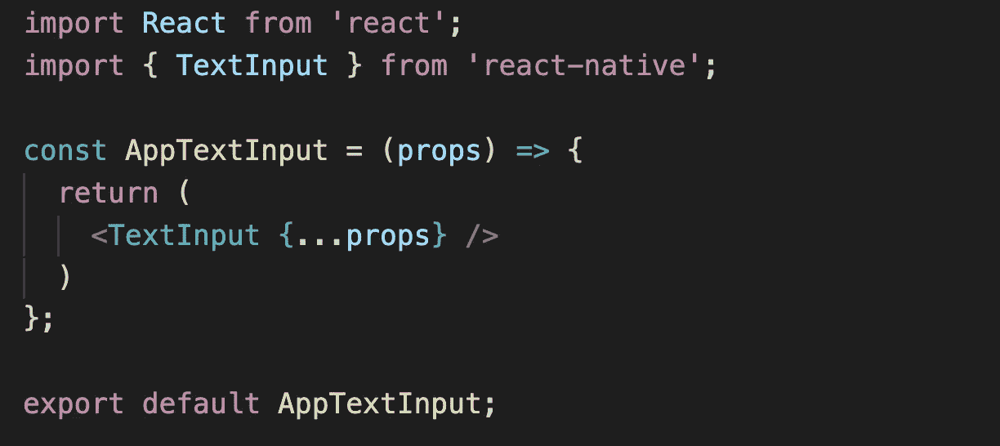

*   将`onChangeText`与`props`分开，并实现内部函数——验证它是否被正确调用。

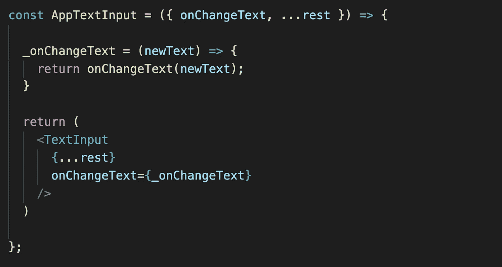

*   “骑”在`onChangeText`回调上触发`onTextInput`事件(因为两者都是同样触发的，而在新的情况下没有这样的回调`onTextInput`🤓).

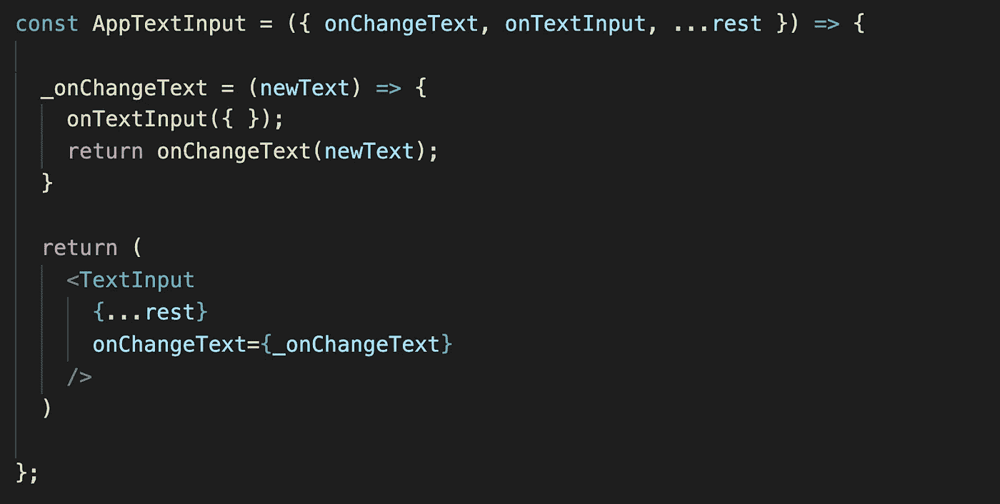

*   填充`onTextInput` API 以支持模式:

```
{
   nativeEvent: {
      text,                 // value of ***diff*** text
      previousText,         // the previous value of text
      range: { start, end } // cursor position  
   }
}
```

*   `previousText` —实际上是`TextInput`的`value`属性，还没有改变(将在`onChangeText`结束后提交)。

```
const { value: previousText } = rest;
```

*   `text` —我使用`lodash`来查找差异`text`，但是你可以使用你喜欢的任何东西。

```
import _ from ‘lodash’;
...const { value: previousText } = rest;
const diiText = _.difference((newText || '').split(''), (previousText || '').split('')).join('');
```

*   `range` —取自任何光标位置变化时触发的`[onSelectionChange](https://reactnative.dev/docs/textinput#onselectionchange)`回调，我在这里使用了*钩子*来保存它的状态(**)。

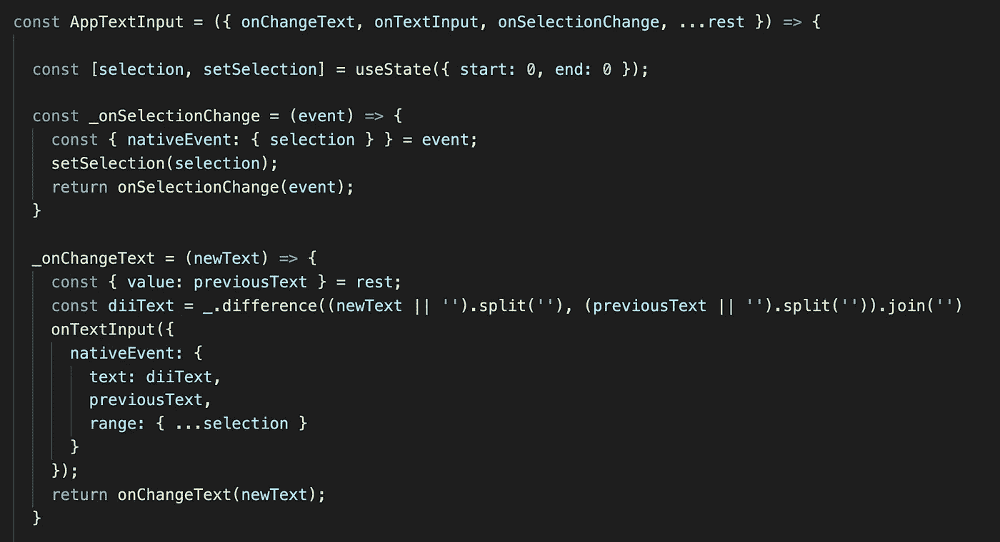

*   让代码更具防御性以避免错误，以防某些回调不作为`props`提供——我用的是`lodash`，但是你可以使用你喜欢的任何东西。

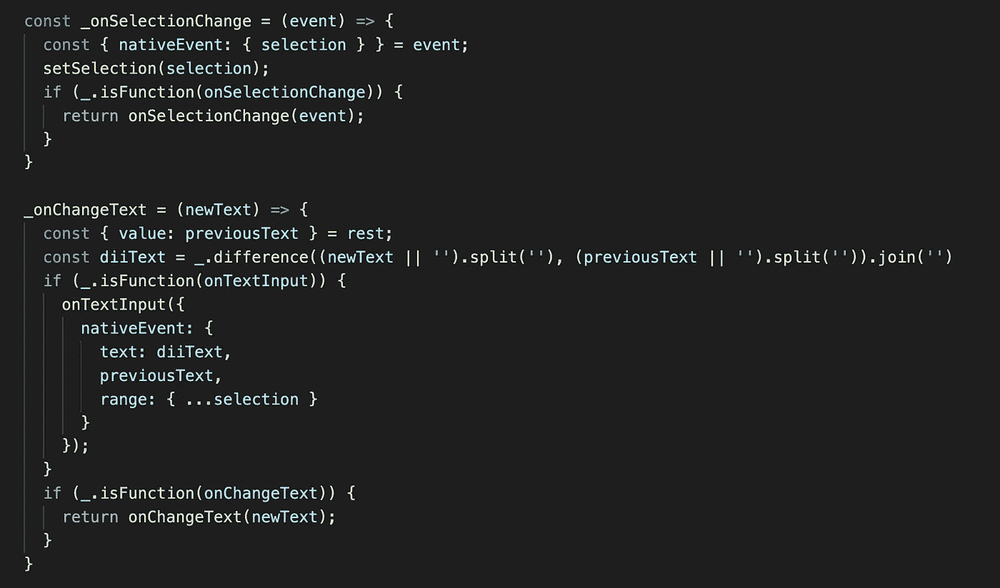

*   一起

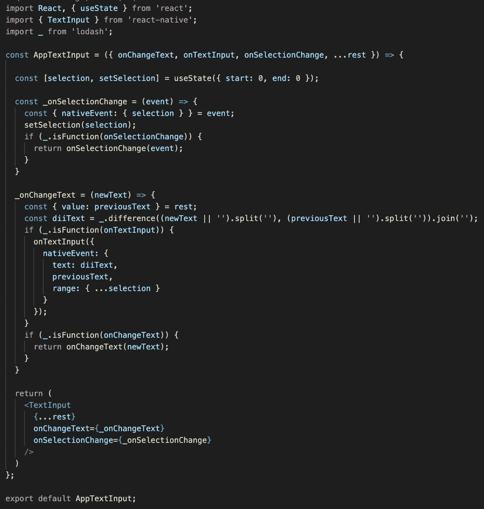

## 4.消费

这种实现对于消费者来说是无缝的，并且功能与以前一样，不需要改变代码库中的任何逻辑或功能。从本地源头消费就行了。


# 全部包起来

你有权利保护自己免受即将到来的破坏性变化，而不是与可能导致长 QA 周期的几个修改竞争。

这种包装方式大大降低了压制性中断-变更协调的风险。节省时间、金钱和紧张。

建议:全部打包。你将拥有大约 40 个精简的`./components/core`文件，而不是分散在整个代码库中。

**祝你下次升级好运！**

找到上面的代码示例@我的[**GitHub**](https://github.com/domainio/RN-Breaking-Changes-Wrap)链接到我的 [**简历**](http://www.linkedin.com/in/erez-zohar-15960856)

(*)适当披露:`onTextInput`将在 0.62.2 版中完全删除，但在 0.62 版中仍然可用

(**)本文没有涵盖所有的`onSelectionChange`边缘案例，它需要更长的代码示例，这超出了本文的范围。