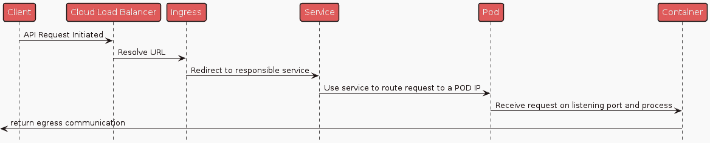
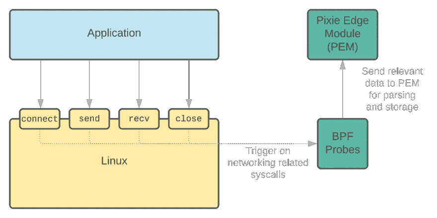
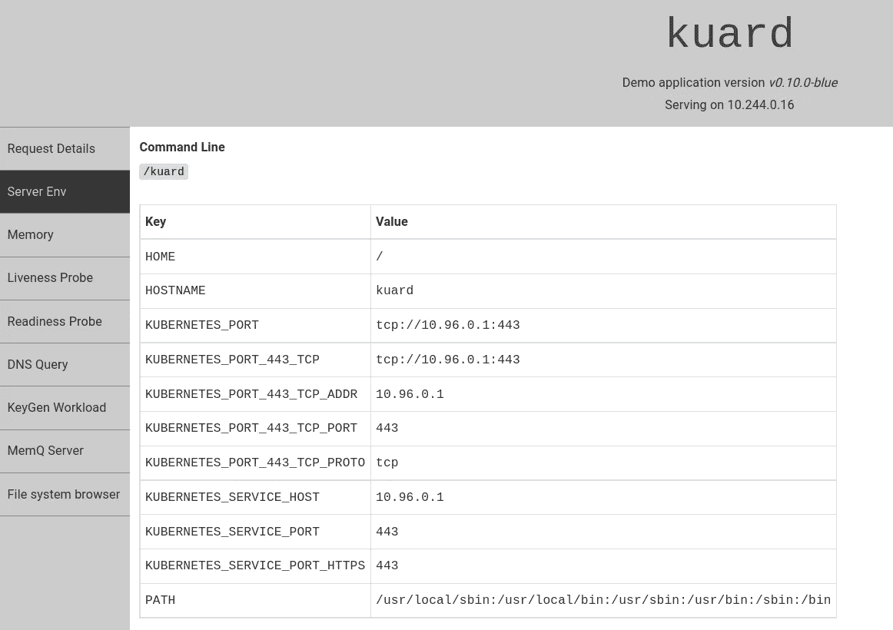
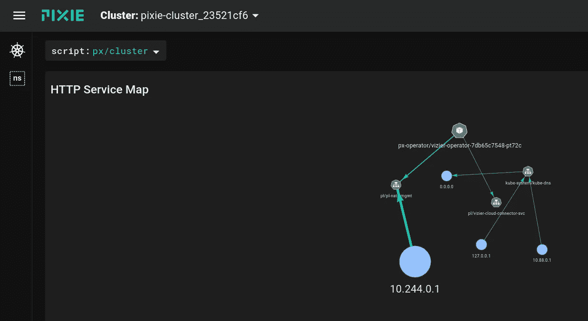
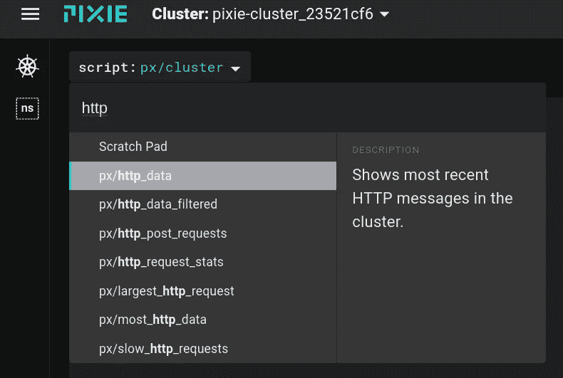
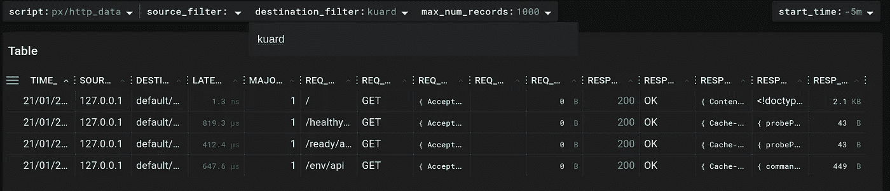
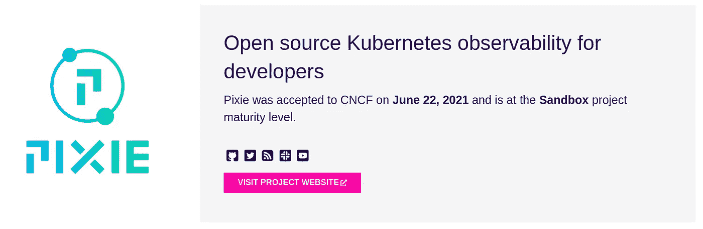

# 如何用 Pixie 解决 Kubernetes 的可观测性挑战

> 原文：<https://itnext.io/how-to-tackle-kubernetes-observability-challenges-with-pixie-4c6414ca913?source=collection_archive---------3----------------------->


卢克·切瑟在 [Unsplash](https://unsplash.com?utm_source=medium&utm_medium=referral) 上的照片

D 非集中式系统的可观测性一直是一个挑战。处理延迟、分布式事务、故障等变得越来越复杂。分散系统的抽象程度越高，推理、调试和故障排除就越困难。

## 在 K8s 上调试很难

使 Kubernetes 的可观察性如此困难的主要原因是工作负载和资源的易变和动态性质。我们现在不是处理一个服务器，而是处理未知数量的服务器(由于自动调用)。我们现在有多个分布式服务，而不是一个单一的应用程序。数据库也是如此，它们通常位于集群之外。

让我们想象一下，对运行在云提供商托管的 Kubernetes 集群上的 API 进行 HTTP(s)调用。这是一个简化的序列图，显示了关键点



来源:作者

在这个通信链的任何一点，事情都可能出错，性能可能下降，安全问题可能发生，等等。了解集群上正在发生的事情以及详细了解通信链的每一步对于运营绩效至关重要。

## 在哪里观察

现在我们知道观察什么，但问题是我们如何以及在哪里放置我们的观察点，洞察力的入口。

有几个选项:

*   将可观察性构建到服务和代码中。这带来了高度的控制，但是维护起来很麻烦并且不可扩展。
*   使用 sidecar 模式将可观察性逻辑注入每个 pod。更好，但这可能会导致性能问题，并且很难开发，因为一些不同的工作负载需要不同的指标，这些指标会随着时间的推移而变化。
*   使用低级系统调用来监控常用协议 stdout 和 stderr 的使用情况。这意味着在集群本身上安装一些东西，这更好，但通常意味着给这些东西扩展特权，并在 Linux 内核中租用。
*   使用带有 eBPF 探测器的低级系统调用。这带来了高扩展性和低开销。

将此与将更重要的指标导出到 Prometheus 结合起来，您就可以开始了。

## 底层技术

由于 eBPF(扩展巴克利包过滤器)的存在，这种粒度级的可观察性成为可能。一种协议，使内核以安全和高性能的方式可编程。

> *eBPF 是一项革命性的技术，起源于 Linux 内核，可以在操作系统内核中运行沙盒程序。它用于安全有效地扩展内核的功能，而无需更改内核源代码或加载内核模块。了解更多 eBPF，请访问*[*eBPF 简介*](https://ebpf.io/what-is-ebpf/) *。*来源:[https://ebpf.io/what-is-ebpf/](https://ebpf.io/what-is-ebpf/)

这里有一个[很棒的视频](https://www.youtube.com/watch?v=5t7-HM2jlTM&ab_channel=ContainerSolutions)，Liz Rice 详细解释了 eBPF。

下图显示了 eBPF 是如何在高层次上工作的



来源:Pixie 网页

# 使用案例和演示

之前，我们已经看到了一个在 Kubernetes 的交通流量的例子。流量中的每一步都应该产生对我们工作负载的有价值的见解。

这里列出了开发人员和运营人员都会感兴趣的典型见解。

*   豆荚表现如何
*   不同呼叫之间的延迟是多少
*   什么是 HTTP 有效负载
*   集群在负载下的表现如何

在演示部分，我们将在一个示例应用程序上查看 HTTP 流量。

Pixie CLI 带有预定义的演示应用程序，我们可以直接从命令行安装。然而，这些演示需要很长时间来加载，相反，我们将使用不同的应用程序。

## 先决条件

要进行演示，您需要安装以下组件:

*   码头引擎
*   迷你库贝星团
*   库贝特尔
*   舵

## 安装 Pixie

Pixie 是用于 Kubernetes 应用程序的开源可观测性工具。Pixie 使用 eBPF 自动捕获遥测数据，无需手动仪器。

我们将为 Pixie CLI 选择 docker 选项，以尽量减少系统混乱。

```
alias px="docker run -i --rm -v ${HOME}/.pixie:/root/.pixie pixielabs/px"
```

## 安装 Minikube

> *Pixie 目前仅支持 minikube，以下安装说明适用于 Debian Linux，其他安装说明可从* [*Minikube 页面*](https://minikube.sigs.k8s.io/docs/start/#installation) 获得

```
curl -LO [https://storage.googleapis.com/minikube/releases/latest/minikube_latest_amd64.deb](https://storage.googleapis.com/minikube/releases/latest/minikube_latest_amd64.deb)sudo dpkg -i minikube_latest_amd64.deb
```

## 启动 minikube

这将使用 KVM 驱动程序启动 minikube。

```
minikube start --driver=kvm2 --cni=flannel --cpus=4 --memory=8000 -p=pixie-cluster
```

如果您运行的是 Windows/MacOs，请使用`--driver=hyperkit`选项

## 使用 Pixie Cloud 创建帐户

这是可能的自我主机 Pixie，但出于演示目的，我们将创建一个免费帐户来访问指标用户界面。

```
px auth login
```

## 获取部署密钥

```
px deploy-key create
export PIXIE_DEPLOY_KEY=<copy key from the command result>
```

## 在集群上安装 Pixie

```
helm install pixie pixie-operator/pixie-operator-chart --set deployKey=$PIXIE_DEPLOY_KEY --set clusterName=pixie-cluster --namespace pl --create-namespace
```

安装可能需要几分钟时间。

## 安装 Kuard

[Kuard](https://github.com/kubernetes-up-and-running/kuard) 是《Kubernetes Up and Running》一书中的一个演示 K8s 应用程序

```
kubectl run --restart=Never --image=gcr.io/kuar-demo/kuard-amd64:blue kuard
```

一旦 pod 准备就绪，转发端口并访问 web UI

```
kubectl port-forward kuard 8080:8080
open [http://localhost:8080/](http://localhost:8080/)
```



## 浏览数据

可以直接从命令行运行查询，但是我们将直接进入一个活动的 UI。

导航至 https://work.withpixie.ai/live/

从`cluster`菜单中选择您的集群



点击脚本下拉菜单并选择`http/data`。



在目的地过滤器中输入`kuard`，只过滤我们 pod 的流量。



刷新 kuard 页面几次，并使用 Pixie UI 右侧的`RUN`按钮重新运行脚本。

请随意进一步探索 Pixie UI 并找到您感兴趣的指标。

## 建筑问题

如果您正在考虑将 Pixie 用于您的工作负载，那么您可能需要考虑一些架构方面的问题。这里有一些关于 Pixie 如何工作的事实，可能有助于解决其中的一些问题

*   数据保留在群集上，您可以决定是否要导出任何内容，例如导出到 Prometheus metrics。
*   数据保留 24 小时，占用空间很小，足以在边缘设备上正常工作。
*   查询是可扩展的，可以用 PiXL 语言(Python 的衍生)编写。
*   路线图上的某个地方是与[开放式遥测](https://opentelemetry.io/)集成，以实现像 Prometheus 或 Jaeger 这样的知名工具之间的无缝数据导出。

## 了解更多信息

Pixie 是一个沙盒 CNCF 项目。



> *要了解更多关于 Pixie 的信息，请查看他们的* [*网页*](https://docs.px.dev/installing-pixie/) *，其中包含更多示例和深入的解释，以及他们的*[*Github Repo*](https://github.com/pixie-io/pixie)*。*