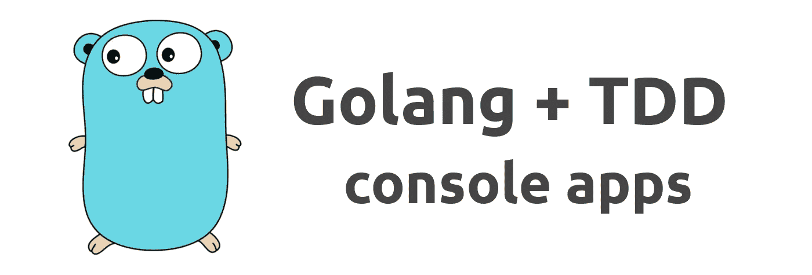
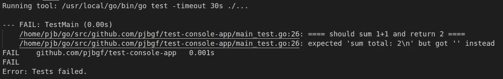
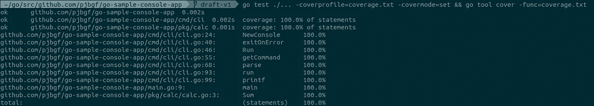
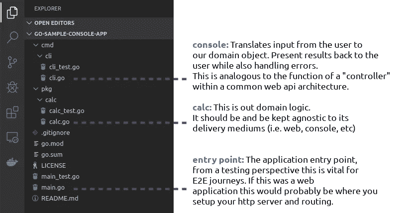

# 使用 TDD 对 Golang 控制台应用程序进行 100%的测试覆盖

> 原文：<https://itnext.io/how-to-tdd-a-console-application-to-achieve-100-coverage-starting-from-main-test-go-934a617b080f?source=collection_archive---------2----------------------->



由上田拓也[创作的地鼠](https://twitter.com/tenntenn)

## 我们将使用 TDD 创建一个控制台计算器应用程序，专注于进程内测试，以获得完美的测试覆盖和干净的架构。

在实践 TDD 时，您不可避免地会遇到一些场景，在这些场景中，要获得良好的覆盖率可能会有一点挑战性，尤其是在尝试不求助于进程外测试的时候。一般来说，`main.go`就是那种情况。

在开发控制台应用程序时，我会给出两个建议:

1.  保持尽可能少的代码。最终，这应该只是您的应用程序的入口点。
2.  真正尝试坚持 TDD 过程，首先创建一个测试，让它通过，然后再重构它。我还建议遵循[转换优先前提](https://blog.cleancoder.com/uncle-bob/2013/05/27/TheTransformationPriorityPremise.html) (TPP)，因为这将有助于保持一个干净的架构，并迫使代码变更由测试驱动。

最初，TDD 可能会感觉很慢，在应用 TPP 时更是如此，但是一旦你掌握了它的窍门，好处应该会开始显现出来。

# 都是为了第一次测试！

我们将从端到端测试开始，这将帮助我们驱动整个应用程序的架构。测试将集中在断言我们的计算器的加法运算，并将被放在一个名为`main_test.go`的新文件中。

在编写测试时，我倾向于从断言行开始。这将非常清楚地表明我将要测试的内容，因此在我着手实现实际测试时不会出现混乱。在这种情况下，我希望我的第一个测试断言计算器将能够对 1 + 1 求和并返回 2。

这段代码还不能编译，这绝对没问题。

注意`assertThat`将是一个变量 func。我个人以这种方式处理测试，使其读作英语:“断言应该求和 1 + 1 并返回 2”。当您需要创建同一个测试的不同变体时，它也会有所帮助，正如我们在创建新的操作(即乘法)时所需要的那样。

为了测试过程中的`main.go`，两件事将是最重要的:

1.  **覆盖输入:**在我们的计算器中，这是用户将用来执行应用程序的命令行:`calc 1 + 1`。
2.  **覆盖输出:**应用程序将使用标准输出向用户打印结果，因此它需要被覆盖，这样我们就可以对它进行断言。

## 覆盖输入

在这一点上，事情开始变得有趣起来，我们如何在不求助于进程外调用的情况下将`calc 1 + 1`转换成应用程序实际接收的内容？事实证明 golang 允许对`os.Args`进行修改，所以我们可以在调用`main()`之前简单地修改一下，大致如下:

```
os.Args = strings.Split("calc 1 + 1", " ")
```

同样，您的控制台应用程序可能依赖的任何输入源也需要进行相应的处理。例如，如果你正在创建一个支持`os.Stdin`或者需要访问环境变量的应用程序，这些需要在`main.go`处理。

关注保持`main.go`作为整个应用程序中唯一可以访问`os.*`资源的地方。这将提高应用程序的可测试性，并使应用程序的每个部分都与其适当的抽象级别保持一致。

## 覆盖操作系统。标准输出

`os.Stdout`的实现基于`*os.File`。这不是一个用于测试的好类型，所以在其他抽象层次，我们将用`io.Writer`来代替它。然而，此时我们别无选择，只能使用临时文件来覆盖`os.Stdout`。

在覆盖了输入和输出之后，我的测试如下所示:

为了简单起见，我不处理创建临时文件的错误，也不处理读取临时文件的错误。如果这些操作中的任何一个失败了，它们将会崩溃，因此，可以随意实现这些断言。

# 让我们追寻那道绿光吧！

一旦实际创建了测试，我们应该创建最小数量的产品代码来使它通过。

首先我会创建一个除了空的`func main()`之外什么都没有的`main.go`文件，这样代码就可以编译了。然后运行测试并得到错误:



在 TPP 之后，通过硬编码我们想要的结果来使测试通过:

现在运行我们的单一测试应该可以通过。这让我们处于一个非常有利的位置，从现在开始，无论发生什么，我们都可以保证不会破坏该命令的命令行语法，否则测试将会失败。

# 重构…

现在我们可以通过替换对`os.Args`和`os.Stdout`的依赖来重构这段代码。如前所述，`os.File`现在可以用`io.Writer`代替，`os.Args`可以用一个简单的字符串数组代替，这两者都将使我们未来的测试简单很多。

在`main.go`中只保留`main` func，在`main_test.go`中只保留应用的端到端测试是有意义的。我们将从它里面重构出`Run`，并把它放到一个新的`cli.go`文件中。

有了新的变化，我们也必须改变`main.go`中的代码:

从这一点开始，如果我们的要求迫使我们，我们将只接触`main.go`和`main_test.go`。否则，我们将专注于在`cli.go`创建测试，并从那里深入我们的测试。

# 命令行界面 CLI

现在我们有了一个`cli.go`,我们应该创建它的测试文件对应部分，这样我们就创建了一个新的测试，它将驱动我们更多的实现。为此，请记住 cli 将负责与处理参数、选择要执行的操作和错误处理相关的所有事情。

我们可以从测试开始，如果没有错误发生(例如，无效语法、无效操作等),我们只运行加法命令。)这里我还将一次性添加两个测试以避免冗余，但是在开发时，一次做一个。:)

这是`cli_test.go`的样子:

请注意，我跳了几步，在那里得到了一个工厂，否则这篇帖子会有两倍长。:)工厂将负责处理传入的参数，并根据`args`决定哪个命令最合适，目前，它将被硬编码为总是返回`additionCommand`:

我们可以通过为`additionCommand`创建测试来迫使一些真正的计算开始发生:

通过最少的更改，它将通过所有测试:

这将持续一段时间，因为您可能会测试`NewConsole`以确保它在接收到`nil`作为输入时会出现混乱。根据传递给 args 的操作符，`GetCommand`实际上返回了正确的类型。一旦所有这些都实现了，所有的测试都通过了，你也可以将`a.value1 +a.value2`从`run` func 重构到它自己的`calc`包中，毕竟，那是我们的领域逻辑和一个完全不同的抽象层次。

# 就这些吗？等等！退出密码呢？

控制台应用程序中的一个重要部分是退出代码。然而，测试退出代码可能相当棘手，原因是当您执行`os.Exit(2)`(或`log.Fatal`)时，后台会调用一个`exit`系统调用，这将使您的应用程序立即停止。当测试中出现这种情况时，测试就会失败——甚至在您的断言执行之前。

这里的答案是求助于进程外测试。然而，我们想确保我们测试的是其他测试运行的同一个编译版本，因此我们不应该用`go run`或`go test`来测试。相反，我们将使用您执行`go test`时在幕后编译的测试二进制文件，这将使所有事情保持同步。

以下是一些需要注意的事项:

1.  当前的可执行文件名称是我们用来运行新命令的名称。这是我们确保测试与其他测试完全相同的二进制文件的方法。
2.  将要执行的新的进程外测试是`TestMain_ErrorCodes_Inception`，所以我们将它作为参数传递给文件。
3.  `TestMain_ErrorCodes_Inception`测试只有在收到环境变量`ErrorCodes_Args`时才会执行`main()`。这也将用于覆盖该测试中的`os.Args`。这对于测试多个测试场景非常有用，每个场景都有不同的命令行，导致不同的退出代码。
4.  第`if !ok {`行主要是为了确保如果测试没有出现错误代码，不会使您的测试错误难以阅读。
5.  我只验证`CombinedOutput`，它包含标准输出和标准误差。我可以将它们分开，并确保我只通过 StdErr 得到错误。但是我决定在`cli_test.go`的其他测试中验证这一点。

在通过测试之前，这个测试将会在应用程序代码中驱动相当多的变化。注意`main.go`现在必须同时传递`os.StdErr`和`os.Exit`。后者的原因是为了确保我们可以在测试`cli.go`时覆盖它，否则它将需要另一个进程外测试，并且还会违反我们的抽象层。

# 那么最后会是什么样子呢？

下面只是应用程序代码，测试和完整的源代码可以在[这个 repo](https://github.com/pjbgf/go-sample-console-app) 找到。

## main.go

仍然是一个单独的 liner，但是现在它也传递给了`cli`标准错误和退出方法。

## cli.go

从下面的实现来看，我可能会改变的一件事是避免违反[告诉不要问](https://martinfowler.com/bliki/TellDontAsk.html)并将解析参数的责任转移到命令本身，然而，我认为一旦实现了更多的操作，并且实际上出现了这种需求，这将是一个重构步骤。

## 计算. go

我们的领域逻辑非常简单，所以这没什么好奇怪的:

一旦实现，结果应该是 100%的测试覆盖率:



# 关于项目组织和清洁建筑的说明

最后，应用程序将分为三个部分:



每个部分都有自己的职责，最重要的是，它们之间的依赖只有一个方向，我们的域逻辑(calc)是无依赖的。

# 现在怎么办？

一旦加法命令完全实现，为了实现下一个操作，比方说乘法，您将在`main_test.go`中创建一个新的端到端测试:

```
assertThat("should multiply 5 * 5 and return 25", "calc 5 * 5", "multiplication total: 25\n")
```

它会被放在我们一开始写的第一行代码的下面。一旦测试失败，您将实现一些代码来使它通过，然后创建其他测试来进一步深入实现。

我很喜欢 Rene French 的 gif，我在欺骗 c#开发者的 [4 golang 代码片段中使用了它，所以我将在这里再次添加它。:)](/4-golang-code-snippets-that-will-deceive-c-developers-6f50a31f0548)


图片来源:[雷内·弗伦奇](https://github.com/egonelbre/gophers)