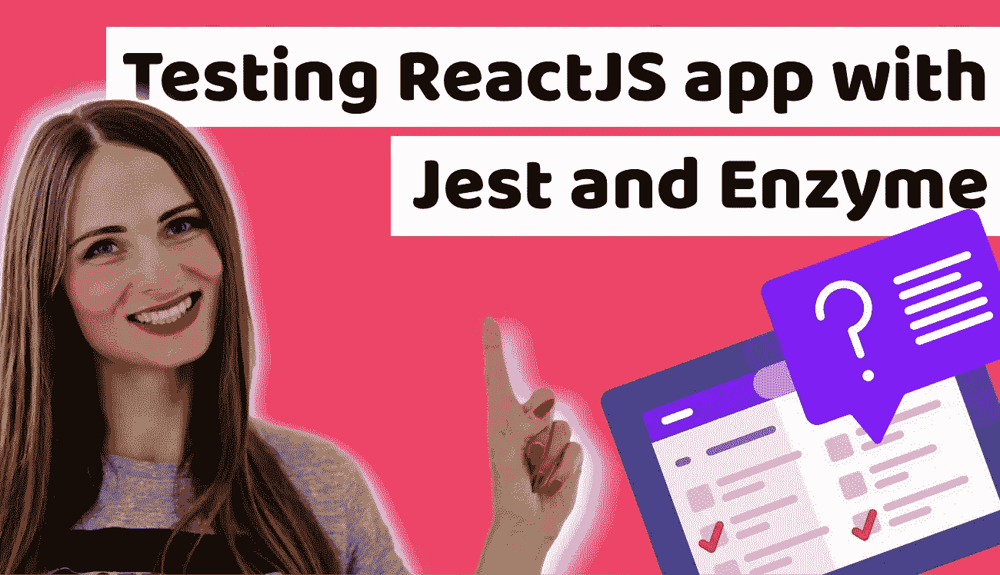
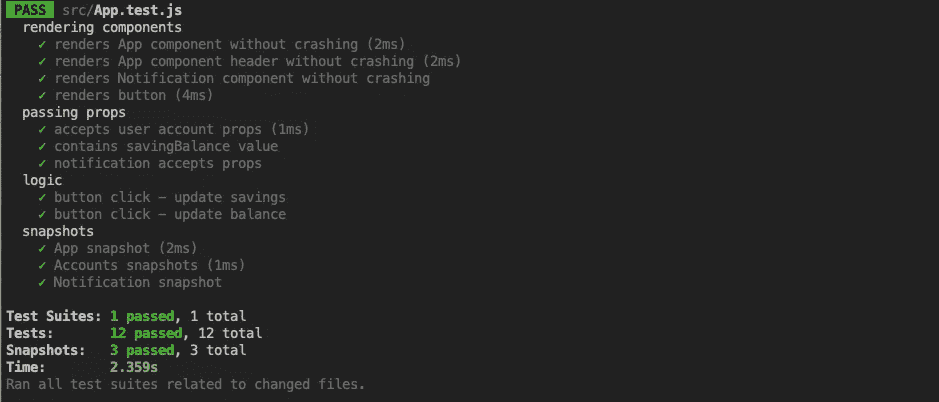

# 如何用 Jest 和 Enzyme 测试 React.js 应用程序——初学者测试教程

> 原文：<https://itnext.io/how-to-test-react-js-application-with-jest-and-enzyme-testing-tutorial-for-beginners-7f3a200f29d7?source=collection_archive---------1----------------------->



[用 Jest 和酶测试 ReactJS 应用](https://www.blog.duomly.com/testing-react-app-with-jest-and-enzyme/)

本文原载于[https://www . blog . duomly . com/testing-react-app-with-jest-and-enzyme/](https://www.blog.duomly.com/testing-react-app-with-jest-and-enzyme/)

# 前端应用测试简介

编写高质量的 web 应用程序需要测试，以避免一个组件在另一个组件发生变化时意外崩溃。有必要在开始时理解逻辑并计划测试用例，以便很好地测试应用程序。

在本文中，我想更深入地探讨开发概念，比如测试驱动开发(TDD)，并向您解释为什么测试应用程序是必不可少的。除此之外，我将讨论测试的利与弊，并描述测试 web 应用程序时使用的三种测试类型。

最后，我将进入实用部分，在这里我将使用 Jest 和 Enzyme 一步一步地测试一个简单的 React.js 应用程序。您可以在我们的 [Github](https://github.com/Duomly/reactjs-hooks-tutorial) 上找到应用程序的代码。

这是视频教程，我正在测试这个应用程序，所以如果你更多的是在观看而不是阅读，请加入我的 Youtube。

开始吧！

# 为什么测试很重要？

应用程序中的测试是检查编写的代码是否正确执行并带来所需的结果。

在我们编码的时候测试应用程序真的很有价值，可以为开发过程带来很多好处，对于未来的应用程序维护也是如此。

测试应用程序的最大好处是防止回归。感谢测试，如果新代码没有再次带来旧的错误，我们可以很容易地捕捉到。回归大大减慢了开发速度，如果有办法防止它，就应该这样做。

测试应用程序还提供了关于我们创建的代码的快速反馈，而不是使用多个`console.log`和手动测试，我们可以找出什么可行，什么不可行。

除此之外，测试帮助我们确保复杂的组件和逻辑在不同的情况下都能很好地工作，所以当我们试图与某些功能进行交互时，不会有意外的惊喜。

测试帮助开发人员创建较少错误的应用程序，并允许我们尽早发现和修复错误。它还简化了新功能的添加，降低了构建应用程序的成本。

# 测试的利与弊

即使单元测试是必不可少的，它也有一些优点和缺点，开发者应该意识到这一点。

测试的优点是:

*   尽早发现错误并尽早修复的可能性
*   写得好的测试提供了某种文档，这有助于新开发人员理解应用程序中发生了什么
*   它减少了手动测试的时间
*   有助于轻松维护和改进应用程序，减少错误

测试的缺点是:

*   编写测试很耗时
*   需要做更多的代码
*   写得不好的测试可以跳过重要的错误

# 什么是测试驱动开发？

测试驱动开发是一种方法，它假设测试是在代码之前编写的，任务是创建通过测试的代码。

测试驱动开发的编码过程分为六个步骤:

1.  编写测试
2.  运行所有新的和现有的测试。在这一步，新的测试应该会失败，因为还没有现有的代码。
3.  编写通过测试的最少代码。
4.  再次运行测试以检查它是否通过。
5.  如有必要，重构代码。
6.  重复一遍。

对于开发高质量的应用程序来说，TDD 是一个很好的解决方案，但是它有优点，也有缺点。

让我们看看 TDD 的优点是什么:

*   在开发过程中编写小测试迫使代码模块化
*   TDD 支持良好的架构和模块化
*   这有助于简化维护
*   它有助于从一开始就阐明项目的需求，并有助于避免误解
*   它在应用程序中提供了高覆盖率的测试

TDD 的缺点是:

*   这可能很难写
*   由于编写额外的代码，它会减慢开发速度
*   很难应用于现有的或者遗留的代码测试，有时需要重构

除了纯粹的 TDD，还有一个解决方案可以考虑，尤其是在前端。在测试驱动开发的情况下，我们正在测试实现，在小的更改之后，测试很容易失败。

但是如果我们测试应用程序的行为，那么实现中的小变化不会使我们改变测试。这种方法被称为行为驱动开发，在前端项目增长的情况下，这是一个值得考虑的解决方案。

# 测试类型

在测试应用程序时，我们可以将测试分为三种类型:

*   **单元测试** —这种类型的测试集中在被称为单元的单个组件、功能和模块上。单元测试隔离特定的单元，并分别进行测试，以确保应用程序的每个部分都经过测试并按预期工作。在这种测试中，我们不是测试每个单元的集成。
*   **组件测试** —这种类型的测试侧重于测试作为应用程序的一个单独部分的单个组件。
*   **快照测试** —快照测试用于确保 UI 不会发生意外变化。框架从组件创建一个快照，然后将其与当前状态进行比较，检查是否有变化。

现在，让我们用 Jest 和 Enzyme 来测试 ReactJS 应用程序。

# 如何用 Jest 和酵素一步步测试 ReactJS app？

这是本文的实践部分，我想一步一步地测试我现有的 ReactJS 应用程序。

如果你想加入并和我一起做，你可以在我们的 [Github](https://github.com/Duomly/reactjs-hooks-tutorial) 上找到代码。

为了测试，我将使用 Jest 和酶。Jest 是一个专注于简单性的 Javascript 测试框架。它可以与大多数现代前端框架和纯 Javascript 一起工作。

Enzyme 是一个用于测试 ReactJS 组件的库，使用起来非常简单和直观。

## 1.装置

让我们从安装所有必需的库开始。使用`yarn`或`npm`打开应用程序和控制台，安装 Jest、Enzyme 和一些附加插件。

如果你用`create-react-app`创建了你的应用，你不需要安装`Jest`，它已经存在了。

```
yarn add enzyme enzyme-adapter-react-16 react-test-renderer
yarn add enzyme-to-json
```

如果你的项目中还没有`Jest`，你可以用下面的命令安装它:

```
yarn add jest
```

准备就绪后，我们可以打开应用程序代码并开始设置测试环境。

准备就绪后，我们可以打开应用程序代码并开始设置测试环境。

## 2.设置测试文件

请打开`setupTest.js`文件，我们需要在这里配置适配器，以便在 Jest 环境中正确使用 Enzyme。

```
import { configure } from "enzyme";
import Adapter from "enzyme-adapter-react-16";
configure({ adapter: new Adapter() });
```

当准备好并保存后，下一步将是考虑测试用例。

## 3.准备测试用例

当我们开始测试任何应用程序时，我们需要知道我们想在里面测试什么。这就是为什么在这一步中，我们要考虑对我们来说很重要的测试案例。

在我们的 ReactJS 应用程序中，我们有一个非常简单的功能。组件被渲染，然后有一个按钮改变框中的值。当余额框为 1000 或更少时，我们通过更改类来显示通知。

所以，首先，让我们测试的是所有的组件都被渲染了。

接下来，我们来检查一下通过组件传递的道具是否正确。

然后我们可以检查逻辑，所以如果单击按钮，两个帐户的值都会改变。

最后，我们可以测试快照。

现在，我们有四组主要的测试想要测试。

## 4.测试组件是否正在呈现

让我们从第一组开始，我们将测试我们的组件是否被正确渲染。我们将使用`describe`对其进行分组。

让我们打开`App.test.js`文件，我们将在其中放置所有的测试。因为应用程序并不大，所以我们不打算把它放在不同的文件中。但是在比两个组件更大的应用程序的情况下，为每个组件分别创建一个测试文件是非常好的。

```
import React from 'react';
import App from './App';
import AccountBalance from './AccountBalance.jsx';
import Notification from './Notification.jsx';
import { shallow, mount } from 'enzyme';
import toJson from "enzyme-to-json";

const userBalance = {
  balance: 1100,
  savingBalance: 103,
}

describe("rendering components", () => {
  it("renders App component without crashing", () => {
    shallow(<App />);
  });
  it("renders App component header without crashing", () => {
    const wrapper = shallow(<App />);
    const header = (<h1 className="has-text-centered title is-1">Welcome in the personal finance app!</h1>);
    expect(wrapper.contains(header)).toEqual(true);
  });
  it("renders Notification component without crashing", () => {
    shallow(<Notification />);
  });
  it("renders button", () => {
    const wrapper = mount(<AccountBalance accounts={userBalance} />);
    const label = wrapper.find("#balance-button").text();
    expect(label).toEqual("Send 100$");
  });
});
```

正如你在代码中看到的，我们首先使用的是`shallow`，它负责呈现没有子组件的组件。如果我们需要查看组件中是否呈现了任何额外的元素，我们可以通过定义元素并使用`.contain()`方法来检查它是否存在。

此外，我已经创建了一个`userBalance`对象，这是一个道具的模拟，将在下一步中使用。

## 5.测试通过道具

现在，我们可以进入下一个测试用例，即将道具传递给组件。让我们用组内的`describe().`创建另一个组，我将设置三个测试，检查道具是否被接受，它们是否正确显示，以及通知道具是否通过。

```
describe("passing props", () => {
  const accountWrapper = mount(<AccountBalance accounts={userBalance} />);
  const notificationWrapper = mount(<Notification balance={userBalance.balance} />);
  it("accepts user account props", () => {
    expect(accountWrapper.props().accounts).toEqual(userBalance);
  });
  it("contains savingBalance value", () => {
    const value = accountWrapper.find(".savings").text();
    const expectedValue = userBalance.savingBalance + "$";
    expect(value).toEqual(expectedValue);
  });
  it("notification accepts props", () => {
    expect(notificationWrapper.props().balance).toEqual(userBalance.balance);
  });
});
```

所以，现在我们可以确定我们的道具被成功地传递给了子组件。现在让我们测试一下应用程序的逻辑。

## 6.测试逻辑

我们测试的下一步是检查逻辑是否正常工作。这里的逻辑并不复杂，因为最重要的功能是在按钮点击事件时更改帐户值。

在`App.test.js`中，我们再添加一个`describe()`组。

```
describe("logic", () => {
  const wrapper = mount(<AccountBalance accounts={userBalance} />);
  wrapper.find("#balance-button").simulate("click"); it("button click - update savings", () => {
    const savingsValue = wrapper.find(".savings").text();
    const expectedValue = userBalance.savingBalance + 100 + '$';
    expect(savingsValue).toEqual(expectedValue);
  });
  it("button click - update balance", () => {
    const balanceValue = wrapper.find(".balance").text();
    const expectedBalanceValue = userBalance.balance - 100 + '$';
    expect(balanceValue).toEqual(expectedBalanceValue);
  });
});
```

首先，我定义了 AccountBalance 组件包装器；然后我用了。simulate()方法模拟选中按钮上的 click 事件。接下来，我们有两个测试来检查点击事件后的功能。

## 7.快照

测试我们简单应用程序的最后一步是快照。为此，我们将使用在本教程开始时安装的附加插件`enzyme-to-json`。在这个组中，我还将定义三个案例，一个用于 App 组件，一个用于 AccountBalance，一个用于通知组件。

```
describe("snapshots", () => {
  it("App snapshot", () => {
    const tree = shallow(<App/>);
    expect(toJson(tree)).toMatchSnapshot();
  });
  it("Accounts snapshots", () => {
    const accountBalanceTree = shallow(<AccountBalance accounts={userBalance} />);
    expect(toJson(accountBalanceTree)).toMatchSnapshot();
  });
  it("Notification snapshot", () => {
    const notificationTree = shallow(<Notification />);
    expect(toJson(notificationTree)).toMatchSnapshot();
  });
});
```

如果 UI 中有一些更新，并且快照测试失败，您可以使用`u`来更新快照。

此外，在首次完成快照测试后，您会在应用程序中看到一个名为`__snapshots__`的新文件夹，快照将保存在该文件夹中。

## 8.测试

现在，是时候真正测试我们的应用程序并运行测试了。让我们打开终端，并运行以下命令:

`yarn test`
或
`npm test`

然后你应该会看到测试正在运行，你会看到你的测试列表，你会看到他们是否通过。
你可以玩玩测试，看看它失败时是什么样子。

这是我的结果:



用 Jest 和酶结果进行 ReactJS 测试

# 结论

在本文中，我介绍了测试 web 应用程序的好处，并指出了测试的一些优点和缺点。除此之外，我还介绍了什么是测试驱动开发，以及它的优点和缺点。我还经历了前端应用程序测试中的三种测试。

之后，我参加了一个实际的任务，在 ReactJS 中有一个应用程序需要测试。我已经安装了所有必要的插件和库；在那之后，我们已经计划了测试用例并通过了测试。

我希望这篇文章对您有所帮助，尤其是如果您是测试初学者的话。本教程将帮助您理解什么是测试，它带来了什么好处，以及如何测试您的应用程序。


[Duomly —编程在线课程](https://www.duomly.com?code=lifetime-80)

感谢您的阅读，
安娜