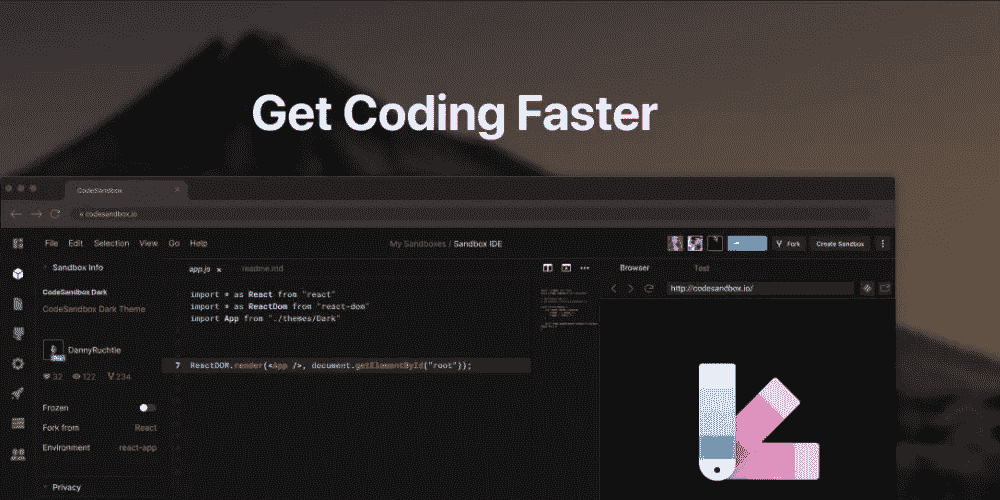
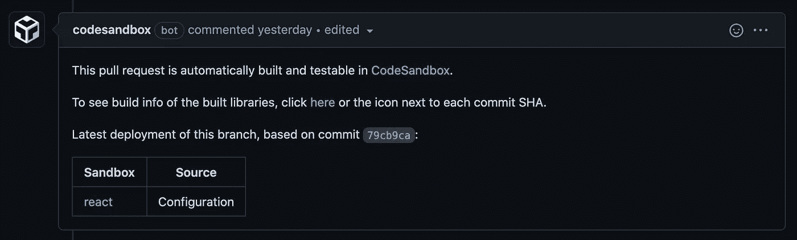

# 如何用 CodeSandbox CI 测试您的 GitHub Pull 请求

> 原文：<https://itnext.io/how-to-test-your-github-pull-requests-with-codesandbox-ci-a7945f166fa?source=collection_archive---------3----------------------->



如果你是一个开源项目维护者，或者你计划构建一个，你应该考虑在你的项目配置中使用 CodeSandbox CI。CodeSandbox CI 这是一个很棒的 GitHub 应用程序，可以根据请求自动构建你的开源项目。这可以节省测试和批准变更的大量时间和精力。

# 它是如何工作的？

每当有人打开一个新的 pull 请求时，CodeSandbox CI 都会为您的项目构建一个新版本。这些构建被发布到 CodeSandbox 注册表，因此您可以在那里或本地测试它，而无需将构建发布到`npm⁠`。

# 我如何设置它？

让我们创建一个演示项目来看看 CodeSandbox CI 的运行情况。为此，在 GitHub 上创建一个新项目，并将其命名为，例如，`codesandbox-ci-test`。在本地克隆并添加一个`package.json`文件，内容如下:

```
{
  "name": "codesandbox-ci-test",
  "version": "1.0.0",
  "main": "dist/index.js",
  "engines": {
    "node": ">=12"
  },
  "scripts": {
    "build": "kcd-scripts build"
  },
  "peerDependencies": {
    "react": "^17.0.2"
  },
  "devDependencies": {
    "kcd-scripts": "^11.2.2",
    "react": "^17.0.2"
  },
  "dependencies": {
    "@babel/runtime": "^7.16.0"
  }
}
```

这是一个 JavaScript 项目的标准 package.json 文件。我们将使用`kcd-scripts`来构建我们的项目，并且我们将使用`react`来为这个演示创建一个小的可重用组件。`@babel/runtime`是`kcd-scripts`所要求的，否则不会构建项目。

在`src/index.js`中创建一个简单的计数器组件:

```
import * as React from 'react';

export default function Counter() {
  const [count, setCount] = React.useState(0);

  return (
    <div>
      <p>You clicked {count} times!!!</p>
      <button onClick={() => setCount(count + 1)}>Click me</button>
    </div>
  );
}
```

将来自 https://github.com/apps/codesandbox[的 CodeSandbox Github 应用程序安装到我们的新仓库中。](https://github.com/apps/codesandbox)

在存储库根目录下名为`.codesandbox`的文件夹中创建一个名为`ci.json`的文件，并添加:

```
{
  "buildCommand": "build",
  "node": "12",
  "sandboxes": ["/cra-template"]
}
```

*   `buildCommand`表示应该运行 package.json 中的哪个脚本来构建项目。
*   `node`是用于构建 PR 的 Node.js 版本。
*   `sandboxes`是我们想要生成的沙箱列表。默认值为`vanilla`。

我们不想使用默认的沙箱，因为我们必须手动修改沙箱代码来导入和显示计数器组件。相反，我们将创建一个定制模板，命名为`cra-template`。

创建一个名为`cra-template`的新文件夹，在这个文件夹中创建一个`package.json`:

```
{
  "name": "react-starter-example",
  "version": "1.0.0",
  "description": "React example starter project",
  "main": "src/index.js",
  "dependencies": {
    "react": "17.0.2",
    "react-dom": "17.0.2",
    "react-scripts": "4.0.0"
  },
  "devDependencies": {
    "@babel/runtime": "7.13.8",
    "typescript": "4.1.3"
  },
  "scripts": {
    "start": "react-scripts start",
    "build": "react-scripts build",
    "test": "react-scripts test --env=jsdom",
    "eject": "react-scripts eject"
  },
  "browserslist": [">0.2%", "not dead", "not ie <= 11", "not op_mini all"]
}
```

使用以下内容创建一个`src`文件夹和一个`index.js`文件:

```
import { StrictMode } from 'react';
import ReactDOM from 'react-dom';
import Counter from 'codesandbox-ci-test';

const rootElement = document.getElementById('root');
ReactDOM.render(
  <StrictMode>
    <Counter />
  </StrictMode>,
  rootElement
);
```

用一个`index.html`文件创建一个`public`文件夹:

```
<!DOCTYPE html>
<html lang="en">
  <head>
    <meta charset="utf-8" />
    <meta
      name="viewport"
      content="width=device-width, initial-scale=1, shrink-to-fit=no"
    />
    <meta name="theme-color" content="#000000" />
    <link rel="manifest" href="%PUBLIC_URL%/manifest.json" />
    <link rel="shortcut icon" href="%PUBLIC_URL%/favicon.ico" />
    <title>React App</title>
  </head>
  <body>
    <noscript> You need to enable JavaScript to run this app. </noscript>
    <div id="root"></div>
  </body>
</html>
```

此时，我们可以创建一个新的拉请求，并查看我们的配置运行情况。CodeSandbox CI 应用程序将构建项目，并将在 pull 请求上留下注释。



您可以查看以下链接来查看结果:

*   PRs 的 CodeSandbox CI 仪表板:[https://CI . code sandbox . io/status/abereghici/code sandbox-CI-test/pr/1/builds/186555](https://ci.codesandbox.io/status/abereghici/codesandbox-ci-test/pr/1/builds/186555)
*   code sandbox app:【https://codesandbox.io/s/react-zmd24 

# 有用的链接和文档

如果您在这个过程中遇到了任何问题，请使用本文中的代码检查 Github 库【https://github.com/abereghici/codesandbox-ci-test[的](https://github.com/abereghici/codesandbox-ci-test)。

如果你对在 mono-repo 项目中使用 CodeSandbox CI 感兴趣，你可以查看来自 Twilio[https://github.com/twilio-labs/paste](https://github.com/twilio-labs/paste)的设计系统项目，看看它们的配置。

有关 CodeSandbox CI 的更多信息，请查看[文档](https://codesandbox.io/docs/ci)。

*最初发布于 2021 年 11 月 10 日*[*https://*bereghici . dev](https://bereghici.dev/blog/how-to-test-your-github-pull-requests-with-codesandbox-ci)*。*