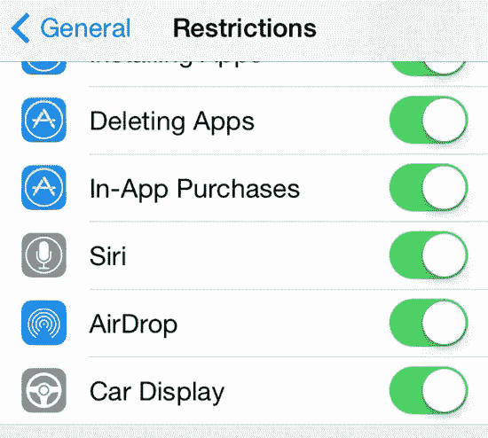
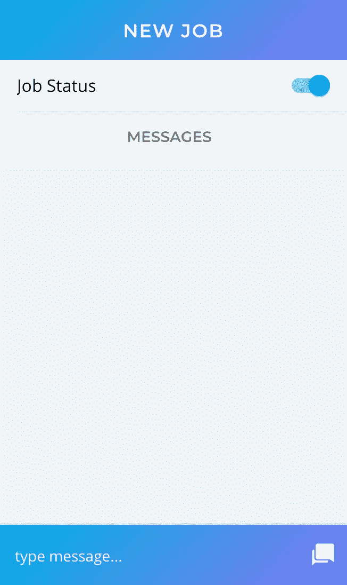

# 如何:使用 Ionic 和 Firestore 切换数据

> 原文：<https://itnext.io/how-to-toggling-data-with-ionic-and-firestore-1cb3d4f8cfde?source=collection_archive---------8----------------------->

> TLDR:你用 ngModel 切换到数据本身，然后用 ionChange 反转(切换)数据并推送到云端。

我记得当第一代 iPhone 问世时——它最漂亮的地方之一就是更新的应用程序 UI。特别是一些我最喜欢的 UI 改进是选择器和简单的开关。



iOS 切换正在运行！

当我在这种切换之前想到我们确实使用了带有“是”或“否”选项的复选框时，我有时会咯咯地笑——但是我跑题了。

首先，你需要一些来自 Firestore 的数据，比如说，我们有一个应用程序，用户可以将工作标记为“开放”或“关闭”。这些数据可能会被模拟成这样:

作业状态:“未完成”

我们的用户界面可能看起来像这样:



关闭该选项时，我们会将作业状态记录转换为“已关闭”。

# 步骤 1:将我们的字符串转换成布尔值

我们需要做的第一件事是将这些数据转换成布尔值(真或假)，使用如下简单函数:

```
job: Job;
jobStatus: boolean; // jobStatus is the boolean version of job.status - it can only be true or falseconstructor(public navParams: NavParams,) {this.job = navParams.get('job');// our getter functions
this.jobStatus = this.job.status === 'open' ? true : false;// note this uses a ternary which is the same as saying if job.status is open set to true otherwise set to false}
```

我们需要这样做的原因是 Angular 目前不支持 ngModel 中的三元运算符(关于这个 btw 还有一个未解决的问题)。

# 步骤 2:连接我们的模型和视图

现在，我们需要在模板中将开关与新的 jobStatus 变量挂钩，如下所示:

```
<ion-toggle [(ngModel)]="jobStatus"></ion-toggle>
```

SWèt 现在，当作业状态为“打开”时，我们的开关将显示为“打开”,反之亦然。但是等等，你可能会说，这不会发回数据！

# 步骤 3:当切换改变时更新模型

这是唯一有点棘手的部分，在 Ionic 文档中没有任何关于当开关被切换时会被触发的事件

快速的谷歌搜索告诉我，最简单的方法就是使用 ionChange。我更新了我的模板:

```
<ion-toggle [(ngModel)]="jobStatus" (ionChange)="updateJobStatus()"></ion-toggle>
```

# 步骤 4:更新我们的数据库

注意:如果使用 Firebase 或其他实时数据库，根据需要更新您的代码——过程是相同的！

现在我们只需要一个函数来响应我们的切换:

```
public updateJobStatus(): void {// the value of the jobStatus is already controlled by the toggle// so we can send it straight to fbconst jobRef: DocumentReference = this.afs.doc(`jobs/${job.id}`).ref;// change our jobStatus boolean back to a string
const jobStatus: string = status === true ? 'open' : 'closed'; jobRef.update({status: jobStatus,});}
```

注意我们是如何需要将 jobStatus 从布尔值变回字符串的？这是最后一点秘制酱。

瞧，我们完成了——很简单，不是吗？如果你认为这可以改进，请在下面留下评论，我退出。