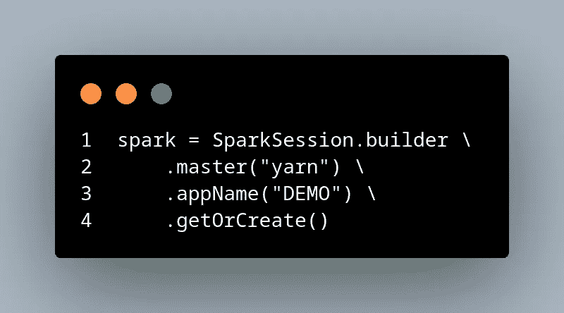
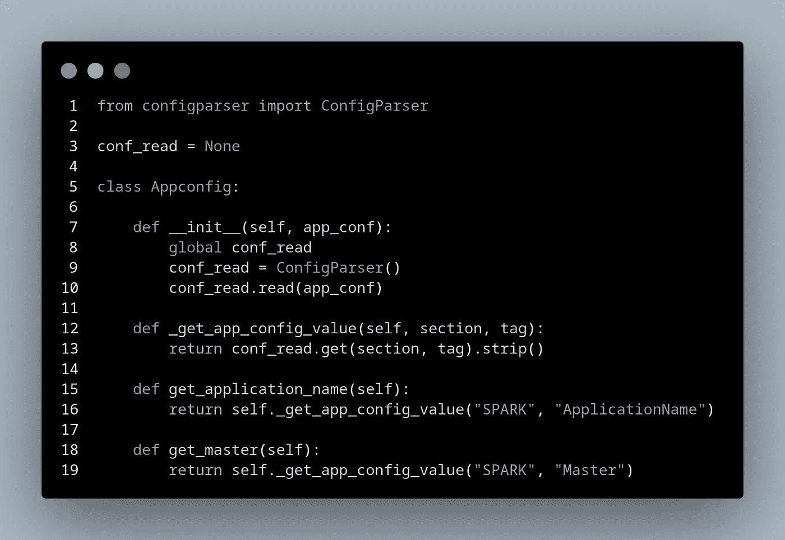
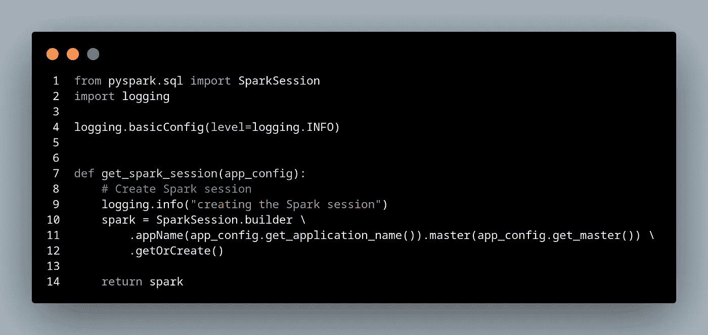
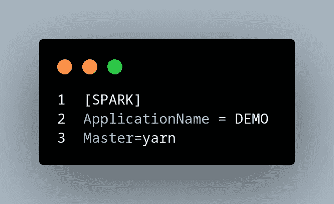
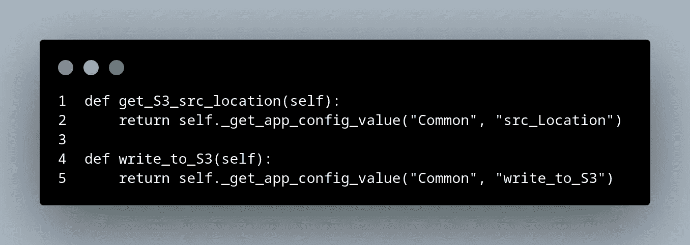
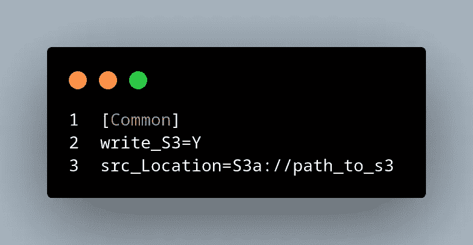

# 如何使用 ConfigParser 动态触发 Python/Pyspark 作业

> 原文：<https://itnext.io/how-to-trigger-python-pyspark-jobs-dynamically-using-configparser-c54b1bd3463e?source=collection_archive---------0----------------------->

让你的 spark 工作更灵活的有效方法。

Apache spark 提供了大量处理大规模大数据的选项，使其成为大数据和数据工程领域最受欢迎的技能之一。

几乎所有的在线教程都向我们展示了如何静态地定义 spark 会话，并根据用例传递配置值，这是一个很好的学习起点。随着您进入数据领域的旅程，在某个时候您会被要求开发生产级代码。

在生产环境中部署代码之前，必须在本地开发并在开发环境中测试。

出于演示的目的，让我们讨论一下 spark 会话，Spark 应用程序的入口点

如果你的工作有极简的功能性，上面的 spark 会话是合理的，也是可行的。在开发复杂的 ETL 作业时，您必须考虑很多因素，比如存储、配置、第三方集成、DQ 检查等等。

当您想在不同的环境中部署它时，您不能每次都简单地浏览代码并手动重构配置，这将非常耗时，并会导致错误配置，使调试成为一场噩梦。

理想的解决方案是定义一个 python 函数/方法来从. conf 文件中获取这些配置值，如下所示。我们将利用 python configparser 库。

下面的代码是不言自明的，并且有效地实现了期望的功能。

现在我们有了获取配置值的方法，现在让我们创建 spark 会话，并在运行时动态获取这些值。

现在我们需要在。conf 文件如下。configparser 库如何工作超出了本文的范围。我建议看一下 configparser 的官方文档。

get_config 特性的好处是我们可以在代码中的任何地方使用它。例如，如果我们想要读取和写入 S3 详细信息，或者设置标志来触发基于特定标志的方法，我们可以使用这个 get_config 包装器。

还有。conf 文件看起来像这样，

**结论:**

建议避免在代码中对值进行硬编码。这很有效，有助于快速部署，并节省大量调试时间。本教程旨在向您展示我们如何在运行时动态传递配置和值。希望这能对外面的人有用，让他们的日常工作变得简单。