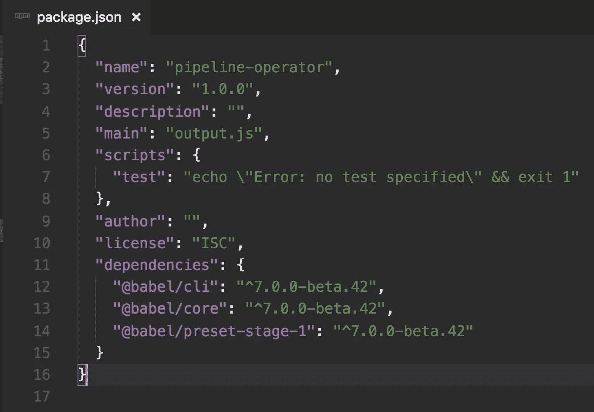

# 今天如何尝试 JavaScript 管道操作符

> 原文：<https://itnext.io/how-to-try-the-javascript-pipeline-operator-today-e3f75eb12cf1?source=collection_archive---------3----------------------->

是啊！是真的。JavaScript 可能会有自己的管道操作符！

“可能吗？”管道操作员目前处于 [TC39 流程](https://tc39.github.io/process-document/)的第一阶段。这意味着这只是一个建议，还不确定它是否会成为语言。当然，这不会阻止热情的 JavaScript 开发人员尝试它。

被提议的管道操作符类似于在诸如 [F#](http://fsharp.org/) 、[elixin](https://elixir-lang.org/)和 [Elm](http://elm-lang.org/) 等语言中可以找到的。如下所示的语法符合上面列出的语言。

# 它是做什么的？

管道操作符将作为一种以可读方式将函数管道化的方式。让我们来看看下面的片段:

```
const double = (n) => n * 2;
const increment = (n) => n + 1;// without pipeline operator
double(increment(5)); // 12// with pipeline operator
const result = 5 
  |> increment 
  |> doubleresult // 12
```

在没有管道操作符的示例*中，我们可以看到，为了得到正确的结果，必须在`double`函数中调用`increment`函数。在示例*中，使用管道操作符*，函数可以按照它们对参数进行操作的顺序放置。*

# 你自己试试

让我们从我们需要的东西开始:

*   节点/NPM - [获取节点 JS](https://nodejs.org)
*   你最喜欢的代码编辑器——推荐: [Visual Studio 代码](https://code.visualstudio.com/)
*   末端的

## 到环境设置！

假设你已经安装了 Node 和你喜欢的编辑器。我们可以从在您的计算机上创建一个名为`pipeline-operator`的目录开始。在这个目录中，我们将创建一个名为`pipe.js`的文件。

现在我们将需要使用 [NPM](https://www.npmjs.com/) (节点的包管理器)安装几个包，它可以通过 Node 获得。

使用您的终端，导航到您刚刚创建的目录。一旦到了那里，我们将需要执行一些命令。让我们从以下内容开始:

```
$ npm init -y
```

这将创建一个`package.json`文件。这个文件包含了项目及其依赖项的相关信息。你可以在这里了解更多关于这个文件的用途[。](https://docs.npmjs.com/files/package.json)

现在让我们添加使用管道操作符所需的包。

```
$ npm install --save @babel/cli @babel/core @babel/preset-stage-1
```

如果一切安装正确，您的`package.json`应该有一个新的`dependencies`属性，如下所示:



这里我们可以看到为了编译 JavaScript 代码而安装的 NPM 包。“编译？”因为管道操作符目前还不是 JavaScript 语言的一部分。我们需要将代码编译成 Node 能够理解的内容。本质上，我们将使用 [Babel](https://babeljs.io/) 将我们的代码翻译成 Node 可以理解和执行的东西。

为了让 Babel 知道如何正确编译代码，我们需要给它一些帮助。我们需要创建另一个名为`.babelrc`的文件，并添加以下几行:

```
{
  "presets": ["[@babel/preset-stage-1](http://twitter.com/babel/preset-stage-1)"]
}
```

现在 Babel 将知道如何将管道操作符翻译成可以由 Node 运行的代码。

## 让管道操作员投入工作

在我们之前制作的`pipe.js`文件中。键入以下内容:

```
const capitalize = str => str[0].toUpperCase() + str.substring(1);
const splitOnSpaces = str => str.trim().split(' ');
const getLastOfArr **=** arr **=>** arr.pop();const lastName = 'albert einstein'
  |> splitOnSpaces
  |> getLastOfArr
  |> capitalizeconsole.log(lastName); // Einstein
```

为了让我们运行下面的代码，我们需要以一种特殊的方式使用 Babel。我们需要将以下内容添加到我们的`package.json`文件`scripts`属性中。

```
"scripts": {
  "start": "babel pipe.js --out-file output.js && node output.js"
},
```

现在我们可以简单地在我们的`pipeline-operator`目录的根目录中执行下面的代码。使用您的终端:

```
$ npm start
```

如果你在终端窗口看到`Einstein`的输出，你就知道它工作了。


# 现在怎么办？

实验！创造你自己的例子并分享它们。试着想象一下管道操作员会如何清理您当前项目中的一些代码。

如果您想帮助支持管道运营商成为 JavaScript 语言的一部分，或者如果您只是希望看到更多潜在的用例。可以访问 [TC39 GitHub 提案页面](https://github.com/tc39/proposal-pipeline-operator)。

不想自己设置这个项目？没问题。你可以在这里找到准备就绪的回购！

欢迎反馈，并随时使用下面的链接进行连接。

[LinkedIn](https://www.linkedin.com/in/james-hall-treworgy-064b5a112)|[GitHub](https://github.com/James-H33)