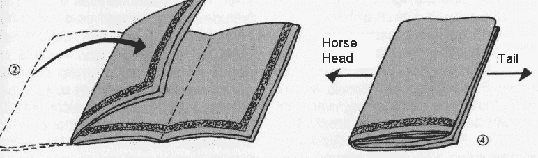

# 如何理解 reduce()？

> 原文：<https://itnext.io/how-to-understand-reduce-d246b7a70f78?source=collection_archive---------3----------------------->

## TypeScript/JavaScript 中的函数编程


数百万条银鱼变成了龙卷风

`reduce`是另一个函数式编程概念，它在 JavaScript 中作为数组方法提供:`Array.prototype.reduce()`:

> `**reduce()**`方法对一个累加器和数组中的每个元素(从左到右)应用一个函数，将它减少到一个值。

以上 [MDN 对方法的解释](https://developer.mozilla.org/en-US/docs/Web/JavaScript/Reference/Global_Objects/Array/reduce)过于简单，有时会给人造成混乱。事实上，`reduce`非常强大，在我看来它有两个用例:折叠列表或转换初始值。

## 减少的参与者

首先让我们来看看`reduce`包含了什么。共有 3 名参与者:

*   **列表**
*   **减速器**(reduce 功能)
*   **初始值**(有时可以省略，不存在时，是列表中的第一项)

例如:

```
function sum(sum: number, item: number): number {
  return sum + item;
}const list = [1,2,3];const result = Array.prototype.reduce.call(list, sum); // -> 6
const result2 = Array.prototype.reduce.call(list, sum, 1); // -> 7
```

**列表**是数组。**减速器**为`sum`功能，第二种情况下**初始值**为数字 1。

## 输入/输出形状

然后，为了更好地理解`reduce`，让我们来了解一下输入/输出形状的概念。我们都知道函数接受输入并生成输出。在纯函数中，没有副作用，所以我们可以说，当我们调用纯函数时，它只是把输入转换成输出。

例如，下面的函数接受两个数字并输出一个数字。看起来是:`[], number -> []`。

```
function sum(a: number[], b: number): number[] { 
  return [...a, b]; 
}
```

你可以想象把一块石头放在一堆石头上面:


[https://unsplash.com/photos/70zb7HHhspc](https://unsplash.com/photos/70zb7HHhspc)

现在，记住形状概念，我们可以将`reduce`的用法分为两种情况:

1.  折叠列表，形状看起来是这样的:`Object[] -> Object`
2.  变换初始值，形状看起来是这样的:`Object -> Object`

## 1.折叠列表:`Object[] -> Object`

这是为了转换列表中的输入，并输出一个值。

你知道`reduce`有时也被称为`fold`，你可以通过想象将一条长毯子折叠成垫子来得到提示:



`reduce`的例子大多属于这一类。

## 示例:计算数组的和

```
function sum(sum: number, item: number): number {
  return sum + item;
}const list = [1,2,3];const result = Array.prototype.reduce.call(list, sum); // -> 6
```

它的作用是:

*   将**列表**中的第一项作为**初始值**
*   循环浏览**列表**并
*   逐个应用**减速器函数**，并将结果链接到下一次迭代

## 示例:查找数组中的最大数字

想想输入和输出的形状，它把一个列表转换成一个单一的值，所以我们可以像这样`reduce`:

```
function max(a: number, b: number): number {
  return a > b ? a : b;
}const list = [1,5,3];const result = Array.prototype.reduce.call(list, max); // -> 5
```

## 2.变换初始值:`Object -> Object`

除了变换**列表**，我们还可以变换**初始值**。在这种情况下，就像递归地将**缩减器**函数应用于**初始值**并链接输出。


[https://twitter.com/danicapatrick/status/508602513789304832](https://twitter.com/danicapatrick/status/508602513789304832)

想象你和粉丝击掌，你是**初始值**，粉丝是**单子**击掌动作是**减速器**。

## 示例:用替换选项列表替换 uri 参数:

假设您有一个 uri `*https://abc.com/:id/docs/:docId/history*`，并且您想要将`:id`替换为用户 id。

想想函数的形状是把对象(uri)转换成另一个 uri(用参数替换)，所以我们可以这样做:

```
const replacementOptions = [
  {replace: ‘:id’, to: ‘SJDUEB’}, 
  {replace: ‘:docId’, to: ‘12345’}
];const uri = ‘https://[abc.com/:id/docs/:docId/history](http://abc.com/:id/docs/:docId/history)’;function reduce(uri: string, option: any): string {
  return uri.replace(option.replace, option.to);
}const result = Array.prototype.reduce.call(
  replacementOptions, // list
  reduce, // reducer
  uri // initial value
);
```

在这种情况下，我们可以看到**初始值** ( `uri`)是由**减速器**函数根据**列表** ( `replacementOptions`)转换而来的。

请注意，它不再转换列表。

## **举例:写一个简单的**[**Redux**](https://redux.js.org/)**实现**


Redux 是一个状态管理库。它有一个全局状态对象，每个动作都会减少状态。

让我们写一个非常简单的 Redux 实现。

```
const initialState = {sum: 0, history: []};function reduce(state: any, action: any) {
  return {
    sum: state.sum + action.n,
    history: [...state.history, action.name]
  };
}const action1 = {
  name: 'action1',
  n: 1
};const action2 = {
  name: 'action2',
  n: 2
};const list = [action1, action2];const finalState = Array.prototype.reduce.call(
  list, 
  reduce,
  initialState
);console.log(finalState); // {sum: 3, history: ['action1', 'action2']}
```

同样，你可以看到我们正在转换**初始值**，而不是**列表**。

*本文属于 TypeScript/JavaScript 中* [*函数式编程系列。*](https://medium.com/@hamxiaoz/functional-programming-in-typescript-javascript-d9d79663bc4)