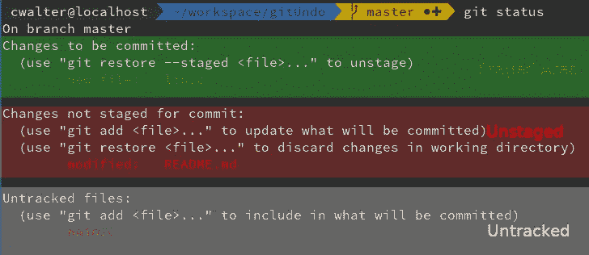
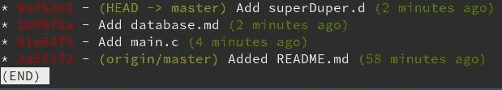
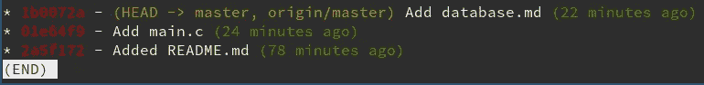
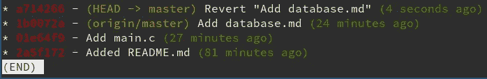

# 如何在 git 中撤销提交

> 原文：<https://itnext.io/how-to-undo-a-commit-in-git-2c7d49deabe0?source=collection_archive---------1----------------------->

吉姆·威尔逊在 [Unsplash](https://unsplash.com/s/photos/revert?utm_source=unsplash&utm_medium=referral&utm_content=creditCopyText) 上的照片

许多开发人员在 git 中努力撤销提交。有时，人们会不小心做出不应该出现在树中的更改。我想向您展示如何在本地或远程撤销这些更改。

基本上，一个文件可以有三种不同的状态。可以是*未跟踪*、*未分级*或*分级*。**未跟踪的**文件从未被添加到树中，这意味着它们是全新的。**未暂存**文件是已经在树中但已经被修改的文件。这些修改后的变更可以添加到下一个状态文件中，即*暂存的*文件。**暂存的**文件是那些进入下一次提交的文件。如果您在存储库中键入 git status，您也可以看到这三种状态。

git 状态—不同的文件状态

# 从暂存文件中删除新文件

暂存文件是那些将进入您下一次提交的文件。如果您不小心将文件添加到了*暂存的*区域，您可以通过键入`git restore --staged <file>`来撤销此操作，因此在这种情况下，它将是`git restore --staged lib.c`。文件`lib.c`将被再次移动到*未跟踪区域*，因为它是一个全新的文件。您所做的更改将仍然存在。如果您不再需要所做的更改，您可以删除该文件。

# 从暂存文件中删除现有文件

如果文件已经在树中，您可以保留所做的更改，或者将其重置为上次提交。`git restore --staged <file>`将再次将文件从*暂存*移动到*未暂存*区域。如果您想要将文件重置为最新提交，您首先必须*卸载*您的文件，即从*暂存*区域中移除它——然后您可以通过键入`git restore <file>`将文件恢复为最新提交。

好的—在未跟踪/未暂存区和暂存区之间移动文件很容易。但是，如果您已经提交了文件，并且需要撤销最近的提交，该怎么办呢？让我们看看如何解决这个问题。

# 撤消提交

因此，让我们假设您想要撤销最近的提交，但是想要保留您的更改。您在工作树中的提交基本上如下所示:

所以你现在的实际提交是“添加 superDuper.d”。现在，您希望撤销该提交，但保留更改。这些更改将从提交移动到*未暂存/未跟踪*区域。`git reset HEAD^`会将你的树重置为你当前所在的树之前的提交。`HEAD^`是`HEAD-1`的简称。`HEAD`是您的工作目录现在实际所在的位置。

如果您想放弃提交而不保留更改，请将`--hard`添加到命令:`git reset --hard HEAD^`。小心，这个**会删除**提交中所做的更改。

## 恢复远程提交

git 工具箱中最不需要的东西是`revert`。恢复意味着撤销最后一次提交。这里的问题是，树已经和你的遥控器同步了。所以*仅仅是*移除提交并不那么容易。我们要做的是撤销我们在单独的提交中所做的事情。`git revert HEAD`正是这样做的。它接受您最近的提交，并恢复所做的所有更改，并将这些恢复的更改提交到它自己的提交中。所以让我们检查一下我们当前的 git 历史。

所以现在我们想恢复最近一次提交，在这里我们添加了 *database.md* 文件。如果我们键入`git revert HEAD`,它会恢复最近一次提交的内容。虽然我们的树看起来像这样:

现在，您可以将所做的更改推送到远程设备，并且您成功地恢复了最近的提交。

## 进一步阅读

如果你想了解更多关于 git 的知识，以及如何在命令行中提高你的 git 技能，请查看我的关于[成为 Git Terminal Pro 的文章。](/become-a-git-terminal-pro-ab6d1955606f)

## 感谢阅读！