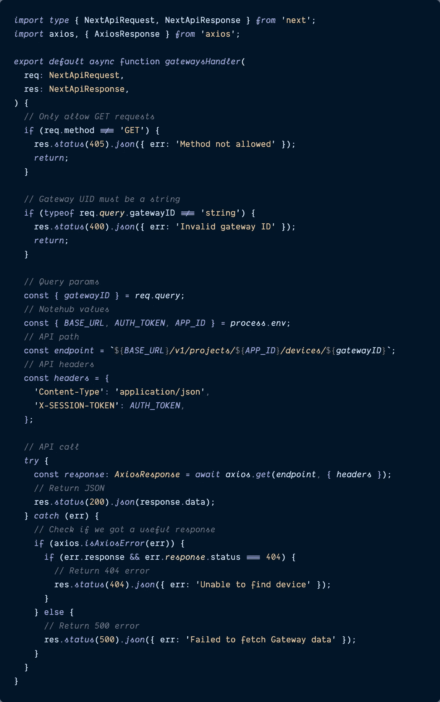
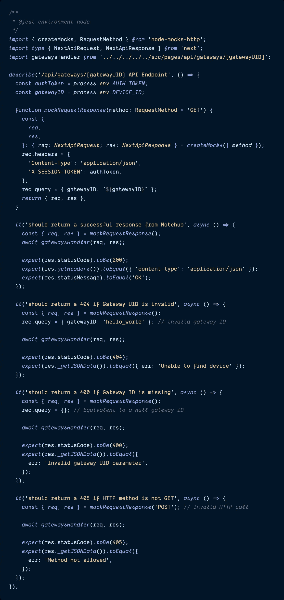
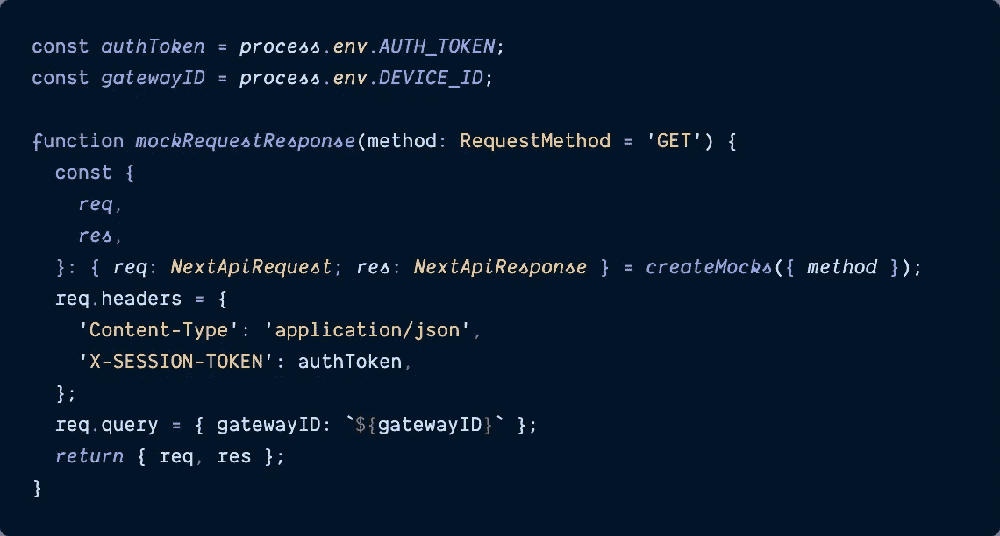

# 如何用 Typescript 对 Next.js API 路由进行单元测试

> 原文：<https://itnext.io/how-to-unit-test-next-js-api-routes-with-typescript-ec1146b4b9b3?source=collection_archive---------1----------------------->

## 如果您需要 env 变量、模拟数据和 Typescript 类型，这是您需要的。


# 介绍

[**Next.js**](https://nextjs.org/) 是一个牛逼的前端框架。它由 React 提供支持，因此它可以很好地处理 React 提供的一切:挂钩、上下文、热浏览器重载、Typescript 集成，然后它比 Create React 应用程序更进了一步，提供了更多类似于[路由](https://nextjs.org/docs/routing/introduction)、[服务器端渲染(SSR)](https://nextjs.org/docs/basic-features/data-fetching/get-server-side-props) 、[静态站点生成(SSG)](https://nextjs.org/docs/basic-features/data-fetching/get-static-props) 的功能，以及 SSR 和 SSG 附带的所有 SEO 功能。 *和*内置 [API 路由](https://nextjs.org/docs/api-routes/introduction) —不需要额外的节点服务器来安全地将 API 调用代理到数据库、另一个微服务或第三方 API。

在 [work](https://blues.io?&utm_source=medium.com&utm_medium=web&utm_campaign=sparrow-accelerator&utm_content=unit-test-nextjs-routes) ，我和一个开发团队一直在构建一个 [**的新应用**](https://github.com/blues/sparrow-starter) ，我们已经开源了这个应用来帮助我们的用户更快地使用我们创建的物联网(IoT)硬件。

对于我们的第一个“加速器应用”，想法是用户将获得一些我们的[物联网设备](https://blues.io/products/?&utm_source=medium.com&utm_medium=web&utm_campaign=sparrow-accelerator&utm_content=unit-test-nextjs-routes)，这些设备将开始收集数据，如温度、湿度、运动等。，他们会将环境数据发送到云[中](https://notehub.io?&utm_source=medium.com&utm_medium=web&utm_campaign=sparrow-accelerator&utm_content=unit-test-nextjs-routes)，然后他们会派生出我们的“启动应用程序”代码来启动和运行仪表板，从云中提取他们自己的传感器数据，并在浏览器中显示出来。

为了构建这个应用程序，我们决定使用 Next.js 框架，因为它提供了我上面列出的许多好处，其中最重要的一个是能够进行安全的 API 调用，而不必使用 Next.js 的 [**API 路由**](https://nextjs.org/docs/api-routes/introduction) 设置独立的节点服务器。应用程序显示的所有数据都必须从云(或数据库)中获取，设备数据在第一次记录后存储在云中。

这是一个生产就绪的应用程序，需要像自动化单元和端到端测试这样的东西来确保应用程序的各个部分按预期工作——这两者都是为了让开发人员和我们的用户相信，随着新功能的添加，现有功能保持不变。

虽然总的来说，Next.js [**文档**](https://nextjs.org/docs/getting-started) 很棒，但它确实有一个不足之处，就是在对这些 API 路径进行单元测试时。文档中几乎没有任何内容涉及如何使用 [Jest](https://jestjs.io/) 和 [React 测试库](https://testing-library.com/docs/react-testing-library/intro/)测试 API 路由——当涉及到任何基于 React 的应用程序时，这是事实上的单元测试库组合。

**这就是为什么今天我将向您展示如何对 Next.js API 路由进行单元测试，包括像本地环境变量、模拟数据对象这样的陷阱，甚至像** `**NextApiRequest**` **这样的 Next 特定对象的类型脚本类型。**

# 要测试的实际 Next.js API 路径

所以在我们开始测试之前，让我给你一个简单的例子，这个应用程序可能会进行的 API 调用的种类。对于我们的应用程序，首先必须从云中获取关于**“网关设备”**的信息。

> ***注:*** *我在实际回购中链接过的文件都是 GitHub 中的历史链接。该项目后来经历了一次重大的重构，为了将来的易用性和灵活性，更干净地划分了不同的层，但是如果您在提交历史中挖掘得足够远(或者只需单击超链接文件名)，您可以看到我们的工作代码，它与我下面描述的相匹配。*

## 获取网关设备信息

**网关**是操作的大脑——有许多传感器都与网关通信，告诉它们在各个位置获得的环境读数，网关负责将来自每个传感器的数据发送到云——这就像你在自行车车轮上看到的轮毂和辐条系统。

在应用程序中发生任何其他事情之前，我们必须获得网关信息，稍后可以使用这些信息来计算哪些传感器和读数与哪些网关相关。我不会深入讨论该应用如何工作的更多细节，因为这超出了本文的范围，但你可以在 GitHub [这里](https://github.com/blues/sparrow-starter)看到整个回购。

让我们关注一下从 Next.js 应用程序到我们的云的 API 调用(恰好叫做 [Notehub](https://notehub.io?&utm_source=medium.com&utm_medium=web&utm_campaign=sparrow-accelerator&utm_content=unit-test-nextjs-routes) )。为了[查询 Notehub](https://dev.blues.io/reference/notehub-api/device-api/#get-device-by-uid?&utm_source=medium.com&utm_medium=web&utm_campaign=sparrow-accelerator&utm_content=unit-test-nextjs-routes) ，我们需要:

*   [授权令牌](https://dev.blues.io/reference/notehub-api/api-introduction/?&utm_source=medium.com&utm_medium=web&utm_campaign=sparrow-accelerator&utm_content=unit-test-nextjs-routes)，
*   一个 Notehub [项目的 ID](https://dev.blues.io/notehub/notehub-walkthrough/#create-a-new-project?&utm_source=medium.com&utm_medium=web&utm_campaign=sparrow-accelerator&utm_content=unit-test-nextjs-routes) ，
*   和网关[设备的 ID](https://dev.blues.io/reference/glossary/#deviceuid?&utm_source=medium.com&utm_medium=web&utm_campaign=sparrow-accelerator&utm_content=unit-test-nextjs-routes) 。

下面是通过 Next.js 调用 Notehub 获取网关设备数据的例子。我将分解代码块之后发生的事情。

> *如果您想查看该文件所模仿的原始代码，请单击文件名。*

`[**pages/api/gateways/[gatewayID].ts**](https://github.com/blues/sparrow-starter/blob/0a0c26c6e0db042b85861846defe621af999d936/src/pages/api/gateways/%5BgatewayUID%5D.ts)`



获取网关信息的实际 API 路由代码。

在我们的代码中， [**Axios HTTP 库**](https://axios-http.com/docs/intro) 用于使我们的 HTTP 请求更加干净和简单，有从`.env.local`文件传入的 [**环境变量**](https://nextjs.org/docs/basic-features/environment-variables) 用于调用需要保密的 Notehub 项目的各个部分(如`APP_ID`和`AUTH_TOKEN`)，由于这个项目是用 Typescript 编写的，`[**NextApiRequest**](https://nextjs.org/docs/basic-features/typescript#api-routes)` [**和**](https://nextjs.org/docs/basic-features/typescript#api-routes)[](https://nextjs.org/docs/basic-features/typescript#api-routes)

**导入之后，进行一些验证检查，以确保 HTTP 请求是一个`GET`，查询参数中的`gatewayID`是一个字符串(应该是这样的，但是确认一下也无妨)，然后构造对 Notehub 项目的 URL 请求(`endpoint`)以及允许访问所需的`headers`，最后用 Axios 进行调用。一旦从 Notehub 返回 JSON 有效负载，就会读取更多的错误，比如找不到网关 ID，如果一切正常，就会返回所有的网关信息。**

**有足够的功能和可能的错误场景使它变得有趣，但没有太多的测试。是时候开始编写单元测试了。**

# **在 Next.js 中设置 API 测试**

**好了，现在我们已经看到了我们想要为之编写单元测试的实际 API 路线，是时候开始了。由于我们只是测试 API 调用，而不是在 DOM 中呈现的组件，Jest 是这次我们需要的唯一测试框架，但也就是说，仍然有一些额外的配置需要处理。**

## **安装`node-mocks-http`库**

**为了模拟 Notehub 的 HTTP 请求和响应对象，我们需要做的第一件事是安装`[**node-mocks-http**](https://www.npmjs.com/package/node-mocks-http)`(而不是使用实际的生产数据，因为每次都很难正确设置)。**

**这个库允许任何使用`request`和`response`对象的基于节点的应用程序模仿 HTTP 请求(Next.js 就是这样做的)。它有一个方便的函数叫做 **createMocks()** ，它合并了另外两个函数`createRequest()`和`createResponse()`，允许我们在同一个函数中模仿`req`和`res`对象。这让我们可以决定在测试中调用`gatewayHandler()`函数时，Notehub 应该接受和返回什么。**

**将这个库添加到项目的`devDependencies`列表的`package.json`文件中，如下所示。**

```
npm install --save-dev node-mocks-http
```

## **为与测试相关的环境变量添加一个` . env.test.local `文件**

**我艰难地认识到 Next.js 项目的`.env.local`文件中存在的环境变量(Next 想要读取环境变量的[规定方式)不会自动填充到它的单元测试中。](https://nextjs.org/docs/basic-features/environment-variables)**

**相反，我们需要在项目的根目录下创建一个名为`.env.test.local`的新文件来保存 [**测试环境变量**](https://nextjs.org/docs/basic-features/environment-variables#test-environment-variables) 。**

**该文件基本上是`env.local`文件的副本。**

**我们将包括到达我们的 API 的`BASE_URL`，一个有效的`AUTH_TOKEN`，一个有效的`APP_ID`和一个有效的`DEVICE_ID`。`DEVICE_ID`是网关设备的 ID，它实际上来自应用程序的 URL 查询参数，但是由于这是对这个路由文件功能的单元测试，为了将我们所有的变量保存在一个集中的地方，我们将把网关的 ID 作为环境变量传递。**

**下面是您的测试环境变量文件应该包含的内容。**

> *****注意:*** *无论是这个文件还是你实际的* `*.env.local*` *文件都不应该*曾经*在 GitHub 中提交给你的回购。确保这些都在你的* `*.gitignore*` *文件中，这样它们就不会意外地出现在任何人都可以读取潜在秘密变量的地方。***

**`**.env.test.local**`**

```
BASE_URL=https://api.notefile.net
AUTH_TOKEN=[MY_AUTH_TOKEN]
APP_ID=[app:MY_NOTEHUB_PROJECT_ID]
DEVICE_ID=[dev:MY_GATEWAY_DEVICE_ID]
```

> *****为您的测试文件使用真实的环境变量:*** *虽然在我们最终的测试文件中，您不会看到我们导入所有这些变量来构建 Notehub URL，但是如果它们无效并且现在包含在内，测试将会出错——测试实际上是在幕后构建有效的 URL，我们只是指定当发出调用时将接收的内容发送回去。未定义的变量或无意义的测试数据变量将导致测试失败。***

**做完这两件事，我们就可以开始测试了。**

## **编写 API 测试**

**为了与 Jest 推荐的保持一致，我们可以将所有的测试文件存储在下一个名为`__tests__/`的项目的根目录下的一个文件夹中，并且为了便于确定哪些测试与哪些组件相关，我倾向于模仿被测试文件的原始文件路径和名称。**

> **如果您喜欢让您的测试与您的实际源文件保持一致，这也是一个有效的选择。这两种代码回购我都用过，所以这真的是个人喜好的问题。**
> 
> **在这种情况下，我倾向于在每个文件夹的根目录下创建 `*__tests__/*` *文件夹，旁边是实际文件所在的位置。因此，在* `*pages/api/*` *文件夹中，我会创建一个名为* `*__tests__/*` *的新文件夹，并在其中添加任何相关的测试文件。***

**由于这是一个埋在我们的`pages/`文件夹中的路由 API 文件，我建议在`__tests__/`文件夹中有一个类似的文件路径:`__tests__/pages/api/gateways/[gatewayID].test.ts`。通过这种方式，快速浏览一下文件名就可以告诉我们这个文件到底在测试什么。**

**然后，我们想出可能要覆盖的测试用例。**

**一些要测试的场景包括:**

*   **使用有效的`authToken`、`APP_ID`和`DEVICE_ID`测试来自 Notehub 的有效响应，这将产生 200 状态代码。**
*   **测试不存在的设备的无效网关 id，并抛出 404 错误。**
*   **测试没有网关 ID 会导致 400 错误。**
*   **并测试尝试进行除了`GET`之外的任何类型的 HTTP 调用都会导致 405 错误。**

**下面是我测试这个 API 端点的样子。我们将在大代码块之后深入研究细节。**

> ***如果您想查看该文件所模仿的原始代码，请单击文件名。***

**`[**__tests__/pages/api/gateways/[gatewayUID].test.ts**](https://github.com/blues/sparrow-starter/blob/b1712d3b34040b12794ddc71671649c401450eea/__tests__/src/pages/api/gateways/%5BgatewayUID%5D.test.ts)`**

****

**为测试网关 API 路由而编写的完整测试。**

****办理进口****

**在编写测试之前，我们需要从`node-mocks-http`库中导入`createMocks`和`RequestMethod`变量。正如我前面提到的，`createMocks()`允许我们在一个函数中模拟`req`和`res`对象，而不是分别模拟它们。**

**此外，由于这是一个 Typescript 文件，我们需要从`next`导入`NextApiRequest`和`NextApiResponse`类型——就像真正的 API route 文件一样。**

**最后，我们需要导入真正的`gatewayHandler`函数——这毕竟是我们要进行单元测试的。**

****创建一个可重用的** `**mockRequestResponse()**` **辅助函数****

**在创建了一个`describe`块来存放所有的单元测试之后，我创建了一个可重用的助手函数来为每个测试设置模拟的 API 调用。**

**这个可重用的`mockRequestResponse()`函数，允许我们只需要构建一次模拟的 HTTP 调用，减少了测试文件中重复代码的数量，并使整体可读性更容易。尽管我们可能会根据测试的场景改变`req`或`res`对象的各个部分，但是编写一次这个函数并能够在每个测试中调用它是一个很大的代码(和时间)节省。**

****

**单元测试的可重用辅助函数。**

**在上面，我从更大的代码块中提取了一个片段，它只关注于`mockRequestResponse()`函数和它在构造过程中需要的两个环境变量`authToken`和`gatewayID`。在声明函数名之后，我们使用`node-http-mocks` `RequestMethod`对象:`method:RequestMethod="GET"`来指定它的方法，然后我们析构并设置来自`createMocks()`函数的`req`和`res`对象类型为`NextApiRequest`和`NextApiResponse`(就像在我们的真实代码中一样)。**

**我们用我们的测试版本`authToken`创建了 Notehub 需要的同一个`req.headers`对象，并将模拟查询参数`gatewayID`设置为等于我们的`.env.test.local`文件提供的`gatewayID`。**

****编写每个测试****

**有了我们构建的`mockRequestResponse()`函数，我们可以简单地在每个测试中调用它来获得我们模拟的`req`和`res`对象，用这些模拟的对象调用实际的`gatewayHandler()`函数，并确保返回的响应是我们期望的。**

**如果在调用`gatewayHandler`之前需要修改`req`对象的属性，那么直接调用`mockRequestResponse()`函数，然后修改`req`对象需要更新的任何属性。**

```
const{ *req*, *res* }= *mockRequestResponse*();
req*.*query = { gatewayID: 'hello_world' };
```

**为了检查响应对象，特别是对于当网关 ID 丢失或无效时传递不同错误字符串的错误场景，我们可以使用`res._getJSONData()`函数实际读出响应的内容。这样，我们可以检查实际的错误消息以及 HTTP 状态代码。**

**很方便，对吧？**

## **检查测试代码覆盖率**

**如果您正在使用 Jest 的代码覆盖率报告特性，现在是运行该功能并在终端打印输出或浏览器中检查该文件的代码覆盖率的好时机。**

> ***您可以通过命令行输入:* `*open coverage/lcov-report/index.html*`来打开代码覆盖率报告**

**希望当您导航到`pages/api/`路线的代码覆盖率时，您将会看到这个文件的一些更好的代码覆盖率。**

**现在，根据需要向所有其他 API 路径添加单元测试。**

# **结论**

**我是 Next.js 框架的粉丝——它的核心是 React，内置了很多细节，比如 SEO 和 API routes。虽然 Next 符合当今许多项目的要求，并帮助我们快速启动和运行项目，但它的测试文档仍有一些不足之处——特别是它的一些非常棒的附加功能，如 API routes。**

**自动化测试是当今现代软件世界的一项要求，能够编写单元测试来继续确认应用程序的功能是否按预期工作是不容忽视或忽略的。幸运的是，`node-mocks-http`库有助于简化模仿的`req`和`res`对象的设置，因此我们可以从各个角度测试我们的 Next.js 应用——从 DOM 中的表示组件到后端的 API 路径。**

**过几周再来看看——我会写更多关于 JavaScript、React、IoT 或其他与 web 开发相关的东西。**

**如果你想确保你不会错过我写的一篇文章，在这里注册我的时事通讯:[https://paigeniedringhaus.substack.com](https://paigeniedringhaus.substack.com)**

**感谢阅读。我希望学习如何对 API routes 进行单元测试对你下一个 Next.js 项目有所帮助(没有双关的意思！).**

# **参考资料和更多资源**

*   **[Next.js 框架](https://nextjs.org/)**
*   **[Jest 单元测试库](https://jestjs.io/)**
*   **[React 测试库](https://testing-library.com/docs/react-testing-library/intro/)**
*   **[Axios HTTP 库](https://axios-http.com/docs/intro)文档**
*   **[Notehub](https://notehub.io?&utm_source=medium.com&utm_medium=web&utm_campaign=sparrow-accelerator&utm_content=unit-test-nextjs-routes) 云**
*   **[节点模仿 HTTP](https://www.npmjs.com/package/node-mocks-http) 库**
*   **完整 [GitHub 项目回购](https://github.com/blues/sparrow-starter)**

***最初发表于*[*【https://www.paigeniedringhaus.com】*](https://www.paigeniedringhaus.com/blog/how-to-unit-test-next-js-api-routes-with-typescript)*。***