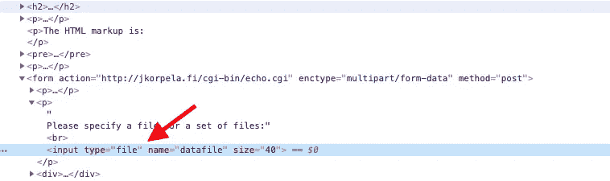
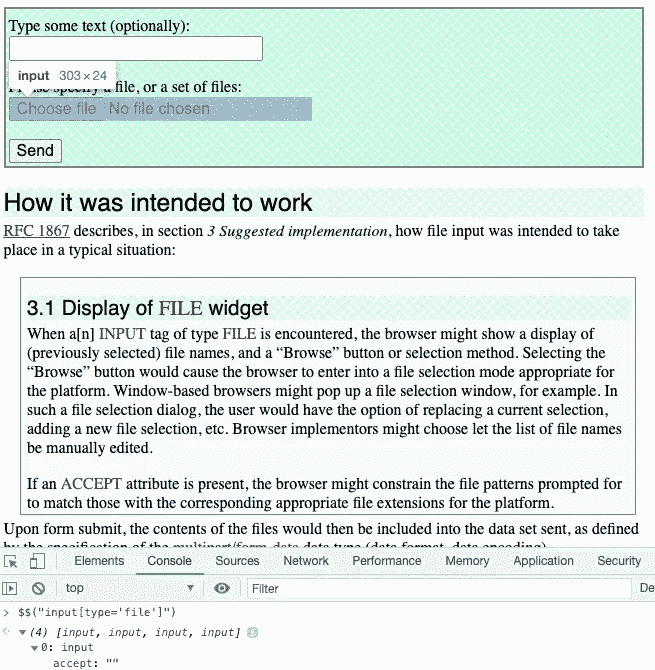
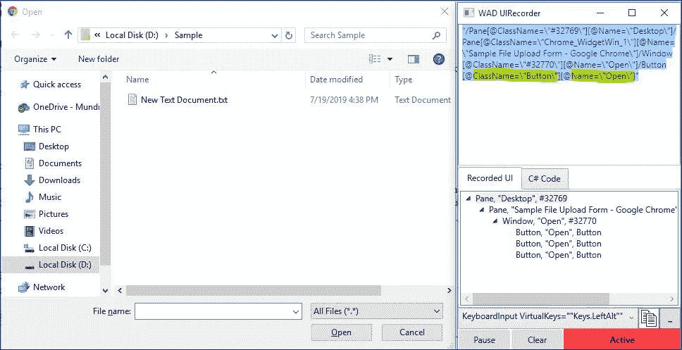

# 如何用 Selenium WebDriver 上传文件？

> 原文：<https://itnext.io/how-to-upload-a-file-with-selenium-webdriver-12154e1d1357?source=collection_archive---------3----------------------->

基弗·里克斯的照片

在测试我们项目的过程中，我们有时不得不面对上传文件的需求。在大多数情况下，我们需要使用 Selenium WebDriver 上传文件。在大多数情况下，web 应用程序应该包含允许用户将文件上传到服务器的功能。然而，这并不总是如此，但更多的关于这一点。测试产品时，掌握使用 Selenium WebDriver 上传文件的技能非常重要。在本文中，我们将讨论并学习如何使用 Selenium WebDriver 上传文件。

让我们用一个真实的例子来分析文件上传到服务器。假设我们需要编写自动化脚本，用于在用户可以上传一些文件的 web 平台上进行测试。在这种情况下，您需要使用文件上传概念将文件上传到 web 应用程序。

在 Selenium WebDriver 中，最好使用 Selenium Java 提供的特性来执行文件上传。这就是 SendKeys 方法。它直接应用于具有 type='file '属性的输入标记。

下面是一个使用 sendKeys 上传 Selenium 和 Java 文件的示例:

有时我们需要上传文件到远程服务器。例如，为了运行我们的自动化脚本，我们使用 Selenium 网格或 Selenoid 服务器。在这种情况下，通常下载文件的方式将会失败。为此，您需要使用远程 Web 驱动程序。

但是自动化专家并不总是这么幸运。有时候会出现硒无力的情况。比如根据脚本，你需要上传或者下载一个文件。点击“上传”或“下载”按钮后，操作系统文件管理器窗口出现在浏览器窗口的顶部，Selenium 不再能够访问该窗口。测试停止。
此外，有时文件类型的输入字段可能会丢失。上传到网站是通过某个 JavaScript 函数实现的，或者只是隐藏起来。在这种情况下，你可以使用第三方框架**机器人框架**或者 **AutoIt** 。

然而，我个人更喜欢不同的方法。Selenium WebDriver 提供了执行 Javascript 函数的能力。如果您遇到输入字段不可用的情况，您可以使用以下代码:

上面的一堆会改变你的文件输入控件的可见性。然后，您可以继续进行文件上传的常规步骤，例如:

此外，您可以使用以下代码:

请注意，通过改变输入字段的可见性，您正在干预测试中的应用程序。注入脚本来改变行为是侵入性的，不建议在测试中使用。

有时候，作为一名自动化工程师，除了通过操作系统窗口，我们没有下载文件的选项。为了实现这种方法，有几个机器人框架和 AutoIt 库。这两个库都非常强大，并且有很好的文档记录。但就个人而言，当我需要通过操作系统窗口下载文件时，我更喜欢在我的自动化测试中使用 WinAppDriver。

# Windows 应用程序驱动程序。

Windows 应用程序驱动程序(WinAppDriver)是一种支持在 Windows 应用程序上进行类似 Selenium 的 UI 测试自动化的服务。此服务支持在 Windows 10 PCs 上测试通用 Windows 平台(UWP)、Windows 窗体(WinForms)、Windows 演示基础(WPF)和经典 Windows (Win32)应用程序。

WinAppDriver 提供了一个 [UI 记录器工具](https://github.com/microsoft/WinAppDriver/releases/tag/UIR-v1.1)。UI Recorder 跟踪应用程序界面的键盘和鼠标交互——代表一个 UI 动作。当记录处于活动状态时，每次发生新的 UI 动作时，顶部和底部面板都会用不同的 UI 元素信息进行动态更新。顶部面板显示了为当前选择的 UI 元素生成的 XPath 查询，底部面板显示了同一元素的原始 XML 信息。您可以导航到底部面板上的 C# Code 选项卡，查看所记录操作的生成 C#代码，您可以在 WinAppDriver 测试中使用这些代码。

UI 记录器

要使用 WinAppDriver 上传文件，可以使用以下代码:

**警告！不幸的是，这种方法只适用于 Windows 操作系统。**

我的建议是永远不要这样做，这是一种导致不稳定测试的恶意做法:

这种方法有其缺点:

*   这个解决方案不是跨平台的。
*   不稳定。
*   没有可能使用[无头浏览器模式](/how-to-run-a-headless-chrome-browser-in-selenium-webdriver-c5521bc12bf0)。

操作系统窗口的所有困难都很容易解决——你需要确保这些窗口不会出现，也不会干扰浏览器。尝试找到一种方法来保证操作系统窗口不会打开。

# 结论。

在本文中，我们考虑了如何在 HTML 页面上上传文件。此外，您如何使用窗体 Windows 应用程序上传文件。我们还看到了在 Selenium 中处理文件上传的各种方法。我们还理解了在 Selenium 中为每种方法处理文件上传的代码实现，最后看了几个例子。

[https://test-engineer.site/](https://test-engineer.site/)

# 作者[安东·斯米尔诺夫](https://www.linkedin.com/in/vaskocuturilo/)