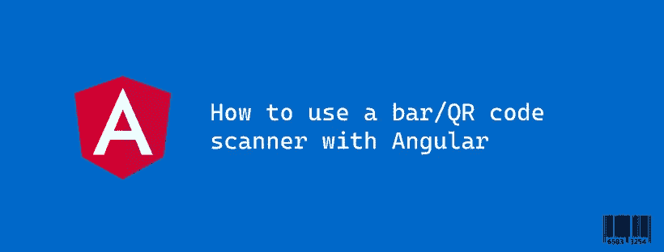

# 如何使用条形码/二维码扫描仪

> 原文：<https://itnext.io/how-to-use-a-bar-qr-code-scanner-with-angular-5622cefcb94?source=collection_archive---------0----------------------->

## 将硬件二维码、裸码扫描仪集成到您的 Angular web 应用程序中，无需库或插件



最近，我不得不在 Angular 应用程序中添加一个条形码扫描仪，我试图寻找一个插件(就像 Ionic 上使用手机摄像头的插件)或一个可以做到这一点的库，而不是重新发明路径，我一无所获。

在今天的文章中，我将与您分享我如何成功地将条形码/Qr 码阅读器轻松集成到我的 web Angular 应用程序中。

# 背景:

在用我的条形码扫描仪进行了几次测试后，我注意到当我打开文本编辑器扫描条形码时，我的电脑/手机开始键入我正在扫描的完全相同的代码，最后，它转到了一个新行。

# 解决方案:

基本上，扫描仪就像一个键盘连接到我的设备；它一个数字一个数字地输入代码，并在末尾的行' \n '后面加了一个 back。

让我们看看我们能做些什么；因此，我将使用 [@HostListner()](https://angular.io/api/core/HostListener) 装饰器添加一个关于按键事件的监听器，一次接收一个数字的代码，并将它连接到一个字符串变量；我们会这样做，直到我们收到回行' \n '这意味着我们得到了完整的代码😌

# 亲动？

我们可能需要在应用程序的多个页面中扫描 QR 码，让我们通过创建一个类来使我们的解决方案可重用，每当我们需要在应用程序中扫描代码时，我们都可以扩展该类。

因为我们正在做一个有角度的项目，我们喜欢使用钩子，所以让我们做一个类似钩子的东西，当 QR /条形码被扫描时就会被触发。让我们将我们的类命名为“OnScan”，以遵循与 Angular 的核心类相同的模式(“OnInit”、“OnDestroy”)..) :

```
import {Component, HostListener} from '@angular/core';

@Component({template: ''})
// tslint:disable-next-line:component-class-suffix
export abstract class OnScan {
  private code: string = '';

  public abstract onScan(code: string): void;

  @HostListener('window:keypress', ['$event'])
  protected keyEvent(event: KeyboardEvent): void {
    if (event.key === 'Enter') {
      this.onScan(this.code);
      this.code = '';
    } else {
      this.code += event.key;
    }
  }
}
```

现在，当我们的侦听器接收到 back to line 事件时，我们将调用我们的“类似钩子”的函数 onScan 来通知我们的组件我们的 QR 码已经准备好了。显然，onScan 抽象函数应该在每个组件中实现，以便能够使用 QR 码。

现在让我们想象一下，你需要知道你连续扫描了多少次代码，我们将添加一个计数器

瞧:

感谢您阅读这篇文章😄

欢迎您的反馈和评论。