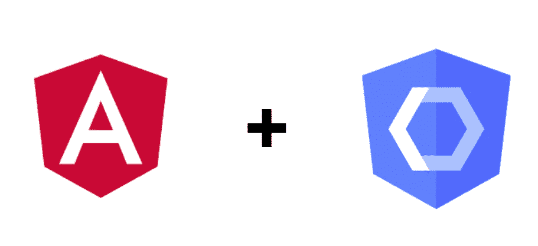

# 如何将 Angular ngModel 和 ngForms 与 WebComponents 一起使用

> 原文：<https://itnext.io/how-to-use-angular-ngmodel-and-ngforms-with-webcomponents-802bd9e1d3d7?source=collection_archive---------5----------------------->

Web 组件是一个真正有趣的工具，它可以改变我们使用 web 技术的方式，因为它们使我们能够忘记我们选择的框架，开始考虑框架无关性。

但除了这些好处，有时候很难与我们最喜欢的框架集成，在这种情况下是 Angular。我们将需要一些变化，使框架与 web 组件正常通信。

今天我们将讨论我们想要在角度形式中使用的组件类型，我们将讨论存储值的元素，例如:输入、选择器、日期选择器。一般来说，存储值并通过用户交互发回新结果的任何元素。

为了理解如何在我们的 web 组件中使用指令`ngModel`或`formControl`，理解 angular 如何管理`<input/>`或`<textarea></textarea>`的使用是很重要的

如果我们看一看[https://www.w3schools.com/tags/tag_input.asp](https://www.w3schools.com/tags/tag_input.asp)我们可以看到这些元素有共同的属性，更具体地说，它们有:

*   `value`:作为存储 de 值的属性
*   `onChange`:作为通知该值变化的输出事件

这两个属性在所有 HTML 表单元素中都很常见，因此认为我们的 web 组件必须具有这个属性才能使用 Angular 是有道理的。

# Angular 是如何工作的？

像`ngModel`、`formControl`和`formControlName`这样的角度指令使用 Angular 中的默认模式来决定对元素的访问逻辑。

如果我们看一下`angular/core` 代码，我们可以看到指令 **DefaulValueAccesor 的实现。**

> [https://github . com/angular/angular/blob/9.1 . x/packages/forms/src/directives/default _ value _ accessor . ts # L47](https://github.com/angular/angular/blob/9.1.x/packages/forms/src/directives/default_value_accessor.ts)

我们可以在这个文件中找到两个不同部分:

## 选择器:

这里我们可以看到这个指令影响了女巫元素。

## 实施:

这里我们可以看到，Angular 是如何管理`value` 属性和事件`onChange` 的。

既然我们知道 angular 在默认情况下如何管理输入元素，那么是时候使用这个方法来告诉 Angular 如何管理我们的组件了。

# 如何在我们的 web 组件中启用 ngModel 和 formControl？

有两种方法可以将`ngModel`和`formControl`用于我们的 web 组件。

第一个，只要我们使用我们在前面段落中定义的标准方式实现我们的 web 组件，将只是告诉 Angular 我们的组件将使用*defaultvalueaccessor*，所以 Angular 试图在我们的组件中找到`value`和`onChange`。

如果我们记得我们解释 Angular 如何工作的第一段代码，最后一个选择器元素是:`[ngDefaultControl]`，这意味着如果你使用`ngModel`的任何组件有这个属性，Angular 将使用默认行为。

但另一方面，在我们所有的组件中添加`ngDefaultControl`可能不是最好的方式，或者我们只是想以不同的方式实现我们的组件行为和内部变量。

# 像专家一样使用 ngModel 和 formControl

正如我们之前提到的，我们可以让我们的组件使用`ngModel`或`formControl`，而不用告诉 Angular 使用默认模式，也不用实现标准的*值，onChange* 系统。

为此，我们将覆盖 DefaultValueAccesor，这样我们将告诉 angular witch 元素我们想要与`ngModel`一起使用，以及元素的哪些输入和输出必须使用 angular。

正如我们在这段代码中看到的，首先我们要定义哪些 HTML 标签必须受该指令的影响，然后告诉 Angular with property 或 event 必须在我们的组件内部进行监视，以执行成功的数据绑定或利用像 onFocus 或 onDirty 这样的 formControl 特性。

所以从现在开始，我们只需要将这个文件添加到我们想要影响的模块中的数组声明中，并在我们的 web 组件中使用`[(ngModel)]`或`formControl`。正如我提到的，ReactiveForm 也使用这个选择器，所以它们的所有功能都可以用于 web 组件。

# 一些建议

即使您可以为值属性和输出事件使用您想要的名称来创建 webComponent，我也强烈建议尝试保持标准的命名约定，这意味着使用值作为属性、onChange、onBlur 或 onFocus 来发出更改、模糊和聚焦事件。通过这样做，您将只需要一个 ControlValue 覆盖所有的选择器声明。