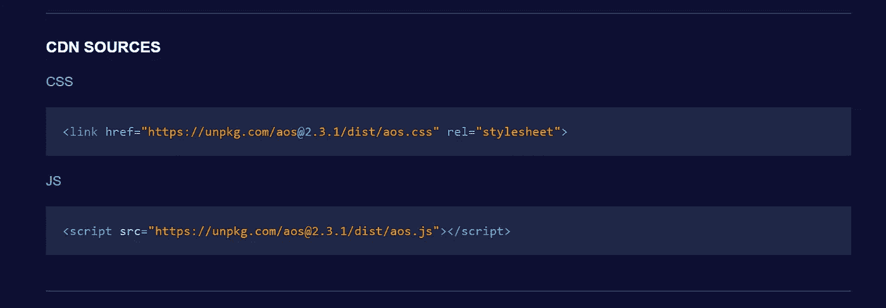

# 如何在卷轴库上使用动画

> 原文：<https://itnext.io/how-to-use-animate-on-scroll-library-218407e041db?source=collection_archive---------2----------------------->

因此，您想知道如何在上下滚动页面时触发动画，而不必自己编写一堆不同的关键帧吗？看，卷轴上的动画库正是你要找的！

上面的代码笔展示了滚动动画效果的快速演示。

***那么如何使用它呢？***

**第一步:** *头至* [***本网站***](https://michalsnik.github.io/aos/) *。*AOS 库是由 Michal sajóg 开发的，他还创建了这个方便的网站，展示了你可以提供给 HTML 元素的所有不同种类的动画。

如果你滚动到他网站的底部，你可以找到 **CDN 资源**。复制并粘贴到你的 HTML 文件中。



在`<head>`中添加样式:

```
<link href="https://unpkg.com/aos@2.3.1/dist/aos.css" rel="stylesheet">
```

在结束`<body>` 标签之前添加脚本:

```
<script src="https://unpkg.com/aos@2.3.1/dist/aos.js"></script>
```

**步骤 3:** 到**初始化**滚动动画将以下代码插入脚本标签中:

```
<script>   
   AOS.init(); 
</script>
```

**第四步:**提供**设置**来配置你想要的元素动画。Michal 已经在 [**GitHub**](https://github.com/michalsnik/aos) 中列出了一些不同的设置。我已经粘贴了下面的确切设置:

```
// below listed default settings
AOS.init({
  // Global settings:
  disable: false, // accepts following values: 'phone', 'tablet', 'mobile', boolean, expression or function
  startEvent: 'DOMContentLoaded', // name of the event dispatched on the document, that AOS should initialize on
  initClassName: 'aos-init', // class applied after initialization
  animatedClassName: 'aos-animate', // class applied on animation
  useClassNames: false, // if true, will add content of `data-aos` as classes on scroll
  disableMutationObserver: false, // disables automatic mutations' detections (advanced)
  debounceDelay: 50, // the delay on debounce used while resizing window (advanced)
  throttleDelay: 99, // the delay on throttle used while scrolling the page (advanced)

  // Settings that can be overridden on per-element basis, by `data-aos-*` attributes:
  offset: 120, // offset (in px) from the original trigger point
  delay: 0, // values from 0 to 3000, with step 50ms
  duration: 400, // values from 0 to 3000, with step 50ms
  easing: 'ease', // default easing for AOS animations
  once: false, // whether animation should happen only once - while scrolling down
  mirror: false, // whether elements should animate out while scrolling past them
  anchorPlacement: 'top-bottom', // defines which position of the element regarding to window should trigger the animation

});
```

他的 [**GitHub 链接**](https://github.com/michalsnik/aos) 也列出了所有不同的*缓动功能*、*锚点放置*等。你可以提供。

**第五步:**现在你要做的就是给你的 html 元素添加`**data-aos**`属性，然后指定你想要使用的**动画名称**。

```
<div data-aos="animation_name">
```

如果您不想在初始化 AOS 脚本时设置每个元素的基础设置，也可以指定这些设置。

```
<div
    data-aos="fade-up"
    data-aos-offset="200"
    data-aos-delay="50"
    data-aos-duration="1000"
    data-aos-easing="ease-in-out"
    data-aos-mirror="true"
    data-aos-once="false"
    data-aos-anchor-placement="top-center"
  >
  </div>
```

我个人更喜欢在脚本中全局地设置我的设置，这样我就不必单独地改变每个元素的设置。

这里是我为好奇的人准备的全球设置。

```
AOS.init({ easing: 'ease-out-back', duration: 800, delay: 300, once: true, disable: 'mobile'});
```

**第六步:**看魔术发生！只需 5 个简单的步骤，你的 HTML 元素就会变成动画！

我希望您今天学到了一些新的东西，并对将这个令人敬畏的库实现到您自己的 web 应用程序中感到兴奋！感谢阅读！😊