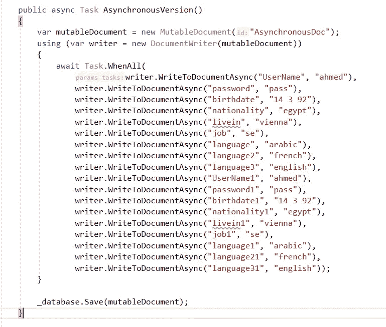
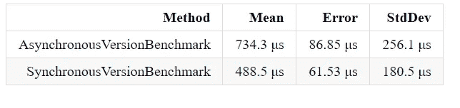

# 如何对线程不安全的对象使用异步？

> 原文：<https://itnext.io/how-to-use-async-with-thread-unsafe-objects-345e97a27bb6?source=collection_archive---------6----------------------->


异步方法通常比普通的单线程方法更受欢迎，因为它不会阻塞主线程，并且很容易并行执行。

虽然不建议使用 Task.run(()=>{})，因为它会不断创建更多的线程，但是当它用于线程不安全的对象时，它甚至不会工作，并且可能会引发异常。在本文中，我们将采用一个真实的场景，为线程不安全的对象 couchbase MutableDocument 提供一个异步写版本。

下面是向可变文档添加字符串的普通 api

```
var mutableDocument=new MutableDocument("doc1");mutableDocument.SetString("Username", "ahmed");
```

现在让我们测试任务。如果情况真的很糟糕，就采取行动

```
static async Task WriteToDocumentAsync(MutableDocument doc, string key, string value){await Task.Run(() =>  doc.SetValue(key, value));}
```

现在让我们测试一下

```
await Task.WhenAll(
             WriteToDocumentAsync(document, "UserName", "ahmed"),
             WriteToDocumentAsync(document, "password", "pass"),
             WriteToDocumentAsync(document, "birthdate", "14 392"),
             WriteToDocumentAsync(document, "nationality","egypt"),
             WriteToDocumentAsync(document, "livein", "vienna"),
             WriteToDocumentAsync(document, "job", "se"),
             WriteToDocumentAsync(document, "language", "arabic"),
             WriteToDocumentAsync(document, "language2", "french"),
             WriteToDocumentAsync(document, "language3","english"),
             WriteToDocumentAsync(document, "UserName1", "ahmed"),
             WriteToDocumentAsync(document, "password1", "pass"),
             WriteToDocumentAsync(document, "birthdate1", "14392"),
             WriteToDocumentAsync(document, "nationality1","egypt"),
             WriteToDocumentAsync(document, "livein1", "vienna"),
             WriteToDocumentAsync(document, "job1", "se"),
             WriteToDocumentAsync(document, "language1", "arabic"),
             WriteToDocumentAsync(document, "language21", "french"),
             WriteToDocumentAsync(document, "language31","english" ));
```

然后嘣！！！！这段代码将在文档对象中抛出空引用异常。

大多数人把异步编程和并行编程混为一谈，这里我们不打算讨论并行编程，因为对于线程不安全的对象来说这是不可能的。

# 实现编写器模式

异步编程:消费者线程(大多数情况下是 UI 线程)要求后台线程完成一项工作，并在完成时通知他。

所以在我们的例子中，我们需要一个后台线程来接收多个文档写请求(方法调用),对它们进行排队，然后一个接一个地执行它们。

_currentThread:是将执行所有写请求的后台线程。

_channel:是系统的对象。线程。在调用者线程和我们的后台线程之间充当通信的通道。

WriteToDocumentAsync 方法:向 _channel 发送消息(请求)，TaskCompletionSource 用于等待执行并接收结果。

Start 方法:是 _currentThread 方法逐个处理写请求，一直等到通道关闭。

Dispose:确保 _channel 已关闭(完成),以允许 _currentThread 被释放。

现在，您可以使用



# 标杆管理



很明显，异步版本带来了大约 150%的性能开销，所以请仅在您需要时使用它，相信将来会实现更多的性能增强。

在 twitter 和 medium 上关注我，了解更多技术和科学内容

[https://twitter.com/MCC_Ahmed](https://twitter.com/MCC_Ahmed)

如果你想支持我更多的技术和科学内容，你可以在

[](https://ko-fi.com/ahmedfouad) [## 给艾哈迈德·福阿德买杯咖啡。ko-fi.com/ahmedfouad

### 给我买杯咖啡

ko-fi.com](https://ko-fi.com/ahmedfouad)