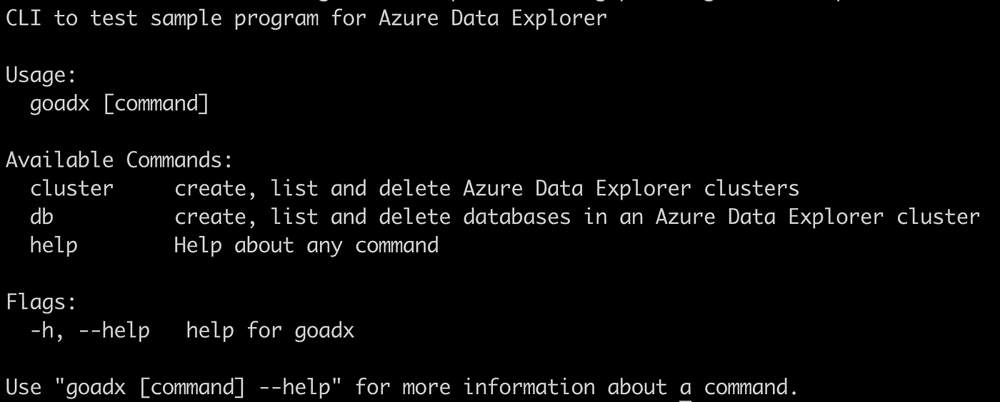

# 如何使用 Azure Go SDK 管理 Azure Data Explorer 集群

> 原文：<https://itnext.io/how-to-use-azure-go-sdk-to-manage-azure-data-explorer-clusters-5109cddac7a0?source=collection_archive---------3----------------------->

[使用 Go SDK 开始使用 Azure Data Explorer](/getting-started-with-azure-data-explorer-using-the-go-sdk-807c50bc8105)介绍了如何使用 [Azure Data Explorer Go SDK](https://github.com/Azure/azure-kusto-go) 从 Azure Data Explorer 接收和查询数据。在这篇博客中，你将 [Azure Go SDK](https://docs.microsoft.com/azure/developer/go/?WT.mc_id=dzone-blog-abhishgu) 来管理 Azure Data Explorer 集群和数据库。

[Azure Data Explorer](https://docs.microsoft.com/azure/data-explorer/?WT.mc_id=dzone-blog-abhishgu) (也称为 **Kusto** )是一种快速、可扩展的数据探索服务，用于分析来自任何数据源(如网站、应用程序、物联网设备等)的大量不同数据。这些数据可用于诊断、监控、报告、机器学习和其他分析功能。

如果你想知道，我们在这里谈论的是两个不同的 SDK。这篇博客中涉及的是用于资源管理的(也称为控制平面 SDK ),我在[其他帖子](https://dev.to/azure/getting-started-with-azure-data-explorer-using-the-go-sdk-30jm)中使用的是用于与 Azure Data Explorer 服务本身交互的数据平面 SDK(摄取、查询等)。)

**涵盖哪些内容？**

使用一个简单的 CLI 应用程序作为示例来演示如何使用 Go SDK。我们将首先试用该应用程序，并了解如何:

*   创建并列出 Azure 数据资源管理器群集
*   创建并列出集群中的数据库
*   删除数据库和集群



示例 CLI 应用程序: *goadx*

一旦完成，我们将遍历示例代码来理解发生了什么

> *代码可在 GitHub*[【https://github.com/abhirockzz/azure-go-sdk-for-dataexplorer】T21](https://github.com/abhirockzz/azure-go-sdk-for-dataexplorer)上找到

请注意，这个基于 CLI 的示例只是为了展示如何使用 Azure Go SDK(在 Azure Data Explorer 的上下文中)作为更大应用程序的一部分。它不应该取代/替代可用于管理 Azure 数据浏览器资源的 [Azure CLI](https://docs.microsoft.com/azure/data-explorer/create-cluster-database-cli?WT.mc_id=dzone-blog-abhishgu)

# 先决条件

[安装 Go 1.13 或以上](https://golang.org/dl/)

你需要一个[微软 Azure 账户](https://docs.microsoft.com/azure/?WT.mc_id=dzone-blog-abhishgu)。去报名参加一个免费的吧！

安装 Azure CLI 如果你还没有的话(应该很快！)

# 运行 CLI 应用程序

获取代码并构建它:

```
git clone https://github.com/abhirockzz/azure-go-sdk-for-dataexplorer
cd azure-go-sdk-for-dataexplorer
go build -o goadx//to confirm
chmod a+x goadx && ./goadx
```

要查看单个命令的详细信息，例如集群创建:

```
./goadx cluster create --help//outputCreates 1 instance of compute type DevNoSLAStandardD11V2 in Basic tierUsage:
  goadx cluster create [flags]Flags:
  -h, --help          help for create
      --loc string    ADX cluster location
      --name string   ADX cluster nameGlobal Flags:
      --rg string    Azure resource group
      --sub string   Azure subscription
```

## 创建集群前还有几个步骤…

**创建一个资源组…**

…使用 [az 组创建](https://docs.microsoft.com/cli/azure/group?view=azure-cli-latest&WT.mc_id=dzone-blog-abhishgu#az-group-create) CLI 命令

```
az group create -l <region> -n <name>e.g. az group create -l southeastasia -n my-adx-rg
```

我们需要一个[服务主体](https://docs.microsoft.com/azure/active-directory/develop/app-objects-and-service-principals?WT.mc_id=dzone-blog-abhishgu#service-principal-object)让 Go SDK 通过 Azure Data Explorer 服务进行身份验证，以执行集群和数据库操作。

**创建服务主体…**

…使用 [az ad sp create-for-rbac](https://docs.microsoft.com/cli/azure/ad/sp?view=azure-cli-latest&WT.mc_id=dzone-blog-abhishgu#az-ad-sp-create-for-rbac)

```
az ad sp create-for-rbac -n "test-datax-sp"
```

您将得到这样的 JSON 响应

```
{
  "appId": "fe7280c7-5705-4789-b17f-71a472340429",
  "displayName": "test-datax-sp",
  "name": "http://test-datax-sp",
  "password": "29c719dd-f2b3-46de-b71c-4004fb6116ee",
  "tenant": "42f988bf-86f1-42af-91ab-2d7cd011db42"
}
```

将服务主体详细信息设置为环境变量。在代码演练过程中，您将看到为什么需要这些特定的变量

```
export AZURE_CLIENT_ID="<appId>"
export AZURE_CLIENT_SECRET="<password>"
export AZURE_TENANT_ID="<tenant>"
```

你都准备好了！

## 创建 Azure 数据浏览器群集

```
./goadx cluster create --name <name of the cluster you want to create> --loc <azure region for the cluster> --rg <name of the resource group> --sub <azure subscription id>
```

例如:

```
./goadx cluster create --name MyAdxCluster --loc "Southeast Asia" --rg my-adx-rg --sub 9a42a42f-ae42-4242-b6a7-eea0ea42d342
```

这将使用`DevNoSLAStandardD11V2`虚拟机创建一个实例集群

> *为了简单/易用，这是硬编码的*

集群创建需要一些时间，这段时间内的代码块。请耐心等待；)喝点咖啡，看看 Twitter，或者做任何让你忙碌大约 10-15 分钟的事情。创建集群后，您将看到以下消息:

```
created cluster MyAdxCluster with ID /subscriptions/9a42a42f-ae42-4242-b6a7-eea0ea42d342/resourceGroups/my-adx-rg/providers/Microsoft.Kusto/Clusters/MyAdxCluster and type Microsoft.Kusto/Clusters
```

## 列出所有的集群

您刚刚创建了一个集群，让我们确保您可以获得它的信息(包括您的资源组中可能已经有的任何其他集群)

```
./goadx cluster list --rg <name of the resource group> --sub <azure subscription id>
```

例如

```
./goadx cluster list --rg my-adx-rg --sub 9a42a42f-ae42-4242-b6a7-eea0ea42d342
```

您将得到如下表格输出:

```
+---------------+---------+----------------+-----------+-------------------------------------------------------+
|     NAME      |  STATE  |    LOCATION    | INSTANCES |                          URI                          |
+---------------+---------+----------------+-----------+-------------------------------------------------------+
| MyAdxCluster | Running | Southeast Asia |         1 | https://MyAdxCluster.southeastasia.kusto.windows.net |
+---------------+---------+----------------+-----------+-------------------------------------------------------+
```

## 有了集群，就该创建数据库了

在集群中创建数据库

```
./goadx db create --name <name of the database you want to create> --cluster <nname of the adx cluster> --loc <azure region> --rg <resource group name> --sub <azure subscription id>
```

例如

```
./goadx db create --name testadxdb --cluster MyAdxCluster --loc "Southeast Asia" --rg my-adx-rg --sub 9a42a42f-ae42-4242-b6a7-eea0ea42d342
```

应该不会花太长时间。创建数据库后，您将看到以下消息:

```
created DB MyAdxCluster/testadxdb with ID /subscriptions/9a42a42f-ae42-4242-b6a7-eea0ea42d342/resourceGroups/my-adx-rg/providers/Microsoft.Kusto/Clusters/MyAdxCluster/Databases/testadxdb and type Microsoft.Kusto/Clusters/Databases
```

## 要检查您刚刚创建的数据库…

```
./goadx db list --cluster <name of the adx cluster> --rg <resource group name> --sub <azure subscription id>
```

例如

```
./goadx db list --cluster MyAdxCluster --rg my-adx-rg --sub 9a42a42f-ae42-4242-b6a7-eea0ea42d342
```

您将得到如下表格输出:

```
+---------------------------+-----------+----------------+------------------------------------+
|           NAME            |   STATE   |    LOCATION    |                TYPE                |
+---------------------------+-----------+----------------+------------------------------------+
| MyAdxCluster/testadxdb     | Succeeded | Southeast Asia | Microsoft.Kusto/Clusters/Databases |
+---------------------------+-----------+----------------+------------------------------------+
```

您可以继续进一步试验，并创建更多的集群和/或数据库

## 是时候清理了…

您可以直接删除集群，如下所示:

```
./goadx cluster delete --name <name of adx cluster> --rg <resource group name> --sub <azure subcription id>
```

例如:

```
./goadx cluster delete --name MyAdxCluster --rg my-adx-rg --sub 9a42a42f-ae42-4242-b6a7-eea0ea42d342
```

您应该会看到一条确认消息，表明集群已被删除:

```
deleted ADX cluster MyAdxCluster from resource group my-adx-rg
```

或者您可以直接删除数据库本身

```
./goadx db delete --name <database name> --cluster <adx cluster name> --rg <resource group name> --sub <azure subscription id>
```

例如

```
./goadx db delete --name testadxdb --cluster MyAdxCluster --rg my-adx-rg --sub 9a42a42f-ae42-4242-b6a7-eea0ea42d342
```

您应该会看到一条确认消息，表明数据库已被删除:

```
deleted DB testadxdb from cluster MyAdxCluster
```

好了，现在你*能做什么*了，是时候看看*如何*完成了！

# 代码遍历

概括地说，应用程序由两部分组成:

*   Azure Data Explorer 操作(创建、读取、删除)——是`[ops](https://github.com/abhirockzz/azure-go-sdk-for-dataexplorer/tree/master/ops)` [包](https://github.com/abhirockzz/azure-go-sdk-for-dataexplorer/tree/master/ops)的一部分
*   CLI 命令—是`[cli](https://github.com/abhirockzz/azure-go-sdk-for-dataexplorer/tree/master/cli)` [包](https://github.com/abhirockzz/azure-go-sdk-for-dataexplorer/tree/master/cli)的一部分

老实说，CLI 并不重要(至少在博客的上下文中是如此)。它使用 [Cobra](https://github.com/spf13/cobra) 包来实现集群和集群(顶层)命令以及子命令— `create`、`list`和`delete`。如果你感兴趣，看看下面的内容:

*   [root.go](https://github.com/abhirockzz/azure-go-sdk-for-dataexplorer/blob/master/cli/root.go) —定义 CLI 入口点的 root 命令
*   [cluster.go](https://github.com/abhirockzz/azure-go-sdk-for-dataexplorer/blob/master/cli/cluster.go) —定义并执行集群操作的子命令
*   [db.go](https://github.com/abhirockzz/azure-go-sdk-for-dataexplorer/blob/master/cli/db.go) —定义并实现数据库操作的子命令

CLI 部分简单地调用 Azure Data Explorer 资源上的 CRUD 操作，这是重要的部分。所以，让我们仔细检查一下

## 证明

这在 [ops/client.go](https://github.com/abhirockzz/azure-go-sdk-for-dataexplorer/blob/master/ops/client.go) 中处理。为了获得客户端组件的句柄来执行所需的操作，我们需要进行身份验证。例如，为了获得`[kusto.ClustersClient](https://godoc.org/github.com/Azure/azure-sdk-for-go/services/kusto/mgmt/2020-02-15/kusto#ClustersClient)`:

```
func getClustersClient(subscription string) kusto.ClustersClient {
    client := kusto.NewClustersClient(subscription)
    authR, err := auth.**NewAuthorizerFromEnvironment**()
    if err != nil {
        log.Fatal(err)
    }
    client.Authorizer = authR return client
}
```

需要注意的是 [auth。newauthorizerfromeenvironment()](https://godoc.org/github.com/Azure/go-autorest/autorest/azure/auth#NewAuthorizerFromEnvironment)寻找一组预定义的环境变量—这是[基于用户环境的认证](https://docs.microsoft.com/en-us/azure/developer/go/azure-sdk-authorization#use-environment-based-authentication)

## 集群操作

[ops/cluster.go](https://github.com/abhirockzz/azure-go-sdk-for-dataexplorer/blob/master/ops/cluster.go) 是处理集群创建、列表和删除的地方。以下是 create 的代码片段:

```
func CreateCluster(sub, clusterName, location, rgName string) {
    ...
    result, err := client.**CreateOrUpdate**(ctx, rgName, clusterName, kusto.Cluster{Location: &location, Sku: &kusto.AzureSku{Name: kusto.DevNoSLAStandardD11V2, Capacity: &numInstances, Tier: kusto.Basic}})
    err = result.**WaitForCompletionRef**(context.Background(), client.Client)
    r, err := result.**Result**(client)
    ...
}
```

[CreateOrUpdate](https://godoc.org/github.com/Azure/azure-sdk-for-go/services/kusto/mgmt/2020-02-15/kusto#ClustersClient.CreateOrUpdate) 用于启动集群创建。因为这是一个长时间运行的 op，它返回一个我们等待的`[ClustersCreateOrUpdateFuture](https://godoc.org/github.com/Azure/azure-sdk-for-go/services/kusto/mgmt/2020-02-15/kusto#ClustersCreateOrUpdateFuture)`(使用`[WaitForCompletionRef](https://godoc.org/github.com/Azure/go-autorest/autorest/azure#Future.WaitForCompletionRef)`

> *请注意，我使用了* `*context.Background()*` *，您可以使用不同的上下文，例如，带有超时或可取消的上下文。*

一旦这是一个，我们检查`[Result](https://godoc.org/github.com/Azure/azure-sdk-for-go/services/kusto/mgmt/2020-02-15/kusto#ClustersCreateOrUpdateFuture.Result)`的未来

列出一个资源组中的所有集群非常简单，可以使用`[ListByResourceGroup](https://godoc.org/github.com/Azure/azure-sdk-for-go/services/kusto/mgmt/2020-02-15/kusto#ClustersClient.ListByResourceGroup)`来完成

```
func ListClusters(sub, rgName string) kusto.ClusterListResult {
    ctx := context.Background() result, err := getClustersClient(sub).**ListByResourceGroup**(ctx, rgName)
    if err != nil {
        log.Fatal(err.Error())
    }
    return result
}
```

`Delete`与`Create`相似，也是一个长时间运行的操作。这是相同的练习-启动删除([使用 Delete](https://godoc.org/github.com/Azure/azure-sdk-for-go/services/kusto/mgmt/2020-02-15/kusto#ClustersClient.Delete) )，等待它完成，然后确认结果

```
func DeleteCluster(sub, clusterName, rgName string) {
    ...
    result, err := client.**Delete**(ctx, rgName, clusterName)
    err = result.**WaitForCompletionRef**(context.Background(), client.Client)
    r, err := result.**Result**(client)
    ...
}
```

## 数据库操作

[ops/db.go](https://github.com/abhirockzz/azure-go-sdk-for-dataexplorer/blob/master/ops/db.go) 是处理数据库创建、列表和删除的地方。以下是 create 的代码片段:

```
func CreateDatabase(sub, rgName, clusterName, location, dbName string) {
    ...
    future, err := client.**CreateOrUpdate**(ctx, rgName, clusterName, dbName, kusto.ReadWriteDatabase{Kind: kusto.KindReadWrite, Location: &location})
    err = future.**WaitForCompletionRef**(context.Background(), client.Client) r, err := future.**Result**(client)
    kdb, _ := r.Value.AsReadWriteDatabase()
    ...
}
```

列表很简单，由`[ListByCluster](https://godoc.org/github.com/Azure/azure-sdk-for-go/services/kusto/mgmt/2020-02-15/kusto#DatabasesClient.ListByCluster)`负责

```
func ListDBs(sub, rgName, clusterName string) kusto.DatabaseListResult {
    ctx := context.Background()
    result, err := getDBClient(sub).**ListByCluster**(ctx, rgName, clusterName)
    if err != nil {
        log.Fatal("failed to get databases in cluster", err)
    }
    return result
}
```

最后，使用`[Delete](https://godoc.org/github.com/Azure/azure-sdk-for-go/services/kusto/mgmt/2020-02-15/kusto#DatabasesClient.Delete)`处理删除

```
func DeleteDB(sub, rgName, clusterName, dbName string) {
    ...
    future, err := getDBClient(sub).**Delete**(ctx, rgName, clusterName, dbName)
    err = future.**WaitForCompletionRef**(context.Background(), client.Client)
    r, err := future.**Result**(client)
    ...
}
```

代码演练到此结束！

# 结论

希望这有助于演示如何使用 Azure Go SDK 来处理 Azure Data Explorer 资源。可以查看 [Python](https://docs.microsoft.com/azure/data-explorer/create-cluster-database-python?WT.mc_id=dzone-blog-abhishgu) 、[的文档。NET](https://docs.microsoft.com/azure/data-explorer/create-cluster-database-csharp?WT.mc_id=dzone-blog-abhishgu) 等例子。探索愉快！