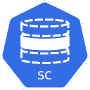

# 如何在 Kubernetes 中使用自定义存储类？

> 原文：<https://itnext.io/how-to-use-custom-storage-classes-in-kubernetes-edc568acfdfe?source=collection_archive---------2----------------------->



大多数 Kubernetes 产品都提供了现成的默认存储类，以简化动态存储供应过程。

但是，如果您有定制需求呢？在本文中，我们将了解如何创建自己的存储类来满足您的需求。示例场景基于一个 [Azure Kubernetes 服务](https://docs.microsoft.com/azure/aks/?WT.mc_id=medium-blog-abhishgu)，但是应该适用于任何 Kubernetes 提供商。

> *代码在* [*GitHub*](https://github.com/abhirockzz/kubernetes-custom-storageclass) 上有

[“教程:Kubernetes 卷的基础知识(第 2 部分)”](/tutorial-basics-of-kubernetes-volumes-part-2-b2ea6f397402)博客文章探讨了 Kubernetes 存储类，并提供了一个利用默认值`StorageClass`的示例。要使用 Kubernetes 集群中的默认存储类触发动态配置，只需**从您的`PersistentVolumeClaim`中排除**属性`storageClass`。例如， [Azure Kubernetes 服务](https://azure.microsoft.com/services/storage/disks/?WT.mc_id=medium-blog-abhishgu)包含两个预播种的存储类，

您可以通过运行`kubectl get storageclass`命令进行检查

```
NAME                PROVISIONER                AGE
default (default)   kubernetes.io/azure-disk   6d10h
managed-premium     kubernetes.io/azure-disk   6d10h
```

*   `default`存储类:提供由标准硬盘支持的标准 [Azure 磁盘](https://docs.microsoft.com/azure/virtual-machines/windows/disks-types?WT.mc_id=medium-blog-abhishgu#standard-hdd)
*   `managed-premium`存储类:提供由高级固态硬盘支持的高级 [Azure 磁盘](https://docs.microsoft.com/azure/virtual-machines/windows/disks-types?WT.mc_id=medium-blog-abhishgu#premium-ssd)

下面是`default`存储类规范的样子(这是通过在我的 AKS 集群上执行`kubectl get sc/default`获得的一个微调版本)

```
apiVersion: storage.k8s.io/v1
kind: StorageClass
metadata:
  labels:
    kubernetes.io/cluster-service: "true"
  name: default
parameters:
  cachingmode: ReadOnly
  kind: Managed
  storageaccounttype: Standard_LRS
provisioner: kubernetes.io/azure-disk
reclaimPolicy: Delete
volumeBindingMode: Immediate
```

# 好吧，那又怎样？


我之所以强调这一点，是因为我希望您注意以下属性、它们的值以及它们的含义

*   `volumeBindingMode: Immediate` -该设置意味着一旦`PersistentVolumeClaim`被创建，就触发`PersistentVolume`创建，然后是存储介质(在本例中为 Azure 磁盘)供应。
*   `reclaimPolicy: Delete` -通过这个设置，一旦删除了一个`PersistentVolumeClaim`，它也会触发相应的`PersistentVolume`和 Azure 磁盘的移除。如果您打算保留这些数据用于备份、其他应用等，您将会大吃一惊。

> *`*reclaimPolicy: Delete*`*`*volumeBindingMode: Immediate*`*都是默认设置***

# **覆盖 volumeBindingMode**

**有效值包括`Immediate`和`WaitForFirstConsumer`。用`WaitForFirstConsumer`覆盖默认值将会延迟`PersistentVolume`的绑定和供应，直到使用`PersistentVolumeClaim`的`Pod`(也就是您的应用程序)被创建。**

# **覆盖回收策略**

**仍然覆盖默认值`Retain`，在`PersistentVolumeClaim`移除后删除`PersistentVolume`，但确保实际存储介质未被清除。**

> ***注意* `*Recycle*` *是* `*reclaimPolicy*`的弃用选项**

# **动手操作:创建和使用自定义存储类**

**要跟进，您需要:**

*   **一个[微软 Azure 账户](https://docs.microsoft.com/azure/?WT.mc_id=medium-blog-abhishgu)——去注册一个免费账户吧！**
*   **[Azure Kubernetes 服务(AKS)集群](https://azure.microsoft.com/services/kubernetes-service/?WT.mc_id=medium-blog-abhishgu) —本博客将指导您创建一个集群**
*   **Azure CLI 或 Azure Cloud Shell——如果你还没有安装 Azure CLI ，你可以选择安装它(应该很快！)或者直接从你的浏览器使用 [Azure 云壳](https://azure.microsoft.com/features/cloud-shell/?WT.mc_id=medium-blog-abhishgu)。**
*   **`[kubectl](https://kubernetes.io/docs/tasks/tools/install-kubectl/)`与您的 AKS 集群交互(如果您使用 Azure Cloud Shell，则不需要)**

## **Kubernetes 集群设置**

**你只需要一个命令就可以在 Azure 上建立一个 Kubernetes 集群。但是，在此之前，我们必须创建一个资源组**

```
**export AZURE_SUBSCRIPTION_ID=[to be filled]
export AZURE_RESOURCE_GROUP=[to be filled]
export AZURE_REGION=[to be filled] (e.g. southeastasia)**
```

**切换到您的订阅并调用`az group create`**

```
**az account set -s $AZURE_SUBSCRIPTION_ID
az group create -l $AZURE_REGION -n $AZURE_RESOURCE_GROUP**
```

**您现在可以调用`az aks create`来创建新的集群**

> **为了简单起见，下面的命令创建了一个单节点集群。根据您的要求随意更改规格**

```
**export AKS_CLUSTER_NAME=[to be filled]az aks create --resource-group $AZURE_RESOURCE_GROUP --name $AKS_CLUSTER_NAME --node-count 1 --node-vm-size Standard_B2s --node-osdisk-size 30 --generate-ssh-keys**
```

**使用`az aks get-credentials`获取 AKS 集群凭证——因此，`kubectl`现在将指向您的新集群。你可以证实这一点**

```
**az aks get-credentials --resource-group $AZURE_RESOURCE_GROUP --name $AKS_CLUSTER_NAME
kubectl get nodes**
```

> ***如果您对使用*[*Azure*](https://azure.microsoft.com/services/kubernetes-service/?WT.mc_id=medium-blog-abhishgu)*学习 Kubernetes 和 Containers 感兴趣，一个很好的起点是使用文档中的* [*快速入门、教程和代码示例*](https://docs.microsoft.com/azure/aks/?WT.mc_id=medium-blog-abhishgu) *来熟悉该服务。我也强烈推荐查看一下* [*50 天 Kubernetes 学习路径*](https://azure.microsoft.com/resources/kubernetes-learning-path/?WT.mc_id=medium-blog-abhishgu) *。高级用户可能希望参考* [*Kubernetes 最佳实践*](https://docs.microsoft.com/azure/aks/best-practices?WT.mc_id=medium-blog-abhishgu) *或观看一些* [*视频*](https://azure.microsoft.com/resources/videos/index/?services=kubernetes-service&WT.mc_id=medium-blog-abhishgu) *以了解演示、主要特性和技术会议。***

# **测试一下…**

**创建存储类并确认其已创建**

```
**kubectl apply -f https://raw.githubusercontent.com/abhirockzz/kubernetes-custom-storageclass/master/custom-storage-class.yaml
    kubectl get sc**
```

> ***为了简单起见，YAML 文件直接从*[*GitHub repo*](https://github.com/abhirockzz/kubernetes-custom-storageclass)*中引用，但是你也可以将文件下载到你的本地机器上，以同样的方式使用它。***

**您应该会看到新的存储类**

```
**NAME                            PROVISIONER                AGE
azuredisk-custom-storageclass   kubernetes.io/azure-disk   4s
default (default)               kubernetes.io/azure-disk   2d10h
managed-premium                 kubernetes.io/azure-disk   2d10h**
```

**创建`PersistentVolumeClaim`**

```
**kubectl apply -f https://raw.githubusercontent.com/abhirockzz/kubernetes-custom-storageclass/master/pvc.yaml
    kubectl get pvc/app-pvc**
```

**您会注意到`STATUS`是`Pending`，这意味着它还没有与`PersistentVolume`相关联。**

```
**NAME      STATUS    VOLUME   CAPACITY   ACCESS MODES   STORAGECLASS                    AGE
app-pvc   Pending                                      azuredisk-custom-storageclass   10s**
```

**创造一个`Deployment`(将创造一个`Pod`)**

```
**kubectl apply -f [https://raw.githubusercontent.com/abhirockzz/kubernetes-custom-storageclass/master/deployment.yaml](https://raw.githubusercontent.com/abhirockzz/kubernetes-custom-storageclass/master/deployment.yaml)**
```

> **`*Pod*` *会在一段时间内过渡到* `*Running*` *状态***

**一旦到了`Running`，再次检查`PersistentVolumeClaim`**

```
**kubectl get pvc/app-pvc**
```

**`STATUS`会变成`Bound`。作为`Pod`创建的结果，使用`PersistentVolumeClaim` ( `azuredisk-custom-storageclass`)中提到的`StorageClass`分析存储请求并触发动态配置。因此，Azure 磁盘是随着`PersistentVolume`的创建及其与`PersistentVolumeClaim`的关联一起提供的。**

```
**NAME      STATUS   VOLUME                                     CAPACITY   ACCESS MODES   STORAGECLASS                    AGE
app-pvc   Bound    pvc-83020049-e107-11e9-93ab-025752f370d3   1Gi        RWO            azuredisk-custom-storageclass   4m53s**
```

> ***这一切发生在* ***之后*** *我们的 app 被部署，多亏了* `*WaitForFirstConsumer*` *设置为* `*volumeBindingMode*` *属性。***

**使用`kubectl get pv`进行确认**

```
**NAME                                       CAPACITY   ACCESS MODES   RECLAIM POLICY   STATUS   CLAIM                    STORAGECLASS                    REASON   AGE
pvc-83020049-e107-11e9-93ab-025752f370d3   1Gi        RWO            Retain           Bound    default/app-pvc          azuredisk-custom-storageclass            4m46s**
```

**当然，还会创建一个 Azure 磁盘。为了检查，**

```
**AKS_NODE_RESOURCE_GROUP=$(az aks show --resource-group $AZURE_RESOURCE_GROUP --name $AKS_CLUSTER_NAME --query nodeResourceGroup -o tsv)az disk list -g $AKS_NODE_RESOURCE_GROUP**
```

**`tags`部分看起来类似于**

```
**"tags": {
      "created-by": "kubernetes-azure-dd",
      "kubernetes.io-created-for-pv-name": "pvc-83020049-e107-11e9-93ab-025752f370d3",
      "kubernetes.io-created-for-pvc-name": "app-pvc",
      "kubernetes.io-created-for-pvc-namespace": "default"
}**
```

# **删除应用程序和永久卷声明**

**让我们删除应用程序和`PersistentVolumeClaim`。**

```
**kubectl delete -f deployment.yaml
kubectl delete -f pvc.yaml**
```

**使用`kubectl get pv`检查`PersistentVolume`——你会看到`STATUS`现在已经变成了`Released`(从`Bound`)。确认 Azure 磁盘仍然存在**

```
**az disk list -g $AKS_NODE_RESOURCE_GROUP**
```

**确实如此。原因是我们通过使用自定义存储类将`reclaimPolicy`设置为`Retain`覆盖了默认行为**

**完成后，您可以删除资源组，这将依次删除 AKS 集群和关联的 Azure 磁盘**

# **打扫卫生**

```
**az group delete --name $AZURE_RESOURCE_GROUP --yes --no-wait**
```

**这个博客到此为止。我真的希望你觉得有用！😃请在 [Twitter](https://twitter.com/abhi_tweeter) 上喜欢、关注并联系我，以获得反馈/建议，或者随时发表评论👇👇**