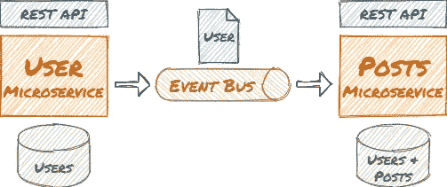
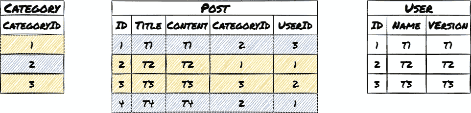
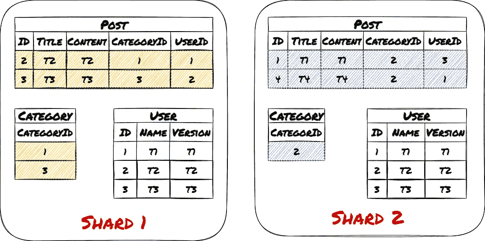
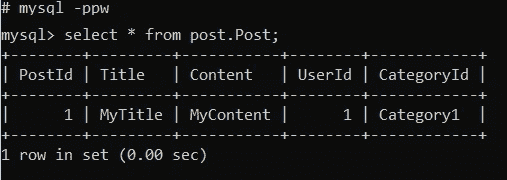
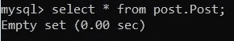

# 如何使用数据库分片和扩展 ASP.NET 核心微服务架构

> 原文：<https://itnext.io/how-to-use-database-sharding-and-scale-an-asp-net-core-microservice-architecture-22c24916590f?source=collection_archive---------0----------------------->

## 对 C # ASP.NET 核心服务进行负载平衡，并使用 MySql 应用层分片。展示了同样适用于 MongoDB 等的概念。


微服务的**大优势之一是，它们可以独立**扩展**。本文展示了扩展** one **微服务及其数据库**的**优势和挑战。**

您将创建一个**工作示例应用**并手动**实现应用层分片**。它展示了如何**基于用例和数据模型选择一个分片键**。这有助于将相同的原则应用于具有集成伸缩性的 DBMS，如 MongoDB 等。

*延伸阅读:* [*用缩放立方体*](/scale-your-app-better-with-scaling-cube-1860930c4d57) *按* [*伊斯坎德尔·萨马托夫*](https://medium.com/u/3110c0425a2b?source=post_page-----22c24916590f--------------------------------) *和* [*到底什么是数据库分片？*](https://betterprogramming.pub/what-exactly-is-database-sharding-ca618a2cbb9a) *由* [*哈里什 V*](https://medium.com/u/fbe24a4fdd7e?source=post_page-----22c24916590f--------------------------------)

这是两部分中的第一部分。您将实现微服务并使用一个分片的数据库。

在第二部分中，您将扩展并运行微服务和数据库的多个容器实例。您将使用 docker compose 和一个负载平衡器。最后，运行 JMeter 负载测试，查看应用程序在使用不同数量的实例时如何伸缩。

# 1.用例及数据模型

示例应用程序由一个**用户和一个 post 微服务**组成。他们**通过消息**进行交流:



【参见我之前的文章 [*如何构建事件驱动的 ASP.NET 核心微服务架构*](/how-to-build-an-event-driven-asp-net-core-microservice-architecture-e0ef2976f33f)

**用户*微服务处理添加和修改用户。*帖子*微服务处理查看和添加帖子。与 *Post* 微服务的交互要多得多。因此，当应用程序的负载增加**时， *Post* 微服务将是第一个需要扩展的微服务**。*

*作者的名字是 *PostService* 有界上下文的一部分，因此也是 *Post* 微服务的一部分。添加和修改作者是在*用户*微服务中完成的。当添加新用户或更改用户名时,*用户*微服务发送事件。*

## **后期服务的逻辑数据模型**

**

*用户可以分类写文章。他们也可以按类别阅读文章，包括作者姓名。最新的帖子在最上面。类别是固定的，很少改变。*

***基于这些用例，我决定按类别划分:***

**

# *2.实施微服务*

***用 ASP.NET 和 web 开发工作量安装** [**Visual Studio 社区**](https://visualstudio.microsoft.com/en/vs/community/) (免费)。*

***创建一个解决方案**，添加一个 ASP.NET Core 5 Web API 项目，名称为“ *PostService* ”。禁用 HTTPS 并激活 OpenAPI 支持。*

***安装以下 NuGet 包**:*

*   *微软。实体框架工作核心工具*
*   *MySql。实体框架工作核心*
*   *纽顿软件。Json*

***创建实体***

**帖子*实体的索引应该加快对某个类别中最新帖子的检索:*

**用户*实体中的版本稍后将帮助处理无序消息:*

***创建*PostServiceContext****

***在 *appsettings 中为分片添加连接字符串。Development.json****

***添加*数据访问*代码***

*`GetConnectionString(string category)`计算`CategoryId`的哈希。散列的第一部分以已配置碎片(连接字符串)的数量为模，确定给定类别的碎片。*

**InitDatabase* 删除并重新创建所有碎片中的所有表，并插入虚拟用户和类别。*

*其他方法创建和加载文章。*

***在*startup . cs*中注册 *DataAccess* 为单例***

***创建*后控制器****

*它使用*数据访问*类*

# *3.从邮政服务访问数据库*

***安装** [**Docker 桌面**](https://hub.docker.com/editions/community/docker-ce-desktop-windows)*

*创建两个 MySql 容器(每个命令占一行)*

```
*C:\dev>docker run -p 3310:3306 --name=mysql1 -e MYSQL_ROOT_PASSWORD=pw -d mysql:5.6C:\dev>docker run -p 3311:3306 --name=mysql2 -e MYSQL_ROOT_PASSWORD=pw -d mysql:5.6*
```

*在 Visual Studio 中启动 *Post* 服务。浏览器在`http://localhost:5001/swagger/index.html`打开*

***使用 swagger UI 与服务进行交互:***

*用 100 个用户和 10 个类别初始化数据库:*

**

***在“类别 1”中添加一个帖子:***

```
*{
  "title": "MyTitle",
  "content": "MyContent",
  "userId": 1,
  "categoryId": "Category1"
}*
```

***阅读“类别 1”中排名前 10 的帖子**以查看您的新帖子:*

**

*连接到数据库容器并**验证哪个数据库包含新的 post** 。*

```
*C:\dev>docker container exec -it mysql1 /bin/sh*
```

*使用密码“pw”登录 MySql 并阅读帖子:*

**

*第二个实例不包含任何帖子:*

```
*C:\dev>docker container exec -it mysql2 /bin/sh*
```

**

# *4.最后的想法和展望*

*您创建了一个**工作应用程序，实现了应用层分片**，并使用了分片键的概念。*

*这只是一个示例应用程序。您必须调整代码，以便在生产环境中使用它。*

*在 [**第二部分**](/how-to-scale-an-asp-net-core-microservice-and-sharded-database-load-test-with-jmeter-1a8c7292e7e3)**中，您将**缩放**和[运行多个容器实例](/how-to-scale-an-asp-net-core-microservice-and-sharded-database-load-test-with-jmeter-1a8c7292e7e3) 的微服务和数据库。您将使用 **docker compose** 和一个**负载平衡器**。然后您将运行 [**JMeter 负载测试**](/how-to-scale-an-asp-net-core-microservice-and-sharded-database-load-test-with-jmeter-1a8c7292e7e3) 来查看应用程序在使用不同数量的实例时是如何伸缩的。最后，您将通过 **RabbitMQ** 从*用户*微服务中 [**模拟用户事件**](/how-to-scale-an-asp-net-core-microservice-and-sharded-database-load-test-with-jmeter-1a8c7292e7e3) 。***

***如果您有任何问题、想法或建议，请联系我。***